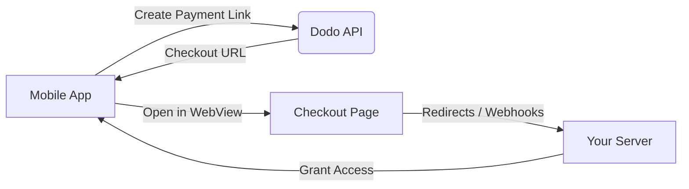

# Create Addon
Source: https://docs.dodopayments.com/api-reference/addons/create-addon

post /addons
Create a new addon product that can be attached to your main subscription products


# Get Addon
Source: https://docs.dodopayments.com/api-reference/addons/get-addon

get /addons/{id}
Retrieve detailed information about a specific addon using its unique identifier


# List Addons
Source: https://docs.dodopayments.com/api-reference/addons/list-addons

get /addons
Retrieve a comprehensive list of all available addons


# Update Addon
Source: https://docs.dodopayments.com/api-reference/addons/update-addon

patch /addons/{id}
Modify the details of an existing addon using its unique identifier


# Update Addon Images
Source: https://docs.dodopayments.com/api-reference/addons/update-addon-images

put /addons/{id}/images
Update images for an existing addon


# Create Brand
Source: https://docs.dodopayments.com/api-reference/brands/create-brand

post /brands
Create a new brand.


# Get Brand
Source: https://docs.dodopayments.com/api-reference/brands/get-brand

get /brands/{id}
Retrieve a specific brand by ID.


# List Brands
Source: https://docs.dodopayments.com/api-reference/brands/list-brands

get /brands
List all brands.


# Update Brand
Source: https://docs.dodopayments.com/api-reference/brands/update-brand

patch /brands/{id}
Update an existing brand's details.


# Update Brand Images
Source: https://docs.dodopayments.com/api-reference/brands/update-brand-images

put /brands/{id}/images
Update the images associated with a brand.


# Create Checkout Session
Source: https://docs.dodopayments.com/api-reference/checkout-sessions/create

post /checkouts
Unified endpoint for creating checkout sessions for all types of billing requirements.


# Create Customer
Source: https://docs.dodopayments.com/api-reference/customers/create-customer

post /customers
Create a new customer in your Dodo Payments account.


# Create Customer Portal Session
Source: https://docs.dodopayments.com/api-reference/customers/create-customer-portal-session

post /customers/{customer_id}/customer-portal/session
Create a session of the Customer Portal for a specific customer.


# List Customers
Source: https://docs.dodopayments.com/api-reference/customers/get-customers

get /customers
Get a list of all customers associated with your account.


# Get Customer Detail
Source: https://docs.dodopayments.com/api-reference/customers/get-customers-1

get /customers/{customer_id}
Get detailed information about a specific customer.


# Patch Customer
Source: https://docs.dodopayments.com/api-reference/customers/patch-customer

patch /customers/{customer_id}
Update a customer's information.


# Create Discount
Source: https://docs.dodopayments.com/api-reference/discounts/create-discount

post /discounts
Create a discount for your account.


# Delete Discount
Source: https://docs.dodopayments.com/api-reference/discounts/delete-discount

delete /discounts/{discount_id}
Delete a discount from your account.


# List Discounts
Source: https://docs.dodopayments.com/api-reference/discounts/list-discounts

get /discounts
Retrieve a list of all discounts associated with your account.


# Update Discount
Source: https://docs.dodopayments.com/api-reference/discounts/update-discount

patch /discounts/{discount_id}
Update a discount in your account.


# Validate Discount
Source: https://docs.dodopayments.com/api-reference/discounts/validate-discount

get /discounts/{discount_id}
Validate a discount code to check if it is valid and can be applied to the current cart.


# List Disputes
Source: https://docs.dodopayments.com/api-reference/disputes/get-disputes

get /disputes
Get a list of all disputes associated with your account.


# Get Dispute Detail
Source: https://docs.dodopayments.com/api-reference/disputes/get-disputes-1

get /disputes/{dispute_id}
Get detailed information about a specific dispute.


# Error Codes
Source: https://docs.dodopayments.com/api-reference/error-codes

Learn more about error codes and how to resolve them in Dodo Payments API.

## Overview

Dodo Payments API uses standard HTTP status codes and custom error codes to indicate the success or failure of API requests. When an error occurs, the API returns an appropriate HTTP status code and a JSON response containing detailed information about the error.

Each error response includes:

* An HTTP status code indicating the general category of the error
* A specific error code that identifies the exact nature of the error
* A human-readable error message explaining what went wrong
* Additional details about the error when applicable

Understanding these error codes and their meanings is crucial for:

* Debugging integration issues
* Implementing proper error handling in your application
* Providing meaningful feedback to end users
* Maintaining a robust payment processing system

The following sections provide detailed information about standard HTTP status codes and specific error codes you may encounter when using the Dodo Payments API.

## Standard API Error Codes

| Error code | HTTP Status           | Description                                                          |
| ---------- | --------------------- | -------------------------------------------------------------------- |
| **400**    | Bad Request           | The request was malformed or contained invalid parameters            |
| **401**    | Unauthorized          | Authentication failed or API key is invalid                          |
| **403**    | Forbidden             | The API key doesn't have permission to access the requested resource |
| **404**    | Not Found             | The requested resource doesn't exist                                 |
| **405**    | Method Not Allowed    | The HTTP method is not supported for this endpoint                   |
| **409**    | Conflict              | The request conflicts with the current state of the resource         |
| **422**    | Unprocessable Entity  | The request was well-formed but contained semantic errors            |
| **429**    | Too Many Requests     | Rate limit exceeded                                                  |
| **500**    | Internal Server Error | An unexpected error occurred on our servers                          |
| **502**    | Bad Gateway           | The server received an invalid response from an upstream server      |
| **503**    | Service Unavailable   | The service is temporarily unavailable                               |
| **504**    | Gateway Timeout       | The server timed out while waiting for an upstream response          |

## Error Response Format

When an error occurs, the API returns a JSON response with the following structure:

```json
{
  "code": "UNSUPPORTED_COUNTRY",
  "message": "Country AI currently not supported"
}
```

## Error Codes Reference

* `ACTIVATION_LIMIT_LESS_THAN_CURRENT_AMOUNT`
  * **Trigger:** License-key activations: new limit \< existing instance count
  * **Message:** New activation limit cannot be less than current instances count

* `ADDONS_NOT_ALLOWED_FOR_ON_DEMAND`
  * **Trigger:** Attempt to add addons to on-demand subscriptions
  * **Message:** Addons are not allowed for on demand subscriptions

* `INTEGER_CONVERSION_FAILURE`
  * **Trigger:** Any integer ↔ string/decimal conversion that fails server-side
  * **Message:** Integer Conversion Failure

* `DISCOUNT_CODE_ALREADY_EXISTS`
  * **Trigger:** Duplicate discount code creation
  * **Message:** Discount Code already exists

* `DISCOUNT_CODE_EXPIRED`
  * **Trigger:** Discount code past its `expires_at` date
  * **Message:** Discount code expired

* `DISCOUNT_CODE_USAGE_LIMIT_EXCEEDED`
  * **Trigger:** Discount reused after `usage_limit` reached
  * **Message:** Usage limit cannot be less than times\_used. Discount code hit usage limit

* `DISCOUNT_NOT_AVAILABLE_FOR_ON_DEMAND`
  * **Trigger:** Code applied to on-demand subscription
  * **Message:** Discount coupon not available for on demand subscriptions

* `DISCOUNT_NOT_AVAILABLE_FOR_PRODUCT`
  * **Trigger:** Code applied to unrelated product(s)
  * **Message:** Discount coupon not available for this product

* `DUPLICATE_LINE_ITEMS_IN_REQUEST`
  * **Trigger:** Same `item_id` appears twice in `items[]`
  * **Message:** Duplicate item\_ids specified in items array

* `EXCHANGE_RATE_NOT_FOUND`
  * **Trigger:** No FX rate for `from → to` currency pair
  * **Message:** Exchange rate not found to convert from USD to EUR

* `INACTIVE_LICENSE_KEY`
  * **Trigger:** Key status ≠ `ACTIVE`
  * **Message:** License key is not active

* `INACTIVE_SUBSCRIPTION_PLAN_CHANGE_NOT_SUPPORTED`
  * **Trigger:** Plan change on inactive subscription
  * **Message:** Changing plans is not supported for inactive subscriptions

* `INSUFFICIENT_WALLET_FUNDS`
  * **Trigger:** Wallet balance \< debit amount
  * **Message:** Insufficient funds in wallet

* `INTERNAL_SERVER_ERROR`
  * **Trigger:** Uncaught exceptions; you should log details server-side
  * **Message:** *No public message (generic 500)*

* `INVALID_DISCOUNT_CODE`
  * **Trigger:** Code does not exist / not applicable
  * **Message:** Invalid Discount Code. Discount Code cannot be applied to any product in the cart

* `INVALID_PERCENTAGE`
  * **Trigger:** Percent amount > 100 % (or 10 000 basis points)
  * **Message:** Percentage amount cannot be more than 10000

* `INVALID_QUERY_PARAMS`
  * **Trigger:** Mutually exclusive / malformed query parameters
  * **Message:** Query params should only contain either time\_frame or (start, end)

* `INVALID_REQUEST_BODY`
  * **Trigger:** Malformed JSON or schema violation
  * **Message:** Your request body is invalid. Please check your request headers and object.

* `INVALID_REQUEST_PARAMETERS`
  * **Trigger:** Semantics wrong (e.g. date in past)
  * **Message:** Cannot change next\_billing\_date to past time

* `INVALID_SUGGESTED_PRICE`
  * **Trigger:** PWYW price \< minimum allowed price
  * **Message:** Suggested Price cannot be lower than minimum price

* `INVALID_TAX_ID`
  * **Trigger:** VAT/GST/TIN failed validation
  * **Message:** Tax Id is invalid

* `LICENSE_KEY_LIMIT_REACHED`
  * **Trigger:** Activations = limit
  * **Message:** License key activation limit reached

* `LICENSE_KEY_NOT_FOUND`
  * **Trigger:** Instance ID or key ID invalid
  * **Message:** License key instance not found or does not belong to this license key

* `LINE_ITEM_NOT_FOUND`
  * **Trigger:** Item ID not part of the referenced payment
  * **Message:** Line item abc123 not found in payment

* `LINE_ITEM_PRORATED`
  * **Trigger:** Refund or update attempted on a prorated line
  * **Message:** Line item {id} cannot be refunded because its prorated

* `LINE_ITEM_REFUND_AMOUNT_TOO_HIGH`
  * **Trigger:** Refund amount > paid amount (tax incl.)
  * **Message:** Line item {id} requested refund amount … is above the paid amount …

* `MAXIMUM_KEYS_REACHED`
  * **Trigger:** Metadata / custom-fields exceeded 50 pairs
  * **Message:** Exceeds 50 key-value pairs

* `MERCHANT_NOT_LIVE`
  * **Trigger:** Business still in test/sandbox mode
  * **Message:** Merchant is not live

* `MISSING_ADDON_IDS`
  * **Trigger:** `addon_id` list empty or unknown IDs
  * **Message:** One or more product IDs do not exist: 123

* `MISSING_PRODUCT_INFORMATION`
  * **Trigger:** Product exists but mandatory info missing
  * **Message:** Product 42 exists but other mandatory information is missing or invalid

* `NO_ELIGIBLE_PAYMENT_METHODS`
  * **Trigger:** After filtering, nothing left
  * **Message:** No eligible payment methods found

* `NO_EXPIRY_ON_SUBSCRIPTION_LICENSE_KEYS`
  * **Trigger:** Attempt to set expiry on sub-based key
  * **Message:** Cannot set expiry date for subscription-based license key

* `NOT_FOUND`
  * **Trigger:** Generic 404 for any missing resource
  * **Message:** Item not found *(or more specific)*

* `ON_DEMAND_PLAN_CHANGE_NOT_SUPPORTED`
  * **Trigger:** Plan swap not allowed for on-demand
  * **Message:** Changing plans is not supported for on demand subscriptions

* `ON_DEMAND_SUBSCRIPTIONS_NOT_ENABLED`
  * **Trigger:** Business has feature flag off
  * **Message:** On demand subscriptions not enabled for this business

* `PAY_AS_YOU_WANT_AMOUNT_REQUIRED`
  * **Trigger:** Price missing for PWYW product
  * **Message:** Amount is mandatory for pay as you want product

* `PAYMENT_ALREADY_REFUNDED`
  * **Trigger:** Duplicate refund
  * **Message:** This payment has already been refunded

* `PRODUCT_IS_DELETED`
  * **Trigger:** Product soft-deleted
  * **Message:** *No messages*

* `PREVIOUS_PAYMENT_PENDING`
  * **Trigger:** Attempt to create charge while previous is in non-terminal state
  * **Message:** Cannot create new charge as previous payment is not successful yet

* `REFUND_AMOUNT_EXCEEDS_PAID_AMOUNT`
  * **Trigger:** Aggregate refund amount > paid amount
  * **Message:** The calculated refund amount is larger than the paid amount

* `REFUND_WINDOW_EXPIRED`
  * **Trigger:** Outside allowable refund window
  * **Message:** Refunds cannot be initiated 90 days after payment creation. Contact [support@dodopayments.com](mailto:support@dodopayments.com)

* `REQUEST_AMOUNT_BELOW_MINIMUM`
  * **Trigger:** Amount \< product minimum
  * **Message:** Amount cannot be less than minimum amount specified for the product

* `SUBSCRIPTION_EXPIRED`
  * **Trigger:** Billing past `ends_at`
  * **Message:** Subscription expired cannot create new charges

* `SUBSCRIPTION_INACTIVE`
  * **Trigger:** Status ≠ `ACTIVE`
  * **Message:** Subscription is not active

* `SUBSCRIPTION_NOT_ON_DEMAND`
  * **Trigger:** Expected on-demand but got fixed interval
  * **Message:** Subscription is already not on demand

* `TOO_MANY_REQUESTS`
  * **Trigger:** 429 rate-limit
  * **Message:** *No messages*

* `TOTAL_PAYMENT_AMOUNT_BELOW_MINIMUM_AMOUNT`
  * **Trigger:** Combined cart total \< gateway minimum
  * **Message:** Minimum amount of \$0.50 is required to process payment

* `UNAUTHORIZED`
  * **Trigger:** No API key or invalid token / scope
  * **Message:** You are not authorised to perform this action

* `UNSUPPORTED_BILLING_CURRENCY`
  * **Trigger:** Subscriptions restricted to USD
  * **Message:** Non USD billing currency is not supported for subscriptions

* `UNSUPPORTED_COUNTRY`
  * **Trigger:** Geo not yet supported
  * **Message:** Country Argentina currently not supported

* `UNSUPPORTED_CURRENCY`
  * **Trigger:** Product or addon currency invalid
  * **Message:** Messages listed in enum comment

* `UNSUPPORTED_DISCOUNT_TYPE`
  * **Trigger:** Flat-amount discounts, etc., not yet live
  * **Message:** Only percentage discount codes are supported for now

* `UNSUPPORTED_PAYMENT_CURRENCY`
  * **Trigger:** Payment currency blocked for connector
  * **Message:** INR transaction is not supported for this transaction

* `UNSUPPORTED_TAX_CATEGORY`
  * **Trigger:** Tax category string not in enum
  * **Message:** Category ebooks currently not supported

## Best Practices

1. Always handle errors gracefully in your application
2. Implement proper error logging
3. Use appropriate error messages for end users
4. Implement retry logic for transient errors
5. Contact support for unresolved issues

## Support

For additional help with error codes or integration issues, please contact our support team at [support@dodopayments.com](mailto:support@dodopayments.com).


# Introduction
Source: https://docs.dodopayments.com/api-reference/introduction

The Dodo Payments API provides comprehensive endpoints for payment processing, subscription management, and digital product delivery. Our RESTful API follows industry standards with detailed responses for all operations.

<CardGroup cols={2}>
  <Card title="Integration Quickstart Guide" icon="rocket" href="/developer-resources/introduction">
    Refer to the comprehensive guide for setting up your first API call efficiently.
  </Card>

  <Card title="SDKs & Libraries" icon="code" href="/developer-resources/dodo-payments-sdks">
    Use our official SDKs for TypeScript, Python, Go, and more.
  </Card>
</CardGroup>

## Environment URLs

* **Test Mode**: [`https://test.dodopayments.com`](https://test.dodopayments.com)
* **Live Mode**: [`https://live.dodopayments.com`](https://live.dodopayments.com)

<Note>
  Learn more about [Test Mode vs Live Mode](/miscellaneous/test-mode-vs-live-mode).
</Note>

## API Key Management and Authentication

<Steps>
  <Step title="Access API Keys">
    Navigate to **Developer → API Keys** in your dashboard to manage your keys.
  </Step>

  <Step title="Generate a New Key">
    Select **Add API Key**, provide a descriptive name, and generate your key.
  </Step>

  <Step title="Store Your Key Securely">
    Copy the generated key immediately and ensure it is stored securely.
  </Step>

  <Step title="Authenticate Your API Requests">
    Use your API keys to authenticate all requests. Apply the following authorization format:

    <CodeGroup>
      ```bash Test Mode
      Authorization: Bearer test_mode_key
      ```

      ```bash Live Mode
      Authorization: Bearer live_mode_key
      ```
    </CodeGroup>

    <Warning>
      Never expose your secret API keys in client-side code or public repositories.
    </Warning>
  </Step>
</Steps>

## Response Format

<CodeGroup>
  ```json Success Response
  {
    "id": "pay_1234567890",
    "status": "completed",
    "amount": 2999,
    "currency": "USD",
    "created_at": "2024-01-15T10:30:00Z"
  }
  ```

  ```json Error Response
  {
    "code": "INVALID_REQUEST",
    "message": "The request contains invalid parameters"
  }
  ```
</CodeGroup>

## Rate Limits

* **Standard**: 100 requests per minute per API key
* **Burst**: Up to 10 requests per second
* **Webhooks**: 1000 deliveries per minute

<Note>
  Monitor `X-RateLimit-Remaining` header to track usage.
</Note>

## Error Handling

To effectively manage errors, consult the *Error Codes* and *Transaction Failures* sections for detailed guidance.

<CardGroup cols={2}>
  <Card title="Error Codes" icon="triangle-exclamation" href="/api-reference/error-codes">
    Delve into comprehensive error details and their resolutions.
  </Card>

  <Card title="Transaction Failures" icon="circle-exclamation" href="/api-reference/transaction-failures">
    Gain insights into common transaction issues and their solutions.
  </Card>
</CardGroup>

## Webhooks

Receive real-time notifications about payment events. See our [Webhook Guide](/developer-resources/webhooks) for setup instructions.

<Card title="Webhook Guide" icon="webhook" href="/developer-resources/webhooks">
  Set up webhooks for real-time notifications and event handling.
</Card>


# Activate License
Source: https://docs.dodopayments.com/api-reference/licenses/activate-license

post /licenses/activate
This endpoint allows you to activate a license for the user.


# Deactivate License
Source: https://docs.dodopayments.com/api-reference/licenses/deactivate-license

post /licenses/deactivate
This endpoint allows you to deactivate a license for the user.


# Get License Key
Source: https://docs.dodopayments.com/api-reference/licenses/get-license-key

get /license_keys/{id}
Retrieve the details of a specific license key by its ID.


# Get License Key Instance
Source: https://docs.dodopayments.com/api-reference/licenses/get-license-key-instance

get /license_key_instances/{id}
Retrieve details of a specific license key instance by its ID.


# Get License Key Instances
Source: https://docs.dodopayments.com/api-reference/licenses/get-license-key-instances

get /license_key_instances
Retrieve a list of instances for a specific license key.


# Get License Keys
Source: https://docs.dodopayments.com/api-reference/licenses/get-license-keys

get /license_keys
Retrieve a list of license keys associated with your account.


# Update License Key
Source: https://docs.dodopayments.com/api-reference/licenses/update-license-key

patch /license_keys/{id}
This endpoint allows you to update a license key by its ID.


# Update License Key Instance
Source: https://docs.dodopayments.com/api-reference/licenses/update-license-key-instance

patch /license_key_instances/{id}
This endpoint allows you to update a specific license key instance by its ID.


# Validate License
Source: https://docs.dodopayments.com/api-reference/licenses/validate-license

post /licenses/validate
This endpoint allows you to validate a license for the user.


# Metadata Guide
Source: https://docs.dodopayments.com/api-reference/metadata

Learn how to use metadata to store additional information about your Dodo Payments objects

## Introduction

Metadata allows you to store additional, structured information about your objects in Dodo Payments. You can attach metadata to most Dodo Payments objects, including payments, subscriptions, and more.

## Overview

* Metadata keys can be up to 40 characters long
* Metadata values can be up to 500 characters long
* You can have up to 50 metadata key-value pairs per object
* Keys should only contain alphanumeric characters, dashes, and underscores
* Metadata is not searchable using our API but is returned in API responses and webhooks

## Use Cases

Metadata is useful for:

* Storing external IDs or references
* Adding internal annotations
* Linking Dodo Payments objects to your system
* Categorizing transactions
* Adding custom attributes for reporting

## Adding Metadata

You can add metadata when creating or updating objects through the API. For products, you also have the option to add metadata directly from the dashboard UI.

### Via API

```javascript
// Adding metadata when creating a payment
const payment = await client.payments.create({
    billing: { city: 'city', country: 'AF', state: 'state', street: 'street', zipcode: 0 },
    customer: { customer_id: 'customer_id' },
    product_cart: [{ product_id: 'product_id', quantity: 0 }],
    metadata:{order_id: 'ORD-123', customer_notes: 'Customer notes'}
  });

// Adding metadata when creating a product
const product = await client.products.create({
    name: 'Premium Software License',
    price: 9900,
    currency: 'USD',
    metadata: {
        category: 'software',
        license_type: 'premium',
        support_tier: 'priority'
    }
});
```

### Via Dashboard UI (Products Only)

For products, you can also add metadata directly from the Dodo Payments dashboard when creating or editing a product. The metadata section allows you to easily add custom key-value pairs without writing code.

<Frame>
  
</Frame>

<Tip>
  Using the dashboard UI for product metadata is particularly useful for non-technical team members who need to manage product information and categories.
</Tip>

## Retrieving Metadata

Metadata is included in API responses when retrieving objects:

```javascript
const payment = await client.payments.retrieve('pay_123');
console.log(payment.metadata.order_id); // '6735'
```

## Searching and Filtering

While metadata is not directly searchable via our API, you can:

1. Store important identifiers in metadata
2. Retrieve objects using their primary IDs
3. Filter the results in your application code

```javascript
// Example: Find a payment using your order ID
const payments = await client.payments.list({
  limit: 100
});

const matchingPayment = payments.data.find(
  payment => payment.metadata.order_id === '6735'
);
```

## Best Practices

### Do:

* Use consistent naming conventions for metadata keys
* Document your metadata schema internally
* Keep values short and meaningful
* Use metadata for static data only
* Consider using prefixes for different systems (e.g., `crm_id`, `inventory_sku`)

### Don't:

* Store sensitive data in metadata
* Use metadata for frequently changing values
* Rely on metadata for critical business logic
* Store duplicate information that's available elsewhere in the object
* Use special characters in metadata keys

## Supported Objects

Metadata is supported on the following objects:

| Object Type   | Support |
| ------------- | ------- |
| Payments      | ✓       |
| Subscriptions | ✓       |
| Products      | ✓       |

## Webhooks and Metadata

Metadata is included in webhook events, making it easy to handle notifications with your custom data:

```javascript
// Example webhook handler
app.post('/webhook', (req, res) => {
  const event = req.body;

  if (event.type === 'payment.succeeded') {
    const orderId = event.data.object.metadata.order_id;
    // Process order using your internal order ID
  }
});
```


# Charge Subscription
Source: https://docs.dodopayments.com/api-reference/misc/charge-subscriptions

post /subscriptions/{subscription_id}/charge
Charge a customer for an on-demand subscription.


# Supported Countries
Source: https://docs.dodopayments.com/api-reference/misc/supported-countries

get /checkout/supported_countries
Retrieve a list of countries that are supported by the Dodo Payments for your customers.

<Tip> You will receive a list of [ISO Alpha-2](https://en.wikipedia.org/wiki/ISO_3166-1_alpha-2) country codes representing the countries we **currently support for payments**. You can view the full list of supported countries [here](/miscellaneous/list-of-countries-we-accept-payments-from). This list is updated regularly as we expand our coverage. </Tip>

<Tip> Note: The available options include ISO Alpha-2 codes for **all countries**, not just the ones we currently support. Please refer to the supported countries list to confirm availability. </Tip>


# Get Invoice
Source: https://docs.dodopayments.com/api-reference/payments/get-invoice

get /invoices/payments/{payment_id}
Get an invoice by Payment ID.


# List Payments
Source: https://docs.dodopayments.com/api-reference/payments/get-payments

get /payments
Get a list of all payments associated with your account.


# Get Payment Detail
Source: https://docs.dodopayments.com/api-reference/payments/get-payments-1

get /payments/{payment_id}
Get detailed information about a specific payment.


# Create One Time Payment
Source: https://docs.dodopayments.com/api-reference/payments/post-payments

post /payments
Create a one-time payment for a customer.


# Retrieve Line Items
Source: https://docs.dodopayments.com/api-reference/payments/retrieve-line-items

get /payments/{payment_id}/line-items
Retrieve line items for a specific payment.


# List Payouts
Source: https://docs.dodopayments.com/api-reference/payouts/get-payouts

get /payouts
Get a list of all payouts associated with your account.


# Archive Products
Source: https://docs.dodopayments.com/api-reference/products/archive-product

delete /products/{id}
Archive a product associated with your account.


# List Products
Source: https://docs.dodopayments.com/api-reference/products/get-products

get /products
Get a list of all products associated with your account.


# Get Product Detail
Source: https://docs.dodopayments.com/api-reference/products/get-products-1

get /products/{id}
Get detailed information about a specific product.


# Update Product
Source: https://docs.dodopayments.com/api-reference/products/patch-products

patch /products/{id}
Update a product's details.


# Create Product
Source: https://docs.dodopayments.com/api-reference/products/post-products

post /products
Create a new product.


# Update Product Images
Source: https://docs.dodopayments.com/api-reference/products/put-products-images

put /products/{id}/images
Update a product's images.


# Unarchive Products
Source: https://docs.dodopayments.com/api-reference/products/unarchive-product

post /products/{id}/unarchive
Unarchive a product associated with your account.


# Update Files
Source: https://docs.dodopayments.com/api-reference/products/update-files

put /products/{id}/files
Update the files associated with a product.


# List Refunds
Source: https://docs.dodopayments.com/api-reference/refunds/get-refunds

get /refunds
Get a list of all refunds associated with your account.


# Get Refund Detail
Source: https://docs.dodopayments.com/api-reference/refunds/get-refunds-1

get /refunds/{refund_id}
Get detailed information about a specific refund.


# Create Refund
Source: https://docs.dodopayments.com/api-reference/refunds/post-refunds

post /refunds
Create a refund for a payment.


# Change Plan
Source: https://docs.dodopayments.com/api-reference/subscriptions/change-plan

post /subscriptions/{subscription_id}/change-plan
Modify an existing subscription's plan, enabling both upgrades and downgrades to different pricing tiers.


# Create Charge (On-Demand)
Source: https://docs.dodopayments.com/api-reference/subscriptions/create-charge

post /subscriptions/{subscription_id}/charge
Create a charge for a subscription. This is useful for on-demand billing.


# Get Subscription Detail
Source: https://docs.dodopayments.com/api-reference/subscriptions/get-subscriptions

get /subscriptions/{subscription_id}
Get detailed information about a specific subscription.


# List subscriptions
Source: https://docs.dodopayments.com/api-reference/subscriptions/get-subscriptions-1

get /subscriptions
Get a list of all subscriptions associated with your account.


# Update Subscription
Source: https://docs.dodopayments.com/api-reference/subscriptions/patch-subscriptions

patch /subscriptions/{subscription_id}
Update a subscription's details.


# Create Subscription
Source: https://docs.dodopayments.com/api-reference/subscriptions/post-subscriptions

post /subscriptions
Create a subscription for a customer.


# Transaction Failures
Source: https://docs.dodopayments.com/api-reference/transaction-failures

Learn about different transaction failure reasons and how to handle them in Dodo Payments API.

## Overview

Dodo Payments API provides detailed transaction failure reasons to help you understand why a payment attempt was unsuccessful. These failure reasons are standardized across different payment methods and providers, making it easier to implement consistent error handling in your application.

Each transaction failure response includes:

* A specific failure reason code
* A human-readable error message
* Additional context about the failure when available
* Whether the error is user-correctable or requires system intervention

Understanding these failure reasons is crucial for:

* Providing clear feedback to your customers
* Implementing appropriate retry logic
* Handling different failure scenarios gracefully
* Maintaining a reliable payment processing system

## Transaction Failure Reasons

The following table lists all possible transaction failure reasons, their meanings, and whether they are user-correctable errors.

| Failure Code                       | User Error | Description                                                     |
| ---------------------------------- | ---------- | --------------------------------------------------------------- |
| `AUTHENTICATION_FAILURE`           | Yes        | The authentication process failed during the transaction        |
| `AUTHENTICATION_REQUIRED`          | Yes        | Additional authentication is needed to complete the transaction |
| `AUTHENTICATION_TIMEOUT`           | Yes        | The authentication process timed out                            |
| `CARD_DECLINED`                    | No         | The card was declined by the issuing bank                       |
| `CARD_VELOCITY_EXCEEDED`           | Yes        | Too many transactions attempted in a short period               |
| `CUSTOMER_CANCELLED`               | Yes        | The customer cancelled the transaction                          |
| `DO_NOT_HONOR`                     | No         | The issuing bank declined the transaction                       |
| `EXPIRED_CARD`                     | Yes        | The card has expired                                            |
| `FRAUDULENT`                       | Yes        | The transaction was flagged as potentially fraudulent           |
| `GENERIC_DECLINE`                  | No         | The transaction was declined for an unspecified reason          |
| `INCORRECT_CVC`                    | Yes        | The provided CVC code was incorrect                             |
| `INCORRECT_NUMBER`                 | Yes        | The card number was entered incorrectly                         |
| `INSUFFICIENT_FUNDS`               | Yes        | The account has insufficient funds to complete the transaction  |
| `INVALID_ACCOUNT`                  | Yes        | The account details provided are invalid                        |
| `INVALID_AMOUNT`                   | Yes        | The transaction amount is invalid                               |
| `INVALID_CARD_NUMBER`              | Yes        | The card number format is invalid                               |
| `INVALID_CARD_OWNER`               | Yes        | The card owner information is invalid                           |
| `INVALID_CVC`                      | Yes        | The CVC format is invalid                                       |
| `INVALID_EXPIRY_YEAR`              | Yes        | The card expiry year is invalid                                 |
| `INVALID_PIN`                      | Yes        | The provided PIN is incorrect                                   |
| `INVALID_REQUEST`                  | Yes        | The transaction request contains invalid data                   |
| `INVALID_UPI_ID`                   | Yes        | The UPI ID provided is invalid                                  |
| `LIVE_MODE_TEST_CARD`              | Yes        | A test card was used in live mode                               |
| `LOST_CARD`                        | Yes        | The card has been reported as lost                              |
| `MANDATE_INVALID`                  | Yes        | The payment mandate is invalid                                  |
| `MANDATE_REQUIRED`                 | Yes        | A mandate is required for this transaction                      |
| `MANDATE_REQUIRED_SYSTEM`          | No         | System requires a mandate for this transaction type             |
| `NETWORK_ERROR`                    | No         | A network error occurred during the transaction                 |
| `NETWORK_TIMEOUT`                  | No         | The network request timed out                                   |
| `ORDER_CREATION_FAILED`            | No         | Failed to create the order for the transaction                  |
| `PAYMENT_METHOD_UNSUPPORTED`       | Yes        | The payment method is not supported for this transaction        |
| `PICKUP_CARD`                      | Yes        | The card has been reported as stolen and should be picked up    |
| `PROCESSING_ERROR`                 | No         | An error occurred while processing the transaction              |
| `REENTER_TRANSACTION`              | Yes        | The transaction needs to be re-entered                          |
| `REVOCATION_OF_AUTHORIZATION`      | Yes        | The authorization for the transaction was revoked               |
| `STOLEN_CARD`                      | Yes        | The card has been reported as stolen                            |
| `TRANSACTION_NOT_ALLOWED`          | Yes        | The transaction is not allowed for this card or account         |
| `TRANSACTION_NOT_APPROVED`         | Yes        | The transaction was not approved                                |
| `TRY_AGAIN_LATER`                  | No         | The transaction should be retried later                         |
| `UNKNOWN_ERROR`                    | No         | An unknown error occurred                                       |
| `PAYMENT_METHOD_PROVIDER_DECLINED` | Yes        | The payment method provider declined the transaction            |

<Note>
  **User Error** indicates whether the payment decline can be resolved by the customer. When `true`, the customer can take action to fix the issue (e.g., entering correct card details). When `false`, the decline is due to system-level issues or bank restrictions that cannot be resolved by the customer.
</Note>

## Support

For additional help with transaction failures or integration issues, please contact our support team at [support@dodopayments.com](mailto:support@dodopayments.com).


# Create Webhook
Source: https://docs.dodopayments.com/api-reference/webhooks/create-webhook

post /webhooks
Create a new webhook for a business.


# Delete Webhook
Source: https://docs.dodopayments.com/api-reference/webhooks/delete-webhook

delete /webhooks/{webhook_id}
Delete a specific webhook.


# Get Webhook Details
Source: https://docs.dodopayments.com/api-reference/webhooks/get-details

get /webhooks/{webhook_id}
Get detailed information about a specific webhook.


# Get Webhook Headers
Source: https://docs.dodopayments.com/api-reference/webhooks/get-webhook-headers

get /webhooks/{webhook_id}/headers
Get the headers for a specific webhook.


# Get Webhook Signing Key
Source: https://docs.dodopayments.com/api-reference/webhooks/get-webhook-signing-key

get /webhooks/{webhook_id}/secret
Get the signing key for a specific webhook.


# List Webhooks
Source: https://docs.dodopayments.com/api-reference/webhooks/list-webhooks

get /webhooks
List all webhooks for a business.


# Update Webhook
Source: https://docs.dodopayments.com/api-reference/webhooks/update-webhook

patch /webhooks/{webhook_id}
Update a specific webhook.


# Update Webhook Headers
Source: https://docs.dodopayments.com/api-reference/webhooks/update-webhook-headers

patch /webhooks/{webhook_id}/headers
Update the headers for a specific webhook.


# Introduction
Source: https://docs.dodopayments.com/changelog/introduction

Welcome to the Dodo Payments Changelog! Stay updated on all the latest features and improvements we've rolled out to enhance your payment processing experience. At Dodo Payments, we strive to provide a seamless, transparent, and robust platform for global merchants.

# Version Logs

| Version   | Date         | Description                                                                                                                                                                                                                                           | Link                       |
| --------- | ------------ | ----------------------------------------------------------------------------------------------------------------------------------------------------------------------------------------------------------------------------------------------------- | -------------------------- |
| `v1.51.0` | `23-8-2025`  | Powerful Checkout Sessions API, Metadata in Payments Export, and Subscription Next Billing Date Update                                                                                                                                                | [Link](/changelog/v1.51.0) |
| `v1.47.0` | `11-8-2025`  | Dashboard UI overhaul, discount codes for subscriptions, expanded Adaptive Currency, webhook management API, and product metadata support.                                                                                                            | [Link](/changelog/v1.47.0) |
| `v1.44.0` | `3-8-2025`   | Adaptive Currency, Turkish Language Support, and New Proration Mode                                                                                                                                                                                   | [Link](/changelog/v1.44.0) |
| `v1.43.0` | `24-7-2025`  | Comprehensive Webhooks Upgrade: endpoint management, security, delivery logs, debugging, and monitoring—now fully self-serve in the dashboard.                                                                                                        | [Link](/changelog/v1.43.0) |
| `v1.38.0` | `9-7-2025`   | Analytics Chart Sharing, Multiple Partial Refunds, Cumulative Revenue Analytics, Context7 Integration, Next.js Adapter                                                                                                                                | [Link](/changelog/v1.38.0) |
| `v1.37.0` | `2-7-2025`   | Enhanced Analytics Dashboard with comprehensive revenue and retention insights, Reports 2.0 with detailed business reporting capabilities, and improved subscription management features for better business intelligence and operational efficiency. | [Link](/changelog/v1.37.0) |
| `v1.34.4` | `26-6-2025`  | Enhanced Dashboard Analytics with comprehensive new metrics across three key dashboard sections: Revenue Analytics, Customer Analytics, and Payment Success Rate Analytics.                                                                           | [Link](/changelog/v1.34.4) |
| `v1.34.0` | `18-6-2025`  | Added Digital Product Delivery, React Native SDK beta release, new proration modes, adaptive currency for subscriptions, and enhanced verification form management.                                                                                   | [Link](/changelog/v1.34.0) |
| `v1.32.0` | `9-6-2025`   | Added support for Affiliates with Affonso, multiple webhook support, enhanced fraud prevention, subscription schedule cancellation, and static payment links.                                                                                         | [Link](/changelog/v1.32.0) |
| `v1.30.0` | `2-6-2025`   | Added support for \$0 payments and 100% discount codes for one-time products, enabled payout threshold for USD wallet, and standardized API error codes and messages.                                                                                 | [Link](/changelog/v1.30.0) |
| `v1.27.0` | `26-5-2025`  | Introduced Partial Refunds and Multi-Brand Support, enabling merchants to manage multiple brands and websites under a single verified business account.                                                                                               | [Link](/changelog/v1.27.0) |
| `v1.25.0` | `20-5-2025`  | Introduced Overlay Checkout Beta, a modern TypeScript library for embedded payments, and a new subscription.plan\_changed webhook event for better subscription lifecycle management.                                                                 | [Link](/changelog/v1.25.0) |
| `v1.22.0` | `9-5-2025`   | Added unified search to the dashboard, added support for upgrading and downgrading subscriptions with addons, and added comprehensive card information to payment responses.                                                                          | [Link](/changelog/v1.22.0) |
| `v1.21.0` | `3-5-2025`   | Added support for addons to subscriptions, made dispute handling more robust, and added customer billing details to payment responses.                                                                                                                | [Link](/changelog/v1.21.0) |
| `v1.18.3` | `26-4-2025`  | Introduced Subscription Plan Change API, enhanced onboarding guidance, notification preferences center, and improved adaptive currency information.                                                                                                   | [Link](/changelog/v1.18.3) |
| `v1.16.1` | `18-4-2025`  | Introduced modern verification forms, new Java and Kotlin SDKs, Afterpay/Clearpay integration, and Google Sign-In.                                                                                                                                    | [Link](/changelog/v1.16.1) |
| `v1.14.0` | `12-4-2025`  | Introduced new European payment methods, subscription billing address updates, and various improvements.                                                                                                                                              | [Link](/changelog/v1.14.0) |
| `v1.13.0` | `9-4-2025`   | Introduced Adaptive Currency Support, MCP Server for AI integration, mobile apps, Custom GPT, and Dodo Dash game.                                                                                                                                     | [Link](/changelog/v1.13.0) |
| `v1.11.0` | `28-3-2025`  | Introduced address autofill for checkout page, notifications center, payment link query builder, saved payment methods, and billing currency control.                                                                                                 | [Link](/changelog/v1.11.0) |
| `v1.10.1` | `21-3-2025`  | Introduced Checkout 2.0, configurable payment methods, dynamic tax calculation, and on-demand subscriptions.                                                                                                                                          | [Link](/changelog/v1.10.1) |
| `v1.7.0`  | `14-3-2025`  | Introduced a dedicated subscriptions page, enhanced customer details, detailed payout information, an official Ruby SDK, enhanced API filters, and various minor improvements.                                                                        | [Link](/changelog/v1.7.0)  |
| `v1.5.0`  | `7-3-2025`   | Introduced a custom date filter for analytics, a new tax category, and various improvements.                                                                                                                                                          | [Link](/changelog/v1.5.0)  |
| `v1.4.0`  | `6-3-2025`   | Introduced the Storefront Feature and Amazon Pay Integration.                                                                                                                                                                                         | [Link](/changelog/v1.4.0)  |
| `v1.3.2`  | `28-2-2025`  | Introduced the Teams Feature, enhanced success/failure screens, and minor improvements.                                                                                                                                                               | [Link](/changelog/v1.3.2)  |
| `v1.0.0`  | `23-2-2025`  | Public release of Dodo Payments with Customer Portal and Customer Portal Session API.                                                                                                                                                                 | [Link](/changelog/v1.0.0)  |
| `v0.24.0` | `15-2-2025`  | Introduced discount coupons, support for over 25 local payment methods, customizable statement descriptors, and a complete UI makeover of the login page.                                                                                             | [Link](/changelog/v0.24.0) |
| `v0.22.0` | `6-2-2025`   | Introduced subscription's first payment, UPI QR payment method, tax ID on checkout, dashboard restructure, self-serve onboarding guides, multi-language support, invoice PDF makeover, and a centralized help widget.                                 | [Link](/changelog/v0.22.0) |
| `v0.20.1` | `31-1-2025`  | Introduced Pay What You Want (PWYW) pricing and expands global payment coverage.                                                                                                                                                                      | [Link](/changelog/v0.20.1) |
| `v0.19.0` | `24-1-2025`  | Added support for UPI and Indian Rupay cards, released PHP SDK, and introduced product archiving.                                                                                                                                                     | [Link](/changelog/v0.19.0) |
| `v0.18.0` | `20-1-2025`  | Added AI chat support, enhanced APIs, inclusive tax pricing, automated country selection, and more.                                                                                                                                                   | [Link](/changelog/v0.18.0) |
| `v0.16.1` | `11-1-2025`  | Added Account Summary feature, enhanced API documentation, and improved postal code validation.                                                                                                                                                       | [Link](/changelog/v0.16.1) |
| `v0.15.1` | `3-1-2025`   | Introducing Invoice API, subscription webhooks, comprehensive guides, Dodo Wall of Love, and social sharing features. Plus, enhanced subscription trial periods and customer identification.                                                          | [Link](/changelog/v0.15.1) |
| `v0.14.0` | `26-12-2024` | Introduced the License Key Management feature, enhancing security and control for merchants distributing digital products and services.                                                                                                               | [Link](/changelog/v0.14.0) |
| `v0.13.2` | `21-12-2024` | Updated Atlas codebase, SDK updates, and minor improvements.                                                                                                                                                                                          | [Link](/changelog/v0.13.2) |
| `v0.12.0` | `17-12-2024` | Added official SDKs, metadata field, and expanded customer APIs with minor improvements and bug fixes.                                                                                                                                                | [Link](/changelog/v0.12.0) |
| `v0.11.0` | `13-12-2024` | Introduced automated emails, webhook event logs, a license key generation guide, and various minor improvements and bug fixes.                                                                                                                        | [Link](/changelog/v0.11.0) |
| `v0.10.0` | `8-12-2024`  | Open-sourced Atlas demo, feature-request section, webhook request logs API, subscription list API, and various improvements and bug fixes.                                                                                                            | [Link](/changelog/v0.10.0) |
| `v0.1.0`  | `25-11-2024` | This is the initial release of the Dodo Payments documentation, marking the Beta launch of our product. Explore the features and improvements designed to enhance your payment processing experience.                                                 | [Link](/changelog/v0.1.0)  |


# v0.1.0 (25 Nov 2024)
Source: https://docs.dodopayments.com/changelog/v0.1.0

This is the initial release of the Dodo Payments documentation, marking the Beta launch of our product. Explore the features and improvements designed to enhance your payment processing experience.

## Smooth Onboarding

* Comprehensive onboarding tracker to monitor merchant progress.
* Support for document resubmission and live-mode activation upon verification.

## Product Catalogue Management

* Easy creation, editing, and deletion of one-time and subscription products.

## Payment Link

* Generate payment links for one-time and subscription products.
* Includes configurable quantities and redirection options for post-payment customer journeys.

## Customizable Checkout Page

* Branded checkout experiences with localized payment options available.
* Real-time tax and total amount calculation displayed on checkout.

## Automated Invoice Generation

* Automatic invoice generation for payments, refunds, and payouts.

## Refund Management

* Seamless partial and full refund management from the dashboard.
* Introduced dispute tracking for effective resolutions.

## Transparent Payouts

* Flexible payout mechanisms with transparent policies and fees.

## Analytics and Reporting

* Advanced analytics dashboard to showcase total revenue, transaction breakdown, customer insights, and top-performing product types.

## API and Webhook Generation

* Easy-to-generate API keys to integrate Dodo Payments into your website or application.
* Webhook setup for real-time notifications about transactions, refunds, and disputes.


# v0.10.0 (8 Dec 2024)
Source: https://docs.dodopayments.com/changelog/v0.10.0

Open-sourced Atlas demo, feature-request section, webhook request logs API, subscription list API, and various improvements and bug fixes.

## New Features

* **Open Sourced Atlas**: A demo application written in Next.js to showcase the integration of Dodo Payments. Explore the [GitHub Repository](https://github.com/dodopayments/dodo-checkout-demo) and documentation [here](/developer-resources/integration-guide).
* **Feature-Request Section**: Introduced a feature-request section on the Dodo Payments dashboard to prioritize the product roadmap based on user feedback.
* **Webhook Request Logs API**: Added APIs for listing and detailing webhook request logs. Refer to the [API Reference](/api-reference/webhooks/get-webhook_events) for more information.
* **Static Payment Links**: Added more query parameters to the static payment links to provide more flexibility in the checkout process. For more details, click [here](/developer-resources/integration-guide#1-static-payment-links).
* **Subscription List API**: Added an API to fetch all subscriptions. Refer to the [API Reference](/api-reference/subscriptions/get-subscriptions-1) for details.

## Minor Improvements and Bug Fixes

* Enhanced the Product and Subscription API responses with additional parameters.
* Implemented rate limiting for API requests, currently set to 20 requests per second.
* Improved the documentation to be more user-friendly and easier to navigate.
* Various minor bug fixes and improvements.


# v0.11.0 (13 Dec 2024)
Source: https://docs.dodopayments.com/changelog/v0.11.0

Introduced automated emails, webhook event logs, a license key generation guide, and various minor improvements and bug fixes.

## New Features

* **Automated Emails**: Added automated emails for payments, subscriptions, refunds, and disputes to keep merchants and customers informed.
* **Webhook Event Log**: Added webhook event log on Dodo Payments Dashboard to track webhook events and troubleshoot issues. Navigate to `Settings > Webhooks > Webhook Logs` to access the logs.
* **License Key Generation Guide**: Added a new guide to implement license key generation for digital products. Refer to the [guide](/features/license-keys) for more information.

## Minor Improvements and Bug Fixes

* Various minor fixes and improvements.


# v0.12.0 (17 Dec 2024)
Source: https://docs.dodopayments.com/changelog/v0.12.0

Added official SDKs, metadata field, and expanded customer APIs with minor improvements and bug fixes.

## New Features

* **Official SDKs**: Introduced official Dodo Payments SDKs for **Node.js**, **Python**, and **Go**. Refer to the [SDKs](/developer-resources/dodo-payments-sdks) page for more information.
* **Metadata Field**: Added a `Metadata` field for payments and subscriptions to store additional information. Refer to the [Metadata](/api-reference/metadata) page for more details.
* **Customer APIs**: Expanded customer APIs to include the following endpoints. You can now pass `customer_id` in payments and subscriptions to prevent customer duplication:
  * **Create Customer**: [/api-reference/customers/create-customer](/api-reference/customers/create-customer)
  * **Patch Customer**: [/api-reference/customers/patch-customer](/api-reference/customers/patch-customer)

## Minor Improvements and Bug Fixes

* Various minor fixes and improvements.


# v0.13.2 (21 Dec 2024)
Source: https://docs.dodopayments.com/changelog/v0.13.2

Updated Atlas codebase, SDK updates, and minor improvements.

## New Features

* **Atlas**: The [GitHub Repository](https://github.com/dodopayments/dodo-checkout-demo) codebase has been updated to use the [Dodo Payments Node SDK](https://github.com/dodopayments/dodopayments-node).
* **SDK Update**: Bumped our SDK versions to `0.13.2` with fixes and updates.

## Minor Improvements and Bug Fixes

* **Dashboard Toggle**: Improved the Test Mode and Live Mode toggle on the dashboard to enhance UX.
* Various minor fixes and improvements.


# v0.14.0 (26 Dec 2024)
Source: https://docs.dodopayments.com/changelog/v0.14.0

Introduced the License Key Management feature, enhancing security and control for merchants distributing digital products and services.

### New Feature: License Key Management

We are excited to introduce the **License Key Management** feature, designed to help merchants secure their digital products and services by generating, managing, and tracking unique license keys. This feature ensures only authorized users access your products and provides merchants with full control over their license key usage and distribution. Ideal for SaaS businesses and digital product vendors, the tool also includes advanced tracking and revocation capabilities for enhanced security.

For more details, please visit the [License Keys Documentation](/features/license-keys).


# v0.15.1 (4 Jan 2025)
Source: https://docs.dodopayments.com/changelog/v0.15.1

Introducing Invoice API, subscription webhooks, comprehensive guides, Dodo Wall of Love, and social sharing features. Plus, enhanced subscription trial periods and customer identification.

## New Features 🚀

### API Enhancements

* Launched Invoice API, enabling merchants and customers to download invoices using `payment_id`. Visit the [Invoice API](/api-reference/payments/get-invoice) documentation for more details.
* Implemented new `subscription.renewed` webhook event for subscription renewal notifications.

### Platform Updates

* Introduced Dodo Payments [Wall of Love](https://dodopayments.com/wall-of-love), showcasing customer testimonials.
* Added social sharing functionality for successful transactions.
  
* Released Policy Generator tool for automatic generation of privacy policy, terms of service, and refund policy documents. [Try Policy Generator](https://dodopayments.com/tools/policy-generator).

### Documentation Improvements

* Published comprehensive guides:
  * [Subscription Integration Guide](/developer-resources/subscription-integration-guide)
  * [Webhook Events Guide](/developer-resources/webhooks/intents/webhook-events-guide)

## Improvements and Bug Fixes 🔧

### API Updates

* Added `trial_period_days` parameter to [Create Subscription API](/api-reference/subscriptions/post-subscriptions) to override product-level trial periods.
* Enhanced customer identification logic: now using consistent `customer_id` across payments and subscriptions for the same email.
* Implemented various performance optimizations and fixed minor bugs.


# v0.16.1 (11 Jan 2025)
Source: https://docs.dodopayments.com/changelog/v0.16.1

Added Account Summary feature, enhanced API documentation, and improved postal code validation.

## New Features 🚀

* **Account Summary Feature**: Provides detailed visibility into transaction and payout ledgers.
  
* **Enhanced API Documentation**: Includes comprehensive parameter descriptions and usage examples.

## Improvements and Bug Fixes 🔧

* **Postal Code Validation**: Updated `Zipcode` field validation to support alphanumeric postal codes.
* **System Optimizations**: Implemented various bug fixes and optimizations to improve overall performance.


# v0.18.0 (20 Jan 2025)
Source: https://docs.dodopayments.com/changelog/v0.18.0

Added AI chat support, enhanced APIs, inclusive tax pricing, automated country selection, and more.

## New Features 🚀

* **AI Chat Support**: Now you can chat with our AI assistant to get help with your technical queries or check the documentation more effectively.
  

* **Enhanced APIs**: Added APIs to filter payments, refunds, subscriptions, and disputes based on `customer_id`, time period, and status, providing more flexibility in data retrieval.

* **Inclusive Tax Pricing**: Added support to make the product price inclusive of tax while creating/updating the product. The tax amount will be calculated automatically based on the tax rate.

* **Automated Country Selection**: Implemented IP-based country auto-selection in static payment links. The country will be auto-selected based on the user's IP address when they open the static payment links.

* **Query Parameter Removal**: Query parameters are now removed as soon as the static payment link loads, preventing end customers from changing URL parameters and tampering with the static payment link.

## Improvements and Bug Fixes 🔧

* **Minor Enhancements and Fixes**: Various minor enhancements and fixes to improve overall performance and user experience.


# v0.19.0 (24 Jan 2025)
Source: https://docs.dodopayments.com/changelog/v0.19.0

Added support for UPI and Indian Rupay cards, released PHP SDK, and introduced product archiving.

## New Features 🚀

* **UPI and Indian Rupay Card Support**: Added support for UPI and Indian Rupay cards for processing payments in India, currently limited to one-time purchases only. You can now accept payments from customers using UPI and Rupay cards. Additionally, enabled the creation of products with INR pricing on the Dodo Payments Dashboard.

  <Frame>
    <iframe className="w-full aspect-video rounded-md" src="https://www.youtube.com/embed/PXQOv4k1Mk8" title="UPI Announcement | Dodo Payments" frameBorder="0" allow="accelerometer; autoplay; clipboard-write; encrypted-media; gyroscope; picture-in-picture" allowFullScreen />
  </Frame>

* **PHP SDK Release**: Launched a new PHP SDK for Dodo Payments, simplifying the integration of Dodo Payments into PHP applications.
  <Card title="View PHP SDK on GitHub →" icon="github" horizontal="true" href="https://github.com/dodopayments/dodopayments-php"> Explore the PHP SDK for Dodo Payments on GitHub. </Card>

* **Product Archiving**: Introduced the ability to archive and unarchive products on the Dodo Payments Dashboard, helping manage clutter and maintain a clean interface.

## Improvements and Bug Fixes 🔧

* **Minor Enhancements and Fixes**: Various minor enhancements and fixes to improve overall performance and user experience.


# v0.20.1 (31 Jan 2025)
Source: https://docs.dodopayments.com/changelog/v0.20.1

Introduced Pay What You Want (PWYW) pricing and expands global payment coverage.

## New Features 🚀

* **Pay What You Want (PWYW) Pricing**: Introduced support for PWYW pricing, allowing users to choose any amount they wish to pay. This feature can be found while creating the product. For more details, please refer to the [documentation](/features/pricing#pay-what-you-want-pricing).

* **Expanded Global Coverage**: Dodo Payments now supports seamless payments from over 150 countries, enhancing global accessibility and convenience for users.
  <Frame>
    <iframe className="w-full aspect-video rounded-md" src="https://www.youtube.com/embed/JQJbSM_vz4g" title="Global Coverage Announcement | Dodo Payments" frameBorder="0" allow="accelerometer; autoplay; clipboard-write; encrypted-media; gyroscope; picture-in-picture" allowFullScreen />
  </Frame>

## Improvements and Bug Fixes 🔧

* **Minor Enhancements and Fixes**: Various minor enhancements and fixes to improve overall performance and user experience.


# v0.22.0 (6 Feb 2025)
Source: https://docs.dodopayments.com/changelog/v0.22.0

Introduced subscription's first payment, UPI QR payment method, tax ID on checkout, dashboard restructure, self-serve onboarding guides, multi-language support, invoice PDF makeover, and a centralized help widget.

## New Features 🚀

* **Subscription's First Payment**: The most requested feature is here! Now, there will be a single transaction for the first payment, combining the mandate and the actual subscription amount.

* **UPI QR Payment Method**: Added UPI QR as a payment method for the Indian market, allowing customers to pay using UPI QR codes.

  

* **Tax ID on Checkout**: Customers can now add their Tax ID on the checkout page for invoicing and tax purposes.

* **Dashboard Restructure**: The entire Dodo Payments Dashboard has been restructured to be more intuitive and user-friendly.

* **Self-Serve Onboarding Guides**: New users can now get started with Dodo Payments using self-serve onboarding guides.

* **Multi-Language Support**: Added support for 14+ languages on the checkout page, allowing customers to pay in their preferred language. Supported languages include:
  * English (en)
  * العربية (ar) // Arabic
  * Català (ca) // Catalan
  * 中文 (cn) // Chinese
  * Deutsch (de) // German
  * Español (es) // Spanish
  * Français (fr) // French
  * עברית (he) // Hebrew
  * Italiano (it) // Italian
  * 日本語 (ja) // Japanese
  * Nederlands (nl) // Dutch
  * Polski (pl) // Polish
  * Português (pt) // Portuguese
  * Svenska (sv) // Swedish
  <Frame>
    <iframe className="w-full aspect-video rounded-md" src="https://www.youtube.com/embed/tR4yUwRKCxs" title="Language Announcement | Dodo Payments" frameBorder="0" allow="accelerometer; autoplay; clipboard-write; encrypted-media; gyroscope; picture-in-picture" allowFullScreen />
  </Frame>

* **Invoice PDF Makeover**: The invoice PDFs have been given a new, clearer, and more effective design.

* **Centralized Help Widget**: Added a centralized Help widget to streamline and improve support.

  

## Improvements and Bug Fixes 🔧

* **Rate Limiting**: Added rate limiting in the invoice API to prevent abuse and ensure system stability.

* **Metadata in Static Payment Links**: Added support for metadata in static payment links. For more details, refer to the [documentation](/developer-resources/integration-guide#1-static-payment-links).

* **Minor Enhancements and Fixes**: Various minor enhancements and fixes to improve overall performance and user experience.


# v0.24.0 (15 Feb 2025)
Source: https://docs.dodopayments.com/changelog/v0.24.0

Introduced discount coupons, support for over 25 local payment methods, customizable statement descriptors, and a complete UI makeover of the login page.

## New Features 🚀

* Introduced the functionality to create and add Discount Coupons to your products and services. You can create coupons with percentage discounts, set expiry dates, and more. Go to `Dashboard > Sales > Discounts` to create and manage discount coupons.

* Dodo Payments now supports over 25 local payment methods, including Apple Pay, Google Pay, Klarna, Affirm, Cash App, UPI, and all major credit/debit cards. This helps boost conversions and reduce checkout drop-offs.

  <Frame>
    <iframe className="w-full aspect-video rounded-md" src="https://www.youtube.com/embed/bf9_2iXWZOA" title="Local Payment Methods Announcement | Dodo Payments" frameBorder="0" allow="accelerometer; autoplay; clipboard-write; encrypted-media; gyroscope; picture-in-picture" allowFullScreen />
  </Frame>

* Added functionality to customize the statement descriptor that appears on your customers' bank statements when they make a payment. You can find the option to customize the statement descriptor under `Dashboard > Business > Business Profile`.

* Complete UI makeover of the Dodo Payments login page.

## Improvements and Bug Fixes 🔧

* Security enhancements, performance improvements, and minor fixes.


# v1.0.0 (23 Feb 2025)
Source: https://docs.dodopayments.com/changelog/v1.0.0

Public release of Dodo Payments with Customer Portal and Customer Portal Session API.

This marks the first changelog since Dodo Payments exited Beta and is now publicly available. 🎉

<Frame>
  <iframe className="w-full aspect-video rounded-md" src="https://www.youtube.com/embed/qa9mLcQqPIA" title="Public Announcement | Dodo Payments" frameBorder="0" allow="accelerometer; autoplay; clipboard-write; encrypted-media; gyroscope; picture-in-picture" allowFullScreen />
</Frame>

## New Features 🚀

* **Customer Portal**: Introduced the `Customer Portal` feature, allowing customers to manage their subscriptions, invoices, and payment methods. You can create static or dynamic Customer Portal links for your customers via the Dodo Payments Dashboard or through APIs. On the dashboard, navigate to `Sales > Customers > Share Invite`.

* **Customer Portal Session API**: Added the `Customer Portal Session` API to create a session of the Customer Portal for a specific customer. Note that the session is valid for only 24 hours. Check the [API Reference](/api-reference/customers/create-customer-portal-session) for more details.

* **Others**: Minor improvements and bug fixes.


# v1.10.1 (21 March 2025)
Source: https://docs.dodopayments.com/changelog/v1.10.1

Introduced Checkout 2.0, configurable payment methods, dynamic tax calculation, and on-demand subscriptions.

## New Features 🚀

* **Checkout 2.0**: Introducing a completely redesigned checkout experience featuring:
  * Streamlined, modern interface for improved user experience
  * New Query Collector System that stores parameters in session storage with unique IDs (e.g., `sess_1a2b3c4d`)
  * Persistent data availability throughout the entire checkout flow
  * More enhancements planned for future releases!
  <Frame>
    
  </Frame>

* **Configurable Payment Methods**: New `allowed_payment_methods` configuration enables merchants to customize available payment options during checkout. See the [Allowed Payment Methods](/developer-resources/allowed-payment-methods) documentation for implementation details.

* **Dynamic Tax Calculation**: Real-time calculation of tax rates based on customer billing addresses for more accurate pricing on the static payment links.

* **On-Demand Subscriptions**: New API endpoints for flexible subscription billing (available for select merchants).  Learn more in the [On-Demand Subscriptions](/features/subscription#enabling-on-demand-subscriptions) guide.

* **Additional Updates**:
  * Performance optimizations
  * Bug fixes
  * General system improvements


# v1.11.0 (28 March 2025)
Source: https://docs.dodopayments.com/changelog/v1.11.0

Introduced address autofill for checkout page, notifications center, payment link query builder, saved payment methods, and billing currency control.

## New Features 🚀

* **Address Autofill**: Streamlined checkout process with smart address field auto-completion based on user input.

  <Frame>
    
  </Frame>

* **Notifications Center**: Stay informed with a new dedicated notifications tab for important system events and updates.

  <Frame>
    
  </Frame>

* **Payment Link Query Builder**: Create and customize payment links more efficiently with our new visual query builder.

  <Frame>
    
  </Frame>

* **Saved Payment Methods**: Enable display of previously used payment methods during checkout by setting `show_saved_payment_methods: true` in payment link configuration.

* **Billing Currency Control**: Enforce specific billing currencies for payment links by setting the `billing_currency` parameter.

* **Improvements**: Various improvements and bug fixes.


# v1.13.0 (9th April 2025)
Source: https://docs.dodopayments.com/changelog/v1.13.0

New features including Adaptive Currency Support, MCP Server for AI integration, mobile apps, Custom GPT, and Dodo Dash game

## New Features 🚀

* **[Adaptive Currency Support](/features/adaptive-currency)** 💱
  * Automatically display prices in customers' local currencies based on their location.
  * Merchants receive payments in their preferred currency, while customers pay in their local currency.
  * Transparent conversion fee structure ranging from 2% to 4%, depending on the order value.
  * Support for over 25 new currencies has been added:
    * **Middle East**: AED (UAE Dirham), SAR (Saudi Riyal)
    * **Asia Pacific**: AUD (Australian Dollar), CNY (Chinese Yuan), HKD (Hong Kong Dollar), IDR (Indonesian Rupiah), KRW (South Korean Won), SGD (Singapore Dollar), TWD (New Taiwan Dollar)
    * **Europe**: ALL (Albanian Lek), CHF (Swiss Franc), CZK (Czech Koruna), DKK (Danish Krone), EUR (Euro), GBP (British Pound), HUF (Hungarian Forint), NOK (Norwegian Krone), PLN (Polish Zloty), RON (Romanian Leu), RSD (Serbian Dinar), SEK (Swedish Krona), TRY (Turkish Lira)
    * **Americas**: BRL (Brazilian Real), CAD (Canadian Dollar), MXN (Mexican Peso)
    <Frame>
      
    </Frame>

* **[Dodo Payments MCP Server](/developer-resources/mcp-server)** 🤖
  * Introducing the new Model Context Protocol (MCP) Server for seamless AI model integration.
  * Provides a standardized interface for interacting with the DodoPayments API.
  * Simple installation via `npx` or through MCP client integration.
  * Offers a comprehensive tool suite for managing payments, subscriptions, and more.
  * Includes advanced features such as tool filtering and enhanced security controls.

* [Mobile App](/features/mobile-app): Now available for iOS and Android, bringing the complete dashboard experience to your mobile device. Key features include:
  * Real-time notifications for transactions, payouts, and subscription renewals
  * Full dashboard access with revenue tracking and performance graphs
  * Complete subscription and product management capabilities
  * Business operations including test/live mode switching and verification management
  * Developer tools with API key management and webhook monitoring
    Download now on the [App Store](https://apps.apple.com/in/app/dodo-payments/id6743651329) or [Google Play](https://play.google.com/store/apps/details?id=com.dodopayments.app).

* **Custom GPT for Dodo Payments**: Available on the ChatGPT Marketplace, trained on our documentation to assist with technical questions or issues. Access it here, [https://dodo.pe/custom-gpt](https://dodo.pe/custom-gpt)

* **Dodo Dash**: Experience the thrill of our endless runner game, Dodo Dash! Guide a daring dodo bird as it sprints, jumps, and dodges obstacles to survive. Give it a try here, [https://dash.dodopayments.com](https://dash.dodopayments.com).

* Various other bug fixes and improvements have been implemented.


# v1.14.0 (12th April 2025)
Source: https://docs.dodopayments.com/changelog/v1.14.0

Introduced new European payment methods, subscription billing address updates, and various improvements.

## New Features 🚀

* **New European Payment Methods**: We've expanded our payment options with four new European payment methods:

  * **iDEAL** - Netherlands
  * **Bancontact** - Belgium
  * **Przelewy24 (P24)** - Poland
  * **EPS** - Austria

  <Frame>
    
  </Frame>

  <Note>
    These payment methods are currently limited to:

    * Euro (EUR) currency only
    * One-time payments only (not available for subscriptions)

    For detailed information about these payment methods, visit our [Payment Methods](/features/payment-methods) documentation.
  </Note>

* **Subscription Billing Address Updates**: Added the ability to update billing addresses for subscriptions through:
  * Customer portal interface
  * Patch subscription API endpoint


# v1.16.1 (18th April 2025)
Source: https://docs.dodopayments.com/changelog/v1.16.1

Introduced modern verification forms, new Java and Kotlin SDKs, Afterpay/Clearpay integration, and Google Sign-In.

## New Features 🚀

* **Modern Verification Forms**: Redesigned the verification forms with a modern, user-friendly interface featuring clearer instructions, improved visual hierarchy, and intuitive form fields for a smoother verification process.

  <Frame>
    
  </Frame>

* **New Java and Kotlin SDKs**: Released native SDKs for Java and Kotlin to support Android development and enterprise Java applications. The SDKs include comprehensive documentation, sample code, and full support for Dodo Payments features including payments, subscriptions, and refunds. Available on GitHub: [Java SDK](https://github.com/dodopayments/dodopayments-java) and [Kotlin SDK](https://github.com/dodopayments/dodopayments-kotlin).

* **Afterpay/Clearpay Integration**: Added support for Afterpay/Clearpay as a Buy Now, Pay Later (BNPL) payment method, enabling customers to split payments into 4 interest-free installments.

* **Google Sign-In**: Implemented Google Sign-In as a new authentication option, allowing users to log in using their Google accounts. This OAuth 2.0-compliant integration supports both personal and workspace Google accounts for enhanced security and convenience.


# v1.18.3 (26th April 2025)
Source: https://docs.dodopayments.com/changelog/v1.18.3

Introduced Subscription Plan Change API, enhanced onboarding guidance, notification preferences center, and improved adaptive currency information.

## New Features 🚀

* **Subscription Plan Change API**: Launched a new API that enables seamless upgrades or downgrades of subscriptions between different product plans. For implementation details, see the [API reference](/api-reference/subscriptions/change-plan).

* **Enhanced Onboarding Guidance**: Improved sidebar nudges to provide clearer direction on next steps in your Dodo Payments onboarding journey.

  <Frame>
    
  </Frame>

* **Notification Preferences Center**: Added a dedicated section for managing your notification settings. Access it by clicking the bell icon in the top right corner and then selecting the settings icon.

  <Frame>
    
  </Frame>

* **Enhanced Adaptive Currency Information**: Added new fields to the payment response including `settlement_amount`, `settlement_currency`, and `settlement_tax` to provide greater transparency on settlement details.

* **General Improvements**: Various minor enhancements and bug fixes to improve overall platform performance.


# v1.21.0 (3rd May 2025)
Source: https://docs.dodopayments.com/changelog/v1.21.0

Added support for addons to subscriptions, made dispute handling more robust, and added customer billing details to payment responses.

## New Features 🚀

* **Subscription Addons**: Introduced support for addons to subscription products. In the Products section, you'll find a new Addons tab where you can create addons such as "Seats". Once created, you can edit your subscription products to include these addons. This feature is available both on the dashboard and via API.

  * [Create Addon](/api-reference/addons/create-addon)
  * [List Addons](/api-reference/addons/list-addons)
  * [Get Addon](/api-reference/addons/get-addon)
  * [Update Addon](/api-reference/addons/update-addon)
  * [Update Addon Images](/api-reference/addons/update-addon-images)

  With addons, you unlock new billing options such as seat-based billing or variable billing per customer. Get creative with addons to design flexible billing models for your business.

  <Frame>
    
  </Frame>

* **Enhanced Dispute Management**: Improved dispute handling to be more robust and easier to manage through your Dodo Payments dashboard.

* **Expanded Response Data**: Added customer billing details to payment responses, subscription responses, and webhooks.

* **General Improvements**: Various minor enhancements and bug fixes to improve overall platform performance.


# v1.22.0 (9th May 2025)
Source: https://docs.dodopayments.com/changelog/v1.22.0

Added unified search to the dashboard, added support for upgrading and downgrading subscriptions with addons, and added comprehensive card information to payment responses.

## New Features 🚀

* **Unified Dashboard Search**: We've implemented a powerful search functionality across the entire dashboard. You can now quickly find:

  * **Identifiers**: Payment, Refund, Dispute, Customer, Discount, Product, and Addon IDs
  * **Names**: Products, Addons, and Customers
  * **Contact Information**: Customer Email addresses
  * **Metadata**: Payment and Subscription metadata
  * **Navigation**: All pages within the Dodo Payments dashboard

  <Frame>
    
  </Frame>

* **Addons Plan Changes**: Added support for upgrading and downgrading subscriptions that include addons.

* **Expanded Payment Card Details**: Payment responses now include comprehensive card information:
  * `card_issuing_country`: Country where the card was issued
  * `card_last_four`: Last 4 digits of the card number
  * `card_brand`: Card brand (Visa, Mastercard, etc.)
  * `card_type`: Card type (credit, debit, prepaid)

* **Platform Enhancements**: Various performance optimizations, bug fixes, and minor improvements across the platform.


# v1.25.0 (20th May 2025)
Source: https://docs.dodopayments.com/changelog/v1.25.0

Introduced Overlay Checkout Beta, a modern TypeScript library for embedded payments, and a new subscription.plan_changed webhook event for better subscription lifecycle management.

## New Features 🚀

* **Overlay Checkout Beta**: We're excited to announce the beta release of our new overlay checkout experience. This modern TypeScript library provides a seamless way to integrate our payment overlay into your web application with real-time event handling and customizable themes. Key features include:

  * **Real-time Event Handling**: Listen to checkout events like payment creation, success, and failure
  * **TypeScript Support**: Fully typed APIs for better developer experience
  * **Customizable Themes**: Support for light and dark themes
  * **Browser Compatibility**: Works across all modern browsers including Chrome, Firefox, Safari, Edge, and IE11+
  * **PCI Compliance**: Maintains security standards while providing an embedded experience

  <Frame>
    
  </Frame>

  Try it out:

  * Live Demo: [https://atlas.dodopayments.com](https://atlas.dodopayments.com#overlay-checkout)
  * Example Code: [https://github.com/dodopayments/dodo-checkout-demo](https://github.com/dodopayments/dodo-checkout-demo)
  * Integration Guide: [Overlay Checkout Guide](/developer-resources/overlay-checkout)

* **New Subscription Event**: Added support for the `subscription.plan_changed` webhook event that fires whenever a subscription is upgraded, downgraded, or modified. This event provides:

  * Complete subscription details after the change
  * Previous and new plan information
  * Prorated billing adjustments
  * Updated next billing date

  This event complements our existing subscription events (`subscription.active`, `subscription.on_hold`, etc.) to provide comprehensive visibility into the subscription lifecycle.

* **Platform Enhancements**: Various performance optimizations, bug fixes, and minor improvements across the platform.


# v1.27.0 (26th May 2025)
Source: https://docs.dodopayments.com/changelog/v1.27.0

Introduced Partial Refunds and Multi-Brand Support, enabling merchants to manage multiple brands and websites under a single verified business account.

## New Features 🚀

* **Partial Refunds**: We're excited to introduce our new Partial Refunds feature, now available through both our API and Dashboard. This powerful capability allows merchants to process precise refunds for specific components of a payment, whether it's a seat add-on or a portion of a subscription. The feature includes built-in validation to prevent errors and automatically generates refund receipts for your records.
  <Frame>
    
  </Frame>

* **Multi-Brand Support**: We're launching Multi-Brand Support, enabling you to manage multiple brands and websites under a single verified business account. This feature is ideal for launching new product lines, creating regional microsites, or separating different offerings while maintaining a streamlined operation.

  Key features include:

  * **Rapid Verification**: Most brands are approved within 24 working hours through our streamlined website review process
  * **Branded Checkout Experience**: Customers see the specific brand's logo, name, and descriptor during checkout
  * **Seamless Brand Creation**: Create additional brands through Business Settings ▸ Brands ▸ Add Brand
  * **Detailed Transaction Analytics**: Each transaction clearly indicates its associated brand for better business insights
  * **Simplified Payouts**: All revenue consolidates into your existing account without additional verification requirements

  <Frame>
    
  </Frame>

  To create additional brands, navigate to Business `Settings ▸ Brands ▸ Add Brand` and complete the required details.

* **Platform Enhancements**: Various performance optimizations, bug fixes, and minor improvements across the platform.


# v1.3.2 (28 Feb 2025)
Source: https://docs.dodopayments.com/changelog/v1.3.2

Introduced the Teams Feature, enhanced success/failure screens, and minor improvements.

## New Features 🚀

* **Teams Feature**: We have introduced the highly requested Teams Feature. Now, you can invite `Editors` and `Viewers` to your Business and collaborate with them seamlessly. To try it out, navigate to the `Business > Teams` section in the Dashboard.

  <Frame>
    
  </Frame>

* **Enhanced Success/Failure Screens**: The default success and failure screens have been updated for cases where no `redirect_url` is provided. These screens now offer greater visibility to your customers and include an option to download the invoice.

  <Frame>
    
  </Frame>

* **Others**: Minor improvements and bug fixes.


# v1.30.0 (2nd June 2025)
Source: https://docs.dodopayments.com/changelog/v1.30.0

Added support for $0 payments and 100% discount codes for one-time products, enabling free product offerings, payout threshold for USD wallet, and standardized API error codes and messages.

## New Features 🚀

* **Zero-Dollar Payments**: Added support for \$0 payments and 100% discount codes for one-time products, enabling free product offerings and promotional campaigns.

* **Custom Payout Threshold**: Added the ability to set minimum payout amounts for USD wallets, helping merchants optimize payout processing and reduce fees for small transactions. Access this feature at `Payouts ▸ USD Wallet ▸ Edit Payout Threshold`.

  <Frame>
    
  </Frame>

* **API Standardization**: Implemented standardized API error codes and messages as part of our ongoing API improvement initiative. This enhancement makes the API more consistent and developer-friendly. For detailed information, visit our [Error Codes Documentation](/api-reference/error-codes).

* **Transaction Decline Standardization**: Introduced unified transaction decline codes and messages, providing clearer insights into failure reasons and distinguishing between user errors and system issues. Learn more in our [Transaction Failures Documentation](/api-reference/transaction-failures).


# v1.32.0 (9th June 2025)
Source: https://docs.dodopayments.com/changelog/v1.32.0

Added support for Affiliates with Affonso, multiple webhook support, enhanced fraud prevention, subscription schedule cancellation, and static payment links.

## New Features 🚀

* **Affiliate Program Integration**: Launched integration with Affonso, enabling you to create and manage affiliate programs directly through Dodo Payments. Track referrals, handle commissions, and grow your revenue with trusted affiliate partnerships. Learn more in our [Affiliates](/features/affiliates) documentation.
  <Frame>
    
  </Frame>

* **Multiple Webhook Support**: Enhanced webhook capabilities to support multiple endpoints, allowing you to send event notifications to different systems simultaneously.

* **Enhanced Fraud Prevention**: Added a new business setting to force 3D Secure authentication for all transactions, helping reduce fraud and chargebacks.

* **Subscription Schedule Cancellation**: Introduced the ability to schedule subscription cancellations to take effect at the end of the billing period, available through our API.

* **Static Payment Links**: Added two more query params for static payment links:
  * `paymentCurrency`: Specifies the payment currency. Default is set as per the billing country.
  * `showCurrencySelector`: Shows the currency selector. Default is true.


# v1.34.0 (18th June 2025)
Source: https://docs.dodopayments.com/changelog/v1.34.0

Added Digital Product Delivery, React Native SDK beta release, new proration modes, adaptive currency for subscriptions, and enhanced verification form management.

## New Features 🚀

* **Digital Product Delivery**: Streamlined digital product delivery system with automated fulfillment, ensuring customers receive their digital goods immediately after successful payment. Learn more in our [Digital Product Delivery](/features/digital-product-delivery) documentation.

  <Frame>
    
  </Frame>

* **React Native SDK (Beta)**: Released our React Native SDK in beta, enabling secure payment processing in native Android and iOS apps with customizable UI components and screens. Learn more in our [React Native SDK](/developer-resources/react-native-integration) documentation.

  <Frame>
    <iframe className="w-full aspect-video rounded-md" src="https://www.youtube.com/embed/uy4vikrKMPI" title="React Native SDK Demo | Dodo Payments" frameBorder="0" allow="accelerometer; autoplay; clipboard-write; encrypted-media; gyroscope; picture-in-picture" allowFullScreen />
  </Frame>

* **New Proration Mode**: Introduced `full_immediately` proration mode, allowing immediate full charges when subscription changes occur, providing more flexible billing options for your business needs.

* **Adaptive Currency for Subscriptions**: Enhanced subscription management with adaptive currency support, automatically adjusting pricing based on customer location and local currency preferences.

* **Instantaneous On-Demand Processing**: Improved processing speed for on-demand charges making it almost instant, reducing transaction times and providing faster payment confirmations.

* **Verification Form Management**: Added comprehensive verification form data viewing capabilities in the Dodo Payments Dashboard verification section, allowing you to review and manage all submitted verification documents in one centralized location.

* **Subscription Cancellation Enhancement**: Implemented subscription cancellation at the end of billing period functionality, now available in both the dashboard and customer portal for improved user experience and billing transparency.

* **General Improvements**: Various minor fixes and performance improvements to enhance overall platform stability and user experience.


# v1.34.4 (26th June 2025)
Source: https://docs.dodopayments.com/changelog/v1.34.4

Enhanced Dashboard Analytics with comprehensive new metrics across three key dashboard sections: Revenue Analytics, Customer Analytics, and Payment Success Rate Analytics.

## New Features 🚀

* **Enhanced Dashboard Analytics**: Completely redesigned the home page analytics with comprehensive new metrics across three key dashboard sections:

  * **Revenue Analytics**

    * Total Revenue overview
    * Daily Revenue tracking
    * Payment count metrics
    * Refund count tracking
    * Payout Received status
    * Top 5 revenue-generating countries
    * Revenue growth rate analysis

    <Frame>
      
    </Frame>

  * **Customer Analytics**

    * Average Revenue Per User (ARPU)
    * Active Customers count
    * Customer segmentation (new vs existing)
    * Top 6 customers for current month

    <Frame>
      
    </Frame>

  * **Payment Success Rate Analytics**

    * Payment Success Rate metrics
    * Refund Success Rate tracking
    * Failure Reasons breakdown
    * Payments status distribution
    * Monthly Success Rate trends

    <Frame>
      
    </Frame>


# v1.37.0 (2nd July 2025)
Source: https://docs.dodopayments.com/changelog/v1.37.0

Enhanced Analytics Dashboard with comprehensive revenue and retention insights, Reports 2.0 with detailed business reporting capabilities, and improved subscription management features for better business intelligence and operational efficiency.

## New Features 🚀

### Enhanced Analytics Dashboard

We've expanded the analytics dashboard with comprehensive revenue and retention insights to help you better understand your business performance.

#### Revenue Breakdown Analytics

Track your recurring revenue metrics with detailed breakdowns:

* **Projected ARR**: Annual Recurring Revenue projections with trend analysis
* **MRR Breakdown and Growth Rate**: Monthly Recurring Revenue analysis with month-over-month growth metrics
* **New MRR Chart**: Visual representation of new customer revenue acquisition
* **Expansion MRR Chart**: Tracking revenue growth from existing customer upgrades and expansions
* **Churn MRR Chart**: Monitoring revenue lost from customer cancellations and downgrades
* **Net New MRR Chart**: Net revenue impact combining new, expansion, and churn MRR

<Frame>
  
</Frame>

#### Retention Analytics

Monitor customer retention and churn patterns:

* **Customer Churn Rate**: Percentage of customers who cancel their subscriptions
* **Revenue Churn Rate**: Percentage of revenue lost from cancellations and downgrades
* **Churn Rate Trends**: Historical tracking of both customer and revenue churn patterns over time
* **User Retention Matrix**: Cohort analysis showing customer retention rates across different time periods

<Frame>
  
</Frame>

### Reports 2.0

We've completely revamped the reports section with more comprehensive and detailed reporting capabilities. Navigate to **Business > Reports** to access the new reporting suite.

Available reports include:

* **Payment Report**: Detailed record of all processed payments with transaction status tracking
* **Refund Report**: Comprehensive log of all refund activities with detailed refund information
* **Payout Report**: Summary of payouts made to your account
* **Product-wise Sales Report**: Sales performance insights with revenue and business growth metrics
* **Payment Failure Report**: Summary of failed payment attempts with failure reasons
* **Customer Report**: Payment summary organized by customer
* **Disputes Report**: Payment disputes summary with resolution status
* **Account Summary Report**: Complete account overview and summary

<Frame>
  
</Frame>

### Enhanced Payout Reporting

We've added detailed payout reports that provide clear visibility into fees and transaction details for each payout you receive from Dodo Payments. Access these enhanced reports in **Business > Payouts**.

<Frame>
  
</Frame>

### Dodo Payments Remote MCP Server

You can now use the hosted Remote MCP Server at [https://mcp.dodopayments.com](https://mcp.dodopayments.com) for instant MCP integration—no local setup required.

<Frame>
  <iframe className="w-full aspect-video rounded-md" src="https://www.youtube.com/embed/TxGgYxNmkT4" title="Using Dodo Payment's Remote MCP Server" frameBorder="0" allow="accelerometer; autoplay; clipboard-write; encrypted-media; gyroscope; picture-in-picture" allowFullScreen />
</Frame>

<Note>
  This is the fastest way to get started with Dodo Payments' MCP integration. No server installation or maintenance needed.
</Note>

<Steps>
  <Step title="Open the Remote MCP Server">
    Visit <a href="https://mcp.dodopayments.com" target="_blank">[https://mcp.dodopayments.com](https://mcp.dodopayments.com)</a> in your browser.
  </Step>

  <Step title="Copy the MCP JSON configuration">
    On the site, copy the MCP JSON configuration provided for your client.
  </Step>

  <Step title="Configure your AI application">
    Paste the configuration into your application's MCP settings (for example, Cursor or Claude).

    <Tip>
      For Cursor, your configuration should look like this:
    </Tip>

    ```json
    {
      "mcpServers": {
        "dodopayments_api": {
          "command": "npx",
          "args": ["-y", "mcp-remote@latest", "https://mcp.dodopayments.com/sse"]
        }
      }
    }
    ```
  </Step>

  <Step title="Complete authentication and environment setup">
    After adding the JSON configuration, a pop-up will prompt you to:

    * Enter your Dodo Payments API key
    * Select the environment (test or live)
    * Select your MCP Client under Configuration Options
  </Step>

  <Step title="Login and Approve">
    * Click the Login and Approve button
  </Step>

  <Step title="Verify successful connection">
    Once setup is complete, you'll see a success screen.

    <Check>
      You're now ready to use the Dodo Payments MCP server!
    </Check>
  </Step>
</Steps>

### Additional Improvements

* Various minor improvements and bug fixes for enhanced stability and performance


# v1.38.0 (9th July 2025)
Source: https://docs.dodopayments.com/changelog/v1.38.0

Analytics Chart Sharing, Multiple Partial Refunds, Cumulative Revenue Analytics, Context7 Integration, Next.js Adapter

## New Features 🚀

### Analytics Chart Sharing

Share your analytics charts as images with customizable branding options. Click the share button on any chart to generate an image with multiple color variants that match your brand identity.

<Frame>
  
</Frame>

### Multiple Partial Refunds

Process multiple partial refunds for a single payment through both the API and Dodo Payments Dashboard, providing greater flexibility in handling customer refund requests.

### Cumulative Revenue Analytics

Track your business growth with new cumulative revenue charts in the analytics dashboard, offering comprehensive insights into your revenue trends over time.

<Frame>
  
</Frame>

### Next.js Adapter

Easily integrate Dodo Payments into your Next.js application with our official adapter. Set up payment processing in just a few lines of code. You can also use our ready-made LLM prompt with AI coding agents (such as Cursor, Windsurf, Lovable, and others) to automate the integration process.

[View the @dodopayments/nextjs package on npm](https://www.npmjs.com/package/@dodopayments/nextjs)

### Context7 Integration

Access Dodo Payments documentation through Context7 MCP, enabling AI coding agents to leverage comprehensive payment processing context. For detailed information, visit the [Context7 documentation](https://context7.com/llmstxt/dodopayments-llms-full.txt).


# v1.4.0 (6 Mar 2025)
Source: https://docs.dodopayments.com/changelog/v1.4.0

Introduced the Storefront Feature and Amazon Pay Integration.

## New Features 🚀

* **Storefront Feature**: Create a simple, branded, and mobile-friendly online store to showcase both One-Time Payment products and Subscription products. This feature eliminates the complexity of building an entire website, enabling you to quickly offer your products or services online without additional web development efforts.

  <Frame>
    
  </Frame>

* **Amazon Pay Integration**: Added Amazon Pay as a payment method for One-Time Payments.

* **Improvements and Fixes**: Minor improvements and bug fixes.


# v1.43.0 (24th July 2025)
Source: https://docs.dodopayments.com/changelog/v1.43.0

Comprehensive Webhooks Upgrade: endpoint management, security, delivery logs, debugging, and monitoring—now fully self-serve in the dashboard.

## New Features 🚀

### Major Webhooks Upgrade

Gain complete control, visibility, and security with our fully reimagined webhooks system. Explore the new capabilities below.

<Steps>
  <Step title="Endpoint & Subscription Management">
    * Create, edit, pause/resume, and delete webhook endpoints (URLs)
    * Select event types for each endpoint
    * Configure custom headers per endpoint
    * Set rate limits for each endpoint
  </Step>

  <Step title="Secrets & Security">
    * View and rotate signing secrets (HMAC keys) per endpoint
    * Regenerate secrets and view last rotation timestamps
    * Copy code snippets or documentation for signature verification
  </Step>

  <Step title="Delivery History & Debugging">
    * View message logs for each endpoint (status, timestamps)
    * Inspect individual message attempts with request/response bodies and headers
    * Replay (re-send) failed or past messages
    * Filter logs by event type, status code, or time range
  </Step>

  <Step title="Testing & Troubleshooting">
    * Send test events from the portal using mock payloads
    * Inspect payload schemas and view expected fields
  </Step>

  <Step title="Monitoring & Metrics">
    * Track delivery stats: success/failure counts, latency, and recent error trends
    * Monitor endpoint health status (e.g., failing, healthy)
  </Step>
</Steps>

<Check>
  You can now manage, debug, and secure your webhooks with greater flexibility—all from the dashboard.
</Check>


# v1.44.0 (3rd August 2025)
Source: https://docs.dodopayments.com/changelog/v1.44.0

Adaptive Currency, Turkish Language Support, and New Proration Mode

## New Features 🚀

* The Adaptive Currency feature now supports additional currencies, further enhancing localized payment experiences across more regions. Newly supported currencies include:
  * MVR (Maldivian Rufiyaa)
  * MUR (Mauritian Rupee)
  * ZAR (South African Rand)
  * PHP (Philippine Peso)
  * FJD (Fijian Dollar)
  * QAR (Qatari Riyal)
  * MYR (Malaysian Ringgit)

For comprehensive details on Adaptive Currency functionality and its benefits, please visit the [Adaptive Currency documentation](/features/adaptive-currency).

* Turkish language support has been added to the Dodo Payments Checkout Page.

* A new proration mode, `difference_immediately`, has been introduced. This mode charges the difference immediately, irrespective of the remaining time in the billing cycle when changing plans via the API. [Documentation](/developer-resources/subscription-integration-guide).


# v1.47.0 (11th August 2025)
Source: https://docs.dodopayments.com/changelog/v1.47.0

Dashboard UI overhaul, discount codes for subscriptions, expanded Adaptive Currency, webhook management API, and product metadata support.

## New Features 🚀

* **Major Dashboard Enhancements**

  * **Sidebar Navigation:** Now collapsible, allowing you to minimize distractions and focus on your workflow.
  * **Dashboard Search:** Completely redesigned for faster, more relevant results with full keyboard navigation support.
  * **Tables:** Gain more control with the ability to hide or rearrange columns, pin columns left or right, and adjust rows per page for a personalized view.
  * **Transaction Details Page:** Improved layout displays more payment information, including a detailed payment breakdown for full transparency.
  * **UI & Style Updates:** Refined colors, typography, and spacing deliver a cleaner, more consistent user experience.

  <Frame>
    
  </Frame>

* **Discount Codes for Subscriptions**\
  You can now apply discount codes to subscriptions, specifying the number of billing cycles the discount should apply. This gives you greater flexibility and control over your pricing strategies.

  <Frame>
    
  </Frame>

* **Adaptive Currency Expansion**\
  The Adaptive Currency feature now supports 50+ additional currencies, enabling even more localized payment experiences. See the [Adaptive Currency documentation](/features/adaptive-currency) for the complete list of supported currencies.

* **Webhook Management API**\
  Introduced webhook CRUD APIs, allowing you to programmatically create, update, and manage your webhooks.

* **Product Metadata Support**\
  You can now add metadata to your products, making it easy to store and retrieve additional information for each product.


# v1.5.0 (7 March 2025)
Source: https://docs.dodopayments.com/changelog/v1.5.0

Introduced a custom date filter for analytics, a new tax category, and various improvements.

## Minor Features 🚀

* Added a custom date filter on the home page analytics to view data for a specific date range.

* Introduced `EdTech` as a tax category for products.

* Various minor improvements and bug fixes.


# v1.51.0 (23rd August 2025)
Source: https://docs.dodopayments.com/changelog/v1.51.0

Powerful Checkout Sessions API, Metadata in Payments Export, and Subscription Next Billing Date Update

## New Features 🚀

### Checkout Sessions API

Introducing our new **Checkout Sessions API** - a powerful, hosted checkout solution that provides a complete payment flow for both one-time purchases and subscriptions. This new API replaces the previous Dynamic Links approach with enhanced flexibility and improved user experience.

**Key Benefits:**

* **Simplified Integration**: No need to provide complete billing addresses upfront - we handle missing details automatically
* **Enhanced Customization**: Full control over payment methods, currencies, themes, and feature flags
* **Better UX**: Pre-fill customer information to reduce checkout friction and improve conversion rates
* **Flexible Configuration**: Support for multi-product carts, subscription trials, discount codes, and more

**What's Changed:**

* **Before**: Required complete billing address information when creating payment links
* **Now**: Pass whatever customer information you have available - we'll collect the rest during checkout
* **Migration**: Simple API endpoint change with no additional handling required

<CardGroup cols={2}>
  <Card title="Get Started with Checkout Sessions" icon="rocket" href="/developer-resources/checkout-session">
    Complete guide with code examples in Node.js, Python, and REST API
  </Card>

  <Card title="API Reference" icon="code" href="/api-reference/checkout-sessions/create">
    Full API documentation with live testing
  </Card>
</CardGroup>

### Minor Improvements

* Payments export reports now include metadata for enhanced data analysis.
* You can now update the next billing date for subscriptions directly via the API.


# v1.7.0 (14 March 2025)
Source: https://docs.dodopayments.com/changelog/v1.7.0

Introduced a dedicated subscriptions page, enhanced customer details, detailed payout information, an official Ruby SDK, enhanced API filters, and various minor improvements.

## New Features 🚀

* **Dedicated Subscriptions Page**: Manage customer subscriptions easily with the new dedicated page. Navigate to `Sales > Subscriptions` on the dashboard.

  <Frame>
    
  </Frame>

* **Enhanced Customer Details**: View subscriptions, payments, and refunds for each customer in one place. Go to `Sales > Customers > arrow icon` on the dashboard.

  <Frame>
    
  </Frame>

* **Detailed Payout Information**: Get more insights on payout amounts, cycles, and dates. Visit `Business > Payouts` on the dashboard.

  <Frame>
    
  </Frame>

* **Official Ruby SDK**: Integrate Dodo Payments into your Ruby applications effortlessly. Check out the [Ruby SDK](https://github.com/dodopayments/dodopayments-ruby) for more details.

* **Enhanced API Filters**: Added filters like `customer_id`, `status`, etc., to relevant list APIs. Refer to the API documentation for more information.

* **Minor Improvements and Bug Fixes**: Various other minor improvements and bug fixes have been implemented.


# Configuring Allowed Payment Methods
Source: https://docs.dodopayments.com/developer-resources/allowed-payment-methods

The Allowed Payment Methods feature enables you to control which payment options are available to your customers during checkout. This configuration works for both one-time payments and subscriptions.

## Overview

By specifying allowed payment methods, you can:

* Control which payment options appear to customers
* Restrict payment methods based on your business requirements
* Maintain consistency across different payment flows
* Optimize checkout experience for your target audience

## Implementation

### Basic Usage

Include the `allowed_payment_method_types` field in your API requests to specify which payment methods should be available:

```json
{
  "allowed_payment_method_types": [
    "credit",
    "debit",
    "upi_collect"
  ]
}
```

### API Endpoints

This configuration can be used with:

* [POST /payments](/api-reference/payments/post-payments) - For one-time payments
* [POST /subscriptions](/api-reference/subscriptions/post-subscriptions) - For subscription payments

## Implementation Examples

### Basic Payment Request

```json
{
  "amount": 1000,
  "currency": "usd",
  "allowed_payment_method_types": [
    "credit",
    "debit",
    "apple_pay"
  ]
}
```

### Subscription Request

```json
{
  "product_id": "prod_123",
  "customer_id": "cust_456",
  "allowed_payment_method_types": [
    "credit",
    "sepa",
    "ideal"
  ]
}
```

## Important Considerations

### Availability Factors

Payment method availability depends on multiple factors:

1. **Customer Location**: Some payment methods are region-specific
2. **Merchant Settings**: Your account configuration and capabilities
3. **Currency**: Supported payment methods vary by currency
4. **Transaction Type**: Some methods may not support all transaction types

### Best Practices

1. **Default Behavior**
   * If `allowed_payment_method_types` is not specified, all eligible payment methods will be available
   * Only specify this field when you need to restrict payment methods

2. **Regional Considerations**
   * Consider your target market when selecting payment methods
   * Include region-specific payment methods for better conversion rates

3. **Testing**
   * Test payment method availability in different regions
   * Verify behavior with various customer profiles

4. **Monitoring**
   * Track which payment methods are most used
   * Adjust allowed methods based on customer preferences

### Limitations

* Payment methods not included in the list will never appear to customers
* Adding a payment method to the list doesn't guarantee its availability
* Some payment methods may require additional setup or verification

## Troubleshooting

### Common Issues

1. **Payment Method Not Appearing**
   * Verify the payment method is correctly listed in `allowed_payment_method_types`
   * Check if the payment method is supported for the customer's location
   * Confirm the payment method is enabled in your merchant settings

2. **Unexpected Payment Methods**
   * Review your `allowed_payment_method_types` configuration
   * Check if the field is being properly passed in API requests
   * Verify there are no conflicting configurations

### Support

If you encounter issues with payment method configuration:

1. Review the [API Reference](/api-reference)
2. Check your merchant dashboard settings
3. Contact DodoPayments Support for assistance


# Astro Adaptor
Source: https://docs.dodopayments.com/developer-resources/astro-adaptor

Learn how to integrate Dodo Payments with your Astro App Router project using our Astro Adaptor. Covers checkout, customer portal, webhooks, and secure environment setup.

<CardGroup cols={2}>
  <Card title="Checkout Handler" icon="cart-shopping" href="#checkout-route-handler">
    Integrate Dodo Payments checkout into your Astro app.
  </Card>

  <Card title="Customer Portal" icon="user" href="#customer-portal-route-handler">
    Allow customers to manage subscriptions and details.
  </Card>

  <Card title="Webhooks" icon="bell" href="#webhook-route-handler">
    Receive and process Dodo Payments webhook events.
  </Card>
</CardGroup>

## Installation

<Steps>
  <Step title="Install the package">
    Run the following command in your project root:

    ```bash
    npm install @dodopayments/astro
    ```
  </Step>

  <Step title="Set up environment variables">
    Create a <code>.env</code> file in your project root:

    ```env expandable
    DODO_PAYMENTS_API_KEY=your-api-key
    DODO_PAYMENTS_WEBHOOK_KEY=your-webhook-secret
    DODO_PAYMENTS_RETURN_URL=https://yourdomain.com/checkout/success
    ```

    <Warning>
      Never commit your <code>.env</code> file or secrets to version control.
    </Warning>
  </Step>
</Steps>

## Route Handler Examples

<Info>
  All examples assume you are using the Astro App Router.
</Info>

<Tabs>
  <Tab title="Checkout Handler">
    <Info>
      Use this handler to integrate Dodo Payments checkout into your Astro app. Supports both static (GET) and dynamic (POST) payment links.
    </Info>

    <CodeGroup>
      ```typescript Astro Route Handler expandable
      // src/pages/api/checkout.ts
      import { Checkout } from "@dodopayments/astro";
      export const prerender = false;

      export const GET = Checkout({
          bearerToken: import.meta.env.DODO_PAYMENTS_API_KEY,
          returnUrl: import.meta.env.DODO_PAYMENTS_RETURN_URL,
          environment: import.meta.env.DODO_PAYMENTS_ENVIRONMENT,
          type: "static", // optional, defaults to 'static'
      });


      export const POST = Checkout({
          bearerToken: import.meta.env.DODO_PAYMENTS_API_KEY,
          returnUrl: import.meta.env.DODO_PAYMENTS_RETURN_URL,
          environment: import.meta.env.DODO_PAYMENTS_ENVIRONMENT,
          type: "dynamic", // for dynamic checkout
      });
      ```
    </CodeGroup>

    <CodeGroup>
      ```curl Static Checkout Curl example expandable
      curl --request GET \
      --url 'https://example.com/api/checkout?productId=pdt_fqJhl7pxKWiLhwQR042rh' \
      --header 'User-Agent: insomnia/11.2.0' \
      --cookie mode=test
      ```
    </CodeGroup>

    <CodeGroup>
      ```curl Dynamic Checkout Curl example expandable
      curl --request POST \
      --url https://example.com/api/checkout \
      --header 'Content-Type: application/json' \
      --header 'User-Agent: insomnia/11.2.0' \
      --cookie mode=test \
      --data '{
      "billing": {
        "city": "Texas",
        "country": "US",
        "state": "Texas",
        "street": "56, hhh",
        "zipcode": "560000"
      },
      "customer": {
        "email": "test@example.com",
        	"name": "test"
      },
      "metadata": {},
      "payment_link": true,
        "product_id": "pdt_QMDuvLkbVzCRWRQjLNcs",
        "quantity": 1,
        "billing_currency": "USD",
        "discount_code": "IKHZ23M9GQ",
        "return_url": "https://example.com",
        "trial_period_days": 10
      }'
      ```
    </CodeGroup>
  </Tab>

  <Tab title="Customer Portal Handler">
    <Info>
      Use this handler to allow customers to manage their subscriptions and details via the Dodo Payments customer portal.
    </Info>

    <CodeGroup>
      ```typescript Astro Route Handler expandable
      // src/pages/api/customer-portal.ts
      import { CustomerPortal } from "@dodopayments/astro";
      export const GET = CustomerPortal({
          bearerToken: import.meta.env.DODO_PAYMENTS_API_KEY,
          environment: import.meta.env.DODO_PAYMENTS_ENVIRONMENT,
      });
      ```
    </CodeGroup>

    <CodeGroup>
      ```curl Customer Portal Curl example expandable
      curl --request GET \
      --url 'https://example.com/api/customer-portal?customer_id=cus_9VuW4K7O3GHwasENg31m&send_email=true' \
      --header 'User-Agent: insomnia/11.2.0' \
      --cookie mode=test
      ```
    </CodeGroup>
  </Tab>

  <Tab title="Webhook Handler">
    <Info>
      Use this handler to receive and process Dodo Payments webhook events securely in your Astro app.
    </Info>

    <CodeGroup>
      ```typescript expandable
      // src/pages/api/webhook.ts
      import { Webhooks } from "@dodopayments/astro";

      export const POST = Webhooks({
          webhookKey: import.meta.env.DODO_PAYMENTS_WEBHOOK_KEY,
          onPayload: async (payload) => {
              // handle the payload
          },
          // ... other event handlers for granular control
      });
      ```
    </CodeGroup>
  </Tab>
</Tabs>

## Checkout Route Handler

<Info>
  Dodo Payments supports two types of payment links for integrating payments into your website, this adaptor supports both type of payment links.
</Info>

* **Static Payment Links:** Instantly shareable URLs for quick, no-code payment collection.
* **Dynamic Payment Links:** Programmatically generate payment links with custom details using the API or SDKs.

<AccordionGroup>
  <Accordion title="Static Checkout (GET)">
    ### Supported Query Parameters

    <ParamField query="productId" type="string" required>
      Product identifier (e.g., <code>?productId=pdt\_nZuwz45WAs64n3l07zpQR</code>).
    </ParamField>

    <ParamField query="quantity" type="integer">
      Quantity of the product.
    </ParamField>

    <ParamField query="fullName" type="string">
      Customer's full name.
    </ParamField>

    <ParamField query="firstName" type="string">
      Customer's first name.
    </ParamField>

    <ParamField query="lastName" type="string">
      Customer's last name.
    </ParamField>

    <ParamField query="email" type="string">
      Customer's email address.
    </ParamField>

    <ParamField query="country" type="string">
      Customer's country.
    </ParamField>

    <ParamField query="addressLine" type="string">
      Customer's address line.
    </ParamField>

    <ParamField query="city" type="string">
      Customer's city.
    </ParamField>

    <ParamField query="state" type="string">
      Customer's state/province.
    </ParamField>

    <ParamField query="zipCode" type="string">
      Customer's zip/postal code.
    </ParamField>

    <ParamField query="disableFullName" type="boolean">
      Disable full name field.
    </ParamField>

    <ParamField query="disableFirstName" type="boolean">
      Disable first name field.
    </ParamField>

    <ParamField query="disableLastName" type="boolean">
      Disable last name field.
    </ParamField>

    <ParamField query="disableEmail" type="boolean">
      Disable email field.
    </ParamField>

    <ParamField query="disableCountry" type="boolean">
      Disable country field.
    </ParamField>

    <ParamField query="disableAddressLine" type="boolean">
      Disable address line field.
    </ParamField>

    <ParamField query="disableCity" type="boolean">
      Disable city field.
    </ParamField>

    <ParamField query="disableState" type="boolean">
      Disable state field.
    </ParamField>

    <ParamField query="disableZipCode" type="boolean">
      Disable zip code field.
    </ParamField>

    <ParamField query="paymentCurrency" type="string">
      Specify the payment currency (e.g., <code>USD</code>).
    </ParamField>

    <ParamField query="showCurrencySelector" type="boolean">
      Show currency selector.
    </ParamField>

    <ParamField query="paymentAmount" type="integer">
      Specify the payment amount (e.g., <code>1000</code> for \$10.00).
    </ParamField>

    <ParamField query="showDiscounts" type="boolean">
      Show discount fields.
    </ParamField>

    <ParamField query="metadata_*" type="string">
      Any query parameter starting with <code>metadata\_</code> will be passed as metadata.
    </ParamField>

    <Warning>
      If <code>productId</code> is missing, the handler returns a 400 response. Invalid query parameters also result in a 400 response.
    </Warning>
  </Accordion>

  <Accordion title="Dynamic Checkout (POST)">
    * Send parameters as a JSON body in a POST request.
    * Supports both one-time and recurring payments.
    * For a complete list of supported POST body fields, refer to:
      * [Request body for a One Time Payment Product](https://docs.dodopayments.com/api-reference/payments/post-payments)
      * [Request body for a Subscription Product](https://docs.dodopayments.com/api-reference/subscriptions/post-subscriptions)
  </Accordion>
</AccordionGroup>

## Customer Portal Route Handler

The Customer Portal Route Handler enables you to seamlessly integrate the Dodo Payments customer portal into your Astro application.

### Query Parameters

<ParamField query="customer_id" type="string" required>
  The customer ID for the portal session (e.g., <code>?customer\_id=cus\_123</code>).
</ParamField>

<ParamField query="send_email" type="boolean">
  If set to <code>true</code>, sends an email to the customer with the portal link.
</ParamField>

<Warning>
  Returns 400 if <code>customer\_id</code> is missing.
</Warning>

## Webhook Route Handler

* **Method:** Only POST requests are supported. Other methods return 405.
* **Signature Verification:** Verifies the webhook signature using <code>webhookKey</code>. Returns 401 if verification fails.
* **Payload Validation:** Validated with Zod. Returns 400 for invalid payloads.
* **Error Handling:**
  * 401: Invalid signature
  * 400: Invalid payload
  * 500: Internal error during verification
* **Event Routing:** Calls the appropriate event handler based on the payload type.

### Supported Webhook Event Handlers

<CodeGroup>
  ```typescript Typescript expandable
  onPayload?: (payload: WebhookPayload) => Promise<void>;
  onPaymentSucceeded?: (payload: WebhookPayload) => Promise<void>;
  onPaymentFailed?: (payload: WebhookPayload) => Promise<void>;
  onPaymentProcessing?: (payload: WebhookPayload) => Promise<void>;
  onPaymentCancelled?: (payload: WebhookPayload) => Promise<void>;
  onRefundSucceeded?: (payload: WebhookPayload) => Promise<void>;
  onRefundFailed?: (payload: WebhookPayload) => Promise<void>;
  onDisputeOpened?: (payload: WebhookPayload) => Promise<void>;
  onDisputeExpired?: (payload: WebhookPayload) => Promise<void>;
  onDisputeAccepted?: (payload: WebhookPayload) => Promise<void>;
  onDisputeCancelled?: (payload: WebhookPayload) => Promise<void>;
  onDisputeChallenged?: (payload: WebhookPayload) => Promise<void>;
  onDisputeWon?: (payload: WebhookPayload) => Promise<void>;
  onDisputeLost?: (payload: WebhookPayload) => Promise<void>;
  onSubscriptionActive?: (payload: WebhookPayload) => Promise<void>;
  onSubscriptionOnHold?: (payload: WebhookPayload) => Promise<void>;
  onSubscriptionRenewed?: (payload: WebhookPayload) => Promise<void>;
  onSubscriptionPlanChanged?: (payload: WebhookPayload) => Promise<void>;
  onSubscriptionCancelled?: (payload: WebhookPayload) => Promise<void>;
  onSubscriptionFailed?: (payload: WebhookPayload) => Promise<void>;
  onSubscriptionExpired?: (payload: WebhookPayload) => Promise<void>;
  onLicenseKeyCreated?: (payload: WebhookPayload) => Promise<void>;
  ```
</CodeGroup>

***

## Prompt for LLM

```

You are an expert Astro developer assistant. Your task is to guide a user through integrating the @dodopayments/astro adapter into their existing Astro project.

The @dodopayments/astro adapter provides route handlers for Dodo Payments' Checkout, Customer Portal, and Webhook functionalities, designed for the Astro App Router.

First, install the necessary packages. Use the package manager appropriate for your project (npm, yarn, or bun) based on the presence of lock files (e.g., package-lock.json for npm, yarn.lock for yarn, bun.lockb for bun):

npm install @dodopayments/astro

Here's how you should structure your response:

    Ask the user which functionalities they want to integrate.

"Which parts of the @dodopayments/astro adapter would you like to integrate into your project? You can choose one or more of the following:

    Checkout Route Handler (for handling product checkouts)

    Customer Portal Route Handler (for managing customer subscriptions/details)

    Webhook Route Handler (for receiving Dodo Payments webhook events)

    All (integrate all three)"

    Based on the user's selection, provide detailed integration steps for each chosen functionality.

If Checkout Route Handler is selected:

Purpose: This handler redirects users to the Dodo Payments checkout page.
File Creation: Create a new file at app/checkout/route.ts in your Astro project.

Code Snippet:

// src/pages/api/checkout.ts
import { Checkout } from "@dodopayments/astro";

export const prerender = false;

export const GET = Checkout({
  bearerToken: import.meta.env.DODO_PAYMENTS_API_KEY,
  returnUrl: import.meta.env.DODO_PAYMENTS_RETURN_URL,
  environment: import.meta.env.DODO_PAYMENTS_ENVIRONMENT,
  type: "static", // optional, defaults to 'static'
});


export const POST = Checkout({
  bearerToken: import.meta.env.DODO_PAYMENTS_API_KEY,
  returnUrl: import.meta.env.DODO_PAYMENTS_RETURN_URL,
  environment: import.meta.env.DODO_PAYMENTS_ENVIRONMENT,
  type: "dynamic", // for dynamic checkout
});

Configuration & Usage:

    bearerToken: Your Dodo Payments API key. It's recommended to set this via the DODO_PAYMENTS_API_KEY environment variable.

    returnUrl: (Optional) The URL to redirect the user to after a successful checkout.

    environment: (Optional) Set to "test_mode" for testing, or omit/set to "live_mode" for production.

    type: (Optional) Set to "static" for GET/static checkout, "dynamic" for POST/dynamic checkout. Defaults to "static".

Static Checkout (GET) Query Parameters:

    productId (required): Product identifier (e.g., ?productId=pdt_nZuwz45WAs64n3l07zpQR)

    quantity (optional): Quantity of the product

    Customer Fields (optional): fullName, firstName, lastName, email, country, addressLine, city, state, zipCode

    Disable Flags (optional, set to true to disable): disableFullName, disableFirstName, disableLastName, disableEmail, disableCountry, disableAddressLine, disableCity, disableState, disableZipCode

    Advanced Controls (optional): paymentCurrency, showCurrencySelector, paymentAmount, showDiscounts

    Metadata (optional): Any query parameter starting with metadata_ (e.g., ?metadata_userId=abc123)

Dynamic Checkout (POST): Parameters are sent as a JSON body. Supports both one-time and recurring payments. For a complete list of supported POST body fields, refer to:

    Docs - One Time Payment Product: https://docs.dodopayments.com/api-reference/payments/post-payments

    Docs - Subscription Product: https://docs.dodopayments.com/api-reference/subscriptions/post-subscriptions

Error Handling: If productId is missing or other query parameters are invalid, the handler will return a 400 response.

If Customer Portal Route Handler is selected:

Purpose: This handler redirects authenticated users to their Dodo Payments customer portal.
File Creation: Create a new file at app/customer-portal/route.ts in your Astro project.

Code Snippet:

// src/pages/api/customer-portal.ts
import { CustomerPortal } from "@dodopayments/astro";

export const GET = CustomerPortal({
  bearerToken: import.meta.env.DODO_PAYMENTS_API_KEY,
  environment: import.meta.env.DODO_PAYMENTS_ENVIRONMENT,
});

Query Parameters:

    customer_id (required): The customer ID for the portal session (e.g., ?customer_id=cus_123)

    send_email (optional, boolean): If set to true, sends an email to the customer with the portal link.

    Returns 400 if customer_id is missing.

If Webhook Route Handler is selected:

Purpose: This handler processes incoming webhook events from Dodo Payments, allowing your application to react to events like successful payments, refunds, or subscription changes.
File Creation: Create a new file at app/api/webhook/dodo-payments/route.ts in your Astro project.

Code Snippet:

// src/pages/api/webhook.ts
import { Webhooks } from "@dodopayments/astro";

export const POST = Webhooks({
  webhookKey: import.meta.env.DODO_PAYMENTS_WEBHOOK_KEY,
  onPayload: async (payload) => {
    // handle the payload
  },
  // ... other event handlers for granular control
});

Handler Details:

    Method: Only POST requests are supported. Other methods return 405.

    Signature Verification: The handler verifies the webhook signature using the webhookKey and returns 401 if verification fails.

    Payload Validation: The payload is validated with Zod. Returns 400 for invalid payloads.

Error Handling:

    401: Invalid signature

    400: Invalid payload

    500: Internal error during verification

Event Routing: Calls the appropriate event handler based on the payload type.

Supported Webhook Event Handlers:

    onPayload?: (payload: WebhookPayload) => Promise<void>

    onPaymentSucceeded?: (payload: WebhookPayload) => Promise<void>

    onPaymentFailed?: (payload: WebhookPayload) => Promise<void>

    onPaymentProcessing?: (payload: WebhookPayload) => Promise<void>

    onPaymentCancelled?: (payload: WebhookPayload) => Promise<void>

    onRefundSucceeded?: (payload: WebhookPayload) => Promise<void>

    onRefundFailed?: (payload: WebhookPayload) => Promise<void>

    onDisputeOpened?: (payload: WebhookPayload) => Promise<void>

    onDisputeExpired?: (payload: WebhookPayload) => Promise<void>

    onDisputeAccepted?: (payload: WebhookPayload) => Promise<void>

    onDisputeCancelled?: (payload: WebhookPayload) => Promise<void>

    onDisputeChallenged?: (payload: WebhookPayload) => Promise<void>

    onDisputeWon?: (payload: WebhookPayload) => Promise<void>

    onDisputeLost?: (payload: WebhookPayload) => Promise<void>

    onSubscriptionActive?: (payload: WebhookPayload) => Promise<void>

    onSubscriptionOnHold?: (payload: WebhookPayload) => Promise<void>

    onSubscriptionRenewed?: (payload: WebhookPayload) => Promise<void>


    onSubscriptionPlanChanged?: (payload: WebhookPayload) => Promise<void>

    onSubscriptionCancelled?: (payload: WebhookPayload) => Promise<void>

    onSubscriptionFailed?: (payload: WebhookPayload) => Promise<void>

    onSubscriptionExpired?: (payload: WebhookPayload) => Promise<void>

    onLicenseKeyCreated?: (payload: WebhookPayload) => Promise<void>

    Environment Variable Setup:

To ensure the adapter functions correctly, you will need to manually set up the following environment variables in your Astro project's deployment environment (e.g., Vercel, Netlify, AWS, etc.):

    DODO_PAYMENTS_API_KEY: Your Dodo Payments API Key (required for Checkout and Customer Portal).

    RETURN_URL: (Optional) The URL to redirect to after a successful checkout (for Checkout handler).

    DODO_PAYMENTS_WEBHOOK_SECRET: Your Dodo Payments Webhook Secret (required for Webhook handler).

Example .env file:

DODO_PAYMENTS_API_KEY=your-api-key
DODO_PAYMENTS_WEBHOOK_KEY=your-webhook-secret

Usage in your code:

bearerToken: import.meta.env.DODO_PAYMENTS_API_KEY
webhookKey: import.meta.env.DODO_PAYMENTS_WEBHOOK_KEY

Important: Never commit sensitive environment variables directly into your version control. Use environment variables for all sensitive information.

If the user needs assistance setting up environment variables for their specific deployment environment, ask them what platform they are using (e.g., Vercel, Netlify, AWS, etc.), and provide guidance. You can also add comments to their PR or chat depending on the context

```


# Better-Auth Adapter
Source: https://docs.dodopayments.com/developer-resources/better-auth-adaptor

This guide shows you how to integrate Dodo Payments into your authentication flow using the Better-Auth adaptor.

# Overview

The <b>Better Auth Adapter</b> for Dodo Payments provides:

* Automatic customer creation on sign-up
* Type-safe checkout flows with product slug mapping
* Self-service customer portal
* Real-time webhook event processing with signature verification
* Full TypeScript support

<Note>
  You need a Dodo Payments account and API keys to use this integration.
</Note>

# Prerequisites

* Node.js 20+
* Access to your Dodo Payments Dashboard
* Existing project using [better-auth](https://www.npmjs.com/package/better-auth)

# Installation

<Steps>
  <Step title="Install dependencies">
    Run the following command in your project root:

    ```bash
    npm install @dodopayments/better-auth dodopayments better-auth zod
    ```

    <Check>
      All required packages are now installed.
    </Check>
  </Step>
</Steps>

# Setup

<Steps>
  <Step title="Configure environment variables">
    Add these to your <code>.env</code> file:

    ```env expandable
    DODO_PAYMENTS_API_KEY=your_api_key_here
    DODO_PAYMENTS_WEBHOOK_SECRET=your_webhook_secret_here
    BETTER_AUTH_URL=http://localhost:3000
    BETTER_AUTH_SECRET=your_better_auth_secret_here
    ```

    <Warning>
      Never commit API keys or secrets to version control.
    </Warning>
  </Step>

  <Step title="Set up server-side integration">
    Create or update <code>src/lib/auth.ts</code>:

    ```typescript expandable
    import { BetterAuth } from "better-auth";
    import {
      dodopayments,
      checkout,
      portal,
      webhooks,
    } from "@dodopayments/better-auth";
    import DodoPayments from "dodopayments";

    export const dodoPayments = new DodoPayments({
      bearerToken: process.env.DODO_PAYMENTS_API_KEY!,
      environment: "test_mode", // or "live_mode" for production
    });

    export const { auth, endpoints, client } = BetterAuth({
      plugins: [
        dodopayments({
          client: dodoPayments,
          createCustomerOnSignUp: true,
          use: [
            checkout({
              products: [
                {
                  productId: "pdt_xxxxxxxxxxxxxxxxxxxxx",
                  slug: "premium-plan",
                },
              ],
              successUrl: "/dashboard/success",
              authenticatedUsersOnly: true,
            }),
            portal(),
            webhooks({
              webhookKey: process.env.DODO_PAYMENTS_WEBHOOK_SECRET!,
              onPayload: async (payload) => {
                console.log("Received webhook:", payload.event_type);
              },
            }),
          ],
        }),
      ],
    });
    ```

    <Tip>
      Set <code>environment</code> to <code>live\_mode</code> for production.
    </Tip>
  </Step>

  <Step title="Set up client-side integration">
    Create or update <code>src/lib/auth-client.ts</code>:

    ```typescript expandable
    import { createAuthClient } from "better-auth/react";
    import { dodopaymentsClient } from "@dodopayments/better-auth";

    export const authClient = createAuthClient({
      baseURL: process.env.BETTER_AUTH_URL || "http://localhost:3000",
      plugins: [dodopaymentsClient()],
    });
    ```
  </Step>
</Steps>

# Usage Examples

## Creating a Checkout Session

```typescript expandable
const { data: checkout, error } = await authClient.dodopayments.checkout({
  slug: "premium-plan",
  customer: {
    email: "customer@example.com",
    name: "John Doe",
  },
  billing: {
    city: "San Francisco",
    country: "US",
    state: "CA",
    street: "123 Market St",
    zipcode: "94103",
  },
  referenceId: "order_123",
});

if (checkout) {
  window.location.href = checkout.url;
}
```

## Accessing the Customer Portal

```typescript expandable
const { data: customerPortal, error } = await authClient.dodopayments.customer.portal();
if (customerPortal && customerPortal.redirect) {
  window.location.href = customerPortal.url;
}
```

## Listing Customer Data

```typescript expandable
// Get subscriptions
const { data: subscriptions, error } =
  await authClient.dodopayments.customer.subscriptions.list({
    query: {
      limit: 10,
      page: 1,
      active: true,
    },
  });

// Get payment history
const { data: payments, error } = await authClient.dodopayments.customer.payments.list({
  query: {
    limit: 10,
    page: 1,
    status: "succeeded",
  },
});
```

# Webhooks

<Info>
  The webhooks plugin processes real-time payment events from Dodo Payments with secure signature verification. The default endpoint is <code>/api/auth/dodopayments/webhooks</code>.
</Info>

<Steps>
  <Step title="Generate and set webhook secret">
    Generate a webhook secret for your endpoint URL (e.g., <code>https\://\<your-domain>/api/auth/dodopayments/webhooks</code>) in the Dodo Payments Dashboard and set it in your <code>.env</code> file:

    ```env
    DODO_PAYMENTS_WEBHOOK_SECRET=your_webhook_secret_here
    ```
  </Step>

  <Step title="Handle webhook events">
    Example handler:

    ```typescript expandable
    webhooks({
      webhookKey: process.env.DODO_PAYMENTS_WEBHOOK_SECRET!,
      onPayload: async (payload) => {
        console.log("Received webhook:", payload.event_type);
      },
    });
    ```
  </Step>
</Steps>

### Supported Webhook Event Handlers

<CodeGroup>
  ```typescript Typescript expandable
  onPayload?: (payload: WebhookPayload) => Promise<void>;
  onPaymentSucceeded?: (payload: WebhookPayload) => Promise<void>;
  onPaymentFailed?: (payload: WebhookPayload) => Promise<void>;
  onPaymentProcessing?: (payload: WebhookPayload) => Promise<void>;
  onPaymentCancelled?: (payload: WebhookPayload) => Promise<void>;
  onRefundSucceeded?: (payload: WebhookPayload) => Promise<void>;
  onRefundFailed?: (payload: WebhookPayload) => Promise<void>;
  onDisputeOpened?: (payload: WebhookPayload) => Promise<void>;
  onDisputeExpired?: (payload: WebhookPayload) => Promise<void>;
  onDisputeAccepted?: (payload: WebhookPayload) => Promise<void>;
  onDisputeCancelled?: (payload: WebhookPayload) => Promise<void>;
  onDisputeChallenged?: (payload: WebhookPayload) => Promise<void>;
  onDisputeWon?: (payload: WebhookPayload) => Promise<void>;
  onDisputeLost?: (payload: WebhookPayload) => Promise<void>;
  onSubscriptionActive?: (payload: WebhookPayload) => Promise<void>;
  onSubscriptionOnHold?: (payload: WebhookPayload) => Promise<void>;
  onSubscriptionRenewed?: (payload: WebhookPayload) => Promise<void>;
  onSubscriptionPlanChanged?: (payload: WebhookPayload) => Promise<void>;
  onSubscriptionCancelled?: (payload: WebhookPayload) => Promise<void>;
  onSubscriptionFailed?: (payload: WebhookPayload) => Promise<void>;
  onSubscriptionExpired?: (payload: WebhookPayload) => Promise<void>;
  onLicenseKeyCreated?: (payload: WebhookPayload) => Promise<void>;
  ```
</CodeGroup>

# Configuration Reference

<AccordionGroup>
  <Accordion title="Plugin Options">
    * <b>client</b> (required): DodoPayments client instance
    * <b>createCustomerOnSignUp</b> (optional): Auto-create customers on user signup
    * <b>use</b> (required): Array of plugins to enable (checkout, portal, webhooks)
  </Accordion>

  <Accordion title="Checkout Plugin Options">
    * <b>products</b>: Array of products or async function returning products
    * <b>successUrl</b>: URL to redirect after successful payment
    * <b>authenticatedUsersOnly</b>: Require user authentication (default: false)
  </Accordion>
</AccordionGroup>

# Troubleshooting & Tips

<AccordionGroup>
  <Accordion title="Common Issues">
    * <b>Invalid API key</b>: Double-check your <code>DODO\_PAYMENTS\_API\_KEY</code> in <code>.env</code>.
    * <b>Webhook signature mismatch</b>: Ensure the webhook secret matches the one set in the Dodo Payments Dashboard.
    * <b>Customer not created</b>: Confirm <code>createCustomerOnSignUp</code> is set to <code>true</code>.
  </Accordion>

  <Accordion title="Best Practices">
    * Use environment variables for all secrets and keys.
    * Test in <code>test\_mode</code> before switching to <code>live\_mode</code>.
    * Log webhook events for debugging and auditing.
  </Accordion>
</AccordionGroup>

# Prompt for LLM

```
You are a skilled developer helping to integrate the @dodopayments/better-auth adapter into a typescript web application with better-auth. This adapter enables seamless payment processing through Dodo Payments with automatic customer management, checkout flows, and webhook handling.
STAGE 1: BASIC SETUP
This stage covers the foundational setup needed before implementing any plugins. Complete this stage first.
STEP 1: Installation
Install the required dependencies:
npm install @dodopayments/better-auth dodopayments better-auth zod
STEP 2: Environment Variables Setup
You will need to complete these external setup tasks. I will provide you with a TODO list for the actions you need to take outside of the code:
TODO LIST FOR USER:
1. Generate Dodo Payments API Key:
   - Go to your Dodo Payments Dashboard > Developer > API Keys
   - Create a new API key (or use existing)
   - Copy the API key value
   - Set environment variable: DODO_PAYMENTS_API_KEY=your_api_key_here
2. Generate Better Auth Secret:
   - Generate a random secret key (32+ characters)
   - Set environment variable: BETTER_AUTH_SECRET=your_better_auth_secret_here
3. Set Application URL:
   - For development: BETTER_AUTH_URL=http://localhost:3000
   - For production: BETTER_AUTH_URL=https://your-domain.com
4. Webhook Secret (only if implementing webhooks plugin):
   - This will be provided after you specify your domain name in Stage 2
   - Set environment variable: DODO_PAYMENTS_WEBHOOK_SECRET=your_webhook_secret_here
Add these environment variables to your .env file:
DODO_PAYMENTS_API_KEY=your_api_key_here
DODO_PAYMENTS_WEBHOOK_SECRET=your_webhook_secret_here
BETTER_AUTH_URL=http://localhost:3000
BETTER_AUTH_SECRET=your_better_auth_secret_here
STEP 3: Server Configuration
Create or update your better-auth setup file (src/lib/auth.ts):
import { BetterAuth } from "better-auth";
import { dodopayments } from "@dodopayments/better-auth";
import DodoPayments from "dodopayments";
// Create DodoPayments client
export const dodoPayments = new DodoPayments({
  bearerToken: process.env.DODO_PAYMENTS_API_KEY!,
  environment: "test_mode", // Change to "live_mode" for production
});
// Configure better-auth with dodopayments adapter
export const { auth, endpoints, client } = BetterAuth({
  plugins: [
    dodopayments({
      client: dodoPayments,
      createCustomerOnSignUp: true, // Auto-create customers on signup
      use: [], // We'll add plugins here in Stage 2
    }),
  ],
});
STEP 4: Client Configuration
Create or update your auth client file (src/lib/auth-client.ts):
import { createAuthClient } from "better-auth/react";
import { dodopaymentsClient } from "@dodopayments/better-auth";
export const authClient = createAuthClient({
  baseURL: process.env.BETTER_AUTH_URL || "http://localhost:3000",
  plugins: [dodopaymentsClient()],
});
STAGE 2: PLUGIN IMPLEMENTATION
After completing Stage 1, you can selectively implement any of these plugins based on your needs. Each plugin is independent and can be added or removed as needed.
PLUGIN SELECTION:
Before implementing any plugins, ask the user which plugins they want to implement:
"Which plugins would you like to implement? You can choose any combination of:
1. CHECKOUT - Enables secure payment processing and checkout flows
2. PORTAL - Provides customer self-service portal for subscriptions and payments
3. WEBHOOKS - Handles real-time payment events from Dodo Payments
Please specify which plugins you want (e.g., 'checkout and webhooks', 'all three', 'just portal', etc.)"
If the user doesn't respond or you cannot prompt the user, implement all three plugins by default.
Based on the user's selection, implement only the requested plugins from the sections below:
CHECKOUT PLUGIN
Purpose: Enables secure payment processing with product slug mapping and session integration.
SETUP TODO LIST FOR USER:
1. Create products in Dodo Payments Dashboard:
   - Go to Dodo Payments Dashboard > Products
   - Create your products (e.g., subscription plans, one-time purchases)
   - Copy each product ID (starts with "pdt_")
   - Note down the product names for creating friendly slugs
2. Plan your checkout URLs:
   - Decide on your success URL (e.g., "/dashboard/success", "/thank-you")
   - Ensure this URL exists in your application
Configuration:
Add checkout to your imports in src/lib/auth.ts:
import { dodopayments, checkout } from "@dodopayments/better-auth";
Add checkout plugin to the use array in your dodopayments configuration:
use: [
  checkout({
    products: [
      {
        productId: "pdt_xxxxxxxxxxxxxxxxxxxxx", // Your actual product ID from Dodo Payments
        slug: "premium-plan", // Friendly slug for checkout
      },
      // Add more products as needed
    ],
    successUrl: "/dashboard/success", // Your success page URL
    authenticatedUsersOnly: true, // Require login for checkout
  }),
],
Usage Example:
const { data: checkout, error } = await authClient.dodopayments.checkout({
  slug: "premium-plan", // Use the slug from your configuration
  customer: {
    email: "customer@example.com",
    name: "John Doe",
  },
  billing: {
    city: "San Francisco",
    country: "US",
    state: "CA",
    street: "123 Market St",
    zipcode: "94103",
  },
  referenceId: "order_123", // Optional reference
});
if (checkout) {
  window.location.href = checkout.url;
}
Options:
- products: Array of products or async function returning products
- successUrl: URL to redirect after successful payment
- authenticatedUsersOnly: Require user authentication (default: false)
PORTAL PLUGIN
Purpose: Provides customer self-service capabilities for managing subscriptions and viewing payment history.
Configuration:
Add portal to your imports in src/lib/auth.ts:
import { dodopayments, portal } from "@dodopayments/better-auth";
Add portal plugin to the use array in your dodopayments configuration:
use: [
  portal(),
],
Usage Examples:
// Access customer portal
const { data: customerPortal, error } = await authClient.dodopayments.customer.portal();
if (customerPortal && customerPortal.redirect) {
  window.location.href = customerPortal.url;
}
// List customer subscriptions
const { data: subscriptions, error } = await authClient.dodopayments.customer.subscriptions.list({
  query: {
    limit: 10,
    page: 1,
    active: true,
  },
});
// List customer payments
const { data: payments, error } = await authClient.dodopayments.customer.payments.list({
  query: {
    limit: 10,
    page: 1,
    status: "succeeded",
  },
});
Note: All portal methods require user authentication.
WEBHOOKS PLUGIN
Purpose: Handles real-time payment events from Dodo Payments with secure signature verification.
BEFORE CONFIGURATION - Setup Webhook URL:
First, I need your domain name to generate the webhook URL and provide you with setup instructions.
STEP 1: Domain Name Input
What is your domain name? Please provide:
- For production: your domain name (e.g., "myapp.com", "api.mycompany.com")
- For staging: your staging domain (e.g., "staging.myapp.com")
- For development: use "localhost:3000" (or your local port)
STEP 2: After receiving your domain name, I will:
- Generate your webhook URL: https://[YOUR-DOMAIN]/api/auth/dodopayments/webhooks
- Provide you with a TODO list for webhook setup in Dodo Payments dashboard
- Give you the exact environment variable setup instructions
WEBHOOK SETUP TODO LIST (will be provided after domain input):
1. Configure webhook in Dodo Payments Dashboard:
   - Go to Dodo Payments Dashboard > Developer > Webhooks
   - Click "Add Webhook" or "Create Webhook"
   - Enter webhook URL: https://[YOUR-DOMAIN]/api/auth/dodopayments/webhooks
   - Select events you want to receive (or select all)
   - Copy the generated webhook secret
2. Set webhook secret in your environment:
   - For production: Set DODO_PAYMENTS_WEBHOOK_SECRET in your hosting provider environment
   - For staging: Set DODO_PAYMENTS_WEBHOOK_SECRET in your staging environment
   - For development: Add DODO_PAYMENTS_WEBHOOK_SECRET=your_webhook_secret_here to your .env file
3. Deploy your application with the webhook secret configured
STEP 3: Add webhooks to your imports in src/lib/auth.ts:
import { dodopayments, webhooks } from "@dodopayments/better-auth";
STEP 4: Add webhooks plugin to the use array in your dodopayments configuration:
use: [
  webhooks({
    webhookKey: process.env.DODO_PAYMENTS_WEBHOOK_SECRET!,
    // Generic handler for all webhook events
    onPayload: async (payload) => {
      console.log("Received webhook:", payload.event_type);
    },
    // Payment event handlers
    onPaymentSucceeded: async (payload) => {
      console.log("Payment succeeded:", payload);
    },
    onPaymentFailed: async (payload) => {
      console.log("Payment failed:", payload);
    },
    onPaymentProcessing: async (payload) => {
      console.log("Payment processing:", payload);
    },
    onPaymentCancelled: async (payload) => {
      console.log("Payment cancelled:", payload);
    },
    // Refund event handlers
    onRefundSucceeded: async (payload) => {
      console.log("Refund succeeded:", payload);
    },
    onRefundFailed: async (payload) => {
      console.log("Refund failed:", payload);
    },
    // Dispute event handlers
    onDisputeOpened: async (payload) => {
      console.log("Dispute opened:", payload);
    },
    onDisputeExpired: async (payload) => {
      console.log("Dispute expired:", payload);
    },
    onDisputeAccepted: async (payload) => {
      console.log("Dispute accepted:", payload);
    },
    onDisputeCancelled: async (payload) => {
      console.log("Dispute cancelled:", payload);
    },
    onDisputeChallenged: async (payload) => {
      console.log("Dispute challenged:", payload);
    },
    onDisputeWon: async (payload) => {
      console.log("Dispute won:", payload);
    },
    onDisputeLost: async (payload) => {
      console.log("Dispute lost:", payload);
    },
    // Subscription event handlers
    onSubscriptionActive: async (payload) => {
      console.log("Subscription active:", payload);
    },
    onSubscriptionOnHold: async (payload) => {
      console.log("Subscription on hold:", payload);
    },
    onSubscriptionRenewed: async (payload) => {
      console.log("Subscription renewed:", payload);
    },
    onSubscriptionPlanChanged: async (payload) => {
      console.log("Subscription plan changed:", payload);
    },
    onSubscriptionCancelled: async (payload) => {
      console.log("Subscription cancelled:", payload);
    },
    onSubscriptionFailed: async (payload) => {
      console.log("Subscription failed:", payload);
    },
    onSubscriptionExpired: async (payload) => {
      console.log("Subscription expired:", payload);
    },
    // License key event handlers
    onLicenseKeyCreated: async (payload) => {
      console.log("License key created:", payload);
    },
  }),
],
Supported Webhook Event Handlers:
- onPayload: Generic handler for all webhook events
- onPaymentSucceeded: Payment completed successfully
- onPaymentFailed: Payment failed
- onPaymentProcessing: Payment is being processed
- onPaymentCancelled: Payment was cancelled
- onRefundSucceeded: Refund completed successfully
- onRefundFailed: Refund failed
- onDisputeOpened: Dispute was opened
- onDisputeExpired: Dispute expired
- onDisputeAccepted: Dispute was accepted
- onDisputeCancelled: Dispute was cancelled
- onDisputeChallenged: Dispute was challenged
- onDisputeWon: Dispute was won
- onDisputeLost: Dispute was lost
- onSubscriptionActive: Subscription became active
- onSubscriptionOnHold: Subscription was put on hold
- onSubscriptionRenewed: Subscription was renewed
- onSubscriptionPlanChanged: Subscription plan was changed
- onSubscriptionCancelled: Subscription was cancelled
- onSubscriptionFailed: Subscription failed
- onSubscriptionExpired: Subscription expired
- onLicenseKeyCreated: License key was created
COMBINING SELECTED PLUGINS:
After implementing the user's selected plugins, update your src/lib/auth.ts file to include all chosen plugins in the imports and use array:
Example for all three plugins:
import { dodopayments, checkout, portal, webhooks } from "@dodopayments/better-auth";
use: [
  checkout({
    // checkout configuration
  }),
  portal(),
  webhooks({
    // webhook configuration
  }),
],
Example for just checkout and portal:
import { dodopayments, checkout, portal } from "@dodopayments/better-auth";
use: [
  checkout({
    // checkout configuration
  }),
  portal(),
],
Example for just webhooks:
import { dodopayments, webhooks } from "@dodopayments/better-auth";
use: [
  webhooks({
    // webhook configuration
  }),
],
IMPORTANT NOTES:
1. Complete Stage 1 before implementing any plugins
2. Ask the user which plugins they want to implement, or implement all three if no response
3. Only implement the plugins the user specifically requested
4. ALWAYS provide TODO lists for external actions the user needs to complete:
   - API key generation and environment variable setup
   - Product creation in Dodo Payments dashboard (for checkout plugin)
   - Webhook setup in Dodo Payments dashboard (for webhooks plugin)
   - Domain name collection for webhook URL generation
5. For webhook plugin: Ask for the user's domain name and generate the exact webhook URL: https://[domain]/api/auth/webhooks/dodopayments
6. All client methods return { data, error } objects for proper error handling
7. Use test_mode for development and live_mode for production
8. The webhook endpoint is automatically created and secured with signature verification (if webhooks plugin is selected)
9. Customer portal and subscription listing require user authentication (if portal plugin is selected)
10. Handle errors appropriately and test webhook functionality in development before going live
11. Present all external setup tasks as clear TODO lists with specific environment variable names

```


# Checkout Sessions
Source: https://docs.dodopayments.com/developer-resources/checkout-session

Create secure, hosted checkout experiences that handle the complete payment flow for both one-time purchases and subscriptions with full customization control.

<CardGroup cols={2}>
  <Card title="Quick Start Guide" icon="rocket" href="#creating-your-first-checkout-session">
    Get your first checkout session running in under 5 minutes
  </Card>

  <Card title="API Reference & Live Testing" icon="code" href="/api-reference/checkout-sessions/create">
    Explore the full API documentation and interactively test Checkout Session requests and responses.
  </Card>
</CardGroup>

<Info>
  **Session Validity**: Checkout sessions are valid for 24 hours by default. If you pass `confirm=true` in your request, the session will only be valid for 15 minutes.
</Info>

## Prerequisites

<Steps>
  <Step title="Dodo Payments Account">
    You'll need an active Dodo Payments merchant account with API access.
  </Step>

  <Step title="API Credentials">
    Generate your API credentials from the Dodo Payments dashboard:
  </Step>

  <Step title="Products Setup">
    Create your products in the Dodo Payments dashboard before implementing checkout sessions.
  </Step>
</Steps>

## Creating Your First Checkout Session

<Tabs>
  <Tab title="Node.js SDK">
    ```javascript expandable
    import DodoPayments from 'dodopayments';

    // Initialize the Dodo Payments client
    const client = new DodoPayments({
      bearerToken: process.env.DODO_PAYMENTS_API_KEY,
    });

    async function createCheckoutSession() {
      try {
        const session = await client.checkoutSessions.create({
          // Products to sell - use IDs from your Dodo Payments dashboard
          product_cart: [
            {
              product_id: 'prod_123', // Replace with your actual product ID
              quantity: 1
            }
          ],
          
          // Pre-fill customer information to reduce friction
          customer: {
            email: 'customer@example.com',
            name: 'John Doe',
            phone_number: '+1234567890'
          },
          
          // Billing address for tax calculation and compliance
          billing_address: {
            street: '123 Main St',
            city: 'San Francisco',
            state: 'CA',
            country: 'US', // Required: ISO 3166-1 alpha-2 country code
            zipcode: '94102'
          },
          
          // Where to redirect after successful payment
          return_url: 'https://yoursite.com/checkout/success',
          
          // Custom data for your internal tracking
          metadata: {
            order_id: 'order_123',
            source: 'web_app'
          }
        });

        // Redirect your customer to this URL to complete payment
        console.log('Checkout URL:', session.checkout_url);
        console.log('Session ID:', session.session_id);
        
        return session;
        
      } catch (error) {
        console.error('Failed to create checkout session:', error);
        throw error;
      }
    }

    // Example usage in an Express.js route
    app.post('/create-checkout', async (req, res) => {
      try {
        const session = await createCheckoutSession();
        res.json({ checkout_url: session.checkout_url });
      } catch (error) {
        res.status(500).json({ error: 'Failed to create checkout session' });
      }
    });
    ```
  </Tab>

  <Tab title="Python SDK">
    ```python expandable
    import os
    from dodopayments import DodoPayments

    # Initialize the Dodo Payments client
    client = DodoPayments(
        bearer_token=os.environ.get("DODO_PAYMENTS_API_KEY"),
    )

    def create_checkout_session():
        """
        Create a checkout session for a single product with customer data pre-filled.
        Returns the session object containing checkout_url for customer redirection.
        """
        try:
            session = client.checkout_sessions.create(
                # Products to sell - use IDs from your Dodo Payments dashboard
                product_cart=[
                    {
                        "product_id": "prod_123",  # Replace with your actual product ID
                        "quantity": 1
                    }
                ],
                
                # Pre-fill customer information to reduce checkout friction
                customer={
                    "email": "customer@example.com",
                    "name": "John Doe",
                    "phone_number": "+1234567890"
                },
                
                # Billing address for tax calculation and compliance
                billing_address={
                    "street": "123 Main St",
                    "city": "San Francisco", 
                    "state": "CA",
                    "country": "US",  # Required: ISO 3166-1 alpha-2 country code
                    "zipcode": "94102"
                },
                
                # Where to redirect after successful payment
                return_url="https://yoursite.com/checkout/success",
                
                # Custom data for your internal tracking
                metadata={
                    "order_id": "order_123",
                    "source": "web_app"
                }
            )
            
            # Redirect your customer to this URL to complete payment
            print(f"Checkout URL: {session.checkout_url}")
            print(f"Session ID: {session.session_id}")
            
            return session
            
        except Exception as error:
            print(f"Failed to create checkout session: {error}")
            raise error

    # Example usage in a Flask route
    from flask import Flask, jsonify, request

    app = Flask(__name__)

    @app.route('/create-checkout', methods=['POST'])
    def create_checkout():
        try:
            session = create_checkout_session()
            return jsonify({"checkout_url": session.checkout_url})
        except Exception as error:
            return jsonify({"error": "Failed to create checkout session"}), 500
    ```
  </Tab>

  <Tab title="REST API">
    ```javascript expandable
    // Direct API call using fetch - useful for any JavaScript environment
    async function createCheckoutSession() {
      try {
        const response = await fetch('https://test.dodopayments.com/checkouts', {
          method: 'POST',
          headers: {
            'Content-Type': 'application/json',
            'Authorization': `Bearer ${process.env.DODO_PAYMENTS_API_KEY}`
          },
          body: JSON.stringify({
            // Products to sell - use IDs from your Dodo Payments dashboard
            product_cart: [
              {
                product_id: 'prod_123', // Replace with your actual product ID
                quantity: 1
              }
            ],
            
            // Pre-fill customer information to reduce checkout friction
            customer: {
              email: 'customer@example.com',
              name: 'John Doe',
              phone_number: '+1234567890'
            },
            
            // Billing address for tax calculation and compliance
            billing_address: {
              street: '123 Main St',
              city: 'San Francisco',
              state: 'CA', 
              country: 'US', // Required: ISO 3166-1 alpha-2 country code
              zipcode: '94102'
            },
            
            // Where to redirect after successful payment
            return_url: 'https://yoursite.com/checkout/success',
            
            // Custom data for your internal tracking
            metadata: {
              order_id: 'order_123',
              source: 'web_app'
            }
          })
        });

        if (!response.ok) {
          throw new Error(`HTTP error! status: ${response.status}`);
        }

        const session = await response.json();
        
        // Redirect your customer to this URL to complete payment
        console.log('Checkout URL:', session.checkout_url);
        console.log('Session ID:', session.session_id);
        
        return session;
        
      } catch (error) {
        console.error('Failed to create checkout session:', error);
        throw error;
      }
    }

    // Example: Redirect user to checkout
    createCheckoutSession().then(session => {
      window.location.href = session.checkout_url;
    });
    ```
  </Tab>
</Tabs>

### API Response

All methods above return the same response structure:

```json
{
  "session_id": "cks_Gi6KGJ2zFJo9rq9Ukifwa",
  "checkout_url": "https://test.checkout.dodopayments.com/session/cks_Gi6KGJ2zFJo9rq9Ukifwa"
}
```

<Steps>
  <Step title="Get the checkout URL">
    Extract the `checkout_url` from the API response.
  </Step>

  <Step title="Redirect your customer">
    Direct your customer to the checkout URL to complete their purchase.

    ```javascript
    // Redirect immediately
    window.location.href = session.checkout_url;

    // Or open in new window
    window.open(session.checkout_url, '_blank');
    ```
  </Step>

  <Step title="Handle the return">
    After payment, customers are redirected to your `return_url` with additional query parameters for payment status.
  </Step>
</Steps>

## Request Body

<CardGroup cols={2}>
  <Card title="Required Fields" icon="asterisk">
    Essential fields needed for every checkout session
  </Card>

  <Card title="Optional Fields" icon="gear">
    Additional configuration to customize your checkout experience
  </Card>
</CardGroup>

### Required Fields

<ParamField body="product_cart" type="array" required>
  Array of products to include in the checkout session. Each product must have a valid `product_id` from your Dodo Payments dashboard.

  <Warning>
    **Important**: Multiple product carts can only contain one-time payment products. You cannot mix subscription products with one-time products in the same checkout session.
  </Warning>

  <Expandable title="Product Cart Item Properties">
    <ParamField body="product_id" type="string" required>
      The unique identifier of the product from your Dodo Payments dashboard.

      **Example:** `"prod_123abc456def"`
    </ParamField>

    <ParamField body="quantity" type="integer" required>
      Quantity of the product. Must be greater than 0.

      **Example:** `1` for single item, `3` for multiple quantities
    </ParamField>
  </Expandable>
</ParamField>

<Tip>
  **Find Your Product IDs**: You can find product IDs in your Dodo Payments dashboard under Products → View Details, or by using the [List Products API](/api-reference/products/get-products).
</Tip>

### Optional Fields

Configure these fields to customize the checkout experience and add business logic to your payment flow.

<AccordionGroup>
  <Accordion title="Customer Information">
    <ParamField body="customer" type="object">
      Pre-fill customer details to reduce checkout friction and improve conversion rates.

      <Expandable title="Customer object properties">
        <ParamField body="email" type="string">
          Customer's email address. Used for receipts, order confirmations, and customer identification.

          **Best Practice**: Always include email when available to ensure customers receive payment confirmations.
        </ParamField>

        <ParamField body="name" type="string">
          Customer's full name as it should appear on receipts and invoices.

          **Example**: `"John Doe"` or `"Jane Smith"`
        </ParamField>

        <ParamField body="phone_number" type="string">
          Customer's phone number in international format. Required for some payment methods and fraud prevention.

          **Format**: Include country code, e.g., `"+1234567890"` for US numbers
        </ParamField>
      </Expandable>
    </ParamField>

    <ParamField body="billing_address" type="object">
      Billing address information for accurate tax calculation, fraud prevention, and regulatory compliance.

      <Info>
        When `confirm` is set to `true`, all billing address fields become required for successful session creation.
      </Info>

      <Expandable title="Billing address object properties">
        <ParamField body="street" type="string">
          Complete street address including house number, street name, and apartment/unit number if applicable.

          **Example**: `"123 Main St, Apt 4B"` or `"456 Oak Avenue"`
        </ParamField>

        <ParamField body="city" type="string">
          City or municipality name.

          **Example**: `"San Francisco"`, `"New York"`, `"London"`
        </ParamField>

        <ParamField body="state" type="string">
          State, province, or region name. Use full names or standard abbreviations.

          **Example**: `"California"` or `"CA"`, `"Ontario"` or `"ON"`
        </ParamField>

        <ParamField body="country" type="string" required>
          Two-letter ISO country code (ISO 3166-1 alpha-2). This field is always required when billing\_address is provided.

          **Examples**: `"US"` (United States), `"CA"` (Canada), `"GB"` (United Kingdom), `"DE"` (Germany)

          <Card title="Country Code Reference" icon="globe" href="/developer-resources/supported-countries">
            View complete list of supported countries and their ISO codes
          </Card>
        </ParamField>

        <ParamField body="zipcode" type="string">
          Postal code, ZIP code, or equivalent based on country requirements.

          **Examples**: `"94102"` (US), `"M5V 3A8"` (Canada), `"SW1A 1AA"` (UK)
        </ParamField>
      </Expandable>
    </ParamField>
  </Accordion>

  <Accordion title="Payment Configuration">
    <ParamField body="allowed_payment_method_types" type="array">
      Control which payment methods are available to customers during checkout. This helps optimize for specific markets or business requirements.

      **Available Options**: `credit`, `debit`, `upi_collect`, `upi_intent`, `apple_pay`, `google_pay`, `amazon_pay`, `klarna`, `affirm`, `afterpay_clearpay`, `sepa`, `ach`

      <Warning>
        **Critical**: Always include `credit` and `debit` as fallback options to prevent checkout failures when preferred payment methods are unavailable.
      </Warning>

      **Example**:

      ```json expandable
      ["apple_pay", "google_pay", "credit", "debit"]
      ```
    </ParamField>

    <ParamField body="billing_currency" type="string">
      Override the default currency selection with a fixed billing currency. Uses ISO 4217 currency codes.

      **Supported Currencies**: `USD`, `EUR`, `GBP`, `CAD`, `AUD`, `INR`, and more

      **Example**: `"USD"` for US Dollars, `"EUR"` for Euros

      <Note>
        This field is only effective when adaptive pricing is enabled. If adaptive pricing is disabled, the product's default currency will be used.
      </Note>
    </ParamField>

    <ParamField body="show_saved_payment_methods" type="boolean" default="false">
      Display previously saved payment methods for returning customers, improving checkout speed and user experience.
    </ParamField>
  </Accordion>

  <Accordion title="Session Management">
    <ParamField body="return_url" type="string">
      URL to redirect customers after successful payment or cancellation.
    </ParamField>

    <ParamField body="confirm" type="boolean" default="false">
      If true, finalizes all session details immediately. API will throw an error if required data is missing.
    </ParamField>

    <ParamField body="discount_code" type="string">
      Apply a discount code to the checkout session.
    </ParamField>

    <ParamField body="metadata" type="object">
      Custom key-value pairs to store additional information about the session.
    </ParamField>
  </Accordion>

  <Accordion title="UI Customization & Features">
    <ParamField body="customization" type="object">
      Customize the appearance and behavior of the checkout interface.

      <Expandable title="Customization object properties">
        <ParamField body="theme" type="string" default="system">
          Theme for the checkout interface. Options: `light`, `dark`, or `system`.
        </ParamField>

        <ParamField body="show_order_details" type="boolean" default="true">
          Display order details section in the checkout interface.
        </ParamField>

        <ParamField body="show_on_demand_tag" type="boolean" default="true">
          Show the "on-demand" tag for applicable products.
        </ParamField>
      </Expandable>
    </ParamField>

    <ParamField body="feature_flags" type="object">
      Configure specific features and behaviors for the checkout session.

      <Expandable title="Feature flags object properties">
        <ParamField body="allow_currency_selection" type="boolean" default="false">
          Allow customers to select their preferred currency during checkout.
        </ParamField>

        <ParamField body="allow_discount_code" type="boolean" default="true">
          Show discount code input field in the checkout interface.
        </ParamField>

        <ParamField body="allow_phone_number_collection" type="boolean" default="true">
          Collect customer phone numbers during checkout.
        </ParamField>

        <ParamField body="allow_tax_id" type="boolean" default="false">
          Allow customers to enter tax identification numbers.
        </ParamField>

        <ParamField body="always_create_new_customer" type="boolean" default="false">
          Force creation of a new customer record instead of updating existing ones.
        </ParamField>
      </Expandable>
    </ParamField>
  </Accordion>

  <Accordion title="Subscription Configuration">
    <ParamField body="subscription_data" type="object">
      Additional configuration for checkout sessions containing subscription products.

      <Expandable title="Subscription data object properties">
        <ParamField body="trial_period_days" type="integer">
          Number of days for the trial period before the first charge.
        </ParamField>
      </Expandable>
    </ParamField>
  </Accordion>
</AccordionGroup>

## Usage Examples

Here are 10 comprehensive examples showcasing different checkout session configurations for various business scenarios:

### 1. Simple Single Product Checkout

```javascript expandable
const session = await client.checkoutSessions.create({
  product_cart: [
    {
      product_id: 'prod_ebook_guide',
      quantity: 1
    }
  ],
  customer: {
    email: 'customer@example.com'
  },
  return_url: 'https://yoursite.com/success'
});
```

### 2. Multi-Product Cart

```javascript expandable
const session = await client.checkoutSessions.create({
  product_cart: [
    {
      product_id: 'prod_laptop',
      quantity: 1
    },
    {
      product_id: 'prod_mouse',
      quantity: 2
    },
    {
      product_id: 'prod_warranty',
      quantity: 1
    }
  ],
  customer: {
    email: 'customer@example.com',
    name: 'John Doe',
    phone_number: '+1234567890'
  },
  billing_address: {
    street: '123 Tech Street',
    city: 'San Francisco',
    state: 'CA',
    country: 'US',
    zipcode: '94102'
  },
  return_url: 'https://electronics-store.com/order-confirmation'
});
```

### 3. Subscription with Trial Period

```javascript expandable
const session = await client.checkoutSessions.create({
  product_cart: [
    {
      product_id: 'prod_monthly_plan',
      quantity: 1
    }
  ],
  subscription_data: {
    trial_period_days: 14
  },
  customer: {
    email: 'user@startup.com',
    name: 'Jane Smith'
  },
  return_url: 'https://saas-app.com/onboarding',
  metadata: {
    plan_type: 'professional',
    referral_source: 'google_ads'
  }
});
```

### 4. Pre-confirmed Checkout

<Note>
  When `confirm` is set to `true`, the customer will be taken directly to the checkout page, bypassing any confirmation steps.
</Note>

```javascript expandable
const session = await client.checkoutSessions.create({
  product_cart: [
    {
      product_id: 'prod_premium_course',
      quantity: 1
    }
  ],
  customer: {
    email: 'student@university.edu',
    name: 'Alex Johnson',
    phone_number: '+1555123456'
  },
  billing_address: {
    street: '456 University Ave',
    city: 'Boston',
    state: 'MA',
    country: 'US',
    zipcode: '02134'
  },
  confirm: true,
  return_url: 'https://learning-platform.com/course-access',
  metadata: {
    course_category: 'programming',
    enrollment_date: '2024-01-15'
  }
});
```

### 5. Checkout with Currency Override

<Note>
  The `billing_currency` override only takes effect when adaptive currency is enabled in your account settings. If adaptive currency is disabled, this parameter will have no effect.
</Note>

```javascript expandable
const session = await client.checkoutSessions.create({
  product_cart: [
    {
      product_id: 'prod_consulting_service',
      quantity: 1
    }
  ],
  customer: {
    email: 'client@company.co.uk',
    name: 'Oliver Williams'
  },
  billing_address: {
    street: '789 Business Park',
    city: 'London',
    state: 'England',
    country: 'GB',
    zipcode: 'SW1A 1AA'
  },
  billing_currency: 'GBP',
  feature_flags: {
    allow_currency_selection: true,
    allow_tax_id: true
  },
  return_url: 'https://consulting-firm.com/service-confirmation'
});
```

### 6. Saved Payment Methods for Returning Customers

```javascript expandable
const session = await client.checkoutSessions.create({
  product_cart: [
    {
      product_id: 'prod_monthly_subscription',
      quantity: 1
    }
  ],
  customer: {
    email: 'returning.customer@example.com',
    name: 'Robert Johnson',
    phone_number: '+1555987654'
  },
  show_saved_payment_methods: true,
  feature_flags: {
    allow_phone_number_collection: true,
    always_create_new_customer: false
  },
  return_url: 'https://subscription-service.com/welcome-back',
  metadata: {
    customer_tier: 'premium',
    account_age: 'returning'
  }
});
```

### 7. B2B Checkout with Tax ID Collection

```javascript expandable
const session = await client.checkoutSessions.create({
  product_cart: [
    {
      product_id: 'prod_enterprise_license',
      quantity: 5
    }
  ],
  customer: {
    email: 'procurement@enterprise.com',
    name: 'Sarah Davis',
    phone_number: '+1800555000'
  },
  billing_address: {
    street: '1000 Corporate Blvd',
    city: 'New York',
    state: 'NY',
    country: 'US',
    zipcode: '10001'
  },
  feature_flags: {
    allow_tax_id: true,
    allow_phone_number_collection: true,
    always_create_new_customer: false
  },
  return_url: 'https://enterprise-software.com/license-delivery',
  metadata: {
    customer_type: 'enterprise',
    contract_id: 'ENT-2024-001',
    sales_rep: 'john.sales@company.com'
  }
});
```

### 8. Dark Theme Checkout with Discount Code

```javascript expandable
const session = await client.checkoutSessions.create({
  product_cart: [
    {
      product_id: 'prod_gaming_chair',
      quantity: 1
    }
  ],
  discount_code: 'BLACKFRIDAY2024',
  customization: {
    theme: 'dark',
    show_order_details: true,
    show_on_demand_tag: false
  },
  feature_flags: {
    allow_discount_code: true
  },
  customer: {
    email: 'gamer@example.com',
    name: 'Mike Chen'
  },
  return_url: 'https://gaming-store.com/order-complete'
});
```

### 9. Regional Payment Methods (UPI for India)

```javascript expandable
const session = await client.checkoutSessions.create({
  product_cart: [
    {
      product_id: 'prod_online_course_hindi',
      quantity: 1
    }
  ],
  allowed_payment_method_types: [
    'upi_collect',
    'upi_intent',
    'credit',
    'debit'
  ],
  customer: {
    email: 'student@example.in',
    name: 'Priya Sharma',
    phone_number: '+919876543210'
  },
  billing_address: {
    street: 'MG Road',
    city: 'Bangalore',
    state: 'Karnataka',
    country: 'IN',
    zipcode: '560001'
  },
  billing_currency: 'INR',
  return_url: 'https://education-platform.in/course-access',
  metadata: {
    region: 'south_india',
    language: 'hindi'
  }
});
```

### 10. BNPL (Buy Now Pay Later) Checkout

```javascript expandable
const session = await client.checkoutSessions.create({
  product_cart: [
    {
      product_id: 'prod_luxury_watch',
      quantity: 1
    }
  ],
  allowed_payment_method_types: [
    'klarna',
    'affirm',
    'afterpay_clearpay',
    'credit',
    'debit'
  ],
  customer: {
    email: 'fashion.lover@example.com',
    name: 'Emma Thompson',
    phone_number: '+1234567890'
  },
  billing_address: {
    street: '555 Fashion Ave',
    city: 'Los Angeles',
    state: 'CA',
    country: 'US',
    zipcode: '90210'
  },
  feature_flags: {
    allow_phone_number_collection: true
  },
  return_url: 'https://luxury-store.com/purchase-confirmation',
  metadata: {
    product_category: 'luxury',
    price_range: 'high_value'
  }
});
```

## Moving from Dynamic Links to Checkout Sessions

### Key Differences

Previously, when creating a payment link with Dynamic Links, you were required to provide the customer's complete billing address.

With Checkout Sessions, this is no longer necessary. You can simply pass along whatever information you have, and we'll handle the rest. For example:

* If you only know the customer's billing country, just provide that.
* The checkout flow will automatically collect the missing details before moving the customer to the payment page.
* On the other hand, if you already have all the required information and want to skip directly to the payment page, you can pass the full data set and include `confirm=true` in your request body.

### Migration Process

Migrating from Dynamic Links to Checkout Sessions is straightforward:

<Steps>
  <Step title="Update your integration">
    Update your integration to use the new API or SDK method.
  </Step>

  <Step title="Adjust request payload">
    Adjust the request payload according to the Checkout Sessions format.
  </Step>

  <Step title="That's it!">
    Yes. No additional handling or special migration steps are needed on your side.
  </Step>
</Steps>


# Node.js, Python, PHP, Go, Ruby, Java & Kotlin
Source: https://docs.dodopayments.com/developer-resources/dodo-payments-sdks

Official SDKs of Node, Python, PHP, Go, Ruby, Java & Kotlin for integrating Dodo Payments

## Node.js

The Node.js SDK provides a simple and intuitive way to integrate Dodo Payments into your Node.js applications.

```bash
npm install dodopayments
```

**Features:**

* Type definitions included
* Promise-based API
* Comprehensive error handling
* Built-in TypeScript support

<Card title="View Node SDK on GitHub →" icon="github" horizontal="true" href="https://github.com/dodopayments/dodopayments-node"> Explore the Node SDK for Dodo Payments on GitHub. </Card>

## Python

The Python SDK offers a Pythonic interface to the Dodo Payments API, making it easy to integrate payments into your Python applications.

```bash
pip install dodopayments
```

**Features:**

* Modern Python support (3.7+)
* Async/await support
* Comprehensive test coverage
* Detailed documentation

<Card title="View Python SDK on GitHub →" icon="github" horizontal="true" href="https://github.com/dodopayments/dodopayments-python"> Explore the Python SDK for Dodo Payments on GitHub. </Card>

## PHP

The PHP SDK provides a robust and flexible way to integrate Dodo Payments into your PHP applications.

```bash
composer require dodopayments/client
```

**Features:**

* PSR-4 autoloading compliant
* Extensive test coverage
* Supports PHP 8 and above
* Detailed documentation

<Card title="View PHP SDK on GitHub →" icon="github" horizontal="true" href="https://github.com/dodopayments/dodopayments-php"> Explore the PHP SDK for Dodo Payments on GitHub. </Card>

## Go

The Go SDK provides a clean and idiomatic Go interface for integrating with Dodo Payments.

```bash
go get github.com/dodopayments/dodopayments-go
```

**Features:**

* Context support
* Strongly typed responses
* Middleware support
* Comprehensive examples

<Card title="View Go SDK on GitHub →" icon="github" horizontal="true" href="https://github.com/dodopayments/dodopayments-go"> Explore the Go SDK for Dodo Payments on GitHub. </Card>

## Ruby

The Ruby SDK provides a simple and intuitive way to integrate Dodo Payments into your Ruby applications.

```bash
gem "dodopayments", "~> 1.14.0"
```

Features:

* Modern Ruby support
* Comprehensive error handling
* Middleware support
* Detailed documentation

<Card title="View Ruby SDK on GitHub →" icon="github" horizontal="true" href="https://github.com/dodopayments/dodopayments-ruby"> Explore the Ruby SDK for Dodo Payments on GitHub. </Card>

## Java

The Java SDK provides a robust and type-safe way to integrate Dodo Payments into your Java applications.

```xml
<dependency>
    <groupId>com.dodopayments.api</groupId>
    <artifactId>dodo-payments-java</artifactId>
    <version>1.14.2</version>
</dependency>
```

**Features:**

* Full Java 8+ support
* Thread-safe implementation
* Comprehensive error handling
* Detailed documentation
* Maven and Gradle support

<Card title="View Java SDK on GitHub →" icon="github" horizontal="true" href="https://github.com/dodopayments/dodopayments-java"> Explore the Java SDK for Dodo Payments on GitHub. </Card>

## Kotlin

The Kotlin SDK provides a modern and idiomatic way to integrate Dodo Payments into your Kotlin applications.

```kotlin
dependencies {
    implementation("com.dodopayments.api:dodo-payments-kotlin:1.14.2")
}
```

**Features:**

* Coroutine support
* Null safety
* Extension functions
* Comprehensive test coverage
* Detailed documentation

<Card title="View Kotlin SDK on GitHub →" icon="github" horizontal="true" href="https://github.com/dodopayments/dodopayments-kotlin"> Explore the Kotlin SDK for Dodo Payments on GitHub. </Card>

## Support

If you need help with implementation or have any questions:

* Join our [Discord community](https://discord.gg/bYqAp4ayYh)
* Email us at [support@dodopayments.com](mailto:support@dodopayments.com)
* Open an issue on the respective SDK GitHub repository

## Contributing

We welcome contributions to our SDKs! Please check the `CONTRIBUTING.md` file in each SDK repository for guidelines.


# Express Adaptor
Source: https://docs.dodopayments.com/developer-resources/express-adaptor

Learn how to integrate Dodo Payments with your Express App Router project using our Express Adaptor. Covers checkout, customer portal, webhooks, and secure environment setup.

<CardGroup cols={2}>
  <Card title="Checkout Handler" icon="cart-shopping" href="#checkout-route-handler">
    Integrate Dodo Payments checkout into your Express app.
  </Card>

  <Card title="Customer Portal" icon="user" href="#customer-portal-route-handler">
    Allow customers to manage subscriptions and details.
  </Card>

  <Card title="Webhooks" icon="bell" href="#webhook-route-handler">
    Receive and process Dodo Payments webhook events.
  </Card>
</CardGroup>

## Installation

<Steps>
  <Step title="Install the package">
    Run the following command in your project root:

    ```bash
    npm install @dodopayments/Express
    ```
  </Step>

  <Step title="Set up environment variables">
    Create a <code>.env</code> file in your project root:

    ```env expandable
    DODO_PAYMENTS_API_KEY=your-api-key
    DODO_PAYMENTS_WEBHOOK_KEY=your-webhook-secret
    DODO_PAYMENTS_ENVIRONMENT="test" or "live"
    DODO_PAYMENTS_RETURN_URL=your-return-url
    ```

    <Warning>
      Never commit your <code>.env</code> file or secrets to version control.
    </Warning>
  </Step>
</Steps>

## Route Handler Examples

<Tabs>
  <Tab title="Checkout Handler">
    <Info>
      Use this handler to integrate Dodo Payments checkout into your Express app. Supports both static (GET) and dynamic (POST) payment links.
    </Info>

    <CodeGroup>
      ```typescript Express Route Handler expandable
      import { checkoutHandler } from '@dodopayments/express';

      app.get('/api/checkout', checkoutHandler({
          bearerToken: process.env.DODO_PAYMENTS_API_KEY,
          returnUrl: process.env.DODO_PAYMENTS_RETURN_URL,
          environment: process.env.DODO_PAYMENTS_ENVIRONMENT,
          type: "static"
      }))

      app.post('/api/checkout', checkoutHandler({
          bearerToken: process.env.DODO_PAYMENTS_API_KEY,
          returnUrl: process.env.DODO_PAYMENTS_RETURN_URL,
          environment: process.env.DODO_PAYMENTS_ENVIRONMENT,
          type: "dynamic"
      }))
      ```
    </CodeGroup>

    <CodeGroup>
      ```curl Static Checkout Curl example expandable
      curl --request GET \
      --url 'https://example.com/api/checkout?productId=pdt_fqJhl7pxKWiLhwQR042rh' \
      --header 'User-Agent: insomnia/11.2.0' \
      --cookie mode=test
      ```
    </CodeGroup>

    <CodeGroup>
      ```curl Dynamic Checkout Curl example expandable
      curl --request POST \
      --url https://example.com/api/checkout \
      --header 'Content-Type: application/json' \
      --header 'User-Agent: insomnia/11.2.0' \
      --cookie mode=test \
      --data '{
      "billing": {
        "city": "Texas",
        "country": "US",
        "state": "Texas",
        "street": "56, hhh",
        "zipcode": "560000"
      },
      "customer": {
        "email": "test@example.com",
        	"name": "test"
      },
      "metadata": {},
      "payment_link": true,
        "product_id": "pdt_QMDuvLkbVzCRWRQjLNcs",
        "quantity": 1,
        "billing_currency": "USD",
        "discount_code": "IKHZ23M9GQ",
        "return_url": "https://example.com",
        "trial_period_days": 10
      }'
      ```
    </CodeGroup>
  </Tab>

  <Tab title="Customer Portal Handler">
    <Info>
      Use this handler to allow customers to manage their subscriptions and details via the Dodo Payments customer portal.
    </Info>

    <CodeGroup>
      ```typescript Express Route Handler expandable
      import { CustomerPortal } from "@dodopayments/express";

      app.get('/api/customer-portal', CustomerPortal({
          bearerToken: process.env.DODO_PAYMENTS_API_KEY,
          environment: process.env.DODO_PAYMENTS_ENVIRONMENT,
      }))
      ```
    </CodeGroup>

    <CodeGroup>
      ```curl Customer Portal Curl example expandable
      curl --request GET \
      --url 'https://example.com/api/customer-portal?customer_id=cus_9VuW4K7O3GHwasENg31m&send_email=true' \
      --header 'User-Agent: insomnia/11.2.0' \
      --cookie mode=test
      ```
    </CodeGroup>
  </Tab>

  <Tab title="Webhook Handler">
    <Info>
      Use this handler to receive and process Dodo Payments webhook events securely in your Express app.
    </Info>

    <CodeGroup>
      ```typescript Express Route Handler expandable
      import { Webhooks } from "@dodopayments/express";

      app.post('/api/webhook',Webhooks({
          webhookKey: process.env.DODO_PAYMENTS_WEBHOOK_KEY,
          onPayload: async (payload) => {
              // handle the payload
          },
          // ... other event handlers for granular control
      }))
      ```
    </CodeGroup>
  </Tab>
</Tabs>

## Checkout Route Handler

<Info>
  Dodo Payments supports two types of payment links for integrating payments into your website, this adaptor supports both type of payment links.
</Info>

* **Static Payment Links:** Instantly shareable URLs for quick, no-code payment collection.
* **Dynamic Payment Links:** Programmatically generate payment links with custom details using the API or SDKs.

<AccordionGroup>
  <Accordion title="Static Checkout (GET)">
    ### Supported Query Parameters

    <ParamField query="productId" type="string" required>
      Product identifier (e.g., <code>?productId=pdt\_nZuwz45WAs64n3l07zpQR</code>).
    </ParamField>

    <ParamField query="quantity" type="integer">
      Quantity of the product.
    </ParamField>

    <ParamField query="fullName" type="string">
      Customer's full name.
    </ParamField>

    <ParamField query="firstName" type="string">
      Customer's first name.
    </ParamField>

    <ParamField query="lastName" type="string">
      Customer's last name.
    </ParamField>

    <ParamField query="email" type="string">
      Customer's email address.
    </ParamField>

    <ParamField query="country" type="string">
      Customer's country.
    </ParamField>

    <ParamField query="addressLine" type="string">
      Customer's address line.
    </ParamField>

    <ParamField query="city" type="string">
      Customer's city.
    </ParamField>

    <ParamField query="state" type="string">
      Customer's state/province.
    </ParamField>

    <ParamField query="zipCode" type="string">
      Customer's zip/postal code.
    </ParamField>

    <ParamField query="disableFullName" type="boolean">
      Disable full name field.
    </ParamField>

    <ParamField query="disableFirstName" type="boolean">
      Disable first name field.
    </ParamField>

    <ParamField query="disableLastName" type="boolean">
      Disable last name field.
    </ParamField>

    <ParamField query="disableEmail" type="boolean">
      Disable email field.
    </ParamField>

    <ParamField query="disableCountry" type="boolean">
      Disable country field.
    </ParamField>

    <ParamField query="disableAddressLine" type="boolean">
      Disable address line field.
    </ParamField>

    <ParamField query="disableCity" type="boolean">
      Disable city field.
    </ParamField>

    <ParamField query="disableState" type="boolean">
      Disable state field.
    </ParamField>

    <ParamField query="disableZipCode" type="boolean">
      Disable zip code field.
    </ParamField>

    <ParamField query="paymentCurrency" type="string">
      Specify the payment currency (e.g., <code>USD</code>).
    </ParamField>

    <ParamField query="showCurrencySelector" type="boolean">
      Show currency selector.
    </ParamField>

    <ParamField query="paymentAmount" type="integer">
      Specify the payment amount (e.g., <code>1000</code> for \$10.00).
    </ParamField>

    <ParamField query="showDiscounts" type="boolean">
      Show discount fields.
    </ParamField>

    <ParamField query="metadata_*" type="string">
      Any query parameter starting with <code>metadata\_</code> will be passed as metadata.
    </ParamField>

    <Warning>
      If <code>productId</code> is missing, the handler returns a 400 response. Invalid query parameters also result in a 400 response.
    </Warning>
  </Accordion>

  <Accordion title="Dynamic Checkout (POST)">
    * Send parameters as a JSON body in a POST request.
    * Supports both one-time and recurring payments.
    * For a complete list of supported POST body fields, refer to:
      * [Request body for a One Time Payment Product](https://docs.dodopayments.com/api-reference/payments/post-payments)
      * [Request body for a Subscription Product](https://docs.dodopayments.com/api-reference/subscriptions/post-subscriptions)
  </Accordion>
</AccordionGroup>

## Customer Portal Route Handler

The Customer Portal Route Handler enables you to seamlessly integrate the Dodo Payments customer portal into your Express application.

### Query Parameters

<ParamField query="customer_id" type="string" required>
  The customer ID for the portal session (e.g., <code>?customer\_id=cus\_123</code>).
</ParamField>

<ParamField query="send_email" type="boolean">
  If set to <code>true</code>, sends an email to the customer with the portal link.
</ParamField>

<Warning>
  Returns 400 if <code>customer\_id</code> is missing.
</Warning>

## Webhook Route Handler

* **Method:** Only POST requests are supported. Other methods return 405.
* **Signature Verification:** Verifies the webhook signature using <code>webhookKey</code>. Returns 401 if verification fails.
* **Payload Validation:** Validated with Zod. Returns 400 for invalid payloads.
* **Error Handling:**
  * 401: Invalid signature
  * 400: Invalid payload
  * 500: Internal error during verification
* **Event Routing:** Calls the appropriate event handler based on the payload type.

### Supported Webhook Event Handlers

<CodeGroup>
  ```typescript Typescript expandable
  onPayload?: (payload: WebhookPayload) => Promise<void>;
  onPaymentSucceeded?: (payload: WebhookPayload) => Promise<void>;
  onPaymentFailed?: (payload: WebhookPayload) => Promise<void>;
  onPaymentProcessing?: (payload: WebhookPayload) => Promise<void>;
  onPaymentCancelled?: (payload: WebhookPayload) => Promise<void>;
  onRefundSucceeded?: (payload: WebhookPayload) => Promise<void>;
  onRefundFailed?: (payload: WebhookPayload) => Promise<void>;
  onDisputeOpened?: (payload: WebhookPayload) => Promise<void>;
  onDisputeExpired?: (payload: WebhookPayload) => Promise<void>;
  onDisputeAccepted?: (payload: WebhookPayload) => Promise<void>;
  onDisputeCancelled?: (payload: WebhookPayload) => Promise<void>;
  onDisputeChallenged?: (payload: WebhookPayload) => Promise<void>;
  onDisputeWon?: (payload: WebhookPayload) => Promise<void>;
  onDisputeLost?: (payload: WebhookPayload) => Promise<void>;
  onSubscriptionActive?: (payload: WebhookPayload) => Promise<void>;
  onSubscriptionOnHold?: (payload: WebhookPayload) => Promise<void>;
  onSubscriptionRenewed?: (payload: WebhookPayload) => Promise<void>;
  onSubscriptionPlanChanged?: (payload: WebhookPayload) => Promise<void>;
  onSubscriptionCancelled?: (payload: WebhookPayload) => Promise<void>;
  onSubscriptionFailed?: (payload: WebhookPayload) => Promise<void>;
  onSubscriptionExpired?: (payload: WebhookPayload) => Promise<void>;
  onLicenseKeyCreated?: (payload: WebhookPayload) => Promise<void>;
  ```
</CodeGroup>

***

## Prompt for LLM

```
You are an expert Express.js developer assistant. Your task is to guide a user through integrating the @dodopayments/express adapter into their existing Express.js project.

The @dodopayments/express adapter provides route handlers for Dodo Payments' Checkout, Customer Portal, and Webhook functionalities, designed to plug directly into an Express app.

First, install the necessary package. Use the package manager appropriate for the user's project (npm, yarn, or bun):

npm install @dodopayments/express

---

Here's how you should structure your response:

1. Ask the user which functionalities they want to integrate.

"Which parts of the @dodopayments/express adapter would you like to integrate into your project? You can choose one or more of the following:

- Checkout Route Handler (for handling product checkouts)
- Customer Portal Route Handler (for managing customer subscriptions/details)
- Webhook Route Handler (for receiving Dodo Payments webhook events)
- All (integrate all three)"

---

2. Based on the user's selection, provide detailed integration steps for each chosen functionality.

---

**If Checkout Route Handler is selected:**

**Purpose**: This handler redirects users to the Dodo Payments checkout page.

**Integration**:
Create two routes in your Express app — one for static (GET) and one for dynamic (POST) checkout.


import { checkoutHandler } from '@dodopayments/express';

app.get('/api/checkout', checkoutHandler({
  bearerToken: process.env.DODO_PAYMENTS_API_KEY,
  returnUrl: process.env.DODO_PAYMENTS_RETURN_URL,
  environment: process.env.DODO_PAYMENTS_ENVIRONMENT,
  type: "static"
}));

app.post('/api/checkout', checkoutHandler({
  bearerToken: process.env.DODO_PAYMENTS_API_KEY,
  returnUrl: process.env.DODO_PAYMENTS_RETURN_URL,
  environment: process.env.DODO_PAYMENTS_ENVIRONMENT,
  type: "dynamic"
}));

Config Options:

    bearerToken: Your Dodo Payments API key (recommended to be stored in DODO_PAYMENTS_API_KEY env variable).

    returnUrl (optional): URL to redirect the user after successful checkout.

    environment: "test_mode" or "live_mode"

    type: "static" (GET) or "dynamic" (POST)

GET (static checkout) expects query parameters:

    productId (required)

    quantity, customer fields (fullName, email, etc.), and metadata (metadata_*) are optional.

POST (dynamic checkout) expects a JSON body with payment details (one-time or subscription). Reference the docs for the full POST schema:

    One-time payments: https://docs.dodopayments.com/api-reference/payments/post-payments

    Subscriptions: https://docs.dodopayments.com/api-reference/subscriptions/post-subscriptions

If Customer Portal Route Handler is selected:

Purpose: This route allows customers to manage their subscriptions via the Dodo Payments portal.

Integration:

import { CustomerPortal } from "@dodopayments/express";

app.get('/api/customer-portal', CustomerPortal({
  bearerToken: process.env.DODO_PAYMENTS_API_KEY,
  environment: process.env.DODO_PAYMENTS_ENVIRONMENT,
}));

Query Parameters:

    customer_id (required): e.g., ?customer_id=cus_123

    send_email (optional): if true, customer is emailed the portal link

Returns 400 if customer_id is missing.

If Webhook Route Handler is selected:

Purpose: Processes incoming webhook events from Dodo Payments to trigger events in your app.

Integration:

import { Webhooks } from "@dodopayments/express";

app.post('/api/webhook', Webhooks({
  webhookKey: process.env.DODO_PAYMENTS_WEBHOOK_KEY,
  onPayload: async (payload) => {
    // Handle generic payload
  },
  // You can also provide fine-grained handlers for each event type below
}));

Features:

    Only POST method is allowed — others return 405

    Signature verification is performed using webhookKey. Returns 401 if invalid.

    Zod-based payload validation. Returns 400 if invalid schema.

    All handlers are async functions.

Supported Webhook Event Handlers:

You may pass in any of the following handlers:

    onPayload

    onPaymentSucceeded

    onPaymentFailed

    onPaymentProcessing

    onPaymentCancelled

    onRefundSucceeded

    onRefundFailed

    onDisputeOpened, onDisputeExpired, onDisputeAccepted, onDisputeCancelled, onDisputeChallenged, onDisputeWon, onDisputeLost

    onSubscriptionActive, onSubscriptionOnHold, onSubscriptionRenewed, onSubscriptionPlanChanged, onSubscriptionCancelled, onSubscriptionFailed, onSubscriptionExpired

    onLicenseKeyCreated

Environment Variable Setup:

Make sure to define these environment variables in your project:

DODO_PAYMENTS_API_KEY=your-api-key
DODO_PAYMENTS_WEBHOOK_KEY=your-webhook-secret
DODO_PAYMENTS_ENVIRONMENT="test" or "live"
DODO_PAYMENTS_RETURN_URL=your-return-url

Use these inside your code as:

process.env.DODO_PAYMENTS_API_KEY
process.env.DODO_PAYMENTS_WEBHOOK_SECRET

Security Note: Do NOT commit secrets to version control. Use .env files locally and secrets managers in deployment environments (e.g., AWS, Vercel, Heroku, etc.).
```


# Fastify Adaptor
Source: https://docs.dodopayments.com/developer-resources/fastify-adaptor

Learn how to integrate Dodo Payments with your Fastify App Router project using our NextJS Adaptor. Covers checkout, customer portal, webhooks, and secure environment setup.

<CardGroup cols={2}>
  <Card title="Checkout Handler" icon="cart-shopping" href="#checkout-route-handler">
    Integrate Dodo Payments checkout into your Fastify app.
  </Card>

  <Card title="Customer Portal" icon="user" href="#customer-portal-route-handler">
    Allow customers to manage subscriptions and details.
  </Card>

  <Card title="Webhooks" icon="bell" href="#webhook-route-handler">
    Receive and process Dodo Payments webhook events.
  </Card>
</CardGroup>

## Installation

<Steps>
  <Step title="Install the package">
    Run the following command in your project root:

    ```bash
    npm install @dodopayments/fastify
    ```
  </Step>

  <Step title="Set up environment variables">
    Create a <code>.env</code> file in your project root:

    ```env expandable
    DODO_PAYMENTS_API_KEY=your-api-key
    DODO_PAYMENTS_RETURN_URL=https://yourapp.com/success
    DODO_PAYMENTS_WEBHOOK_KEY=your-webhook-secret
    DODO_PAYMENTS_ENVIRONMENT="test"or"live"
    ```

    <Warning>
      Never commit your <code>.env</code> file or secrets to version control.
    </Warning>
  </Step>
</Steps>

## Route Handler Examples

<Info>
  All examples assume you are using the Fastify App Router.
</Info>

<Tabs>
  <Tab title="Checkout Handler">
    <Info>
      Use this handler to integrate Dodo Payments checkout into your Fastify app. Supports both static (GET) and dynamic (POST) payment links.
    </Info>

    <CodeGroup>
      ```typescript Fastify Route Handler expandable
        // route.ts
        import { Checkout } from '@dodopayments/fastify';
        import Fastify from 'fastify'

        const fastify = Fastify({})
        const checkoutGet = Checkout({
            bearerToken: process.env.DODO_PAYMENTS_API_KEY,
            environment: process.env.DODO_PAYMENTS_ENVIRONMENT,
            returnUrl: process.env.DODO_PAYMENTS_RETURN_URL,
            type: 'static'
        });

        const checkoutPost = Checkout({
            bearerToken: process.env.DODO_PAYMENTS_API_KEY,
            environment: process.env.DODO_PAYMENTS_ENVIRONMENT,
            returnUrl: process.env.DODO_PAYMENTS_RETURN_URL,
            type: 'dynamic'
        });

        fastify.get('/api/checkout', checkoutGet.getHandler);
        fastify.post('/api/checkout', checkoutGet.postHandler);
      ```
    </CodeGroup>

    <CodeGroup>
      ```curl Static Checkout Curl example expandable
      curl --request GET \
      --url 'https://example.com/api/checkout?productId=pdt_fqJhl7pxKWiLhwQR042rh' \
      --header 'User-Agent: insomnia/11.2.0' \
      --cookie mode=test
      ```
    </CodeGroup>

    <CodeGroup>
      ```curl Dynamic Checkout Curl example expandable
      curl --request POST \
      --url https://example.com/api/checkout \
      --header 'Content-Type: application/json' \
      --header 'User-Agent: insomnia/11.2.0' \
      --cookie mode=test \
      --data '{
      "billing": {
        "city": "Texas",
        "country": "US",
        "state": "Texas",
        "street": "56, hhh",
        "zipcode": "560000"
      },
      "customer": {
        "email": "test@example.com",
        	"name": "test"
      },
      "metadata": {},
      "payment_link": true,
        "product_id": "pdt_QMDuvLkbVzCRWRQjLNcs",
        "quantity": 1,
        "billing_currency": "USD",
        "discount_code": "IKHZ23M9GQ",
        "return_url": "https://example.com",
        "trial_period_days": 10
      }'
      ```
    </CodeGroup>
  </Tab>

  <Tab title="Customer Portal Handler">
    <Info>
      Use this handler to allow customers to manage their subscriptions and details via the Dodo Payments customer portal.
    </Info>

    <CodeGroup>
      ```typescript Fastify Route Handler expandable
      // route.ts
      import { CustomerPortal } from "@dodopayments/fastify";
      import Fastify from 'fastify'

      const fastify = Fastify({})
      const customerPortalHandler = CustomerPortal({
          bearerToken: process.env.DODO_PAYMENTS_API_KEY,
          environment: process.env.DODO_PAYMENTS_ENVIRONMENT
      });
      fastify.get('/api/customer-portal', customerPortalHandler);
      ```
    </CodeGroup>

    <CodeGroup>
      ```curl Customer Portal Curl example expandable
      curl --request GET \
      --url 'https://example.com/api/customer-portal?customer_id=cus_9VuW4K7O3GHwasENg31m&send_email=true' \
      --header 'User-Agent: insomnia/11.2.0' \
      --cookie mode=test
      ```
    </CodeGroup>
  </Tab>

  <Tab title="Webhook Handler">
    <Info>
      Use this handler to receive and process Dodo Payments webhook events securely in your Fastify app.
    </Info>

    <CodeGroup>
      ```typescript Fastify Route Handler expandable
      // route.ts
      import Fastify from 'fastify'
      import { Webhooks } from '@dodopayments/fastify'

      const fastify = Fastify({})
      fastify.addContentTypeParser('application/json', { parseAs: 'string' }, function (req, body, done) {
          done(null, body)
      })

      fastify.post('/api/webhooks', Webhooks({
      webhookKey: process.env.DODO_PAYMENTS_WEBHOOK_KEY,
      onPayload: async (payload) => {
          // Handle Payload Here
          console.log(payload)
      }
      }));

      ```
    </CodeGroup>
  </Tab>
</Tabs>

## Checkout Route Handler

<Info>
  Dodo Payments supports two types of payment links for integrating payments into your website, this adaptor supports both type of payment links.
</Info>

* **Static Payment Links:** Instantly shareable URLs for quick, no-code payment collection.
* **Dynamic Payment Links:** Programmatically generate payment links with custom details using the API or SDKs.

<AccordionGroup>
  <Accordion title="Static Checkout (GET)">
    ### Supported Query Parameters

    <ParamField query="productId" type="string" required>
      Product identifier (e.g., <code>?productId=pdt\_nZuwz45WAs64n3l07zpQR</code>).
    </ParamField>

    <ParamField query="quantity" type="integer">
      Quantity of the product.
    </ParamField>

    <ParamField query="fullName" type="string">
      Customer's full name.
    </ParamField>

    <ParamField query="firstName" type="string">
      Customer's first name.
    </ParamField>

    <ParamField query="lastName" type="string">
      Customer's last name.
    </ParamField>

    <ParamField query="email" type="string">
      Customer's email address.
    </ParamField>

    <ParamField query="country" type="string">
      Customer's country.
    </ParamField>

    <ParamField query="addressLine" type="string">
      Customer's address line.
    </ParamField>

    <ParamField query="city" type="string">
      Customer's city.
    </ParamField>

    <ParamField query="state" type="string">
      Customer's state/province.
    </ParamField>

    <ParamField query="zipCode" type="string">
      Customer's zip/postal code.
    </ParamField>

    <ParamField query="disableFullName" type="boolean">
      Disable full name field.
    </ParamField>

    <ParamField query="disableFirstName" type="boolean">
      Disable first name field.
    </ParamField>

    <ParamField query="disableLastName" type="boolean">
      Disable last name field.
    </ParamField>

    <ParamField query="disableEmail" type="boolean">
      Disable email field.
    </ParamField>

    <ParamField query="disableCountry" type="boolean">
      Disable country field.
    </ParamField>

    <ParamField query="disableAddressLine" type="boolean">
      Disable address line field.
    </ParamField>

    <ParamField query="disableCity" type="boolean">
      Disable city field.
    </ParamField>

    <ParamField query="disableState" type="boolean">
      Disable state field.
    </ParamField>

    <ParamField query="disableZipCode" type="boolean">
      Disable zip code field.
    </ParamField>

    <ParamField query="paymentCurrency" type="string">
      Specify the payment currency (e.g., <code>USD</code>).
    </ParamField>

    <ParamField query="showCurrencySelector" type="boolean">
      Show currency selector.
    </ParamField>

    <ParamField query="paymentAmount" type="integer">
      Specify the payment amount (e.g., <code>1000</code> for \$10.00).
    </ParamField>

    <ParamField query="showDiscounts" type="boolean">
      Show discount fields.
    </ParamField>

    <ParamField query="metadata_*" type="string">
      Any query parameter starting with <code>metadata\_</code> will be passed as metadata.
    </ParamField>

    <Warning>
      If <code>productId</code> is missing, the handler returns a 400 response. Invalid query parameters also result in a 400 response.
    </Warning>
  </Accordion>

  <Accordion title="Dynamic Checkout (POST)">
    * Send parameters as a JSON body in a POST request.
    * Supports both one-time and recurring payments.
    * For a complete list of supported POST body fields, refer to:
      * [Request body for a One Time Payment Product](https://docs.dodopayments.com/api-reference/payments/post-payments)
      * [Request body for a Subscription Product](https://docs.dodopayments.com/api-reference/subscriptions/post-subscriptions)
  </Accordion>
</AccordionGroup>

## Customer Portal Route Handler

The Customer Portal Route Handler enables you to seamlessly integrate the Dodo Payments customer portal into your Fastify application.

### Query Parameters

<ParamField query="customer_id" type="string" required>
  The customer ID for the portal session (e.g., <code>?customer\_id=cus\_123</code>).
</ParamField>

<ParamField query="send_email" type="boolean">
  If set to <code>true</code>, sends an email to the customer with the portal link.
</ParamField>

<Warning>
  Returns 400 if <code>customer\_id</code> is missing.
</Warning>

## Webhook Route Handler

* **Method:** Only POST requests are supported. Other methods return 405.
* **Signature Verification:** Verifies the webhook signature using <code>webhookKey</code>. Returns 401 if verification fails.
* **Payload Validation:** Validated with Zod. Returns 400 for invalid payloads.
* **Error Handling:**
  * 401: Invalid signature
  * 400: Invalid payload
  * 500: Internal error during verification
* **Event Routing:** Calls the appropriate event handler based on the payload type.

### Supported Webhook Event Handlers

<CodeGroup>
  ```typescript Typescript expandable
  onPayload?: (payload: WebhookPayload) => Promise<void>;
  onPaymentSucceeded?: (payload: WebhookPayload) => Promise<void>;
  onPaymentFailed?: (payload: WebhookPayload) => Promise<void>;
  onPaymentProcessing?: (payload: WebhookPayload) => Promise<void>;
  onPaymentCancelled?: (payload: WebhookPayload) => Promise<void>;
  onRefundSucceeded?: (payload: WebhookPayload) => Promise<void>;
  onRefundFailed?: (payload: WebhookPayload) => Promise<void>;
  onDisputeOpened?: (payload: WebhookPayload) => Promise<void>;
  onDisputeExpired?: (payload: WebhookPayload) => Promise<void>;
  onDisputeAccepted?: (payload: WebhookPayload) => Promise<void>;
  onDisputeCancelled?: (payload: WebhookPayload) => Promise<void>;
  onDisputeChallenged?: (payload: WebhookPayload) => Promise<void>;
  onDisputeWon?: (payload: WebhookPayload) => Promise<void>;
  onDisputeLost?: (payload: WebhookPayload) => Promise<void>;
  onSubscriptionActive?: (payload: WebhookPayload) => Promise<void>;
  onSubscriptionOnHold?: (payload: WebhookPayload) => Promise<void>;
  onSubscriptionRenewed?: (payload: WebhookPayload) => Promise<void>;
  onSubscriptionPlanChanged?: (payload: WebhookPayload) => Promise<void>;
  onSubscriptionCancelled?: (payload: WebhookPayload) => Promise<void>;
  onSubscriptionFailed?: (payload: WebhookPayload) => Promise<void>;
  onSubscriptionExpired?: (payload: WebhookPayload) => Promise<void>;
  onLicenseKeyCreated?: (payload: WebhookPayload) => Promise<void>;
  ```
</CodeGroup>

***

## Prompt for LLM

```
You are an expert Fastify developer assistant. Your task is to guide a user through integrating the @dodopayments/fastify adapter into their existing Fastify project.

The @dodopayments/fastify adapter provides route handlers for Dodo Payments' Checkout, Customer Portal, and Webhook functionalities, designed to plug directly into an Fastify app.

First, install the necessary package. Use the package manager appropriate for the user's project (npm, yarn, or bun):

npm install @dodopayments/fastify

---

Here's how you should structure your response:

1. Ask the user which functionalities they want to integrate.

"Which parts of the @dodopayments/fastify adapter would you like to integrate into your project? You can choose one or more of the following:

- Checkout Route Handler (for handling product checkouts)
- Customer Portal Route Handler (for managing customer subscriptions/details)
- Webhook Route Handler (for receiving Dodo Payments webhook events)
- All (integrate all three)"

---

2. Based on the user's selection, provide detailed integration steps for each chosen functionality.

---

**If Checkout Route Handler is selected:**

**Purpose**: This handler redirects users to the Dodo Payments checkout page.

**Integration**:
Create two routes in your Fastify app — one for static (GET) and one for dynamic (POST) checkout.


import { Checkout } from '@dodopayments/fastify';
import Fastify from 'fastify'

const fastify = Fastify({})
const checkoutGet = Checkout({
    bearerToken: process.env.DODO_PAYMENTS_API_KEY,
    environment: process.env.DODO_PAYMENTS_ENVIRONMENT,
    returnUrl: process.env.DODO_PAYMENTS_RETURN_URL,
    type: 'static'
});

const checkoutPost = Checkout({
    bearerToken: process.env.DODO_PAYMENTS_API_KEY,
    environment: process.env.DODO_PAYMENTS_ENVIRONMENT,
    returnUrl: process.env.DODO_PAYMENTS_RETURN_URL,
    type: 'dynamic'
});

fastify.get('/api/checkout', checkoutGet.getHandler);
fastify.post('/api/checkout', checkoutGet.postHandler);


Config Options:

    bearerToken: Your Dodo Payments API key (recommended to be stored in DODO_PAYMENTS_API_KEY env variable).

    returnUrl (optional): URL to redirect the user after successful checkout.

    environment: "test_mode" or "live_mode"

    type: "static" (GET) or "dynamic" (POST)

GET (static checkout) expects query parameters:

    productId (required)

    quantity, customer fields (fullName, email, etc.), and metadata (metadata_*) are optional.

POST (dynamic checkout) expects a JSON body with payment details (one-time or subscription). Reference the docs for the full POST schema:

    One-time payments: https://docs.dodopayments.com/api-reference/payments/post-payments

    Subscriptions: https://docs.dodopayments.com/api-reference/subscriptions/post-subscriptions

If Customer Portal Route Handler is selected:

Purpose: This route allows customers to manage their subscriptions via the Dodo Payments portal.

Integration:

import { CustomerPortal } from "@dodopayments/fastify";
import Fastify from 'fastify'

const fastify = Fastify({})
const customerPortalHandler = CustomerPortal({
    bearerToken: process.env.DODO_PAYMENTS_API_KEY,
    environment: process.env.DODO_PAYMENTS_ENVIRONMENT
});
fastify.get('/api/customer-portal', customerPortalHandler);

Query Parameters:

    customer_id (required): e.g., ?customer_id=cus_123

    send_email (optional): if true, customer is emailed the portal link

Returns 400 if customer_id is missing.

If Webhook Route Handler is selected:

Purpose: Processes incoming webhook events from Dodo Payments to trigger events in your app.

Integration:

import Fastify from 'fastify'
import { Webhooks } from '@dodopayments/fastify'

const fastify = Fastify({})
fastify.addContentTypeParser('application/json', { parseAs: 'string' }, function (req, body, done) {
    done(null, body)
})

fastify.post('/api/webhooks', Webhooks({
  webhookKey: process.env.DODO_PAYMENTS_WEBHOOK_KEY,
  onPayload: async (payload) => {
    // Handle Payload Here
    console.log(payload)
  }
}));

Features:

    Only POST method is allowed — others return 405

    Signature verification is performed using webhookKey. Returns 401 if invalid.

    Zod-based payload validation. Returns 400 if invalid schema.

    All handlers are async functions.

Supported Webhook Event Handlers:

You may pass in any of the following handlers:

    onPayload

    onPaymentSucceeded

    onPaymentFailed

    onPaymentProcessing

    onPaymentCancelled

    onRefundSucceeded

    onRefundFailed

    onDisputeOpened, onDisputeExpired, onDisputeAccepted, onDisputeCancelled, onDisputeChallenged, onDisputeWon, onDisputeLost

    onSubscriptionActive, onSubscriptionOnHold, onSubscriptionRenewed, onSubscriptionPaused, onSubscriptionPlanChanged, onSubscriptionCancelled, onSubscriptionFailed, onSubscriptionExpired

    onLicenseKeyCreated

Environment Variable Setup:

Make sure to define these environment variables in your project:

DODO_PAYMENTS_API_KEY=your-api-key
DODO_PAYMENTS_RETURN_URL=https://yourapp.com/success
DODO_PAYMENTS_WEBHOOK_KEY=your-webhook-secret
DODO_PAYMENTS_ENVIRONMENT="test"or"live"

Use these inside your code as:

process.env.DODO_PAYMENTS_API_KEY
process.env.DODO_PAYMENTS_WEBHOOK_KEY

Security Note: Do NOT commit secrets to version control. Use .env files locally and secrets managers in deployment environments (e.g., AWS, Vercel, Heroku, etc.).
```


# Hono Adaptor
Source: https://docs.dodopayments.com/developer-resources/hono-adaptor

Learn how to integrate Dodo Payments with your Hono App Router project using our NextJS Adaptor. Covers checkout, customer portal, webhooks, and secure environment setup.

<CardGroup cols={2}>
  <Card title="Checkout Handler" icon="cart-shopping" href="#checkout-route-handler">
    Integrate Dodo Payments checkout into your Hono app.
  </Card>

  <Card title="Customer Portal" icon="user" href="#customer-portal-route-handler">
    Allow customers to manage subscriptions and details.
  </Card>

  <Card title="Webhooks" icon="bell" href="#webhook-route-handler">
    Receive and process Dodo Payments webhook events.
  </Card>
</CardGroup>

## Installation

<Steps>
  <Step title="Install the package">
    Run the following command in your project root:

    ```bash
    npm install @dodopayments/hono
    ```
  </Step>

  <Step title="Set up environment variables">
    Create a <code>.env</code> file in your project root:

    ```env expandable
    DODO_PAYMENTS_API_KEY=your-api-key
    DODO_PAYMENTS_RETURN_URL=https://yourapp.com/success
    DODO_PAYMENTS_WEBHOOK_KEY=your-webhook-secret
    DODO_PAYMENTS_ENVIRONMENT="test"or"live"
    ```

    <Warning>
      Never commit your <code>.env</code> file or secrets to version control.
    </Warning>
  </Step>
</Steps>

## Route Handler Examples

<Info>
  All examples assume you are using the Hono App Router.
</Info>

<Tabs>
  <Tab title="Checkout Handler">
    <Info>
      Use this handler to integrate Dodo Payments checkout into your Hono app. Supports both static (GET) and dynamic (POST) payment links.
    </Info>

    <CodeGroup>
      ```typescript Hono Route Handler expandable
        // route.ts
        import { Checkout } from '@dodopayments/hono';
        import Hono from 'hono'

        const app = new Hono()

        app.get(
        "/api/checkout",
        Checkout({
            bearerToken: process.env.DODO_PAYMENTS_API_KEY,
            environment: process.env.DODO_PAYMENTS_ENVIRONMENT,
            returnUrl: process.env.DODO_PAYMENTS_RETURN_URL,
            type: 'static'
        })
        );

        app.post(
        "/api/checkout",
        Checkout({
            bearerToken: process.env.DODO_PAYMENTS_API_KEY,
            environment: process.env.DODO_PAYMENTS_ENVIRONMENT,
            returnUrl: process.env.DODO_PAYMENTS_RETURN_URL,
            type: 'dynamic'
        })
        );
      ```
    </CodeGroup>

    <CodeGroup>
      ```curl Static Checkout Curl example expandable
      curl --request GET \
      --url 'https://example.com/api/checkout?productId=pdt_fqJhl7pxKWiLhwQR042rh' \
      --header 'User-Agent: insomnia/11.2.0' \
      --cookie mode=test
      ```
    </CodeGroup>

    <CodeGroup>
      ```curl Dynamic Checkout Curl example expandable
      curl --request POST \
      --url https://example.com/api/checkout \
      --header 'Content-Type: application/json' \
      --header 'User-Agent: insomnia/11.2.0' \
      --cookie mode=test \
      --data '{
      "billing": {
        "city": "Texas",
        "country": "US",
        "state": "Texas",
        "street": "56, hhh",
        "zipcode": "560000"
      },
      "customer": {
        "email": "test@example.com",
        	"name": "test"
      },
      "metadata": {},
      "payment_link": true,
        "product_id": "pdt_QMDuvLkbVzCRWRQjLNcs",
        "quantity": 1,
        "billing_currency": "USD",
        "discount_code": "IKHZ23M9GQ",
        "return_url": "https://example.com",
        "trial_period_days": 10
      }'
      ```
    </CodeGroup>
  </Tab>

  <Tab title="Customer Portal Handler">
    <Info>
      Use this handler to allow customers to manage their subscriptions and details via the Dodo Payments customer portal.
    </Info>

    <CodeGroup>
      ```typescript Hono Route Handler expandable
      // route.ts
      import { Checkout } from '@dodopayments/hono';
      import Hono from 'hono'

      const app = new Hono()
      app.get(
          "/api/customer-portal",
          CustomerPortal({
              bearerToken: process.env.DODO_PAYMENTS_API_KEY,
              environment: process.env.DODO_PAYMENTS_ENVIRONMENT
          })
      );
      ```
    </CodeGroup>

    <CodeGroup>
      ```curl Customer Portal Curl example expandable
      curl --request GET \
      --url 'https://example.com/api/customer-portal?customer_id=cus_9VuW4K7O3GHwasENg31m&send_email=true' \
      --header 'User-Agent: insomnia/11.2.0' \
      --cookie mode=test
      ```
    </CodeGroup>
  </Tab>

  <Tab title="Webhook Handler">
    <Info>
      Use this handler to receive and process Dodo Payments webhook events securely in your Hono app.
    </Info>

    <CodeGroup>
      ```typescript Hono Route Handler expandable
      // route.ts
      import Hono from 'hono'
      import { Webhooks } from '@dodopayments/hono'

      const app = new Hono()
      app.post(
      "/api/webhooks",
          Webhooks({
              webhookKey: process.env.DODO_PAYMENTS_WEBHOOK_KEY,
              onPayload: async (payload) => {
              // Handle Payload Here
              console.log(payload)
              }
          })
      );

      ```
    </CodeGroup>
  </Tab>
</Tabs>

## Checkout Route Handler

<Info>
  Dodo Payments supports two types of payment links for integrating payments into your website, this adaptor supports both type of payment links.
</Info>

* **Static Payment Links:** Instantly shareable URLs for quick, no-code payment collection.
* **Dynamic Payment Links:** Programmatically generate payment links with custom details using the API or SDKs.

<AccordionGroup>
  <Accordion title="Static Checkout (GET)">
    ### Supported Query Parameters

    <ParamField query="productId" type="string" required>
      Product identifier (e.g., <code>?productId=pdt\_nZuwz45WAs64n3l07zpQR</code>).
    </ParamField>

    <ParamField query="quantity" type="integer">
      Quantity of the product.
    </ParamField>

    <ParamField query="fullName" type="string">
      Customer's full name.
    </ParamField>

    <ParamField query="firstName" type="string">
      Customer's first name.
    </ParamField>

    <ParamField query="lastName" type="string">
      Customer's last name.
    </ParamField>

    <ParamField query="email" type="string">
      Customer's email address.
    </ParamField>

    <ParamField query="country" type="string">
      Customer's country.
    </ParamField>

    <ParamField query="addressLine" type="string">
      Customer's address line.
    </ParamField>

    <ParamField query="city" type="string">
      Customer's city.
    </ParamField>

    <ParamField query="state" type="string">
      Customer's state/province.
    </ParamField>

    <ParamField query="zipCode" type="string">
      Customer's zip/postal code.
    </ParamField>

    <ParamField query="disableFullName" type="boolean">
      Disable full name field.
    </ParamField>

    <ParamField query="disableFirstName" type="boolean">
      Disable first name field.
    </ParamField>

    <ParamField query="disableLastName" type="boolean">
      Disable last name field.
    </ParamField>

    <ParamField query="disableEmail" type="boolean">
      Disable email field.
    </ParamField>

    <ParamField query="disableCountry" type="boolean">
      Disable country field.
    </ParamField>

    <ParamField query="disableAddressLine" type="boolean">
      Disable address line field.
    </ParamField>

    <ParamField query="disableCity" type="boolean">
      Disable city field.
    </ParamField>

    <ParamField query="disableState" type="boolean">
      Disable state field.
    </ParamField>

    <ParamField query="disableZipCode" type="boolean">
      Disable zip code field.
    </ParamField>

    <ParamField query="paymentCurrency" type="string">
      Specify the payment currency (e.g., <code>USD</code>).
    </ParamField>

    <ParamField query="showCurrencySelector" type="boolean">
      Show currency selector.
    </ParamField>

    <ParamField query="paymentAmount" type="integer">
      Specify the payment amount (e.g., <code>1000</code> for \$10.00).
    </ParamField>

    <ParamField query="showDiscounts" type="boolean">
      Show discount fields.
    </ParamField>

    <ParamField query="metadata_*" type="string">
      Any query parameter starting with <code>metadata\_</code> will be passed as metadata.
    </ParamField>

    <Warning>
      If <code>productId</code> is missing, the handler returns a 400 response. Invalid query parameters also result in a 400 response.
    </Warning>
  </Accordion>

  <Accordion title="Dynamic Checkout (POST)">
    * Send parameters as a JSON body in a POST request.
    * Supports both one-time and recurring payments.
    * For a complete list of supported POST body fields, refer to:
      * [Request body for a One Time Payment Product](https://docs.dodopayments.com/api-reference/payments/post-payments)
      * [Request body for a Subscription Product](https://docs.dodopayments.com/api-reference/subscriptions/post-subscriptions)
  </Accordion>
</AccordionGroup>

## Customer Portal Route Handler

The Customer Portal Route Handler enables you to seamlessly integrate the Dodo Payments customer portal into your Hono application.

### Query Parameters

<ParamField query="customer_id" type="string" required>
  The customer ID for the portal session (e.g., <code>?customer\_id=cus\_123</code>).
</ParamField>

<ParamField query="send_email" type="boolean">
  If set to <code>true</code>, sends an email to the customer with the portal link.
</ParamField>

<Warning>
  Returns 400 if <code>customer\_id</code> is missing.
</Warning>

## Webhook Route Handler

* **Method:** Only POST requests are supported. Other methods return 405.
* **Signature Verification:** Verifies the webhook signature using <code>webhookKey</code>. Returns 401 if verification fails.
* **Payload Validation:** Validated with Zod. Returns 400 for invalid payloads.
* **Error Handling:**
  * 401: Invalid signature
  * 400: Invalid payload
  * 500: Internal error during verification
* **Event Routing:** Calls the appropriate event handler based on the payload type.

### Supported Webhook Event Handlers

<CodeGroup>
  ```typescript Typescript expandable
  onPayload?: (payload: WebhookPayload) => Promise<void>;
  onPaymentSucceeded?: (payload: WebhookPayload) => Promise<void>;
  onPaymentFailed?: (payload: WebhookPayload) => Promise<void>;
  onPaymentProcessing?: (payload: WebhookPayload) => Promise<void>;
  onPaymentCancelled?: (payload: WebhookPayload) => Promise<void>;
  onRefundSucceeded?: (payload: WebhookPayload) => Promise<void>;
  onRefundFailed?: (payload: WebhookPayload) => Promise<void>;
  onDisputeOpened?: (payload: WebhookPayload) => Promise<void>;
  onDisputeExpired?: (payload: WebhookPayload) => Promise<void>;
  onDisputeAccepted?: (payload: WebhookPayload) => Promise<void>;
  onDisputeCancelled?: (payload: WebhookPayload) => Promise<void>;
  onDisputeChallenged?: (payload: WebhookPayload) => Promise<void>;
  onDisputeWon?: (payload: WebhookPayload) => Promise<void>;
  onDisputeLost?: (payload: WebhookPayload) => Promise<void>;
  onSubscriptionActive?: (payload: WebhookPayload) => Promise<void>;
  onSubscriptionOnHold?: (payload: WebhookPayload) => Promise<void>;
  onSubscriptionRenewed?: (payload: WebhookPayload) => Promise<void>;
  onSubscriptionPlanChanged?: (payload: WebhookPayload) => Promise<void>;
  onSubscriptionCancelled?: (payload: WebhookPayload) => Promise<void>;
  onSubscriptionFailed?: (payload: WebhookPayload) => Promise<void>;
  onSubscriptionExpired?: (payload: WebhookPayload) => Promise<void>;
  onLicenseKeyCreated?: (payload: WebhookPayload) => Promise<void>;
  ```
</CodeGroup>

***

## Prompt for LLM

```
You are an expert Hono developer assistant. Your task is to guide a user through integrating the @dodopayments/hono adapter into their existing Hono project.

The @dodopayments/hono adapter provides route handlers for Dodo Payments' Checkout, Customer Portal, and Webhook functionalities, designed to plug directly into an Hono app.

First, install the necessary package. Use the package manager appropriate for the user's project (npm, yarn, or bun):

npm install @dodopayments/hono

---

Here's how you should structure your response:

1. Ask the user which functionalities they want to integrate.

"Which parts of the @dodopayments/hono adapter would you like to integrate into your project? You can choose one or more of the following:

- Checkout Route Handler (for handling product checkouts)
- Customer Portal Route Handler (for managing customer subscriptions/details)
- Webhook Route Handler (for receiving Dodo Payments webhook events)
- All (integrate all three)"

---

2. Based on the user's selection, provide detailed integration steps for each chosen functionality.

---

**If Checkout Route Handler is selected:**

**Purpose**: This handler redirects users to the Dodo Payments checkout page.

**Integration**:
Create two routes in your Hono app — one for static (GET) and one for dynamic (POST) checkout.


import { Checkout } from '@dodopayments/hono';
import Hono from 'hono'

const app = new Hono()

app.get(
  "/api/checkout",
  Checkout({
    bearerToken: process.env.DODO_PAYMENTS_API_KEY,
    environment: process.env.DODO_PAYMENTS_ENVIRONMENT,
    returnUrl: process.env.DODO_PAYMENTS_RETURN_URL,
    type: 'static'
  })
);

app.post(
  "/api/checkout",
  Checkout({
    bearerToken: process.env.DODO_PAYMENTS_API_KEY,
    environment: process.env.DODO_PAYMENTS_ENVIRONMENT,
    returnUrl: process.env.DODO_PAYMENTS_RETURN_URL,
    type: 'dynamic'
  })
);


Config Options:

    bearerToken: Your Dodo Payments API key (recommended to be stored in DODO_PAYMENTS_API_KEY env variable).

    returnUrl (optional): URL to redirect the user after successful checkout.

    environment: "test_mode" or "live_mode"

    type: "static" (GET) or "dynamic" (POST)

GET (static checkout) expects query parameters:

    productId (required)

    quantity, customer fields (fullName, email, etc.), and metadata (metadata_*) are optional.

POST (dynamic checkout) expects a JSON body with payment details (one-time or subscription). Reference the docs for the full POST schema:

    One-time payments: https://docs.dodopayments.com/api-reference/payments/post-payments

    Subscriptions: https://docs.dodopayments.com/api-reference/subscriptions/post-subscriptions

If Customer Portal Route Handler is selected:

Purpose: This route allows customers to manage their subscriptions via the Dodo Payments portal.

Integration:

import { Checkout } from '@dodopayments/hono';
import Hono from 'hono'

const app = new Hono()
app.get(
  "/api/customer-portal",
  CustomerPortal({
    bearerToken: process.env.DODO_PAYMENTS_API_KEY,
    environment: process.env.DODO_PAYMENTS_ENVIRONMENT
  })
);

Query Parameters:

    customer_id (required): e.g., ?customer_id=cus_123

    send_email (optional): if true, customer is emailed the portal link

Returns 400 if customer_id is missing.

If Webhook Route Handler is selected:

Purpose: Processes incoming webhook events from Dodo Payments to trigger events in your app.

Integration:

import Hono from 'hono'
import { Webhooks } from '@dodopayments/hono'

const app = new Hono()
app.post(
  "/api/webhooks",
  Webhooks({
    webhookKey: process.env.DODO_PAYMENTS_WEBHOOK_KEY,
    onPayload: async (payload) => {
      // Handle Payload Here
      console.log(payload)
    }
  })
);

Features:

    Only POST method is allowed — others return 405

    Signature verification is performed using webhookKey. Returns 401 if invalid.

    Zod-based payload validation. Returns 400 if invalid schema.

    All handlers are async functions.

Supported Webhook Event Handlers:

You may pass in any of the following handlers:

    onPayload

    onPaymentSucceeded

    onPaymentFailed

    onPaymentProcessing

    onPaymentCancelled

    onRefundSucceeded

    onRefundFailed

    onDisputeOpened, onDisputeExpired, onDisputeAccepted, onDisputeCancelled, onDisputeChallenged, onDisputeWon, onDisputeLost

    onSubscriptionActive, onSubscriptionOnHold, onSubscriptionRenewed, onSubscriptionPaused, onSubscriptionPlanChanged, onSubscriptionCancelled, onSubscriptionFailed, onSubscriptionExpired

    onLicenseKeyCreated

Environment Variable Setup:

Make sure to define these environment variables in your project:

DODO_PAYMENTS_API_KEY=your-api-key
DODO_PAYMENTS_RETURN_URL=https://yourapp.com/success
DODO_PAYMENTS_WEBHOOK_KEY=your-webhook-secret
DODO_PAYMENTS_ENVIRONMENT="test"or"live"

Use these inside your code as:

process.env.DODO_PAYMENTS_API_KEY
process.env.DODO_PAYMENTS_WEBHOOK_KEY

Security Note: Do NOT commit secrets to version control. Use .env files locally and secrets managers in deployment environments (e.g., AWS, Vercel, Heroku, etc.).
```


# Payments Integration Guide
Source: https://docs.dodopayments.com/developer-resources/integration-guide

This guide will help you integrate the Dodo Payments API into your website.

## Prerequisites

To integrate the Dodo Payments API, you'll need:

* A Dodo Payments merchant account
* API Credentials (API key and webhook secret key) from dashboard

If you don't have an account yet, you can get your business approved by [contacting the founder](https://demo.dodopayments.com/) or by filling out this [form](https://dodopayments.com/early-access).

## Dashboard Setup

1. Navigate to the [Dodo Payments Dashboard](https://app.dodopayments.com/)

2. Create a product (one-time payment or subscription)
   * [Detailed Guide](/guides/one-time-product)

3. Test the checkout flow:
   * Click the share button on the product page
   * Open the link in your browser
   * Use test card number: `4242 4242 4242 4242`
   * Enter any future expiration date and any 3-digit CVV

4. Generate your API key:
   * Go to Settings > API
   * [Detailed Guide](/api-reference/introduction#api-key-generation)
   * Copy the API key the in env named DODO\_PAYMENTS\_API\_KEY

5. Configure webhooks:
   * Go to Settings > Webhooks
   * Create a webhook URL for payment notifications
   * [Detailed Guide](/guides/webhook-setup)
   * Copy the webhook secret key in env

## API Integration

### Payment Links

Dodo Payments supports two types of payment links for integrating payments into your website:

* **Static Payment Links**: Instantly shareable URLs for quick, no-code payment collection.
* **Dynamic Payment Links**: Programmatically generate payment links with custom details using the API or SDKs.

For a seamless in-page experience, you can use our **Overlay Checkout** integration, which embeds the Dodo Payments checkout on your site by leveraging these payment links.

#### 1. Static Payment Links

Static payment links let you quickly accept payments by sharing a simple URL. You can customize the checkout experience by passing query parameters to pre-fill customer details, control form fields, and add custom metadata.

<Steps>
  <Step title="Construct your payment link">
    Start with the base URL and append your product ID:

    ```text
    https://checkout.dodopayments.com/buy/{productid}
    ```
  </Step>

  <Step title="Add core parameters">
    Include essential query parameters:

    * <ParamField query="quantity" type="integer" default="1">Number of items to purchase.</ParamField>
    * <ParamField query="redirect_url" type="string" required>URL to redirect after payment completion.</ParamField>

    <Note>
      The redirect URL will include payment details as query parameters, for example:<br />
      <code>[https://example.com/?payment\_id=pay\_ts2ySpzg07phGeBZqePbH\&status=succeeded](https://example.com/?payment_id=pay_ts2ySpzg07phGeBZqePbH\&status=succeeded)</code>
    </Note>
  </Step>

  <Step title="Pre-fill customer information (optional)">
    Add customer or billing fields as query parameters to streamline checkout.

    <AccordionGroup>
      <Accordion title="Supported Customer Fields">
        * <ParamField query="fullName" type="string">Customer's full name (ignored if firstName or lastName is provided).</ParamField>
        * <ParamField query="firstName" type="string">Customer's first name.</ParamField>
        * <ParamField query="lastName" type="string">Customer's last name.</ParamField>
        * <ParamField query="email" type="string">Customer's email address.</ParamField>
        * <ParamField query="country" type="string">Customer's country.</ParamField>
        * <ParamField query="addressLine" type="string">Street address.</ParamField>
        * <ParamField query="city" type="string">City.</ParamField>
        * <ParamField query="state" type="string">State or province.</ParamField>
        * <ParamField query="zipCode" type="string">Postal/ZIP code.</ParamField>
        * <ParamField query="showDiscounts" type="boolean">true or false</ParamField>
      </Accordion>
    </AccordionGroup>
  </Step>

  <Step title="Control form fields (optional)">
    <Info>
      You can disable specific fields to make them read-only for the customer. This is useful when you already have the customer's details (e.g., logged-in users).
    </Info>

    To disable a field, provide its value and set the corresponding <code>disable...</code> flag to <code>true</code>:

    <CodeGroup>
      ```text Example
      &email=alice@example.com&disableEmail=true
      ```
    </CodeGroup>

    <Tabs>
      <Tab title="Disable Flags Table">
        | Field        | Disable Flag         | Required Parameter |
        | ------------ | -------------------- | ------------------ |
        | Full Name    | `disableFullName`    | `fullName`         |
        | First Name   | `disableFirstName`   | `firstName`        |
        | Last Name    | `disableLastName`    | `lastName`         |
        | Email        | `disableEmail`       | `email`            |
        | Country      | `disableCountry`     | `country`          |
        | Address Line | `disableAddressLine` | `addressLine`      |
        | City         | `disableCity`        | `city`             |
        | State        | `disableState`       | `state`            |
        | ZIP Code     | `disableZipCode`     | `zipCode`          |
      </Tab>
    </Tabs>

    <Tip>
      Disabling fields helps prevent accidental changes and ensures data consistency.
    </Tip>
  </Step>

  <Step title="Add advanced controls (optional)">
    * <ParamField query="paymentCurrency" type="string">Specifies the payment currency. Defaults to the billing country's currency.</ParamField>
    * <ParamField query="showCurrencySelector" type="boolean" default="true">Show or hide the currency selector.</ParamField>
    * <ParamField query="paymentAmount" type="integer">Amount in cents (for Pay What You Want pricing only).</ParamField>
    * <ParamField query="metadata_*" type="string">Custom metadata fields (e.g., <code>metadata\_orderId=123</code>).</ParamField>
  </Step>

  <Step title="Share the link">
    Send the completed payment link to your customer. When they visit, all query parameters are collected and stored with a session ID. The URL is then simplified to include just the session parameter (e.g., <code>?session=sess\_1a2b3c4d</code>). The stored information persists through page refreshes and is accessible throughout the checkout process.

    <Check>
      The customer's checkout experience is now streamlined and personalized based on your parameters.
    </Check>
  </Step>
</Steps>

#### 2. Dynamic Payment Links

Created via API call or our sdk with customer details. Here's an example:

There are two APIs for creating dynamic payment links:

* One-time Payment Link API [API reference](/api-reference/payments/post-payments)
* Subscription Payment Link API [API reference](/api-reference/subscriptions/post-subscriptions)

The guide below is for one-time payment link creation.

For detailed instructions on integrating subscriptions, refer to this [Subscription Integration Guide](/developer-resources/subscription-integration-guide).

<Info>Make sure you are passing `payment_link = true` to get payment link </Info>

<Tabs>
  <Tab title="Node.js SDK">
    ```javascript
    import DodoPayments from 'dodopayments';

    const client = new DodoPayments({
    bearerToken: process.env['DODO_PAYMENTS_API_KEY'], // This is the default and can be omitted
    });

    async function main() {
    const payment = await client.payments.create({
    payment_link: true,
    billing: { city: 'city', country: 'AF', state: 'state', street: 'street', zipcode: 0 },
    customer: { email: 'email@email.com', name: 'name' },
    product_cart: [{ product_id: 'product_id', quantity: 0 }],
    });

    console.log(payment.payment_id);
    }

    main();
    ```
  </Tab>

  <Tab title="Python SDK">
    ```python
    import os
    from dodopayments import DodoPayments

    client = DodoPayments(
    bearer_token=os.environ.get("DODO_PAYMENTS_API_KEY"),  # This is the default and can be omitted (if using same name `DODO_PAYMENTS_API_KEY`)
    )
    payment = client.payments.create(
    payment_link=True,
    billing={
        "city": "city",
        "country": "AF",
        "state": "state",
        "street": "street",
        "zipcode": 0,
    },
    customer={
        "email": "email@email.com",
        "name": "name",
    },
    product_cart=[{
        "product_id": "product_id",
        "quantity": 0,
    }],
    )
    print(payment.payment_link)
    ```
  </Tab>

  <Tab title="Go SDK">
    ```go
    package main

    import (
    "context"
    "fmt"

    "github.com/dodopayments/dodopayments-go"
    "github.com/dodopayments/dodopayments-go/option"
    )

    func main() {
    client := dodopayments.NewClient(
    option.WithBearerToken("My Bearer Token"), // defaults to os.LookupEnv("DODO_PAYMENTS_API_KEY")
    )
    payment, err := client.Payments.New(context.TODO(), dodopayments.PaymentNewParams{
    PaymentLink: dodopayments.F(true),
    Billing: dodopayments.F(dodopayments.PaymentNewParamsBilling{
      City: dodopayments.F("city"),
      Country: dodopayments.F(dodopayments.CountryCodeAf),
      State: dodopayments.F("state"),
      Street: dodopayments.F("street"),
      Zipcode: dodopayments.F(int64(0)),
    }),
    Customer: dodopayments.F(dodopayments.PaymentNewParamsCustomer{
      Email: dodopayments.F("email"),
      Name: dodopayments.F("name"),
    }),
    ProductCart: dodopayments.F([]dodopayments.PaymentNewParamsProductCart{dodopayments.PaymentNewParamsProductCart{
      ProductID: dodopayments.F("product_id"),
      Quantity: dodopayments.F(int64(0)),
    }}),
    })
    if err != nil {
    panic(err.Error())
    }
    fmt.Printf("%+v\n", payment.PaymentLink)
    }

    ```
  </Tab>

  <Tab title="Api Reference">
    ```javascript
    import { NextRequest, NextResponse } from "next/server";      

    export async function POST(request: NextRequest) {
    try {
    const body = await request.json();
    const { formData, cartItems } = paymentRequestSchema.parse(body);

    const response = await fetch(`${process.env.NEXT_PUBLIC_DODO_TEST_API}/payments`, {
      method: "POST",
      headers: {
        "Content-Type": "application/json",
        Authorization: `Bearer ${process.env.DODO_API_KEY}`, // Replace with your API secret key generated from the Dodo Payments Dashboard
      },
      body: JSON.stringify({
        billing: {
          city: formData.city,
          country: formData.country,
          state: formData.state,
          street: formData.addressLine,
          zipcode: parseInt(formData.zipCode),
        },
        customer: {
          email: formData.email,
          name: `${formData.firstName} ${formData.lastName}`,
          phone_number: formData.phoneNumber || undefined,
        },
        payment_link: true,
        product_cart: cartItems.map((id) => ({
          product_id: id,
          quantity: 1,
        })),
        return_url: process.env.NEXT_PUBLIC_RETURN_URL,
      }),
    });

    if (!response.ok) {
      const errorData = await response.json().catch(() => null);
      return NextResponse.json(
        { error: "Payment link creation failed", details: errorData },
        { status: response.status }
      );
    }

    const data = await response.json();
    return NextResponse.json({ paymentLink: data.payment_link });
    } catch (err) {
    console.error("Payment error:", err);
    return NextResponse.json(
      {
        error: err instanceof Error ? err.message : "An unknown error occurred",
      },
      { status: 500 }
    );
    }
    }
    ```
  </Tab>
</Tabs>

You can see all our available SDKs on [Dodo Payments SDK](developer-resources/dodo-payments-sdks) page.

For detailed API request body requirements, consult our [API Reference](/api-reference/payments/post-payments).

<Info>After creating the payment link, redirect your customers to complete their payment.</Info>

#### 3. Overlay Checkout

For a seamless in-page checkout experience, explore our [Overlay Checkout](/developer-resources/overlay-checkout) integration that allows customers to complete payments without leaving your website.

### Implementing Webhooks

Set up an API endpoint to receive payment notifications. Here's an example using Next.js:

```javascript
import { Webhook } from "standardwebhooks";
import { headers } from "next/headers";
import { WebhookPayload } from "@/types/api-types";

const webhook = new Webhook(process.env.DODO_WEBHOOK_KEY!); // Replace with your secret key generated from the Dodo Payments Dashboard

export async function POST(request: Request) {
  const headersList = headers();
  const rawBody = await request.text();

  const webhookHeaders = {
    "webhook-id": headersList.get("webhook-id") || "",
    "webhook-signature": headersList.get("webhook-signature") || "",
    "webhook-timestamp": headersList.get("webhook-timestamp") || "",
  };

  await webhook.verify(rawBody, webhookHeaders);
  const payload = JSON.parse(rawBody) as WebhookPayload;
  
  // Process the payload according to your business logic
}
```

Our webhook implementation follows the [Standard Webhooks](https://standardwebhooks.com/) specification. For webhook type definitions, refer to our [Webhook Event Guide](/developer-resources/webhooks/intents/webhook-events-guide).

You can refer to this project with demo implementation on [GitHub](https://github.com/dodopayments/dodo-checkout-demo) using Next.js and TypeScript.

You can check out the live implementation [here](https://atlas.dodopayments.com/).


# Code Integration Tutorial
Source: https://docs.dodopayments.com/developer-resources/integration-tutorial

This tutorial demonstrates integrating Dodo Payments into a Next.js app using the Node.js SDK for One-Time and Subscription Products. It utilizes the Dodo Next.js Minimal Boilerplate and covers essential steps to get started efficiently.

## Prerequisites

Before you begin, make sure you have:

* [Created a Dodo Payments account](/quickstart)
* [Obtained your API keys](/api-reference/introduction#authentication)
* Basic knowledge of Next.js and React
* Node.js installed (v14 or higher)

## Boilerplate Setup

Clone our Next.js boilerplate to get started quickly:

```bash
git clone https://github.com/dodopayments/dodo-nextjs-minimal-boilerplate
cd dodo-nextjs-minimal-boilerplate
npm install
```

<Note>
  The boilerplate includes all necessary dependencies and basic setup for Dodo Payments integration.
</Note>

## Integration Options

Choose your integration path:

<CardGroup cols={2}>
  <Card title="One-Time Payments" icon="credit-card" href="#one-time-payment-product-integration">
    Process single payments
  </Card>

  <Card title="Subscriptions" icon="repeat" href="#subscription-payment-product-integration">
    Handle recurring payments
  </Card>
</CardGroup>

## One-Time Payment Product Integration

Learn how to implement one-time payments in your application:

<iframe className="w-full aspect-video rounded-md" src="https://www.youtube.com/embed/3igzmVkVDbY" title="One-Time Payment Integration | Dodo Payments" frameBorder="0" allow="accelerometer; autoplay; clipboard-write; encrypted-media; gyroscope; picture-in-picture" allowFullScreen />

### Key Steps

<Steps>
  1. [Initialize the SDK](/developer-resources/dodo-payments-sdks#initialization)
  2. [Create a product](/api-reference/products/post-products)
  3. [Generate a payment link](/api-reference/payments/post-payments)
  4. [Handle webhooks](/developer-resources/webhooks/intents/payment)
</Steps>

## Subscription Payment Product Integration

Learn how to implement subscription payments:

<iframe className="w-full aspect-video rounded-md" src="https://www.youtube.com/embed/rj62ral2rek" title="Subscription Integration | Dodo Payments" frameBorder="0" allow="accelerometer; autoplay; clipboard-write; encrypted-media; gyroscope; picture-in-picture" allowFullScreen />

### Key Steps

<Steps>
  1. [Initialize the SDK](/developer-resources/dodo-payments-sdks#initialization)
  2. [Create a subscription product](/api-reference/products/post-products)
  3. [Create a subscription](/api-reference/subscriptions/post-subscriptions)
  4. [Handle subscription webhooks](/developer-resources/webhooks/intents/subscription)
</Steps>

## Webhook Integration

Set up webhooks to handle asynchronous events:

```typescript
import { verifyWebhookSignature } from '@dodopayments/node';

export default async function handler(req, res) {
  const signature = req.headers['dodo-signature'];
  const payload = req.body;
  
  try {
    verifyWebhookSignature({
      payload,
      signature,
      secret: process.env.WEBHOOK_SECRET
    });
    
    // Handle webhook event
    switch (payload.type) {
      case 'payment.succeeded':
        // Handle successful payment
        break;
      case 'subscription.created':
        // Handle new subscription
        break;
      // ... handle other events
    }
    
    res.status(200).json({ received: true });
  } catch (err) {
    res.status(400).json({ error: 'Invalid signature' });
  }
}
```

## Testing

Before going live:

1. Use [test API keys](/miscellaneous/test-mode-vs-live-mode)
2. Test with [test card numbers](/miscellaneous/testing-process)
3. Verify webhook handling
4. Test error scenarios

## Common Integration Issues

* [Handling failed payments](/api-reference/technical-faqs#failed-payments)
* [Webhook timeouts](/api-reference/technical-faqs#webhook-timeouts)
* [Authentication errors](/api-reference/technical-faqs#authentication-errors)

## Next Steps

<CardGroup cols={2}>
  <Card title="API Reference" icon="code" href="/api-reference/payments/get-payments">
    Explore all available endpoints
  </Card>

  <Card title="SDKs" icon="box" href="/developer-resources/dodo-payments-sdks">
    View SDK documentation
  </Card>

  <Card title="Webhooks" icon="bell" href="/developer-resources/webhooks/intents/webhook-events-guide">
    Learn about webhook events
  </Card>

  <Card title="Testing" icon="vial" href="/miscellaneous/testing-process">
    Test your integration
  </Card>
</CardGroup>

## Need Help?

* Join our [Developer Community](https://community.dodopayments.com)
* Check our [Technical FAQs](/api-reference/technical-faqs)
* Contact [Developer Support](/miscellaneous/help-support)


# Introduction
Source: https://docs.dodopayments.com/developer-resources/introduction

Welcome to the Dodo Payments Developer Resources - built to help you seamlessly integrate secure, scalable, and customizable payment solutions into your stack

## Core Concepts

Before diving into integration, familiarize yourself with these core concepts:

<CardGroup cols={2}>
  <Card title="Products" icon="box" href="/developer-resources/managing-products">
    Create and manage your product catalog
  </Card>

  <Card title="Payments" icon="credit-card" href="/developer-resources/integration-guide">
    Process one-time payments
  </Card>

  <Card title="Subscriptions" icon="repeat" href="/developer-resources/subscription-integration-guide">
    Handle recurring payments
  </Card>

  <Card title="Customers" icon="users" href="/api-reference/customers/create-customer">
    Manage customer data
  </Card>
</CardGroup>

## Environment URLs

Use the appropriate base URL for your environment:

* Test Mode: [`https://test.dodopayments.com`](https://test.dodopayments.com)
* Live Mode: [`https://live.dodopayments.com`](https://live.dodopayments.com)

Learn more about [Test Mode vs Live Mode](/miscellaneous/test-mode-vs-live-mode).

## Integration Steps

Follow these steps to integrate Dodo Payments:

<Steps>
  1. [Set up your account](/quickstart) and get your API keys
  2. Choose your integration method:
     * [Follow our tutorial](/developer-resources/integration-tutorial)
     * [Use our SDKs](/developer-resources/dodo-payments-sdks)
     * [Direct API integration](/developer-resources/integration-guide)
  3. [Set up webhooks](/developer-resources/webhooks/intents/webhook-events-guide) for real-time updates
  4. [Test your integration](/miscellaneous/testing-process)
  5. Go live!
</Steps>

## Need Help?

* Check our [Technical FAQs](/api-reference/technical-faqs)
* Contact [Developer Support](/miscellaneous/help-support)

## What's Next?

<CardGroup cols={2}>
  <Card title="Quick Integration" icon="bolt" href="/developer-resources/integration-tutorial">
    Follow our step-by-step tutorial
  </Card>

  <Card title="API Explorer" icon="compass" href="/api-reference/payments/get-payments">
    Browse all available endpoints
  </Card>
</CardGroup>


# Manage License Keys using API
Source: https://docs.dodopayments.com/developer-resources/license-keys-api-usage

This section provides details on how to integrate and utilize the License Key Management feature using the available APIs.

### **1. License Key Action APIs**

<Card title="POST: Activate License" icon="link" href="/api-reference/licenses/activate-license" horizontal>
  Activates a license key instance to grant customer access to the associated product.
</Card>

<Card title="POST: Deactivate License" icon="link" href="/api-reference/licenses/deactivate-license" horizontal>
  Deactivates a previously activated license key instance, freeing it for reuse or managing activation limits.
</Card>

<Card title="POST: Validate License" icon="link" href="/api-reference/licenses/validate-license" horizontal>
  Validates a license key to confirm its authenticity, validity, and compliance with set parameters.
</Card>

### **2. License Key Management and Query APIs**

<Card title="GET: Get License Keys" icon="link" href="/api-reference/licenses/get-license-keys" horizontal>
  Retrieves a list of all license keys for a merchant, including their status and usage details.
</Card>

<Card title="GET: Get License Key" icon="link" href="/api-reference/licenses/get-license-key" horizontal>
  Fetches details of a specific license key, including expiry, usage limits, and activation history.
</Card>

<Card title="PATCH: Update License Key" icon="link" href="/api-reference/licenses/update-license-key" horizontal>
  Modifies details of an existing license key, such as expiry date, activation limits, enabling or disabling a license key.
</Card>

### **3. License Key Instance APIs**

<Card title="GET: Get License Key Instances" icon="link" href="/api-reference/licenses/get-license-key-instances" horizontal>
  Retrieves all instances of activations for a specific license key.
</Card>

<Card title="GET: Get License Key Instance" icon="link" href="/api-reference/licenses/get-license-key-instance" horizontal>
  Fetches details of a specific license key activation instance, such as device information and activation timestamp.
</Card>

<Card title="PATCH: Update License Key Instance" icon="link" href="/api-reference/licenses/update-license-key-instance" horizontal>
  Updates details of a specific license key activation instance, such as revoking access or modifying device information.
</Card>

By utilizing these APIs, merchants can seamlessly manage license key creation, validation, and monitoring. These endpoints enable complete automation for tracking and securing digital products, ensuring a robust and scalable solution.


# Managing Products Via API
Source: https://docs.dodopayments.com/developer-resources/managing-products

This document provides details on how to create, update, manage, and retrieve one-time or subscription-based products using the Dodo Payments API.

## Endpoints Overview

The following API endpoints allow you to create, update, manage, and retrieve products, including uploading images for them.

| Action               | Method  | Endpoint                                                                        |
| -------------------- | ------- | ------------------------------------------------------------------------------- |
| Create Product       | `POST`  | [`/products`](/api-reference/products/post-products)                            |
| Update Product       | `PATCH` | [`/products/{product_id}`](/api-reference/products/patch-products)              |
| Upload Product Image | `PUT`   | [`/products/{product_id}/images`](/api-reference/products/put-products-images)  |
| Retrieve Products    | `GET`   | [`/products`](/api-reference/products/get-products-1)                           |
| Archive Product      | `POST`  | [`/products/{product_id}/archive`](/api-reference/products/archive-product)     |
| Unarchive Product    | `POST`  | [`/products/{product_id}/unarchive`](/api-reference/products/unarchive-product) |

## Creating a Product

A product can be a one-time item or a subscription-based service. To create a new product, send a `POST` request to the `/products` endpoint with details such as name, description, price, currency, and whether it is a recurring product.

For detailed request and response structure, refer to the [Create Product API documentation](/api-reference/products/post-products).

## Updating a Product

To modify an existing product, send a `PATCH` request to the `/products/{product_id}` endpoint. You can update properties such as name, price, and description while keeping other details unchanged.

For the full list of updateable fields and response formats, refer to the [Update Product API documentation](/api-reference/products/patch-products).

## Retrieving Products

You can fetch a list of products stored in your account using a `GET` request to the `/products` endpoint. This allows you to retrieve product details, including active and archived products.

For more details, refer to the [Retrieve Products API documentation](/api-reference/products/get-products-1).

## Archiving a Product

If you no longer wish to display or use a product, you can archive it using a `POST` request to the `/products/{product_id}/archive` endpoint. This action hides the product but does not delete it permanently.

For more details, refer to the [Archive Product API documentation](/api-reference/products/archive-product).

## Unarchiving a Product

If you need to restore an archived product, send a `POST` request to the `/products/{product_id}/unarchive` endpoint. This will reactivate the product and make it available for use again.

For more details, refer to the [Unarchive Product API documentation](/api-reference/products/unarchive-product).

## Uploading a Product Image

You can associate an image with a product by uploading it to AWS S3 using a pre-signed URL provided by the API. First, request an image upload URL from the `/products/{product_id}/images` endpoint, then use the provided URL to upload the image within 60 seconds.

For more details, refer to the [Upload Product Image API documentation](/api-reference/products/put-products-images).

### Upload Image to S3

Once the pre-signed URL is received from the API, upload the image within 60 seconds using the `PUT` method. This ensures secure and temporary access to AWS S3 for uploading the image.

#### Example Request

```http
PUT https://s3.amazonaws.com/bucket_name/img_67890?AWSAccessKeyId=xyz&Expires=123456789&Signature=abc
Content-Type: image/png

<BINARY IMAGE DATA>
```

### Libraries for Uploading to S3

To simplify the upload process, you can use the following libraries for different programming languages:

* **Node.js**: `axios`, `node-fetch`
* **Python**: `requests`, `boto3`
* **Go**: `net/http`
* **PHP**: `GuzzleHttp`
* **Ruby**: `rest-client`

### Successful Upload Response

If the upload is successful, AWS S3 will return a `200 OK` status, indicating that the image has been stored successfully.

## Notes

* All requests must include an authorization token in the `Authorization` header.
* Ensure that the `product_id` in the update and image upload endpoints matches an existing product.
* For recurring products, set `recurring: true` and specify a `billing_cycle` (`daily`, `weekly`, `monthly`, `yearly`).
* The pre-signed URL expires in 60 seconds, so the image must be uploaded within that timeframe.


# MCP Server Guide
Source: https://docs.dodopayments.com/developer-resources/mcp-server

The DodoPayments MCP (Model Context Protocol) Server provides a standardized interface for AI models to interact with the DodoPayments API.

## Quick Start

### Installation Options

#### 1. Using the Dodo Payments Remote MCP Server

You can use the hosted Remote MCP Server at [https://mcp.dodopayments.com](https://mcp.dodopayments.com), so you don't need to run the server yourself.

<Note>
  This is the fastest way to get started with Dodo Payments' MCP integration—no local setup required.
</Note>

<Frame>
  <iframe className="w-full aspect-video rounded-md" src="https://www.youtube.com/embed/TxGgYxNmkT4" title="Using Dodo Payment's Remote MCP Server" frameBorder="0" allow="accelerometer; autoplay; clipboard-write; encrypted-media; gyroscope; picture-in-picture" allowFullScreen />
</Frame>

<Steps>
  <Step title="Open the Remote MCP Server">
    Visit <a href="https://mcp.dodopayments.com" target="_blank">[https://mcp.dodopayments.com](https://mcp.dodopayments.com)</a> in your browser.
  </Step>

  <Step title="Copy the MCP JSON configuration">
    On the site, copy the MCP JSON configuration provided for your client.
  </Step>

  <Step title="Configure your AI application">
    Paste the configuration into your application's MCP settings (for example, Cursor or Claude).

    <Tip>
      For Cursor, your configuration should look like this:
    </Tip>

    ```json
    {
      "mcpServers": {
        "dodopayments_api": {
          "command": "npx",
          "args": ["-y", "mcp-remote@latest", "https://mcp.dodopayments.com/sse"]
        }
      }
    }
    ```
  </Step>

  <Step title="Complete authentication and environment setup">
    After adding the JSON configuration, a pop-up will prompt you to:

    * Enter your Dodo Payments API key
    * Select the environment (test or live)
    * Select your MCP Client under Configuration Options
  </Step>

  <Step title="Login and Approve">
    * Click the Login and Approve button
  </Step>

  <Step title="Verify successful connection">
    Once setup is complete, you'll see a success screen.

    <Check>
      You're now ready to use the Dodo Payments MCP server!
    </Check>
  </Step>
</Steps>

#### 2. Direct Installation

Run the MCP Server directly using `npx`:

```bash
# Set your API key
export DODO_PAYMENTS_API_KEY="My Bearer Token"

# Run the server
npx -y dodopayments-mcp
```

#### 3. MCP Client Integration

For existing MCP clients (listed at [modelcontextprotocol.io](https://modelcontextprotocol.io/clients)), configure the server using JSON:

```json
{
  "mcpServers": {
    "dodopayments_api": {
      "command": "npx",
      "args": ["-y", "dodopayments-mcp"],
      "env": {
        "DODO_PAYMENTS_API_KEY": "My Bearer Token"
      }
    }
  }
}
```

## Advanced Usage

### Tool Filtering

The MCP Server supports various filtering options to manage tool exposure:

```bash
# Include specific tools
--tool <tool_name>

# Filter by resource
--resource <resource_pattern>

# Filter by operation type
--operation <read|write>

# List available tools
--list

# Exclude specific tools
--no-tool <tool_name>
```

Multiple filters can be combined for precise control.

### Programmatic Integration

```javascript
// Core imports
import { server, endpoints, init } from "dodopayments-mcp/server";

// Individual tool import
import createPayments from "dodopayments-mcp/tools/payments/create-payments";

// Initialize server with all endpoints
init({ server, endpoints });

// Manual server start
const transport = new StdioServerTransport();
await server.connect(transport);

// Custom server configuration
const myServer = new McpServer(...);

// Custom endpoint definition
const myCustomEndpoint = {
  tool: {
    name: 'my_custom_tool',
    description: 'My custom tool',
    inputSchema: zodToJsonSchema(z.object({ a_property: z.string() })),
  },
  handler: async (client: client, args: any) => {
    return { myResponse: 'Hello world!' };
  }
};

// Initialize with custom configuration
init({ server: myServer, endpoints: [createPayments, myCustomEndpoint] });
```

## Available Tools

### Payment Operations

| Tool                | Type  | Description         |
| ------------------- | ----- | ------------------- |
| `create_payments`   | write | Create new payments |
| `retrieve_payments` | read  | Get payment details |
| `list_payments`     | read  | List all payments   |

### Subscription Management

| Tool                     | Type  | Description                  |
| ------------------------ | ----- | ---------------------------- |
| `create_subscriptions`   | write | Create new subscriptions     |
| `retrieve_subscriptions` | read  | Get subscription details     |
| `update_subscriptions`   | write | Update subscription details  |
| `list_subscriptions`     | read  | List all subscriptions       |
| `charge_subscriptions`   | write | Process subscription charges |

### License Management

| Tool                    | Type  | Description                |
| ----------------------- | ----- | -------------------------- |
| `activate_licenses`     | write | Activate license keys      |
| `deactivate_licenses`   | write | Deactivate license keys    |
| `validate_licenses`     | write | Validate license keys      |
| `retrieve_license_keys` | read  | Get license key details    |
| `update_license_keys`   | write | Update license key details |
| `list_license_keys`     | read  | List all license keys      |

### Customer Management

| Tool                               | Type  | Description                     |
| ---------------------------------- | ----- | ------------------------------- |
| `create_customers`                 | write | Create new customers            |
| `retrieve_customers`               | read  | Get customer details            |
| `update_customers`                 | write | Update customer details         |
| `list_customers`                   | read  | List all customers              |
| `create_customers_customer_portal` | write | Create customer portal sessions |

### Payment Processing

| Tool                | Type  | Description         |
| ------------------- | ----- | ------------------- |
| `create_refunds`    | write | Process refunds     |
| `retrieve_refunds`  | read  | Get refund details  |
| `list_refunds`      | read  | List all refunds    |
| `retrieve_disputes` | read  | Get dispute details |
| `list_disputes`     | read  | List all disputes   |
| `list_payouts`      | read  | List all payouts    |

### Product Management

| Tool                     | Type  | Description               |
| ------------------------ | ----- | ------------------------- |
| `create_products`        | write | Create new products       |
| `retrieve_products`      | read  | Get product details       |
| `update_products`        | write | Update product details    |
| `list_products`          | read  | List all products         |
| `delete_products`        | write | Delete products           |
| `unarchive_products`     | write | Restore archived products |
| `update_products_images` | write | Update product images     |

### Discount Management

| Tool                 | Type  | Description                                           |
| -------------------- | ----- | ----------------------------------------------------- |
| `create_discounts`   | write | Create new discounts (auto-generates code if omitted) |
| `retrieve_discounts` | read  | Get discount details                                  |
| `update_discounts`   | write | Update discount details                               |
| `list_discounts`     | read  | List all discounts                                    |
| `delete_discounts`   | write | Delete discounts                                      |

### Other Operations

| Tool                            | Type | Description               |
| ------------------------------- | ---- | ------------------------- |
| `retrieve_webhook_events`       | read | Get webhook event details |
| `list_webhook_events`           | read | List all webhook events   |
| `list_supported_countries_misc` | read | List supported countries  |

## Security Considerations

1. **API Key Protection**
   * Never commit API keys to version control
   * Use environment variables for sensitive data
   * Rotate API keys periodically

2. **Access Control**
   * Use tool filtering to limit exposed endpoints
   * Implement proper authentication in custom endpoints
   * Monitor API usage and implement rate limiting

## Best Practices

1. **Tool Selection**
   * Use filtering to optimize context window usage
   * Group related operations for better organization
   * Document custom tool implementations

2. **Error Handling**
   * Implement proper error handling in custom endpoints
   * Log and monitor server operations
   * Provide meaningful error messages

3. **Performance**
   * Use pagination for list operations
   * Cache frequently accessed data
   * Optimize custom endpoint implementations

## Support

For additional support:

* Check [modelcontextprotocol.io](https://modelcontextprotocol.io/)
* Contact DodoPayments support team


# Mobile Integration Guide
Source: https://docs.dodopayments.com/developer-resources/mobile-integration

Unified guide for integrating Dodo Payments into Android, iOS, and Flutter mobile applications.

## Overview

This guide walks you through integrating Dodo Payments into your mobile applications, including Android, iOS, and Flutter. You'll learn about prerequisites, dashboard setup, integration workflow, platform-specific code, best practices, and troubleshooting tips.

## Prerequisites

* Dodo Payments merchant account
* API credentials (API key and webhook secret key)
* Mobile app project (Android, iOS, or Flutter)

<Note>
  If you don't have an account, get your business approved by <a href="https://demo.dodopayments.com/" target="_blank">contacting the founder</a> or filling out this <a href="https://dodopayments.com/early-access" target="_blank">form</a>.
</Note>

## Dashboard Setup

<Steps>
  <Step title="Access the Dashboard">
    Go to the <a href="https://app.dodopayments.com/" target="_blank">Dodo Payments Dashboard</a>.
  </Step>

  <Step title="Create a Product">
    Set up a one-time or subscription product.
  </Step>

  <Step title="Test the Checkout Flow">
    Share and open the product link, use test card `4242 4242 4242 4242` with any future expiry and 3-digit CVV.
  </Step>

  <Step title="Generate API Key">
    Settings → API. <a href="/api-reference/introduction#api-key-generation">See guide</a>.
  </Step>

  <Step title="Configure Webhooks">
    Settings → Webhooks. <a href="/developer-resources/webhooks/intents/webhook-events-guide">See guide</a>.
  </Step>
</Steps>

## Integration Workflow

<Steps>
  <Step title="Create a Payment Link">
    You can create payment links either statically or dynamically:

    **Static Payment Links**

    ```text
    https://checkout.dodopayments.com/buy/{productid}?quantity=1&redirect_url={your website return_url}
    ```

    **Dynamic Payment Links**

    ```swift
    // Create a payment link using the Dodo Payments API
    func createPaymentLink() async throws -> String {
        let url = URL(string: "https://api.dodopayments.com/v1/payments")!
        var request = URLRequest(url: url)
        request.httpMethod = "POST"
        request.setValue("Bearer \(DODO_SECRET_KEY)", forHTTPHeaderField: "Authorization")
        request.setValue("application/json", forHTTPHeaderField: "Content-Type")
        let paymentData: [String: Any] = [
            "payment_link": true,
            "billing": [
                "city": "city",
                "country": "US",
                "state": "state",
                "street": "street",
                "zipcode": 0
            ],
            "customer": [
                "email": "customer@example.com",
                "name": "Customer Name"
            ],
            "product_cart": [
                [
                    "product_id": "prod_xyz789",
                    "quantity": 1
                ]
            ],
            "return_url": "myapp://payment-status"
        ]
        request.httpBody = try JSONSerialization.data(withJSONObject: paymentData)
        let (data, _) = try await URLSession.shared.data(for: request)
        let response = try JSONDecoder().decode(PaymentResponse.self, from: data)
        return response.payment_link
    }
    ```
  </Step>

  <Step title="Open Payment Link in App">
    Open the payment link in your mobile app using a secure in-app browser or web view. This ensures a seamless and secure payment experience.

    <Tip>
      Use Chrome Custom Tabs (Android), SFSafariViewController (iOS), or WebView (Flutter) for best results.
    </Tip>

    See the Platform-Specific Integration section below for code examples.
  </Step>

  <Step title="Handle Payment Completion Callback">
    After payment, Dodo Payments will redirect to your specified return URL. Handle this callback in your app to confirm payment status.

    **Webhook Example (Node.js/Express):**

    ```javascript
    // index.ts in express 
    const { Webhook } = require("standardwebhooks");
    const webhook = new Webhook('DODO_PAYMENTS_WEBHOOK_KEY');
    app.post('/webhook/dodo-payments', async (req, res) => {
      try {
        const body = req.body;
        const webhookHeaders = {
          "webhook-id": req.headers["webhook-id"] || "",
          "webhook-signature": req.headers["webhook-signature"] || "",
          "webhook-timestamp": req.headers["webhook-timestamp"] || "",
        };
        const raw = JSON.stringify(body);
        const samePayloadOutput = await webhook.verify(raw, webhookHeaders);
        console.log(samePayloadOutput == body); //should be true except the order of keys
        // ... Rest of your code HERE ...
        res.status(200).json({ received: true });
      } catch (error) {
        console.error('Error processing webhook:', error);
        res.status(400).json({ error: 'Webhook handler failed' });
      }
    });
    ```

    **Test Webhook (Node.js):**

    ```javascript
    // test.js
    const { Webhook } = require("standardwebhooks");
    const timestamp = new Date();
    const generatedId = crypto.randomUUID();
    const payload = { key: "value" };
    const payloadString = JSON.parse(payload);
    const webhookInstance = new Webhook('DODOS_DONT_FLY');
    const signature = webhookInstance.sign(generatedId, timestamp, payloadString);
    const headers = {
        "webhook-id": generatedId,
        "webhook-timestamp": Math.floor(timestamp.getTime() / 1000),
        "webhook-signature": signature,
        "Content-Type": "application/json"
    };
    const endpointUrl = "http://localhost:8080/webhook/dodo-payments";
    const response = await axios.post(endpointUrl, payload, { headers });
    console.log("Webhook request successful, response:", response.data);
    ```
  </Step>
</Steps>

## Platform-Specific Integration

<Tabs>
  <Tab title="Android">
    ### Android Integration

    #### Using Chrome Custom Tabs

    ```kotlin
    // Add Chrome Custom Tabs dependency to build.gradle
    implementation 'androidx.browser:browser:1.5.0'

    // In your Activity
    class PaymentActivity : AppCompatActivity() {
        private var customTabsSession: CustomTabsSession? = null
        private var customTabsClient: CustomTabsClient? = null
        private var customTabsServiceConnection: CustomTabsServiceConnection? = null

        override fun onCreate(savedInstanceState: Bundle?) {
            super.onCreate(savedInstanceState)
            // Initialize Custom Tabs
            customTabsServiceConnection = object : CustomTabsServiceConnection() {
                override fun onCustomTabsServiceConnected(name: ComponentName, client: CustomTabsClient) {
                    customTabsClient = client
                    customTabsClient?.warmup(0L)
                    customTabsSession = customTabsClient?.newSession(object : CustomTabsCallback() {
                        override fun onNavigationEvent(navigationEvent: Int, extras: Bundle?) {
                            // Handle navigation events
                        }
                    })
                }
                override fun onServiceDisconnected(name: ComponentName) {
                    customTabsClient = null
                }
            }
            CustomTabsClient.bindCustomTabsService(
                this,
                "com.android.chrome",
                customTabsServiceConnection!!
            )
            // Launch payment link
            val paymentLink = "https://checkout.dodopayments.com/buy/{productid}"
            val customTabsIntent = CustomTabsIntent.Builder(customTabsSession)
                .build()
            customTabsIntent.launchUrl(this, Uri.parse(paymentLink))
        }
    }
    ```
  </Tab>

  <Tab title="iOS">
    ### iOS Integration

    #### Using SFSafariViewController

    ```swift
    import SafariServices
    class PaymentViewController: UIViewController {
        override func viewDidLoad() {
            super.viewDidLoad()
            let paymentLink = "https://checkout.dodopayments.com/buy/{productid}"
            if let url = URL(string: paymentLink) {
                let safariVC = SFSafariViewController(url: url)
                present(safariVC, animated: true, completion: nil)
            }
        }
    }
    ```

    #### Handling Apple Pay Redirects

    1. Set the `redirect_url` to a custom scheme or Universal Link:
       ```swift
       // Custom URL Scheme
       myapp://payment-status?payment_id=xyz&status=succeeded
       // Universal Link
       https://myapp.com/payment-status?payment_id=xyz&status=succeeded
       ```
    2. Handle the redirect in AppDelegate:
       ```swift
       func application(_ app: UIApplication, open url: URL, options: [UIApplication.OpenURLOptionsKey : Any] = [:]) -> Bool {
           if url.scheme == "myapp" && url.host == "payment-status" {
               NotificationCenter.default.post(name: .paymentCompleted, object: url)
               return true
           }
           return false
       }
       ```
    3. Add observer in your view controller:
       ```swift
       NotificationCenter.default.addObserver(self, selector: #selector(handlePaymentCompletion(_:)), name: .paymentCompleted, object: nil)
       @objc func handlePaymentCompletion(_ notification: Notification) {
           if let url = notification.object as? URL {
               safariVC?.dismiss(animated: true)
               // Parse and handle the payment status here
           }
       }
       ```

    <Info>Register your custom URL scheme in Info.plist under URL Types.</Info>
  </Tab>

  <Tab title="Flutter">
    ### Flutter Integration

    ```dart
    import 'package:flutter/material.dart';
    import 'package:webview_flutter/webview_flutter.dart';
    class PaymentScreen extends StatefulWidget {
      @override
      _PaymentScreenState createState() => _PaymentScreenState();
    }
    class _PaymentScreenState extends State<PaymentScreen> {
      late WebViewController _controller;
      final String paymentLink = "https://checkout.dodopayments.com/buy/{productid}";
      @override
      Widget build(BuildContext context) {
        return Scaffold(
          appBar: AppBar(title: Text('Payment')),
          body: WebView(
            initialUrl: paymentLink,
            javascriptMode: JavascriptMode.unrestricted,
            onWebViewCreated: (WebViewController webViewController) {
              _controller = webViewController;
            },
            navigationDelegate: (NavigationRequest request) {
              if (request.url.contains('payment_id') && request.url.contains('status')) {
                // Handle payment completion
                final uri = Uri.parse(request.url);
                final paymentId = uri.queryParameters['payment_id'];
                final status = uri.queryParameters['status'];
                handlePaymentCompletion(paymentId, status);
                return NavigationDecision.prevent;
              }
              return NavigationDecision.navigate;
            },
          ),
        );
      }
      void handlePaymentCompletion(String? paymentId, String? status) {
        if (status == 'succeeded') {
          // Payment successful
        } else {
          // Payment failed
        }
      }
    }
    ```

    <Tip>
      Use WebView for payment links. Handle the redirect URL to detect payment completion.
    </Tip>
  </Tab>
</Tabs>

## Best Practices

* **Security**: Never store API keys in your app code. Use secure storage and SSL pinning.
* **User Experience**: Show loading indicators, handle errors gracefully, and provide clear messages.
* **Testing**: Use test cards, simulate network errors, and test on various devices.

## Troubleshooting

### Common Issues

* **WebView not opening payment link**: Ensure the payment link is valid and uses HTTPS.
* **Callback not received**: Check your return URL and webhook configuration.
* **API key errors**: Verify that your API key is correct and has the necessary permissions.

## Additional Resources

* [Payment Integration Guide](/developer-resources/integration-guide)
* [Webhook Documentation](/developer-resources/webhooks/intents/webhook-events-guide)
* [Testing Process](/miscellaneous/testing-process)
* [Technical FAQs](/api-reference/technical-faqs)

<Check>
  For questions or support, contact <a href="mailto:support@dodopayments.com">[support@dodopayments.com](mailto:support@dodopayments.com)</a>.
</Check>


# Next.js Adaptor
Source: https://docs.dodopayments.com/developer-resources/nextjs-adaptor

Learn how to integrate Dodo Payments with your Next.js App Router project using our NextJS Adaptor. Covers checkout, customer portal, webhooks, and secure environment setup.

<CardGroup cols={2}>
  <Card title="Checkout Handler" icon="cart-shopping" href="#checkout-route-handler">
    Integrate Dodo Payments checkout into your Next.js app.
  </Card>

  <Card title="Customer Portal" icon="user" href="#customer-portal-route-handler">
    Allow customers to manage subscriptions and details.
  </Card>

  <Card title="Webhooks" icon="bell" href="#webhook-route-handler">
    Receive and process Dodo Payments webhook events.
  </Card>
</CardGroup>

## Installation

<Steps>
  <Step title="Install the package">
    Run the following command in your project root:

    ```bash
    npm install @dodopayments/nextjs
    ```
  </Step>

  <Step title="Set up environment variables">
    Create a <code>.env</code> file in your project root:

    ```env
    DODO_PAYMENTS_API_KEY=your-api-key
    DODO_PAYMENTS_WEBHOOK_KEY=your-webhook-secret
    DODO_PAYMENTS_RETURN_URL=https://yourdomain.com/checkout/success
    DODO_PAYMENTS_ENVIRONMENT="test"or"live"
    ```

    <Warning>
      Never commit your <code>.env</code> file or secrets to version control.
    </Warning>
  </Step>
</Steps>

## Route Handler Examples

<Info>
  All examples assume you are using the Next.js App Router.
</Info>

<Tabs>
  <Tab title="Checkout Handler">
    <Info>
      Use this handler to integrate Dodo Payments checkout into your Next.js app. Supports both static (GET) and dynamic (POST) payment links.
    </Info>

    <CodeGroup>
      ```typescript Next.js Route Handler expandable
      // app/checkout/route.ts
      import { Checkout } from "@dodopayments/nextjs";

      export const GET = Checkout({
        bearerToken: process.env.DODO_PAYMENTS_API_KEY,
        returnUrl: process.env.DODO_PAYMENTS_RETURN_URL,
        environment: process.env.DODO_PAYMENTS_ENVIRONMENT,
        type: "static", // optional, defaults to 'static'
      });

      export const POST = Checkout({
        bearerToken: process.env.DODO_PAYMENTS_API_KEY,
        returnUrl: process.env.DODO_PAYMENTS_RETURN_URL,
        environment: process.env.DODO_PAYMENTS_ENVIRONMENT,
        type: "dynamic", // for dynamic checkout
      });
      ```
    </CodeGroup>

    <CodeGroup>
      ```curl Static Checkout Curl example expandable
      curl --request GET \
      --url 'https://example.com/api/checkout?productId=pdt_fqJhl7pxKWiLhwQR042rh' \
      --header 'User-Agent: insomnia/11.2.0' \
      --cookie mode=test
      ```
    </CodeGroup>

    <CodeGroup>
      ```curl Dynamic Checkout Curl example expandable
      curl --request POST \
      --url https://example.com/api/checkout \
      --header 'Content-Type: application/json' \
      --header 'User-Agent: insomnia/11.2.0' \
      --cookie mode=test \
      --data '{
      "billing": {
        "city": "Texas",
        "country": "US",
        "state": "Texas",
        "street": "56, hhh",
        "zipcode": "560000"
      },
      "customer": {
        "email": "test@example.com",
        	"name": "test"
      },
      "metadata": {},
      "payment_link": true,
        "product_id": "pdt_QMDuvLkbVzCRWRQjLNcs",
        "quantity": 1,
        "billing_currency": "USD",
        "discount_code": "IKHZ23M9GQ",
        "return_url": "https://example.com",
        "trial_period_days": 10
      }'
      ```
    </CodeGroup>
  </Tab>

  <Tab title="Customer Portal Handler">
    <Info>
      Use this handler to allow customers to manage their subscriptions and details via the Dodo Payments customer portal.
    </Info>

    <CodeGroup>
      ```typescript Next.js Route Handler expandable
      // app/customer-portal/route.ts
      import { CustomerPortal } from "@dodopayments/nextjs";

      export const GET = CustomerPortal({
        bearerToken: process.env.DODO_PAYMENTS_API_KEY,
        environment: process.env.DODO_PAYMENTS_ENVIRONMENT,
      });
      ```
    </CodeGroup>

    <CodeGroup>
      ```curl Customer Portal Curl example expandable
      curl --request GET \
      --url 'https://example.com/api/customer-portal?customer_id=cus_9VuW4K7O3GHwasENg31m&send_email=true' \
      --header 'User-Agent: insomnia/11.2.0' \
      --cookie mode=test
      ```
    </CodeGroup>
  </Tab>

  <Tab title="Webhook Handler">
    <Info>
      Use this handler to receive and process Dodo Payments webhook events securely in your Next.js app.
    </Info>

    <CodeGroup>
      ```typescript Next.js Route Handler expandable
      // app/api/webhook/dodo-payments/route.ts
      import { Webhooks } from "@dodopayments/nextjs";

      export const POST = Webhooks({
        webhookKey: process.env.DODO_PAYMENTS_WEBHOOK_KEY,
        onPayload: async (payload) => {
          // handle the payload
        },
        // ... other event handlers for granular control
      });
      ```
    </CodeGroup>
  </Tab>
</Tabs>

## Checkout Route Handler

<Info>
  Dodo Payments supports two types of payment links for integrating payments into your website, this adaptor supports both type of payment links.
</Info>

* **Static Payment Links:** Instantly shareable URLs for quick, no-code payment collection.
* **Dynamic Payment Links:** Programmatically generate payment links with custom details using the API or SDKs.

<AccordionGroup>
  <Accordion title="Static Checkout (GET)">
    ### Supported Query Parameters

    <ParamField query="productId" type="string" required>
      Product identifier (e.g., <code>?productId=pdt\_nZuwz45WAs64n3l07zpQR</code>).
    </ParamField>

    <ParamField query="quantity" type="integer">
      Quantity of the product.
    </ParamField>

    <ParamField query="fullName" type="string">
      Customer's full name.
    </ParamField>

    <ParamField query="firstName" type="string">
      Customer's first name.
    </ParamField>

    <ParamField query="lastName" type="string">
      Customer's last name.
    </ParamField>

    <ParamField query="email" type="string">
      Customer's email address.
    </ParamField>

    <ParamField query="country" type="string">
      Customer's country.
    </ParamField>

    <ParamField query="addressLine" type="string">
      Customer's address line.
    </ParamField>

    <ParamField query="city" type="string">
      Customer's city.
    </ParamField>

    <ParamField query="state" type="string">
      Customer's state/province.
    </ParamField>

    <ParamField query="zipCode" type="string">
      Customer's zip/postal code.
    </ParamField>

    <ParamField query="disableFullName" type="boolean">
      Disable full name field.
    </ParamField>

    <ParamField query="disableFirstName" type="boolean">
      Disable first name field.
    </ParamField>

    <ParamField query="disableLastName" type="boolean">
      Disable last name field.
    </ParamField>

    <ParamField query="disableEmail" type="boolean">
      Disable email field.
    </ParamField>

    <ParamField query="disableCountry" type="boolean">
      Disable country field.
    </ParamField>

    <ParamField query="disableAddressLine" type="boolean">
      Disable address line field.
    </ParamField>

    <ParamField query="disableCity" type="boolean">
      Disable city field.
    </ParamField>

    <ParamField query="disableState" type="boolean">
      Disable state field.
    </ParamField>

    <ParamField query="disableZipCode" type="boolean">
      Disable zip code field.
    </ParamField>

    <ParamField query="paymentCurrency" type="string">
      Specify the payment currency (e.g., <code>USD</code>).
    </ParamField>

    <ParamField query="showCurrencySelector" type="boolean">
      Show currency selector.
    </ParamField>

    <ParamField query="paymentAmount" type="integer">
      Specify the payment amount (e.g., <code>1000</code> for \$10.00).
    </ParamField>

    <ParamField query="showDiscounts" type="boolean">
      Show discount fields.
    </ParamField>

    <ParamField query="metadata_*" type="string">
      Any query parameter starting with <code>metadata\_</code> will be passed as metadata.
    </ParamField>

    <Warning>
      If <code>productId</code> is missing, the handler returns a 400 response. Invalid query parameters also result in a 400 response.
    </Warning>
  </Accordion>

  <Accordion title="Dynamic Checkout (POST)">
    * Send parameters as a JSON body in a POST request.
    * Supports both one-time and recurring payments.
    * For a complete list of supported POST body fields, refer to:
      * [Request body for a One Time Payment Product](https://docs.dodopayments.com/api-reference/payments/post-payments)
      * [Request body for a Subscription Product](https://docs.dodopayments.com/api-reference/subscriptions/post-subscriptions)
  </Accordion>
</AccordionGroup>

## Customer Portal Route Handler

The Customer Portal Route Handler enables you to seamlessly integrate the Dodo Payments customer portal into your Next.js application.

### Query Parameters

<ParamField query="customer_id" type="string" required>
  The customer ID for the portal session (e.g., <code>?customer\_id=cus\_123</code>).
</ParamField>

<ParamField query="send_email" type="boolean">
  If set to <code>true</code>, sends an email to the customer with the portal link.
</ParamField>

<Warning>
  Returns 400 if <code>customer\_id</code> is missing.
</Warning>

## Webhook Route Handler

* **Method:** Only POST requests are supported. Other methods return 405.
* **Signature Verification:** Verifies the webhook signature using <code>webhookKey</code>. Returns 401 if verification fails.
* **Payload Validation:** Validated with Zod. Returns 400 for invalid payloads.
* **Error Handling:**
  * 401: Invalid signature
  * 400: Invalid payload
  * 500: Internal error during verification
* **Event Routing:** Calls the appropriate event handler based on the payload type.

### Supported Webhook Event Handlers

<CodeGroup>
  ```typescript Typescript expandable
  onPayload?: (payload: WebhookPayload) => Promise<void>;
  onPaymentSucceeded?: (payload: WebhookPayload) => Promise<void>;
  onPaymentFailed?: (payload: WebhookPayload) => Promise<void>;
  onPaymentProcessing?: (payload: WebhookPayload) => Promise<void>;
  onPaymentCancelled?: (payload: WebhookPayload) => Promise<void>;
  onRefundSucceeded?: (payload: WebhookPayload) => Promise<void>;
  onRefundFailed?: (payload: WebhookPayload) => Promise<void>;
  onDisputeOpened?: (payload: WebhookPayload) => Promise<void>;
  onDisputeExpired?: (payload: WebhookPayload) => Promise<void>;
  onDisputeAccepted?: (payload: WebhookPayload) => Promise<void>;
  onDisputeCancelled?: (payload: WebhookPayload) => Promise<void>;
  onDisputeChallenged?: (payload: WebhookPayload) => Promise<void>;
  onDisputeWon?: (payload: WebhookPayload) => Promise<void>;
  onDisputeLost?: (payload: WebhookPayload) => Promise<void>;
  onSubscriptionActive?: (payload: WebhookPayload) => Promise<void>;
  onSubscriptionOnHold?: (payload: WebhookPayload) => Promise<void>;
  onSubscriptionRenewed?: (payload: WebhookPayload) => Promise<void>;
  onSubscriptionPlanChanged?: (payload: WebhookPayload) => Promise<void>;
  onSubscriptionCancelled?: (payload: WebhookPayload) => Promise<void>;
  onSubscriptionFailed?: (payload: WebhookPayload) => Promise<void>;
  onSubscriptionExpired?: (payload: WebhookPayload) => Promise<void>;
  onLicenseKeyCreated?: (payload: WebhookPayload) => Promise<void>;
  ```
</CodeGroup>

***

## Prompt for LLM

```

You are an expert Next.js developer assistant. Your task is to guide a user through integrating the @dodopayments/nextjs adapter into their existing Next.js project.

The @dodopayments/nextjs adapter provides route handlers for Dodo Payments' Checkout, Customer Portal, and Webhook functionalities, designed for the Next.js App Router.

First, install the necessary packages. Use the package manager appropriate for your project (npm, yarn, or bun) based on the presence of lock files (e.g., package-lock.json for npm, yarn.lock for yarn, bun.lockb for bun):

npm install @dodopayments/nextjs

Here's how you should structure your response:

    Ask the user which functionalities they want to integrate.

"Which parts of the @dodopayments/nextjs adapter would you like to integrate into your project? You can choose one or more of the following:

    Checkout Route Handler (for handling product checkouts)

    Customer Portal Route Handler (for managing customer subscriptions/details)

    Webhook Route Handler (for receiving Dodo Payments webhook events)

    All (integrate all three)"

    Based on the user's selection, provide detailed integration steps for each chosen functionality.

If Checkout Route Handler is selected:

Purpose: This handler redirects users to the Dodo Payments checkout page.
File Creation: Create a new file at app/checkout/route.ts in your Next.js project.

Code Snippet:

// app/checkout/route.ts
import { Checkout } from '@dodopayments/nextjs'

export const GET = Checkout({
bearerToken: process.env.DODO_PAYMENTS_API_KEY!,
returnUrl: process.env.DODO_PAYMENTS_RETURN_URL,
environment: process.env.DODO_PAYMENTS_ENVIRONMENT,
type: "static",
});

export const POST = Checkout({
bearerToken: process.env.DODO_PAYMENTS_API_KEY!,
returnUrl: process.env.DODO_PAYMENTS_RETURN_URL,
environment: process.env.DODO_PAYMENTS_ENVIRONMENT,
type: "dynamic",
});

Configuration & Usage:

    bearerToken: Your Dodo Payments API key. It's recommended to set this via the DODO_PAYMENTS_API_KEY environment variable.

    returnUrl: (Optional) The URL to redirect the user to after a successful checkout.

    environment: (Optional) Set to "test_mode" for testing, or omit/set to "live_mode" for production.

    type: (Optional) Set to "static" for GET/static checkout, "dynamic" for POST/dynamic checkout. Defaults to "static".

Static Checkout (GET) Query Parameters:

    productId (required): Product identifier (e.g., ?productId=pdt_nZuwz45WAs64n3l07zpQR)

    quantity (optional): Quantity of the product

    Customer Fields (optional): fullName, firstName, lastName, email, country, addressLine, city, state, zipCode

    Disable Flags (optional, set to true to disable): disableFullName, disableFirstName, disableLastName, disableEmail, disableCountry, disableAddressLine, disableCity, disableState, disableZipCode

    Advanced Controls (optional): paymentCurrency, showCurrencySelector, paymentAmount, showDiscounts

    Metadata (optional): Any query parameter starting with metadata_ (e.g., ?metadata_userId=abc123)

Dynamic Checkout (POST): Parameters are sent as a JSON body. Supports both one-time and recurring payments. For a complete list of supported POST body fields, refer to:

    Docs - One Time Payment Product: https://docs.dodopayments.com/api-reference/payments/post-payments

    Docs - Subscription Product: https://docs.dodopayments.com/api-reference/subscriptions/post-subscriptions

Error Handling: If productId is missing or other query parameters are invalid, the handler will return a 400 response.

If Customer Portal Route Handler is selected:

Purpose: This handler redirects authenticated users to their Dodo Payments customer portal.
File Creation: Create a new file at app/customer-portal/route.ts in your Next.js project.

Code Snippet:

// app/customer-portal/route.ts
import { CustomerPortal } from '@dodopayments/nextjs'

export const GET = CustomerPortal({
bearerToken: process.env.DODO_PAYMENTS_API_KEY!,
environment: "test_mode",
});

Query Parameters:

    customer_id (required): The customer ID for the portal session (e.g., ?customer_id=cus_123)

    send_email (optional, boolean): If set to true, sends an email to the customer with the portal link.

    Returns 400 if customer_id is missing.

If Webhook Route Handler is selected:

Purpose: This handler processes incoming webhook events from Dodo Payments, allowing your application to react to events like successful payments, refunds, or subscription changes.
File Creation: Create a new file at app/api/webhook/dodo-payments/route.ts in your Next.js project.

Code Snippet:

// app/api/webhook/dodo-payments/route.ts
import { Webhooks } from '@dodopayments/nextjs'

export const POST = Webhooks({
webhookKey: process.env.DODO_WEBHOOK_SECRET!,
onPayload: async (payload) => {
// handle the payload
},
// ... other event handlers for granular control
});

Handler Details:

    Method: Only POST requests are supported. Other methods return 405.

    Signature Verification: The handler verifies the webhook signature using the webhookKey and returns 401 if verification fails.

    Payload Validation: The payload is validated with Zod. Returns 400 for invalid payloads.

Error Handling:

    401: Invalid signature

    400: Invalid payload

    500: Internal error during verification

Event Routing: Calls the appropriate event handler based on the payload type.

Supported Webhook Event Handlers:

    onPayload?: (payload: WebhookPayload) => Promise<void>

    onPaymentSucceeded?: (payload: WebhookPayload) => Promise<void>

    onPaymentFailed?: (payload: WebhookPayload) => Promise<void>

    onPaymentProcessing?: (payload: WebhookPayload) => Promise<void>

    onPaymentCancelled?: (payload: WebhookPayload) => Promise<void>

    onRefundSucceeded?: (payload: WebhookPayload) => Promise<void>

    onRefundFailed?: (payload: WebhookPayload) => Promise<void>

    onDisputeOpened?: (payload: WebhookPayload) => Promise<void>

    onDisputeExpired?: (payload: WebhookPayload) => Promise<void>

    onDisputeAccepted?: (payload: WebhookPayload) => Promise<void>

    onDisputeCancelled?: (payload: WebhookPayload) => Promise<void>

    onDisputeChallenged?: (payload: WebhookPayload) => Promise<void>

    onDisputeWon?: (payload: WebhookPayload) => Promise<void>

    onDisputeLost?: (payload: WebhookPayload) => Promise<void>

    onSubscriptionActive?: (payload: WebhookPayload) => Promise<void>

    onSubscriptionOnHold?: (payload: WebhookPayload) => Promise<void>

    onSubscriptionRenewed?: (payload: WebhookPayload) => Promise<void>


    onSubscriptionPlanChanged?: (payload: WebhookPayload) => Promise<void>

    onSubscriptionCancelled?: (payload: WebhookPayload) => Promise<void>

    onSubscriptionFailed?: (payload: WebhookPayload) => Promise<void>

    onSubscriptionExpired?: (payload: WebhookPayload) => Promise<void>

    onLicenseKeyCreated?: (payload: WebhookPayload) => Promise<void>

    Environment Variable Setup:

To ensure the adapter functions correctly, you will need to manually set up the following environment variables in your Next.js project's deployment environment (e.g., Vercel, Netlify, AWS, etc.):

    DODO_PAYMENTS_API_KEY: Your Dodo Payments API Key (required for Checkout and Customer Portal).

    RETURN_URL: (Optional) The URL to redirect to after a successful checkout (for Checkout handler).

    DODO_WEBHOOK_SECRET: Your Dodo Payments Webhook Secret (required for Webhook handler).

Example .env file:

DODO_PAYMENTS_API_KEY=your-api-key
DODO_PAYMENTS_WEBHOOK_KEY=your-webhook-secret
DODO_PAYMENTS_ENVIRONMENT="test" or "live"
DODO_PAYMENTS_RETURN_URL=your-return-url

Usage in your code:

bearerToken: process.env.DODO_PAYMENTS_API_KEY!
webhookKey: process.env.DODO_WEBHOOK_SECRET!

Important: Never commit sensitive environment variables directly into your version control. Use environment variables for all sensitive information.

If the user needs assistance setting up environment variables for their specific deployment environment, ask them what platform they are using (e.g., Vercel, Netlify, AWS, etc.), and provide guidance. You can also add comments to their PR or chat depending on the context

```


# Nuxt Adaptor
Source: https://docs.dodopayments.com/developer-resources/nuxt-adaptor

Integrate Dodo Payments with your Nuxt project using the official Nuxt module. Covers checkout, customer portal, webhooks, and secure environment setup.

<CardGroup cols={2}>
  <Card title="Checkout API Route" icon="cart-shopping" href="#checkout-api-route">
    Integrate Dodo Payments checkout into your Nuxt app using a server route.
  </Card>

  <Card title="Customer Portal API Route" icon="user" href="#customer-portal-api-route">
    Allow customers to manage subscriptions and details via a Nuxt server route.
  </Card>

  <Card title="Webhooks API Route" icon="bell" href="#webhook-api-route">
    Receive and process Dodo Payments webhook events securely in Nuxt.
  </Card>
</CardGroup>

## Overview

<Info>
  This guide explains how to integrate Dodo Payments into your Nuxt application using the official Nuxt module. You'll learn how to set up checkout, customer portal, and webhook API routes, and how to securely manage environment variables.
</Info>

## Installation

<Steps>
  <Step title="Install the Nuxt module">
    Run the following command in your project root:

    ```bash
    npm install @dodopayments/nuxt
    ```
  </Step>

  <Step title="Register the module in nuxt.config.ts">
    Add <code>@dodopayments/nuxt</code> to your <code>modules</code> array and configure it:

    ```typescript nuxt.config.ts expandable
    export default defineNuxtConfig({
      modules: ["@dodopayments/nuxt"],
      devtools: { enabled: true },
      compatibilityDate: "2025-02-25",
      runtimeConfig: {
        private: {
          bearerToken: process.env.NUXT_PRIVATE_BEARER_TOKEN,
          webhookKey: process.env.NUXT_PRIVATE_WEBHOOK_KEY,
          environment: process.env.NUXT_PRIVATE_ENVIRONMENT,
          returnUrl: process.env.NUXT_PRIVATE_RETURNURL
        },
      }
    });
    ```
  </Step>
</Steps>

<Warning>
  Never commit your <code>.env</code> file or secrets to version control.
</Warning>

## API Route Handler Examples

<Info>
  All Dodo Payments integrations in Nuxt are handled via server routes in the <code>server/routes/api/</code> directory.
</Info>

<Tabs>
  <Tab title="Checkout API Route">
    <Info>
      Create a GET route to handle product checkouts. Accepts <code>productId</code> as a query parameter.
    </Info>

    <CodeGroup>
      ```typescript server/routes/api/checkout.get.ts expandable

      export default defineEventHandler((event) => {
        const {
          private: { bearerToken, environment, returnUrl },
        } = useRuntimeConfig();

        const handler = checkoutHandler({
          bearerToken: bearerToken,
          environment: environment,
          returnUrl: returnUrl,
        });

        return handler(event);
      });
      ```
    </CodeGroup>

    <CodeGroup>
      ```typescript server/routes/api/checkout.post.ts expandable

      export default defineEventHandler((event) => {
        const {
          private: { bearerToken, environment, returnUrl },
        } = useRuntimeConfig();

        const handler = checkoutHandler({
          bearerToken: bearerToken,
          environment: environment,
          returnUrl: returnUrl,
          type: "dynamic"
        });

        return handler(event);
      });
      ```
    </CodeGroup>

    <Warning>
      If <code>productId</code> is missing or invalid, the handler returns a 400 response.
    </Warning>

    <CodeGroup>
      ```curl Static Checkout Curl example expandable
      curl --request GET \
      --url 'https://example.com/api/checkout?productId=pdt_fqJhl7pxKWiLhwQR042rh' \
      --header 'User-Agent: insomnia/11.2.0' \
      --cookie mode=test
      ```
    </CodeGroup>

    <CodeGroup>
      ```curl Dynamic Checkout Curl example
      curl --request POST \
      --url https://example.com/api/checkout \
      --header 'Content-Type: application/json' \
      --header 'User-Agent: insomnia/11.2.0' \
      --cookie mode=test \
      --data '{
      "billing": {
        "city": "Texas",
        "country": "US",
        "state": "Texas",
        "street": "56, hhh",
        "zipcode": "560000"
      },
      "customer": {
        "email": "test@example.com",
        	"name": "test"
      },
      "metadata": {},
      "payment_link": true,
        "product_id": "pdt_QMDuvLkbVzCRWRQjLNcs",
        "quantity": 1,
        "billing_currency": "USD",
        "discount_code": "IKHZ23M9GQ",
        "return_url": "https://example.com",
        "trial_period_days": 10
      }'
      ```
    </CodeGroup>
  </Tab>

  <Tab title="Customer Portal API Route">
    <Info>
      Create a GET route to allow customers to access their portal. Accepts <code>customer\_id</code> as a query parameter.
    </Info>

    <CodeGroup>
      ```typescript server/routes/api/customer-portal.get.ts expandable

      export default defineEventHandler((event) => {
        const {
          private: { bearerToken, environment },
        } = useRuntimeConfig();

        const handler = customerPortalHandler({
          bearerToken,
          environment: environment,
        });

        return handler(event);
      });
      ```
    </CodeGroup>

    **Query Parameters:**

    * <code>customer\_id</code> (required): The customer ID for the portal session (e.g., <code>?customer\_id=cus\_123</code>)
    * <code>send\_email</code> (optional, boolean): If <code>true</code>, sends an email to the customer with the portal link.

    <Warning>
      Returns 400 if <code>customer\_id</code> is missing.
    </Warning>

    <CodeGroup>
      ```curl Customer Portal Curl example expandable
      curl --request GET \
      --url 'https://example.com/api/customer-portal?customer_id=cus_9VuW4K7O3GHwasENg31m&send_email=true' \
      --header 'User-Agent: insomnia/11.2.0' \
      --cookie mode=test
      ```
    </CodeGroup>
  </Tab>

  <Tab title="Webhook API Route">
    <Info>
      Create a POST route to securely receive and process webhook events from Dodo Payments.
    </Info>

    <CodeGroup>
      ```typescript server/routes/api/webhook.post.ts expandable

      export default defineEventHandler((event) => {
        const {
          private: { webhookKey },
        } = useRuntimeConfig();

        const handler = Webhooks({
          webhookKey: webhookKey,
          onPayload: async (payload: any) => {
            // Handle webhook payload here
          },
          // ...add other event handlers as needed
        });

        return handler(event);
      });
      ```
    </CodeGroup>
  </Tab>
</Tabs>

## Checkout Route Handler

<Info>
  Dodo Payments supports two types of payment links for integrating payments into your website, this adaptor supports both type of payment links.
</Info>

* **Static Payment Links:** Instantly shareable URLs for quick, no-code payment collection.
* **Dynamic Payment Links:** Programmatically generate payment links with custom details using the API or SDKs.

<AccordionGroup>
  <Accordion title="Static Checkout (GET)">
    ### Supported Query Parameters

    <ParamField query="productId" type="string" required>
      Product identifier (e.g., <code>?productId=pdt\_nZuwz45WAs64n3l07zpQR</code>).
    </ParamField>

    <ParamField query="quantity" type="integer">
      Quantity of the product.
    </ParamField>

    <ParamField query="fullName" type="string">
      Customer's full name.
    </ParamField>

    <ParamField query="firstName" type="string">
      Customer's first name.
    </ParamField>

    <ParamField query="lastName" type="string">
      Customer's last name.
    </ParamField>

    <ParamField query="email" type="string">
      Customer's email address.
    </ParamField>

    <ParamField query="country" type="string">
      Customer's country.
    </ParamField>

    <ParamField query="addressLine" type="string">
      Customer's address line.
    </ParamField>

    <ParamField query="city" type="string">
      Customer's city.
    </ParamField>

    <ParamField query="state" type="string">
      Customer's state/province.
    </ParamField>

    <ParamField query="zipCode" type="string">
      Customer's zip/postal code.
    </ParamField>

    <ParamField query="disableFullName" type="boolean">
      Disable full name field.
    </ParamField>

    <ParamField query="disableFirstName" type="boolean">
      Disable first name field.
    </ParamField>

    <ParamField query="disableLastName" type="boolean">
      Disable last name field.
    </ParamField>

    <ParamField query="disableEmail" type="boolean">
      Disable email field.
    </ParamField>

    <ParamField query="disableCountry" type="boolean">
      Disable country field.
    </ParamField>

    <ParamField query="disableAddressLine" type="boolean">
      Disable address line field.
    </ParamField>

    <ParamField query="disableCity" type="boolean">
      Disable city field.
    </ParamField>

    <ParamField query="disableState" type="boolean">
      Disable state field.
    </ParamField>

    <ParamField query="disableZipCode" type="boolean">
      Disable zip code field.
    </ParamField>

    <ParamField query="paymentCurrency" type="string">
      Specify the payment currency (e.g., <code>USD</code>).
    </ParamField>

    <ParamField query="showCurrencySelector" type="boolean">
      Show currency selector.
    </ParamField>

    <ParamField query="paymentAmount" type="integer">
      Specify the payment amount (e.g., <code>1000</code> for \$10.00).
    </ParamField>

    <ParamField query="showDiscounts" type="boolean">
      Show discount fields.
    </ParamField>

    <ParamField query="metadata_*" type="string">
      Any query parameter starting with <code>metadata\_</code> will be passed as metadata.
    </ParamField>

    <Warning>
      If <code>productId</code> is missing, the handler returns a 400 response. Invalid query parameters also result in a 400 response.
    </Warning>
  </Accordion>

  <Accordion title="Dynamic Checkout (POST)">
    * Send parameters as a JSON body in a POST request.
    * Supports both one-time and recurring payments.
    * For a complete list of supported POST body fields, refer to:
      * [Request body for a One Time Payment Product](https://docs.dodopayments.com/api-reference/payments/post-payments)
      * [Request body for a Subscription Product](https://docs.dodopayments.com/api-reference/subscriptions/post-subscriptions)
  </Accordion>
</AccordionGroup>

## Customer Portal Route Handler

The Customer Portal Route Handler enables you to seamlessly integrate the Dodo Payments customer portal into your Nuxt application.

### Query Parameters

<ParamField query="customer_id" type="string" required>
  The customer ID for the portal session (e.g., <code>?customer\_id=cus\_123</code>).
</ParamField>

<ParamField query="send_email" type="boolean">
  If set to <code>true</code>, sends an email to the customer with the portal link.
</ParamField>

<Warning>
  Returns 400 if <code>customer\_id</code> is missing.
</Warning>

## Webhook Route Handler

* **Method:** Only POST requests are supported. Other methods return 405.
* **Signature Verification:** Verifies the webhook signature using <code>webhookKey</code>. Returns 401 if verification fails.
* **Payload Validation:** Validated with Zod. Returns 400 for invalid payloads.
* **Error Handling:**
  * 401: Invalid signature
  * 400: Invalid payload
  * 500: Internal error during verification
* **Event Routing:** Calls the appropriate event handler based on the payload type.

### Supported Webhook Event Handlers

<CodeGroup>
  ```typescript Typescript
  onPayload?: (payload: WebhookPayload) => Promise<void>;
  onPaymentSucceeded?: (payload: WebhookPayload) => Promise<void>;
  onPaymentFailed?: (payload: WebhookPayload) => Promise<void>;
  onPaymentProcessing?: (payload: WebhookPayload) => Promise<void>;
  onPaymentCancelled?: (payload: WebhookPayload) => Promise<void>;
  onRefundSucceeded?: (payload: WebhookPayload) => Promise<void>;
  onRefundFailed?: (payload: WebhookPayload) => Promise<void>;
  onDisputeOpened?: (payload: WebhookPayload) => Promise<void>;
  onDisputeExpired?: (payload: WebhookPayload) => Promise<void>;
  onDisputeAccepted?: (payload: WebhookPayload) => Promise<void>;
  onDisputeCancelled?: (payload: WebhookPayload) => Promise<void>;
  onDisputeChallenged?: (payload: WebhookPayload) => Promise<void>;
  onDisputeWon?: (payload: WebhookPayload) => Promise<void>;
  onDisputeLost?: (payload: WebhookPayload) => Promise<void>;
  onSubscriptionActive?: (payload: WebhookPayload) => Promise<void>;
  onSubscriptionOnHold?: (payload: WebhookPayload) => Promise<void>;
  onSubscriptionRenewed?: (payload: WebhookPayload) => Promise<void>;
  onSubscriptionPlanChanged?: (payload: WebhookPayload) => Promise<void>;
  onSubscriptionCancelled?: (payload: WebhookPayload) => Promise<void>;
  onSubscriptionFailed?: (payload: WebhookPayload) => Promise<void>;
  onSubscriptionExpired?: (payload: WebhookPayload) => Promise<void>;
  onLicenseKeyCreated?: (payload: WebhookPayload) => Promise<void>;
  ```
</CodeGroup>

***

## Prompt for LLM

```
You are an expert Nuxt developer assistant. Your task is to guide a user through integrating the @dodopayments/nuxt module into their existing Nuxt project.

The @dodopayments/nuxt module provides API route handlers for Dodo Payments' Checkout, Customer Portal, and Webhook functionalities, designed for Nuxt 3 server routes.

First, install the necessary package:

npm install @dodopayments/nuxt

Second, add the configuration to nuxt.config.ts

export default defineNuxtConfig({
  modules: ["@dodopayments/nuxt"],
  devtools: { enabled: true },
  compatibilityDate: "2025-02-25",
  runtimeConfig: {
    private: {
      bearerToken: process.env.NUXT_PRIVATE_BEARER_TOKEN,
      webhookKey: process.env.NUXT_PRIVATE_BEARER_TOKEN,
      environment: process.env.NUXT_PRIVATE_ENVIRONMENT,
      returnUrl: process.env.NUXT_PRIVATE_RETURNURL
    },
  }
});


Here's how you should structure your response:

    Ask the user which functionalities they want to integrate.

"Which parts of the @dodopayments/nuxt module would you like to integrate into your project? You can choose one or more of the following:

    Checkout API Route (for handling product checkouts)
    Customer Portal API Route (for managing customer subscriptions/details)
    Webhook API Route (for receiving Dodo Payments webhook events)
    All (integrate all three)"

    Based on the user's selection, provide detailed integration steps for each chosen functionality.

If Checkout API Route is selected:

Purpose: This route redirects users to the Dodo Payments checkout page.
File Creation: Create a new file at server/routes/api/checkout.get.ts in your Nuxt project.

Code Snippet:

// server/routes/api/checkout.get.ts

export default defineEventHandler((event) => {
  const {
    private: { bearerToken, environment, returnUrl },
  } = useRuntimeConfig();

  const handler = checkoutHandler({
    bearerToken: bearerToken,
    environment: environment,
    returnUrl: returnUrl,
  });

  return handler(event);
});

Configuration & Usage:
- bearerToken: Your Dodo Payments API key. Set via the NUXT_PRIVATE_BEARER_TOKEN environment variable.
- returnUrl: (Optional) The URL to redirect the user to after a successful checkout.
- environment: (Optional) Set to your environment (e.g., "test_mode" or "live_mode").

Static Checkout (GET) Query Parameters:
- productId (required): Product identifier (e.g., ?productId=pdt_nZuwz45WAs64n3l07zpQR)
- quantity (optional): Quantity of the product
- Customer Fields (optional): fullName, firstName, lastName, email, country, addressLine, city, state, zipCode
- Disable Flags (optional, set to true to disable): disableFullName, disableFirstName, disableLastName, disableEmail, disableCountry, disableAddressLine, disableCity, disableState, disableZipCode
- Advanced Controls (optional): paymentCurrency, showCurrencySelector, paymentAmount, showDiscounts
- Metadata (optional): Any query parameter starting with metadata_ (e.g., ?metadata_userId=abc123)

Dynamic Checkout (POST): Parameters are sent as a JSON body. Supports both one-time and recurring payments. For a complete list of supported POST body fields, refer to:
- Docs - One Time Payment Product: https://docs.dodopayments.com/api-reference/payments/post-payments
- Docs - Subscription Product: https://docs.dodopayments.com/api-reference/subscriptions/post-subscriptions

Error Handling: If productId is missing or other query parameters are invalid, the handler will return a 400 response.

If Customer Portal API Route is selected:

Purpose: This route allows customers to access their Dodo Payments customer portal.
File Creation: Create a new file at server/routes/api/customer-portal.get.ts in your Nuxt project.

Code Snippet:

// server/routes/api/customer-portal.get.ts

export default defineEventHandler((event) => {
  const {
    private: { bearerToken, environment },
  } = useRuntimeConfig();

  const handler = customerPortalHandler({
    bearerToken,
    environment: environment,
  });

  return handler(event);
});

Query Parameters:
- customer_id (required): The customer ID for the portal session (e.g., ?customer_id=cus_123)
- send_email (optional, boolean): If set to true, sends an email to the customer with the portal link.
- Returns 400 if customer_id is missing.

If Webhook API Route is selected:

Purpose: This route processes incoming webhook events from Dodo Payments, allowing your application to react to events like successful payments, refunds, or subscription changes.
File Creation: Create a new file at server/routes/api/webhook.post.ts in your Nuxt project.

Code Snippet:

// server/routes/api/webhook.post.ts

export default defineEventHandler((event) => {
  const {
    private: { webhookKey },
  } = useRuntimeConfig();

  const handler = Webhooks({
    webhookKey: webhookKey,
    onPayload: async (payload) => {
      // handle the payload
    },
    // ... other event handlers for granular control
  });

  return handler(event);
});

Handler Details:
- Method: Only POST requests are supported. Other methods return 405.
- Signature Verification: The handler verifies the webhook signature using webhookKey and returns 401 if verification fails.
- Payload Validation: The payload is validated with Zod. Returns 400 for invalid payloads.

Error Handling:
- 401: Invalid signature
- 400: Invalid payload
- 500: Internal error during verification

Event Routing: Calls the appropriate event handler based on the payload type. Supported event handlers include:
- onPayload?: (payload: WebhookPayload) => Promise<void>
- onPaymentSucceeded?: (payload: WebhookPayload) => Promise<void>
- onPaymentFailed?: (payload: WebhookPayload) => Promise<void>
- onPaymentProcessing?: (payload: WebhookPayload) => Promise<void>
- onPaymentCancelled?: (payload: WebhookPayload) => Promise<void>
- onRefundSucceeded?: (payload: WebhookPayload) => Promise<void>
- onRefundFailed?: (payload: WebhookPayload) => Promise<void>
- onDisputeOpened?: (payload: WebhookPayload) => Promise<void>
- onDisputeExpired?: (payload: WebhookPayload) => Promise<void>
- onDisputeAccepted?: (payload: WebhookPayload) => Promise<void>
- onDisputeCancelled?: (payload: WebhookPayload) => Promise<void>
- onDisputeChallenged?: (payload: WebhookPayload) => Promise<void>
- onDisputeWon?: (payload: WebhookPayload) => Promise<void>
- onDisputeLost?: (payload: WebhookPayload) => Promise<void>
- onSubscriptionActive?: (payload: WebhookPayload) => Promise<void>
- onSubscriptionOnHold?: (payload: WebhookPayload) => Promise<void>
- onSubscriptionRenewed?: (payload: WebhookPayload) => Promise<void>
- onSubscriptionPlanChanged?: (payload: WebhookPayload) => Promise<void>
- onSubscriptionCancelled?: (payload: WebhookPayload) => Promise<void>
- onSubscriptionFailed?: (payload: WebhookPayload) => Promise<void>
- onSubscriptionExpired?: (payload: WebhookPayload) => Promise<void>
- onLicenseKeyCreated?: (payload: WebhookPayload) => Promise<void>

Environment Variable Setup:
To ensure the module functions correctly, set up the following environment variables in your Nuxt project's deployment environment (e.g., Vercel, Netlify, AWS, etc.):
- NUXT_PRIVATE_BEARER_TOKEN: Your Dodo Payments API Key (required for Checkout and Customer Portal).
- NUXT_PRIVATE_WEBHOOK_KEY: Your Dodo Payments Webhook Secret (required for Webhook handler).
- NUXT_PRIVATE_ENVIRONMENT: (Optional) Set to your environment (e.g., "test_mode" or "live_mode").
- NUXT_PRIVATE_RETURNURL: (Optional) The URL to redirect to after a successful checkout (for Checkout handler).

Usage in your code:
bearerToken: useRuntimeConfig().private.bearerToken
webhookKey: useRuntimeConfig().private.webhookKey

Important: Never commit sensitive environment variables directly into your version control. Use environment variables for all sensitive information.

If the user needs assistance setting up environment variables for their specific deployment environment, ask them what platform they are using (e.g., Vercel, Netlify, AWS, etc.), and provide guidance.
```


# On-Demand Subscriptions Guide
Source: https://docs.dodopayments.com/developer-resources/ondemand-subscriptions

Integrate on-demand subscriptions by authorizing mandates, creating variable charges, handling webhooks, and implementing safe retry policies.

## Overview

On-demand subscriptions let you authorize a customer’s payment method once and then charge variable amounts whenever you need, instead of on a fixed schedule.

<Info>
  This feature may need to be enabled on your account. Contact support if you don’t see it in your dashboard.
</Info>

Use this guide to:

* Create an on-demand subscription (authorize a mandate with optional initial price)
* Trigger subsequent charges with custom amounts
* Track outcomes using webhooks

For a general subscription setup, see the [Subscription Integration Guide](/developer-resources/subscription-integration-guide).

## Prerequisites

* Dodo Payments merchant account and API key
* Webhook secret configured and an endpoint to receive events
* A subscription product in your catalog

<Tip>
  If you want the customer to approve the mandate via hosted checkout, set `payment_link: true` and provide a `return_url`.
</Tip>

## How on-demand works

1. You create a subscription with the `on_demand` object to authorize a payment method and optionally collect an initial charge.
2. Later, you create charges against that subscription with custom amounts using the dedicated charge endpoint.
3. You listen to webhooks (e.g., `payment.succeeded`, `payment.failed`) to update your system.

## Create an on-demand subscription

Endpoint: [POST /subscriptions](/api-reference/subscriptions/post-subscriptions)

Key request fields (body):

<AccordionGroup>
  <Accordion title="Request Body Parameters">
    <ParamField body="product_id" type="string" required>
      Product ID for the subscription.
    </ParamField>

    <ParamField body="quantity" type="integer" required>
      Number of units. Minimum 1.
    </ParamField>

    <ParamField body="billing" type="object" required>
      Billing address for the customer.
    </ParamField>

    <ParamField body="customer" type="object" required>
      Either attach an existing customer or provide customer details.
    </ParamField>

    <ParamField body="payment_link" type="boolean" default="false">
      If true, creates a hosted checkout link for mandate authorization and optional initial payment.
    </ParamField>

    <ParamField body="return_url" type="string">
      Where to redirect the customer after completing hosted checkout.
    </ParamField>

    <ParamField body="on_demand.mandate_only" type="boolean" required>
      If true, authorizes the payment method without charging the customer during creation.
    </ParamField>

    <ParamField body="on_demand.product_price" type="integer">
      Initial charge amount (in the smallest currency unit). If specified, this value overrides the product’s original price set during product creation. If omitted, the product’s stored price is used. Example: to charge \$1.00, pass <code>100</code>.
    </ParamField>

    <ParamField body="on_demand.product_currency" type="string">
      Optional currency override for the initial charge. Defaults to the product currency.
    </ParamField>

    <ParamField body="on_demand.product_description" type="string">
      Optional description override for billing and line items.
    </ParamField>

    <ParamField body="on_demand.adaptive_currency_fees_inclusive" type="boolean">
      If true, includes adaptive currency fees within <code>product\_price</code>. If false, fees are added on top. Ignored when adaptive pricing is disabled.
    </ParamField>
  </Accordion>
</AccordionGroup>

### Create an on-demand subscription

<Tabs>
  <Tab title="Node.js SDK">
    ```javascript
    import DodoPayments from 'dodopayments';

    const client = new DodoPayments({
      bearerToken: process.env.DODO_PAYMENTS_API_KEY,
    });

    async function main() {
      const subscription = await client.subscriptions.create({
        billing: { city: 'SF', country: 'US', state: 'CA', street: '1 Market St', zipcode: '94105' },
        customer: { customer_id: 'customer_123' },
        product_id: 'prod_sub_123',
        quantity: 1,
        payment_link: true,
        return_url: 'https://example.com/billing/success',
        on_demand: {
          mandate_only: true, // set false to collect an initial charge
          // product_price: 1000, // optional: charge $10.00 now if mandate_only is false
          // product_currency: 'USD',
          // product_description: 'Custom initial charge',
          // adaptive_currency_fees_inclusive: false,
        },
      });

      // If payment_link was true, redirect the customer to authorize the mandate
      console.log(subscription.payment_link);
    }

    main().catch(console.error);
    ```
  </Tab>

  <Tab title="Python SDK">
    ```python
    import os
    from dodopayments import DodoPayments

    client = DodoPayments(bearer_token=os.environ.get('DODO_PAYMENTS_API_KEY'))

    subscription = client.subscriptions.create(
        billing={
            "city": "SF",
            "country": "US",
            "state": "CA",
            "street": "1 Market St",
            "zipcode": "94105",
        },
        customer={"customer_id": "customer_123"},
        product_id="prod_sub_123",
        quantity=1,
        payment_link=True,
        return_url="https://example.com/billing/success",
        on_demand={
            "mandate_only": True,
            # "product_price": 1000,
            # "product_currency": "USD",
            # "product_description": "Custom initial charge",
            # "adaptive_currency_fees_inclusive": False,
        },
    )

    print(subscription.payment_link)
    ```
  </Tab>

  <Tab title="Go SDK">
    ```go
    package main

    import (
      "context"
      "fmt"
      "github.com/dodopayments/dodopayments-go"
      "github.com/dodopayments/dodopayments-go/option"
    )

    func main() {
      client := dodopayments.NewClient(
        option.WithBearerToken("YOUR_API_KEY"),
      )
      subscription, err := client.Subscriptions.New(context.TODO(), dodopayments.SubscriptionNewParams{
        Billing: dodopayments.F(dodopayments.BillingAddressParam{
          City:    dodopayments.F("SF"),
          Country: dodopayments.F(dodopayments.CountryCodeUs),
          State:   dodopayments.F("CA"),
          Street:  dodopayments.F("1 Market St"),
          Zipcode: dodopayments.F("94105"),
        }),
        Customer: dodopayments.F[dodopayments.CustomerRequestUnionParam](dodopayments.AttachExistingCustomerParam{
          CustomerID: dodopayments.F("customer_123"),
        }),
        ProductID:  dodopayments.F("prod_sub_123"),
        Quantity:   dodopayments.F(int64(1)),
        PaymentLink: dodopayments.F(true),
        ReturnURL:   dodopayments.F("https://example.com/billing/success"),
        OnDemand: dodopayments.F(dodopayments.OnDemandSubscriptionReqParam{
          MandateOnly: dodopayments.F(true),
          // ProductPrice: dodopayments.F(int64(1000)),
          // ProductCurrency: dodopayments.F(dodopayments.CurrencyUsd),
          // ProductDescription: dodopayments.F("Custom initial charge"),
          // AdaptiveCurrencyFeesInclusive: dodopayments.F(false),
        }),
      })
      if err != nil { panic(err) }
      fmt.Println(subscription.PaymentLink)
    }
    ```
  </Tab>

  <Tab title="cURL">
    ```bash
    curl -X POST "$DODO_API/subscriptions" \
      -H "Authorization: Bearer $DODO_API_KEY" \
      -H "Content-Type: application/json" \
      -d '{
        "billing": {"city": "SF", "country": "US", "state": "CA", "street": "1 Market St", "zipcode": "94105"},
        "customer": {"customer_id": "customer_123"},
        "product_id": "prod_sub_123",
        "quantity": 1,
        "payment_link": true,
        "return_url": "https://example.com/billing/success",
        "on_demand": {
          "mandate_only": true
        }
      }'
    ```
  </Tab>
</Tabs>

<Check>
  Set `payment_link: true`, redirect the customer to `payment_link` to complete mandate authorization.
</Check>

```json Success
{
  "subscription_id": "sub_123",
  "payment_link": "https://pay.dodopayments.com/checkout/...",
  "customer": { "customer_id": "customer_123", "email": "alex@example.com", "name": "Alex Doe" },
  "metadata": {},
  "recurring_pre_tax_amount": 0,
  "addons": []
}
```

## Charge an on-demand subscription

After the mandate is authorized, create charges as needed.

Endpoint: [POST /subscriptions/\{subscription\_id}/charge](/api-reference/subscriptions/create-charge)

Key request fields (body):

<AccordionGroup>
  <Accordion title="Charge request body parameters">
    <ParamField body="product_price" type="integer" required>
      Amount to charge (in the smallest currency unit). Example: to charge \$25.00, pass <code>2500</code>.
    </ParamField>

    <ParamField body="product_currency" type="string">
      Optional currency override for the charge.
    </ParamField>

    <ParamField body="product_description" type="string">
      Optional description override for this charge.
    </ParamField>

    <ParamField body="adaptive_currency_fees_inclusive" type="boolean">
      If true, includes adaptive currency fees within <code>product\_price</code>. If false, fees are added on top.
    </ParamField>

    <ParamField body="metadata" type="object">
      Additional metadata for the payment. If omitted, the subscription metadata is used.
    </ParamField>
  </Accordion>
</AccordionGroup>

<Tabs>
  <Tab title="Node.js SDK">
    ```javascript
    import DodoPayments from 'dodopayments';

    const client = new DodoPayments({ bearerToken: process.env.DODO_PAYMENTS_API_KEY });

    async function chargeNow(subscriptionId) {
      const res = await client.subscriptions.charge(subscriptionId, { product_price: 2500 });
      console.log(res.payment_id);
    }

    chargeNow('sub_123').catch(console.error);
    ```
  </Tab>

  <Tab title="Python SDK">
    ```python
    import os
    from dodopayments import DodoPayments

    client = DodoPayments(bearer_token=os.environ.get('DODO_PAYMENTS_API_KEY'))

    response = client.subscriptions.charge(
        subscription_id="sub_123",
        product_price=2500,
    )

    print(response.payment_id)
    ```
  </Tab>

  <Tab title="Go SDK">
    ```go
    package main

    import (
      "context"
      "fmt"
      "github.com/dodopayments/dodopayments-go"
      "github.com/dodopayments/dodopayments-go/option"
    )

    func main() {
      client := dodopayments.NewClient(option.WithBearerToken("YOUR_API_KEY"))
      res, err := client.Subscriptions.Charge(context.TODO(), "sub_123", dodopayments.SubscriptionChargeParams{
        ProductPrice: dodopayments.F(int64(2500)),
      })
      if err != nil { panic(err) }
      fmt.Println(res.PaymentID)
    }
    ```
  </Tab>

  <Tab title="cURL">
    ```bash
    curl -X POST "$DODO_API/subscriptions/sub_123/charge" \
      -H "Authorization: Bearer $DODO_API_KEY" \
      -H "Content-Type: application/json" \
      -d '{
        "product_price": 2500,
        "product_description": "Extra usage for March"
      }'
    ```
  </Tab>
</Tabs>

```json Success
{ "payment_id": "pay_abc123" }
```

<Warning>
  Charging a subscription that is not on-demand may fail. Ensure the subscription has `on_demand: true` in its details before charging.
</Warning>

## Payment retries

Our fraud detection system may block aggressive retry patterns (and can flag them as potential card testing). Follow a safe retry policy.

<Warning>
  Burst retry patterns can be flagged as fraudulent or suspected card testing by our risk systems and processors. Avoid clustered retries; follow the backoff schedule and time alignment guidance below.
</Warning>

### Principles for safe retry policies

* **Backoff mechanism**: Use exponential backoff between retries.
* **Retry limits**: Cap total retries (3–4 attempts max).
* **Intelligent filtering**: Retry only on retryable failures (e.g., network/issuer errors, insufficient funds); never retry hard declines.
* **Card testing prevention**: Do not retry failures like `DO_NOT_HONOR`, `STOLEN_CARD`, `LOST_CARD`, `PICKUP_CARD`, `FRAUDULENT`, `AUTHENTICATION_FAILURE`.
* **Vary metadata (optional)**: If you maintain your own retry system, differentiate retries via metadata (e.g., `retry_attempt`).

### Suggested retry schedule (subscriptions)

* **1st attempt**: Immediate when you create the charge
* **2nd attempt**: After 3 days
* **3rd attempt**: After 7 more days (10 days total)
* **4th attempt (final)**: After another 7 days (17 days total)

Final step: if still unpaid, mark the subscription as unpaid or cancel it, based on your policy. Notify the customer during the window to update their payment method.

### Avoid burst retries; align to authorization time

* Anchor retries to the original authorization timestamp to avoid “burst” behavior across your portfolio.
* Example: If the customer starts a trial or mandate at 1:10 pm today, schedule follow-up retries at 1:10 pm on subsequent days per your backoff (e.g., +3 days → 1:10 pm, +7 days → 1:10 pm).
* Alternatively, if you store the last successful payment time `T`, schedule the next attempt at `T + X days` to preserve time-of-day alignment.

<Note>
  Time-zone and DST: use a consistent time standard for scheduling and convert for display only to maintain intervals.
</Note>

### Decline codes you should not retry

* `STOLEN_CARD`
* `DO_NOT_HONOR`
* `FRAUDULENT`
* `PICKUP_CARD`
* `AUTHENTICATION_FAILURE`
* `LOST_CARD`

<Note>
  For a comprehensive list of decline reasons and whether they are user-correctable, see the
  [Transaction Failures](/api-reference/transaction-failures) documentation.
</Note>

<Tip>
  Only retry on soft/temporary issues (e.g., `insufficient_funds`, `issuer_unavailable`, `processing_error`, network timeouts). If the same decline repeats, pause further retries.
</Tip>

### Implementation guidelines (no code)

* Use a scheduler/queue that persists precise timestamps; compute next attempt at the exact time-of-day offset (e.g., `T + 3 days` at the same HH:MM).
* Maintain and reference the last successful payment timestamp `T` to compute the next attempt; do not bunch multiple subscriptions at the same instant.
* Always evaluate the last decline reason; stop retries for hard declines in the skip list above.
* Cap concurrent retries per customer and per account to prevent accidental surges.
* Communicate proactively: email/SMS the customer to update their payment method before the next scheduled attempt.
* Use metadata only for observability (e.g., `retry_attempt`); never try to “evade” fraud/risk systems by rotating inconsequential fields.

## Track outcomes with webhooks

Implement webhook handling to track the customer journey. See [Implementing Webhooks](/developer-resources/integration-guide#implementing-webhooks).

* **subscription.active**: Mandate authorized and subscription activated
* **subscription.failed**: Creation failed (e.g., mandate failure)
* **subscription.on\_hold**: Subscription placed on hold (e.g., unpaid state)
* **payment.succeeded**: Charge succeeded
* **payment.failed**: Charge failed

<Tip>
  For on-demand flows, focus on `payment.succeeded` and `payment.failed` to reconcile usage-based charges.
</Tip>

## Testing and next steps

<Steps>
  <Step title="Create in test mode">
    Use your test API key to create the subscription with `payment_link: true`, then open the link and complete the mandate.
  </Step>

  <Step title="Trigger a charge">
    Call the charge endpoint with a small `product_price` (e.g., `100`) and verify you receive `payment.succeeded`.
  </Step>

  <Step title="Go live">
    Switch to your live API key once you have validated events and internal state updates.
  </Step>
</Steps>

## Troubleshooting

* **422 Invalid Request**: Ensure `on_demand.mandate_only` is provided on creation and `product_price` is provided for charges.
* **Currency errors**: If you override `product_currency`, confirm it’s supported for your account and customer.
* **No webhooks received**: Verify your webhook URL and signature secret configuration.


# Overlay Checkout Guide
Source: https://docs.dodopayments.com/developer-resources/overlay-checkout

A modern TypeScript library for embedding Dodo Payments overlay checkout and listening to checkout events in real-time.

## Overview

The Dodo Payments Checkout SDK provides a seamless way to integrate our payment overlay into your web application. Built with TypeScript and modern web standards, it offers a robust solution for handling payments with real-time event handling and customizable themes.

<Frame>
  
</Frame>

* Live Demo: [https://atlas.dodopayments.com](https://atlas.dodopayments.com#overlay-checkout)
* Github code for demo: [https://github.com/dodopayments/dodo-checkout-demo](https://github.com/dodopayments/dodo-checkout-demo/blob/main/src/components/Home/OverlayCheckout.tsx)

## Installation

```bash
# Using npm
npm install dodopayments-checkout

# Using yarn
yarn add dodopayments-checkout

# Using pnpm
pnpm add dodopayments-checkout
```

## Quick Start

```typescript
import { DodoPayments } from "dodopayments-checkout";

// Initialize the SDK
DodoPayments.Initialize({
  mode: "test", // 'test' or 'live'
  onEvent: (event) => {
    console.log("Checkout event:", event);
  },
  theme: "light", // 'light' or 'dark'
  linkType: "static", // 'static' or 'dynamic'
  displayType: "overlay"
});

// Open checkout
DodoPayments.Checkout.open({
  products: [
    {
      productId: "pdt_your_product_id",
      quantity: 1,
    },
  ],
  redirectUrl: "https://your-website.com/success",
});
```

## Configuration

### Initialize Options

```typescript
interface InitializeOptions {
  mode: "test" | "live";
  onEvent: (event: CheckoutEvent) => void;
  theme?: "light" | "dark";
  linkType?: "static" | "dynamic";
  displayType: "overlay";
}
```

| Option        | Type     | Required | Description                                    |
| ------------- | -------- | -------- | ---------------------------------------------- |
| `mode`        | string   | Yes      | Environment mode: 'test' or 'live'             |
| `onEvent`     | function | Yes      | Callback function for handling checkout events |
| `theme`       | string   | No       | UI theme: 'light' or 'dark'                    |
| `linkType`    | string   | No       | Payment link type: 'static' or 'dynamic'       |
| `displayType` | string   | Yes      | Display type, must be 'overlay'                |

### Checkout Options

```typescript
interface CheckoutOptions {
  products?: {
    productId: string;
    quantity: number;
  }[];
  paymentLink?: string;
  redirectUrl?: string;
  queryParams?: Record<string, string>;
}
```

| Option        | Type   | Required | Description                           |
| ------------- | ------ | -------- | ------------------------------------- |
| `products`    | array  | Yes\*    | Array of products to purchase         |
| `paymentLink` | string | Yes\*    | payment link for dynamic payment link |
| `redirectUrl` | string | No       | URL to redirect after payment         |
| `queryParams` | object | No       | Additional query parameters           |

\*Either `products` or `paymentLink` must be provided

## Event Handling

The SDK provides real-time events that you can listen to:

```typescript
DodoPayments.Initialize({
  onEvent: (event: CheckoutEvent) => {
    switch (event.event_type) {
      case "checkout.opened":
        // Checkout overlay has been opened
        break;
      case "checkout.closed":
        // Checkout has been closed
        break;
      case "checkout.redirect":
        // Checkout will perform a redirect
        break;
      case "checkout.error":
        // An error occurred
        break;
    }
  }
});
```

## Methods

### Open Checkout

```typescript
DodoPayments.Checkout.open({
  products: [
    {
      productId: "pdt_your_product_id",
      quantity: 1,
    },
  ],
  redirectUrl: "https://your-website.com/success",
  queryParams: {
    email: "customer@example.com",
    disableEmail: "true"
  }
});
```

### Close Checkout

```typescript
DodoPayments.Checkout.close();
```

### Check Status

```typescript
const isOpen = DodoPayments.Checkout.isOpen();
```

## Browser Support

* Chrome (latest)
* Firefox (latest)
* Safari (latest)
* Edge (latest)
* IE11+

> **Note**: Apple Pay is not currently supported in the overlay checkout experience. We plan to add support for Apple Pay in a future release.

## CDN Implementation

For quick integration, you can use our CDN:

```html
<!DOCTYPE html>
<html lang="en">
<head>
    <meta charset="UTF-8">
    <meta name="viewport" content="width=device-width, initial-scale=1.0">
    <title>Dodo Payments Checkout</title>
    
    <!-- Load DodoPayments -->
    <script src="https://cdn.jsdelivr.net/npm/dodopayments-checkout@latest/dist/index.js"></script>
    <script>
        // Initialize the SDK
        DodoPaymentsCheckout.DodoPayments.Initialize({
            mode: "test", // Change to 'live' for production
            displayType: "overlay",
            theme: "light",
            onEvent: (event) => {
                console.log('Checkout event:', event);
            }
        });
    </script>
</head>
<body>
    <button onclick="openCheckout()">Checkout Now</button>

    <script>
        function openCheckout() {
            DodoPaymentsCheckout.DodoPayments.Checkout.open({
                products: [
                    {
                        productId: "pdt_your_product_id",
                        quantity: 1
                    }
                ],
                redirectUrl: window.location.origin + "/success"
            });
        }
    </script>
</body>
</html>
```

## TypeScript Support

The SDK is written in TypeScript and includes comprehensive type definitions. All public APIs are fully typed for better developer experience.

## Error Handling

The SDK provides detailed error information through the event system. Always implement proper error handling in your `onEvent` callback:

```typescript
DodoPayments.Initialize({
  onEvent: (event: CheckoutEvent) => {
    if (event.event_type === "checkout.error") {
      console.error("Checkout error:", event.data?.message);
      // Handle error appropriately
    }
  }
});
```

## Best Practices

1. Always initialize the SDK before attempting to open the checkout
2. Implement proper error handling in your event callback
3. Use the test mode during development
4. Handle all relevant events for a complete user experience
5. Provide a redirect URL for better user flow
6. Use TypeScript for better type safety and developer experience

## Step-by-Step Guide

### 1. Project Setup

First, ensure you have a modern JavaScript/TypeScript project. We recommend using Next.js, React, or Vue.js.

### 2. Install the SDK

Install the Dodo Payments Checkout SDK using your preferred package manager:

```bash
# Using npm
npm install dodopayments-checkout

# Using yarn
yarn add dodopayments-checkout

# Using pnpm
pnpm add dodopayments-checkout
```

### 3. Basic Implementation

Create a new component for your checkout button:

```typescript
// components/CheckoutButton.tsx
"use client";

import { Button } from "@/components/ui/button";
import { DodoPayments } from "dodopayments-checkout";
import { useEffect, useState } from "react";

export function CheckoutButton() {
  const [isLoading, setIsLoading] = useState(false);

  useEffect(() => {
    // Initialize the SDK
    DodoPayments.Initialize({
      mode: "test", // Change to 'live' for production
      displayType: "overlay",
      theme: "dark",
      onEvent: (event) => {
        console.log("Checkout event:", event);
        
        // Handle different events
        switch (event.event_type) {
          case "checkout.opened":
            setIsLoading(false);
            break;
          case "checkout.error":
            // Handle error
            break;
        }
      },
    });
  }, []);

  const handleCheckout = async () => {
    try {
      setIsLoading(true);
      await DodoPayments.Checkout.open({
        products: [
          {
            productId: "pdt_your_product_id",
            quantity: 1,
          },
        ],
        redirectUrl: `${window.location.origin}/success`,
        queryParams: {
          email: "customer@example.com",
          disableEmail: "true",
        },
      });
    } catch (error) {
      console.error("Failed to open checkout:", error);
      setIsLoading(false);
    }
  };

  return (
    <Button 
      onClick={handleCheckout}
      disabled={isLoading}
    >
      {isLoading ? "Loading..." : "Checkout Now"}
    </Button>
  );
}
```

### 4. Add to Your Page

Use the checkout button in your page:

```typescript
// app/page.tsx
import { CheckoutButton } from "@/components/CheckoutButton";

export default function Home() {
  return (
    <main className="flex min-h-screen flex-col items-center justify-center p-24">
      <h1>Welcome to Our Store</h1>
      <CheckoutButton />
    </main>
  );
}
```

### 5. Handle Success and Failure

Create success and failure pages:

```typescript
// app/success/page.tsx
export default function SuccessPage() {
  return (
    <div className="flex min-h-screen flex-col items-center justify-center">
      <h1>Payment Successful!</h1>
      <p>Thank you for your purchase.</p>
    </div>
  );
}

// app/failure/page.tsx
export default function FailurePage() {
  return (
    <div className="flex min-h-screen flex-col items-center justify-center">
      <h1>Payment Failed</h1>
      <p>Please try again or contact support.</p>
    </div>
  );
}
```

### 6. Testing Your Integration

1. Start your development server:

```bash
npm run dev
```

2. Test the checkout flow:
   * Click the checkout button
   * Verify the overlay appears
   * Test the payment flow using test credentials
   * Confirm redirects work correctly

### 7. Going Live

When you're ready to go live:

1. Change the mode to 'live':

```typescript
DodoPayments.Initialize({
  mode: "live",
  // ... other options
});
```

2. Update your product IDs to use live products
3. Test the complete flow in production
4. Monitor events and errors

### Common Issues and Solutions

1. **Checkout not opening**
   * Verify SDK initialization
   * Check for console errors
   * Ensure product IDs are correct

2. **Events not firing**
   * Confirm event handler is properly set up
   * Check for JavaScript errors
   * Verify network connectivity

3. **Styling issues**
   * Ensure no CSS conflicts
   * Check theme settings
   * Verify responsive design

For more help, visit our Discord or contact our developer support team.


# React Native SDK (Beta)
Source: https://docs.dodopayments.com/developer-resources/react-native-integration

Complete guide to integrating Dodo Payments SDK in your React Native application for secure payment processing

# React Native SDK Integration

The Dodo Payments React Native SDK enables you to build secure payment experiences in your native Android and iOS apps. Our SDK provides customizable UI components and screens for collecting payment details.

* 📦 Install our SDK from [NPM](https://www.npmjs.com/package/dodopayments-react-native-sdk)
* 📚 View our [demo repository](https://github.com/dodopayments/dodopayments-react-native-demo) for complete implementation examples
* 🎥 Watch our [demo video](https://youtube.com/shorts/uy4vikrKMPI) to see the Dodo Payments SDK in action

<Frame>
  <iframe className="w-full aspect-video rounded-md" src="https://www.youtube.com/embed/uy4vikrKMPI" title="React Native SDK Demo | Dodo Payments" frameBorder="0" allow="accelerometer; autoplay; clipboard-write; encrypted-media; gyroscope; picture-in-picture" allowFullScreen />
</Frame>

## Features

<CardGroup cols={1}>
  <Card title="Simplified Security" icon="shield-check">
    Collect sensitive payment data securely while remaining PCI compliant
  </Card>

  <Card title="Multiple Payment Methods" icon="credit-card">
    Accept various [payment methods](/features/payment-methods) to expand global reach
  </Card>

  <Card title="Native UI" icon="mobile">
    Native screens and elements for Android and iOS
  </Card>
</CardGroup>

<Note>
  Currently, Apple Pay, Google Pay, Cash App, and UPI are not supported in the React Native SDK. We are actively working to add support for these payment methods in future releases.
</Note>

## Installation

<Steps>
  <Step title="Install the SDK">
    Install the Dodo Payments SDK using your preferred package manager:

    <Tabs>
      <Tab title="npm">
        ```bash
        npm install dodopayments-react-native-sdk
        ```
      </Tab>

      <Tab title="yarn">
        ```bash
        yarn add dodopayments-react-native-sdk
        ```
      </Tab>
    </Tabs>
  </Step>

  <Step title="Platform-specific setup">
    <Tabs>
      <Tab title="iOS">
        Run pod install in your iOS folder:

        ```bash
        cd ios && pod install && npm run ios
        ```
      </Tab>

      <Tab title="Android">
        Run the following command:

        ```bash
        npm run android
        ```
      </Tab>
    </Tabs>
  </Step>
</Steps>

## Client-Side Setup

<Steps>
  <Step title="Get Publishable Key">
    Get your publishable key from the Dodo Payments dashboard. (Distinct for both test and live modes)
    [https://app.dodopayments.com/developer/others](https://app.dodopayments.com/developer/others)
  </Step>

  <Step title="Setup Payment Provider">
    Wrap your app with the `DodoPaymentProvider`:

    ```tsx App.tsx
    import React from 'react';
    import { DodoPaymentProvider } from 'dodopayments-react-native-sdk';
    import PaymentScreen from './PaymentScreen';

    function App() {
      return (
        <DodoPaymentProvider publishableKey="YOUR_PUBLISHABLE_KEY">
          <PaymentScreen />
        </DodoPaymentProvider>
      );
    }

    export default App;
    ```

    <Note>
      You'll need to generate API keys from your Dodo Payments dashboard. See our [API key generation guide](/api-reference/introduction#api-key-generation) for detailed instructions.
    </Note>
  </Step>

  <Step title="Create payment utility function">
    Create a utility function to fetch payment parameters from your backend API:

    ```tsx utils/fetchPaymentParams.ts
    const API_URL = 'YOUR_BACKEND_URL'; // Replace with your server URL

    const fetchPaymentParams = async () => {
      const response = await fetch(`${API_URL}/create-payment`, {
        method: 'POST',
        headers: {
          'Content-Type': 'application/json',
        },
      });
      
      if (!response.ok) {
        throw new Error('Failed to fetch payment parameters');
      }
      
      return await response.json();
    };

    export default fetchPaymentParams;
    ```

    <Note>
      This function assumes you have a backend API endpoint that creates payment intents and returns a client secret. Ensure your backend is properly configured to handle payment creation. See our [API Integration Tutorial](/developer-resources/integration-tutorial) for backend setup examples.
    </Note>
  </Step>

  <Step title="Implement the payment screen">
    Create your payment screen using the `useCheckout` hook. Here's a complete implementation:

    ```tsx PaymentScreen.tsx
    import React from 'react';
    import { View, Text, useColorScheme } from 'react-native';
    import { useCheckout, type sessionParams } from 'dodopayments-react-native-sdk';
    import fetchPaymentParams from './utils/fetchPaymentParams';

    const PaymentScreen = () => {
      const { initPaymentSession, presentPaymentSheet } = useCheckout();
      const [error, setError] = React.useState('');
      const [message, setMessage] = React.useState('');
      const [loading, setLoading] = React.useState(false);
      const [showSuccessScreen, setShowSuccessScreen] = React.useState(false);
      const isDarkMode = useColorScheme() === 'dark';

      const processPayment = async () => {
        setLoading(true);
        setMessage('');
        setError('');

        try {
          // 1. Get payment parameters from your backend
          const key = await fetchPaymentParams();
          
          // 2. Initialize payment session
          const paymentSheetParamsResult = await initPaymentSession({
            clientSecret: key.clientSecret,
          });
          
          // 3. Configure and present payment sheet
          const params: sessionParams = {
            ...(paymentSheetParamsResult as sessionParams),
            configuration: {
              appearance: {
                themes: isDarkMode ? 'dark' : 'light',
                primaryButton: {
                  colors: {
                    light: {
                      background: 'green',
                      componentBorder: 'green',
                      placeholderText: 'yellow',
                    },
                    dark: {
                      background: 'green',
                      componentBorder: 'green',
                      placeholderText: 'yellow',
                    },
                  },
                  shapes: {
                    borderRadius: 30,
                    borderWidth: 3,
                  },
                },
              },
              mode: 'test', // DEFAULTS TO TEST MODE
            },
          };

          const paymentSheetResponse = await presentPaymentSheet(params);

          // 4. Handle payment result
          switch (paymentSheetResponse?.status) {
            case 'cancelled':
              setError('Payment cancelled by user.');
              break;
            case 'succeeded':
              setMessage('');
              setShowSuccessScreen(true);
              break;
            case 'failed':
              setError('Payment failed : \n' + paymentSheetResponse?.message);
              break;
            default:
              setError(paymentSheetResponse?.message);
              setMessage('');
          }
        } catch (err) {
          setError('Failed to process payment');
        } finally {
          setLoading(false);
        }
      };

      return (
        <View>
          <Button 
            onPress={processPayment}
            disabled={loading}
            title={loading ? 'Processing...' : 'Pay Now'}
          />
          {error && <Text style={{ color: 'red' }}>{error}</Text>}
          {message && <Text style={{ color: 'green' }}>{message}</Text>}
          {showSuccessScreen && (
            <PaymentSuccessScreen
              amount={total}
              onContinue={() => setShowSuccessScreen(false)}
            />
          )}
        </View>
      );
    };

    export default PaymentScreen;
    ```

    <Note>
      For complete examples with styling, error handling, and customization options, check out our demo repositories:

      * [Basic Integration Demo](https://github.com/dodopayments/dodopayments-react-native-demo)
    </Note>
  </Step>
</Steps>

## Configuration Options

### Session Parameters

<ParamField path="clientSecret" type="string" required>
  The client secret from your payment intent, obtained from One time payment or subscription API.
</ParamField>

<ParamField path="mode" type="string" required>
  The mode of the payment session (test or live).
</ParamField>

<ParamField path="configuration.appearance" type="object">
  Customization options for the payment sheet appearance
</ParamField>

<ParamField path="configuration.appearance.themes" type="string">
  Theme mode: `'light'` or `'dark'`
</ParamField>

### Appearance Customization

You can customize the React Native Unified Checkout to match your app's design by modifying colors, fonts, and more through the appearance parameter when calling `initPaymentSession()`.

#### Color Customization

Each color category determines the color of one or more components in the UI. For example, `primary` defines the color of the Pay button.

| Color Category        | Usage                                                        |
| --------------------- | ------------------------------------------------------------ |
| `primary`             | Primary color for the Pay button and selected items          |
| `background`          | Background color of the payment page                         |
| `componentBackground` | Background color for inputs, tabs, and other components      |
| `componentBorder`     | External border color for inputs, tabs, and other components |
| `componentDivider`    | Internal border color (shared borders) for components        |
| `primaryText`         | Header text color                                            |
| `secondaryText`       | Label text color for input fields                            |
| `componentText`       | Input text color (e.g., card number, zip code)               |
| `placeholderText`     | Placeholder text color for input fields                      |
| `icon`                | Color for icons (e.g., close button)                         |
| `error`               | Color for error messages and destructive actions             |

Example configuration with light and dark mode support:

```tsx
const appearance = {
  colors: {
    light: {
      primary: '#F8F8F2',
      background: '#ffffff',
      componentBackground: '#E6DB74',
      componentBorder: '#FD971F',
      componentDivider: '#FD971F',
      primaryText: '#F8F8F2',
      secondaryText: '#75715E',
      componentText: '#AE81FF',
      placeholderText: '#E69F66',
      icon: '#F92672',
      error: '#FF0000',
    },
    dark: {
      primary: '#00ff0099',
      background: '#ff0000',
      componentBackground: '#ff0080',
      componentBorder: '#62ff08',
      componentDivider: '#d6de00',
      primaryText: '#5181fc',
      secondaryText: '#ff7b00',
      componentText: '#00ffff',
      placeholderText: '#00ffff',
      icon: '#f0f0f0',
      error: '#0f0f0f',
    },
  },
};
```

#### Shape Customization

You can customize the border radius, border width, and shadow used throughout the payment interface:

```tsx
const appearance = {
  shapes: {
    borderRadius: 10, // Border radius for input fields, tabs, and components
    borderWidth: 1,   // Border width for components
  },
};
```

#### Component-Specific Customization

You can customize specific UI components like the primary button (Pay button). These settings take precedence over the global appearance settings:

```tsx
const appearance = {
  primaryButton: {
    colors: {
      background: '#000000',
      text: '#ffffff',
      border: '#ff00ff',
    },
    shapes: {
      borderRadius: 10,
      borderWidth: 1.5,
    },
  },
};
```

To apply these customizations, include them in your payment session configuration:

```tsx
const params: sessionParams = {
  ...paymentSheetParams,
  configuration: {
    appearance: {
      themes: isDarkMode ? 'dark' : 'light',
      ...appearance, // Include your custom appearance settings
    },
  },
};
```

## Error Handling

Handle different payment states in your checkout function:

```tsx
const handlePaymentResult = (paymentSheetResponse) => {
  switch (paymentSheetResponse?.status) {
    case 'cancelled':
      // User cancelled the payment
      console.log('Payment cancelled by user');
      break;
    case 'succeeded':
      // Payment completed successfully
      console.log('Payment succeeded');
      // Navigate to success screen or update UI
      break;
    case 'failed':
      // Payment failed
      console.log('Payment failed:', paymentSheetResponse?.message);
      // Show error message to user
      break;
    default:
      console.log('Unknown payment status:', paymentSheetResponse?.status);
  }
};
```

<AccordionGroup>
  <Accordion title="Common Error Scenarios">
    * **Network connectivity issues**: Ensure stable internet connection
    * **Invalid client secret**: Verify backend is generating valid payment intents
    * **Missing peer dependencies**: Install all required dependencies
    * **Platform-specific setup**: Complete iOS and Android configuration steps
    * **API errors**: Check our [Error Codes Reference](/api-reference/error-codes) for detailed error handling
  </Accordion>

  <Accordion title="Debugging Tips">
    * Enable debug logging in development
    * Check network requests to your backend
    * Verify API keys are correctly configured
    * Test on both iOS and Android platforms
    * Review our [Technical FAQs](/api-reference/technical-faqs) for common issues
    * Use [Test vs Live Mode](/miscellaneous/test-mode-vs-live-mode) appropriately
  </Accordion>
</AccordionGroup>

### Test Payment Methods

<Tip>
  Use test card numbers in development to verify your integration without processing real payments. Learn more about our [testing process](/miscellaneous/testing-process) and available test environments.
</Tip>


# Remix Adaptor
Source: https://docs.dodopayments.com/developer-resources/remix-adaptor

Learn how to integrate Dodo Payments with your Remix App Router project using our Remix Adaptor. Covers checkout, customer portal, webhooks, and secure environment setup.

<CardGroup cols={2}>
  <Card title="Checkout Handler" icon="cart-shopping" href="#checkout-route-handler">
    Integrate Dodo Payments checkout into your Remix app.
  </Card>

  <Card title="Customer Portal" icon="user" href="#customer-portal-route-handler">
    Allow customers to manage subscriptions and details.
  </Card>

  <Card title="Webhooks" icon="bell" href="#webhook-route-handler">
    Receive and process Dodo Payments webhook events.
  </Card>
</CardGroup>

## Installation

<Steps>
  <Step title="Install the package">
    Run the following command in your project root:

    ```bash
    npm install @dodopayments/remix
    ```
  </Step>

  <Step title="Set up environment variables">
    Create a <code>.env</code> file in your project root:

    ```env expandable
    DODO_PAYMENTS_API_KEY=your-api-key
    DODO_PAYMENTS_WEBHOOK_SECRET=your-webhook-secret
    DODO_PAYMENTS_RETURN_URL=https://yourdomain.com/checkout/success
    DODO_PAYMENTS_ENVIRONMENT="test or live"
    ```

    <Warning>
      Never commit your <code>.env</code> file or secrets to version control.
    </Warning>
  </Step>
</Steps>

## Route Handler Examples

<Info>
  All examples assume you are using the Remix App Router.
</Info>

<Tabs>
  <Tab title="Checkout Handler">
    <Info>
      Use this handler to integrate Dodo Payments checkout into your Remix app. Supports both static (GET) and dynamic (POST) payment links.
    </Info>

    <CodeGroup>
      ```typescript Remix Route Handler expandable
      // app/routes/api.checkout.tsx
      import { Checkout } from "@dodopayments/remix";
      import type { LoaderFunctionArgs } from "@remix-run/node";

      const checkoutGetHandler = Checkout({
          bearerToken: process.env.DODO_PAYMENTS_API_KEY,
          returnUrl: process.env.DODO_PAYMENTS_RETURN_URL,
          environment: process.env.DODO_PAYMENTS_ENVIRONMENT,
          type: "static", // optional, defaults to 'static'
      });

      const checkoutPostHandler = Checkout({
          bearerToken: process.env.DODO_PAYMENTS_API_KEY,
          returnUrl: process.env.DODO_PAYMENTS_RETURN_URL,
          environment: process.env.DODO_PAYMENTS_ENVIRONMENT,
          type: "dynamic", // optional, defaults to 'static'
      });

      export const loader = ({ request }: LoaderFunctionArgs) => checkoutGetHandler(request);
      export const action = ({ request }: LoaderFunctionArgs) => checkoutPostHandler(request);
      ```
    </CodeGroup>

    <CodeGroup>
      ```curl Static Checkout Curl example expandable
      curl --request GET \
      --url 'https://example.com/api/checkout?productId=pdt_fqJhl7pxKWiLhwQR042rh' \
      --header 'User-Agent: insomnia/11.2.0' \
      --cookie mode=test
      ```
    </CodeGroup>

    <CodeGroup>
      ```curl Dynamic Checkout Curl example expandable
      curl --request POST \
      --url https://example.com/api/checkout \
      --header 'Content-Type: application/json' \
      --header 'User-Agent: insomnia/11.2.0' \
      --cookie mode=test \
      --data '{
      "billing": {
        "city": "Texas",
        "country": "US",
        "state": "Texas",
        "street": "56, hhh",
        "zipcode": "560000"
      },
      "customer": {
        "email": "test@example.com",
        	"name": "test"
      },
      "metadata": {},
      "payment_link": true,
        "product_id": "pdt_QMDuvLkbVzCRWRQjLNcs",
        "quantity": 1,
        "billing_currency": "USD",
        "discount_code": "IKHZ23M9GQ",
        "return_url": "https://example.com",
        "trial_period_days": 10
      }'
      ```
    </CodeGroup>
  </Tab>

  <Tab title="Customer Portal Handler">
    <Info>
      Use this handler to allow customers to manage their subscriptions and details via the Dodo Payments customer portal.
    </Info>

    <CodeGroup>
      ```typescript Remix Route Handler expandable
      // app/routes/api.customer-portal.tsx
      import { CustomerPortal } from "@dodopayments/remix";
      import type { LoaderFunctionArgs } from "@remix-run/node";

      const customerPortalHandler = CustomerPortal({
          bearerToken: process.env.DODO_PAYMENTS_API_KEY,
          environment: process.env.DODO_PAYMENTS_ENVIRONMENT
      });

      export const loader = ({ request }: LoaderFunctionArgs) => customerPortalHandler(request);
      ```
    </CodeGroup>

    <CodeGroup>
      ```curl Customer Portal Curl example expandable
      curl --request GET \
      --url 'https://example.com/api/customer-portal?customer_id=cus_9VuW4K7O3GHwasENg31m&send_email=true' \
      --header 'User-Agent: insomnia/11.2.0' \
      --cookie mode=test
      ```
    </CodeGroup>
  </Tab>

  <Tab title="Webhook Handler">
    <Info>
      Use this handler to receive and process Dodo Payments webhook events securely in your Remix app.
    </Info>

    <CodeGroup>
      ```typescript Remix Route Handler expandable
      // app/routes/api.webhook.tsx
      import { Webhooks } from "@dodopayments/remix";
      import type { LoaderFunctionArgs } from "@remix-run/node";

      const webhookHandler = Webhooks({
      webhookKey: process.env.DODO_PAYMENTS_WEBHOOK_SECRET,
      onPayload: async (payload) => {
          //Handle Payload Here
          console.log(payload)
      }
      });
      export const action = ({ request }: LoaderFunctionArgs) => webhookHandler(request);
      ```
    </CodeGroup>
  </Tab>
</Tabs>

## Checkout Route Handler

<Info>
  Dodo Payments supports two types of payment links for integrating payments into your website, this adaptor supports both type of payment links.
</Info>

* **Static Payment Links:** Instantly shareable URLs for quick, no-code payment collection.
* **Dynamic Payment Links:** Programmatically generate payment links with custom details using the API or SDKs.

<AccordionGroup>
  <Accordion title="Static Checkout (GET)">
    ### Supported Query Parameters

    <ParamField query="productId" type="string" required>
      Product identifier (e.g., <code>?productId=pdt\_nZuwz45WAs64n3l07zpQR</code>).
    </ParamField>

    <ParamField query="quantity" type="integer">
      Quantity of the product.
    </ParamField>

    <ParamField query="fullName" type="string">
      Customer's full name.
    </ParamField>

    <ParamField query="firstName" type="string">
      Customer's first name.
    </ParamField>

    <ParamField query="lastName" type="string">
      Customer's last name.
    </ParamField>

    <ParamField query="email" type="string">
      Customer's email address.
    </ParamField>

    <ParamField query="country" type="string">
      Customer's country.
    </ParamField>

    <ParamField query="addressLine" type="string">
      Customer's address line.
    </ParamField>

    <ParamField query="city" type="string">
      Customer's city.
    </ParamField>

    <ParamField query="state" type="string">
      Customer's state/province.
    </ParamField>

    <ParamField query="zipCode" type="string">
      Customer's zip/postal code.
    </ParamField>

    <ParamField query="disableFullName" type="boolean">
      Disable full name field.
    </ParamField>

    <ParamField query="disableFirstName" type="boolean">
      Disable first name field.
    </ParamField>

    <ParamField query="disableLastName" type="boolean">
      Disable last name field.
    </ParamField>

    <ParamField query="disableEmail" type="boolean">
      Disable email field.
    </ParamField>

    <ParamField query="disableCountry" type="boolean">
      Disable country field.
    </ParamField>

    <ParamField query="disableAddressLine" type="boolean">
      Disable address line field.
    </ParamField>

    <ParamField query="disableCity" type="boolean">
      Disable city field.
    </ParamField>

    <ParamField query="disableState" type="boolean">
      Disable state field.
    </ParamField>

    <ParamField query="disableZipCode" type="boolean">
      Disable zip code field.
    </ParamField>

    <ParamField query="paymentCurrency" type="string">
      Specify the payment currency (e.g., <code>USD</code>).
    </ParamField>

    <ParamField query="showCurrencySelector" type="boolean">
      Show currency selector.
    </ParamField>

    <ParamField query="paymentAmount" type="integer">
      Specify the payment amount (e.g., <code>1000</code> for \$10.00).
    </ParamField>

    <ParamField query="showDiscounts" type="boolean">
      Show discount fields.
    </ParamField>

    <ParamField query="metadata_*" type="string">
      Any query parameter starting with <code>metadata\_</code> will be passed as metadata.
    </ParamField>

    <Warning>
      If <code>productId</code> is missing, the handler returns a 400 response. Invalid query parameters also result in a 400 response.
    </Warning>
  </Accordion>

  <Accordion title="Dynamic Checkout (POST)">
    * Send parameters as a JSON body in a POST request.
    * Supports both one-time and recurring payments.
    * For a complete list of supported POST body fields, refer to:
      * [Request body for a One Time Payment Product](https://docs.dodopayments.com/api-reference/payments/post-payments)
      * [Request body for a Subscription Product](https://docs.dodopayments.com/api-reference/subscriptions/post-subscriptions)
  </Accordion>
</AccordionGroup>

## Customer Portal Route Handler

The Customer Portal Route Handler enables you to seamlessly integrate the Dodo Payments customer portal into your Remix application.

### Query Parameters

<ParamField query="customer_id" type="string" required>
  The customer ID for the portal session (e.g., <code>?customer\_id=cus\_123</code>).
</ParamField>

<ParamField query="send_email" type="boolean">
  If set to <code>true</code>, sends an email to the customer with the portal link.
</ParamField>

<Warning>
  Returns 400 if <code>customer\_id</code> is missing.
</Warning>

## Webhook Route Handler

* **Method:** Only POST requests are supported. Other methods return 405.
* **Signature Verification:** Verifies the webhook signature using <code>webhookKey</code>. Returns 401 if verification fails.
* **Payload Validation:** Validated with Zod. Returns 400 for invalid payloads.
* **Error Handling:**
  * 401: Invalid signature
  * 400: Invalid payload
  * 500: Internal error during verification
* **Event Routing:** Calls the appropriate event handler based on the payload type.

### Supported Webhook Event Handlers

<CodeGroup>
  ```typescript Typescript expandable
  onPayload?: (payload: WebhookPayload) => Promise<void>;
  onPaymentSucceeded?: (payload: WebhookPayload) => Promise<void>;
  onPaymentFailed?: (payload: WebhookPayload) => Promise<void>;
  onPaymentProcessing?: (payload: WebhookPayload) => Promise<void>;
  onPaymentCancelled?: (payload: WebhookPayload) => Promise<void>;
  onRefundSucceeded?: (payload: WebhookPayload) => Promise<void>;
  onRefundFailed?: (payload: WebhookPayload) => Promise<void>;
  onDisputeOpened?: (payload: WebhookPayload) => Promise<void>;
  onDisputeExpired?: (payload: WebhookPayload) => Promise<void>;
  onDisputeAccepted?: (payload: WebhookPayload) => Promise<void>;
  onDisputeCancelled?: (payload: WebhookPayload) => Promise<void>;
  onDisputeChallenged?: (payload: WebhookPayload) => Promise<void>;
  onDisputeWon?: (payload: WebhookPayload) => Promise<void>;
  onDisputeLost?: (payload: WebhookPayload) => Promise<void>;
  onSubscriptionActive?: (payload: WebhookPayload) => Promise<void>;
  onSubscriptionOnHold?: (payload: WebhookPayload) => Promise<void>;
  onSubscriptionRenewed?: (payload: WebhookPayload) => Promise<void>;
  onSubscriptionPlanChanged?: (payload: WebhookPayload) => Promise<void>;
  onSubscriptionCancelled?: (payload: WebhookPayload) => Promise<void>;
  onSubscriptionFailed?: (payload: WebhookPayload) => Promise<void>;
  onSubscriptionExpired?: (payload: WebhookPayload) => Promise<void>;
  onLicenseKeyCreated?: (payload: WebhookPayload) => Promise<void>;
  ```
</CodeGroup>

***

## Prompt for LLM

```

You are an expert Remix developer assistant. Your task is to guide a user through integrating the @dodopayments/remix adapter into their existing Remix project.

The @dodopayments/remix adapter provides route handlers for Dodo Payments' Checkout, Customer Portal, and Webhook functionalities, designed for Remix route handlers.

First, install the necessary packages. Use the package manager appropriate for your project (npm, yarn, or bun) based on the presence of lock files (e.g., package-lock.json for npm, yarn.lock for yarn, bun.lockb for bun):

npm install @dodopayments/remix

Here's how you should structure your response:

    Ask the user which functionalities they want to integrate.

"Which parts of the @dodopayments/remix adapter would you like to integrate into your project? You can choose one or more of the following:

    Checkout Route Handler (for handling product checkouts)

    Customer Portal Route Handler (for managing customer subscriptions/details)

    Webhook Route Handler (for receiving Dodo Payments webhook events)

    All (integrate all three)"

    Based on the user's selection, provide detailed integration steps for each chosen functionality.

If Checkout Route Handler is selected:

Purpose: This handler redirects users to the Dodo Payments checkout page.
File Creation: Create a new file at app/routes/api.checkout.tsx in your Remix project.

Code Snippet:

// app/routes/api.checkout.tsx
import { Checkout } from "@dodopayments/remix";
import type { LoaderFunctionArgs } from "@remix-run/node";

const checkoutGetHandler = Checkout({
  bearerToken: process.env.DODO_PAYMENTS_API_KEY,
  returnUrl: process.env.DODO_PAYMENTS_RETURN_URL,
  environment: process.env.DODO_PAYMENTS_ENVIRONMENT,
  type: "static", // optional, defaults to 'static'
});

const checkoutPostHandler = Checkout({
  bearerToken: process.env.DODO_PAYMENTS_API_KEY,
  returnUrl: process.env.DODO_PAYMENTS_RETURN_URL,
  environment: process.env.DODO_PAYMENTS_ENVIRONMENT,
  type: "dynamic", // optional, defaults to 'static'
});

export const loader = ({ request }: LoaderFunctionArgs) => checkoutGetHandler(request);

export const action = ({ request }: LoaderFunctionArgs) => checkoutPostHandler(request);

If Customer Portal Route Handler is selected:

Purpose: This handler redirects authenticated users to their Dodo Payments customer portal.
File Creation: Create a new file at app/routes/api.customer-portal.tsx in your Remix project.

Code Snippet:

// app/routes/api.customer-portal.tsx
import { CustomerPortal } from "@dodopayments/remix";
import type { LoaderFunctionArgs } from "@remix-run/node";

const customerPortalHandler = CustomerPortal({
  bearerToken: process.env.DODO_PAYMENTS_API_KEY,
  environment: process.env.DODO_PAYMENTS_ENVIRONMENT
});

export const loader = ({ request }: LoaderFunctionArgs) => customerPortalHandler(request);

Query Parameters:

    customer_id (required): The customer ID for the portal session (e.g., ?customer_id=cus_123)

    send_email (optional, boolean): If set to true, sends an email to the customer with the portal link.

    Returns 400 if customer_id is missing.

If Webhook Route Handler is selected:

Purpose: This handler processes incoming webhook events from Dodo Payments, allowing your application to react to events like successful payments, refunds, or subscription changes.
File Creation: Create a new file at app/routes/api.webhook.tsx in your Remix project.

Code Snippet:

// app/routes/api.webhook.tsx
import { Webhooks } from "@dodopayments/remix";
import type { LoaderFunctionArgs } from "@remix-run/node";

const webhookHandler = Webhooks({
  webhookKey: process.env.DODO_PAYMENTS_WEBHOOK_SECRET,
  onPayload: async (payload) => {
    //Handle Payload Here
    console.log(payload)
  }
});

export const action = ({ request }: LoaderFunctionArgs) => webhookHandler(request);

Handler Details:

    Method: Only POST requests are supported. Other methods return 405.

    Signature Verification: The handler verifies the webhook signature using the webhookKey and returns 401 if verification fails.

    Payload Validation: The payload is validated with Zod. Returns 400 for invalid payloads.

Error Handling:

    401: Invalid signature

    400: Invalid payload

    500: Internal error during verification

Event Routing: Calls the appropriate event handler based on the payload type.

Supported Webhook Event Handlers:

    onPayload?: (payload: WebhookPayload) => Promise<void>

    onPaymentSucceeded?: (payload: WebhookPayload) => Promise<void>

    onPaymentFailed?: (payload: WebhookPayload) => Promise<void>

    onPaymentProcessing?: (payload: WebhookPayload) => Promise<void>

    onPaymentCancelled?: (payload: WebhookPayload) => Promise<void>

    onRefundSucceeded?: (payload: WebhookPayload) => Promise<void>

    onRefundFailed?: (payload: WebhookPayload) => Promise<void>

    onDisputeOpened?: (payload: WebhookPayload) => Promise<void>

    onDisputeExpired?: (payload: WebhookPayload) => Promise<void>

    onDisputeAccepted?: (payload: WebhookPayload) => Promise<void>

    onDisputeCancelled?: (payload: WebhookPayload) => Promise<void>

    onDisputeChallenged?: (payload: WebhookPayload) => Promise<void>

    onDisputeWon?: (payload: WebhookPayload) => Promise<void>

    onDisputeLost?: (payload: WebhookPayload) => Promise<void>

    onSubscriptionActive?: (payload: WebhookPayload) => Promise<void>

    onSubscriptionOnHold?: (payload: WebhookPayload) => Promise<void>

    onSubscriptionRenewed?: (payload: WebhookPayload) => Promise<void>

    onSubscriptionPaused?: (payload: WebhookPayload) => Promise<void>

    onSubscriptionPlanChanged?: (payload: WebhookPayload) => Promise<void>

    onSubscriptionCancelled?: (payload: WebhookPayload) => Promise<void>

    onSubscriptionFailed?: (payload: WebhookPayload) => Promise<void>

    onSubscriptionExpired?: (payload: WebhookPayload) => Promise<void>

    onLicenseKeyCreated?: (payload: WebhookPayload) => Promise<void>

    Environment Variable Setup:

To ensure the adapter functions correctly, you will need to manually set up the following environment variables in your Remix project's deployment environment (e.g., Vercel, Netlify, AWS, etc.):

    DODO_PAYMENTS_API_KEY: Your Dodo Payments API Key (required for Checkout and Customer Portal).

    DODO_PAYMENTS_RETURN_URL: (Optional) The URL to redirect to after a successful checkout (for Checkout handler).

    DODO_PAYMENTS_ENVIRONMENT: (Optional) The environment for the API (e.g., test or live).

    DODO_PAYMENTS_WEBHOOK_SECRET: Your Dodo Payments Webhook Secret (required for Webhook handler).

Example .env file:

DODO_PAYMENTS_API_KEY=your-api-key
DODO_PAYMENTS_RETURN_URL=your-return-url
DODO_PAYMENTS_ENVIRONMENT=test
DODO_PAYMENTS_WEBHOOK_SECRET=your-webhook-secret

Usage in your code:

bearerToken: process.env.DODO_PAYMENTS_API_KEY
webhookKey: process.env.DODO_PAYMENTS_WEBHOOK_SECRET

Important: Never commit sensitive environment variables directly into your version control. Use environment variables for all sensitive information.

If the user needs assistance setting up environment variables for their specific deployment environment, ask them what platform they are using (e.g., Vercel, Netlify, AWS, etc.), and provide guidance. You can also add comments to their PR or chat depending on the context

```


# Subscription Integration Guide
Source: https://docs.dodopayments.com/developer-resources/subscription-integration-guide

This guide will help you integrate the Dodo Payments Subscription Product into your website.

## Prerequisites

To integrate the Dodo Payments API, you'll need:

* A Dodo Payments merchant account
* API credentials (API key and webhook secret key) from the dashboard

If you don't have an account yet, you can get your business approved by [contacting the founder](https://demo.dodopayments.com/) or by filling out this [form](https://dodopayments.com/early-access).

For a more detailed guide on the prerequisites, check this [section](/developer-resources/integration-guide#dashboard-setup).

## API Integration

### Payment Links

Dodo Payments supports two types of payment links:

#### 1. Static Payment Links

[Detailed Guide](/developer-resources/integration-guide#1-static-payment-links)

#### 2. Dynamic Payment Links

Created via API call or our SDK with customer details. Here's an example:

There are two APIs for creating dynamic payment links:

* **Subscription Payment Link API** - [API reference](/api-reference/subscriptions/post-subscriptions)
* **One-time Payment Link API** - [API reference](/api-reference/payments/post-payments)

The guide below focuses on subscription payment link creation.

For detailed instructions on integrating one-time products, refer to this [One-time Integration Guide](/developer-resources/integration-guide).

<Info>Make sure you are passing `payment_link = true` to get payment link </Info>

<Tabs>
  <Tab title="Node.js SDK">
    ```javascript
    import DodoPayments from 'dodopayments';

    const client = new DodoPayments({
    bearerToken: process.env['DODO_PAYMENTS_API_KEY'], // This is the default and can be omitted
    });

    async function main() {
    const subscription = await client.subscriptions.create({
    billing: { city: 'city', country: 'IN', state: 'state', street: 'street', zipcode: 89789 },
    customer: { customer_id: 'customer_id' },
    product_id: 'product_id',
    payment_link: true,
    return_url: 'https://example.com/success',
    quantity: 1,
    });

    console.log(subscription.subscription_id);
    }

    main();
    ```
  </Tab>

  <Tab title="Python SDK">
    ```python
    import os
    from dodopayments import DodoPayments

    client = DodoPayments(
      bearer_token=os.environ.get("DODO_PAYMENTS_API_KEY"),  # This is the default and can be omitted
    )
    subscription = client.subscriptions.create(
      billing={
          "city": "city",
          "country": "IN",
          "state": "state",
          "street": "street",
          "zipcode": 54535,
      },
      customer={
          "customer_id": "customer_id"
      },
      product_id="product_id",
      quantity=1,
      payment_link: true,
      return_url: 'https://example.com/success',
    )
    print(subscription.subscription_id)
    ```
  </Tab>

  <Tab title="GO SDK">
    ```go
    package main

    import (
    "context"
    "fmt"

    "github.com/dodopayments/dodopayments-go"
    "github.com/dodopayments/dodopayments-go/option"
    )

    func main() {
    client := dodopayments.NewClient(
      option.WithBearerToken("My Bearer Token"), // defaults to os.LookupEnv("DODO_PAYMENTS_API_KEY")
    )
    subscription, err := client.Subscriptions.New(context.TODO(), dodopayments.SubscriptionNewParams{
      Billing: dodopayments.F(dodopayments.SubscriptionNewParamsBilling{
        City: dodopayments.F("city"),
        Country: dodopayments.F(dodopayments.CountryCodeIn),
        State: dodopayments.F("state"),
        Street: dodopayments.F("street"),
        Zipcode: dodopayments.F(int64(65787)),
      }),
      Customer: dodopayments.F[dodopayments.SubscriptionNewParamsCustomerUnion](dodopayments.SubscriptionNewParamsCustomerAttachExistingCustomer{
        CustomerID: dodopayments.F("customer_id"),
      }),
      ProductID: dodopayments.F("product_id"),
      Quantity: dodopayments.F(int64(1)),
    })
    if err != nil {
      panic(err.Error())
    }
    fmt.Printf("%+v\n", subscription.SubscriptionID)
    }
    ```
  </Tab>

  <Tab title="Api Reference">
    ```javascript
    import { NextRequest, NextResponse } from "next/server";      

    export async function POST(request: NextRequest) {
    try {
    const body = await request.json();
    const { formData, cartItems } = paymentRequestSchema.parse(body);

    const response = await fetch(`${process.env.NEXT_PUBLIC_DODO_TEST_API}/subscriptions`, {
    method: "POST",
    headers: {
      "Content-Type": "application/json",
      Authorization: `Bearer ${process.env.DODO_API_KEY}`, // Replace with your API secret key generated from the Dodo Payments Dashboard
    },
    body: JSON.stringify({
      billing: {
        city: formData.city,
        country: formData.country,
        state: formData.state,
        street: formData.addressLine,
        zipcode: parseInt(formData.zipCode),
      },
      customer: {
        email: formData.email,
        name: `${formData.firstName} ${formData.lastName}`,
        phone_number: formData.phoneNumber || undefined,
      },
      payment_link: true,
      product_id: id,
      quantity: 1,
      return_url: process.env.NEXT_PUBLIC_RETURN_URL,
    }),
    });

    if (!response.ok) {
    const errorData = await response.json().catch(() => null);
    return NextResponse.json(
      { error: "Payment link creation failed", details: errorData },
      { status: response.status }
    );
    }

    const data = await response.json();
    return NextResponse.json({ paymentLink: data.payment_link });
    } catch (err) {
    console.error("Payment error:", err);
    return NextResponse.json(
    {
      error: err instanceof Error ? err.message : "An unknown error occurred",
    },
    { status: 500 }
    );
    }
    }
    ```
  </Tab>
</Tabs>

### API Response

The following is an example of the response:

```json
{
  "client_secret": "<string>",
  "customer": {
    "customer_id": "<string>",
    "email": "<string>",
    "name": "<string>"
  },
  "metadata": {},
  "payment_link": "<string>",
  "recurring_pre_tax_amount": 1,
  "subscription_id": "<string>"
}
```

Redirect the customer to `payment_link`.

### Webhooks

When integrating subscriptions, you'll receive webhooks to track the subscription lifecycle. These webhooks help you manage subscription states and payment scenarios effectively.

To set up your webhook endpoint, please follow our [Detailed Integration Guide](/developer-resources/integration-guide#implementing-webhooks).

#### Subscription Event Types

The following webhook events track subscription status changes:

1. **`subscription.active`** - Subscription is successfully activated.
2. **`subscription.on_hold`** - Subscription is put on hold due to failed renewal.
3. **`subscription.failed`** - Subscription creation failed during mandate creation.
4. **`subscription.renewed`** - Subscription is renewed for the next billing period.

For reliable subscription lifecycle management, we recommend tracking these subscription events.

#### Payment Scenarios

**Successful Payment Flow**

When a payment succeeds, you'll receive the following webhooks:

1. `subscription.active` - Indicates subscription activation
2. `payment.succeeded` - Confirms the initial payment:
   * For immediate billing (0 trial days): Expect within 2-10 minutes
   * For trial days: whenever that ends
3. `subscription.renewed` - Indicates payment deduction and renewal for next cycle. (Basically, whenever payment gets deducted for subscription products, you will get `subscription.renewed` webhook along with `payment.succeeded`)

**Payment Failure Scenarios**

1. Subscription Failure

* `subscription.failed` - Subscription creation failed due to failure to create a mandate.
* `payment.failed` - Indicates failed payment.

<Info>**Best Practice**: To simplify implementation, we recommend primarily tracking subscription events for managing the subscription lifecycle.</Info>

### Sample Subscription event payload

***

| Property      | Type   | Required | Description                                                                                  |
| ------------- | ------ | -------- | -------------------------------------------------------------------------------------------- |
| `business_id` | string | Yes      | The unique identifier for the business                                                       |
| `timestamp`   | string | Yes      | The timestamp of when the event occurred (not necessarily the same as when it was delivered) |
| `type`        | string | Yes      | The type of event. See [Event Types](#event-types)                                           |
| `data`        | object | Yes      | The main data payload. See [Data Object](#data-object)                                       |

## Changing Subscription Plans

You can upgrade or downgrade a subscription plan using the change plan API endpoint. This allows you to modify the subscription's product, quantity, and handle proration.

<Card title="Change Plan API Reference" icon="arrows-rotate" href="/api-reference/subscriptions/change-plan">
  For detailed information about changing subscription plans, please refer to our Change Plan API documentation.
</Card>

### Proration Options

When changing subscription plans, you have two options for handling the immediate charge:

#### 1. `prorated_immediately`

* Calculates the prorated amount based on the remaining time in the current billing cycle
* Charges the customer only for the difference between the old and new plan
* During a trial period, this will immediately switch the user to the new plan, charging the customer right away

#### 2. `full_immediately`

* Charges the customer the full subscription amount for the new plan
* Ignores any remaining time or credits from the previous plan
* Useful when you want to reset the billing cycle or charge the full amount regardless of proration

#### 3. `difference_immediately`

* When upgrading, the customer is immediately charged the difference between the two plan amounts.
* For example, if the current plan is 30 Dollars and the customer upgrades to an 80 Dollars, they are charged \$50 instantly.
* When downgrading, the unused amount from the current plan is added as internal credit and automatically applied to future subscription renewals.
* For example, if the current plan is 50 Dollars and the customer switches to a 20 Dollars plan, the remaining \$30 is credited and used toward the next billing cycle.

### Behavior

* When you invoke this API, Dodo Payments immediately initiates a charge based on your selected proration option
* If the plan change is a downgrade and you use `prorated_immediately`, credits will be automatically calculated and added to the subscription's credit balance. These credits are specific to that subscription and will only be used to offset future recurring payments of the same subscription
* The `full_immediately` option bypasses credit calculations and charges the complete new plan amount

<Tip>
  **Choose your proration option carefully**: Use `prorated_immediately` for fair billing that accounts for unused time, or `full_immediately` when you want to charge the complete new plan amount regardless of the current billing cycle.
</Tip>

### Charge Processing

* The immediate charge initiated upon plan change usually completes processing in less than 2 minutes
* If this immediate charge fails for any reason, the subscription is automatically placed on hold until the issue is resolved

## On-Demand Subscriptions

<Info>
  On-demand subscriptions let you charge customers flexibly, not just on a fixed schedule. Contact support to enable this feature.
</Info>

**To create an on-demand subscription:**

To create an on-demand subscription, use the [POST /subscriptions](/api-reference/subscriptions/post-subscriptions) API endpoint and include the `on_demand` field in your request body. This allows you to authorize a payment method without an immediate charge, or set a custom initial price.

**To charge an on-demand subscription:**

For subsequent charges, use the [POST /subscriptions/charge](/api-reference/subscriptions/create-charge) endpoint and specify the amount to charge the customer for that transaction.

<Note>
  For a complete, step-by-step guide—including request/response examples, safe retry policies, and webhook handling—see the <a href="/developer-resources/ondemand-subscriptions">On-Demand Subscriptions Guide</a>.
</Note>


# SveleteKit Adaptor
Source: https://docs.dodopayments.com/developer-resources/sveltekit-adaptor

Learn how to integrate Dodo Payments with your SveleteKit App Router project using our SveleteKit Adaptor. Covers checkout, customer portal, webhooks, and secure environment setup.

<CardGroup cols={2}>
  <Card title="Checkout Handler" icon="cart-shopping" href="#checkout-route-handler">
    Integrate Dodo Payments checkout into your SveleteKit app.
  </Card>

  <Card title="Customer Portal" icon="user" href="#customer-portal-route-handler">
    Allow customers to manage subscriptions and details.
  </Card>

  <Card title="Webhooks" icon="bell" href="#webhook-route-handler">
    Receive and process Dodo Payments webhook events.
  </Card>
</CardGroup>

## Installation

<Steps>
  <Step title="Install the package">
    Run the following command in your project root:

    ```bash
    npm install @dodopayments/svelteKit
    ```
  </Step>

  <Step title="Set up environment variables">
    Create a <code>.env</code> file in your project root:

    ```env expandable expandable
    DODO_PAYMENTS_API_KEY=your-api-key
    DODO_PAYMENTS_WEBHOOK_KEY=your-webhook-secret
    DODO_PAYMENTS_RETURN_URL=https://yourdomain.com/checkout/success
    DODO_PAYMENTS_ENVIRONMENT="test" or "live"
    ```

    <Warning>
      Never commit your <code>.env</code> file or secrets to version control.
    </Warning>
  </Step>
</Steps>

## Route Handler Examples

<Info>
  All examples assume you are using the SveleteKit App Router.
</Info>

<Tabs>
  <Tab title="Checkout Handler">
    <Info>
      Use this handler to integrate Dodo Payments checkout into your SveleteKit app. Supports both static (GET) and dynamic (POST) payment links.
    </Info>

    <CodeGroup>
      ```typescript SveleteKit Route Handler expandable
      // src/routes/api/checkout/+server.ts
      import { Checkout } from "@dodopayments/sveltekit";
      import { DODO_PAYMENTS_API_KEY, DODO_PAYMENTS_RETURN_URL, DODO_PAYMENTS_ENVIRONMENT } from '$env/static/private';

      const checkoutGetHandler = Checkout({
          bearerToken: DODO_PAYMENTS_API_KEY,
          returnUrl: DODO_PAYMENTS_RETURN_URL,
          environment: environment,
          type: "static", // optional, defaults to 'static'
      });

      const checkoutPostHandler = Checkout({
          bearerToken: DODO_PAYMENTS_API_KEY,
          returnUrl: DODO_PAYMENTS_RETURN_URL,
          environment: environment,
          type: "dynamic", // optional, defaults to 'static'
      });

      export const GET = checkoutGetHandler.GET;
      export const POST = checkoutPostHandler.POST;
      ```
    </CodeGroup>

    <CodeGroup>
      ```curl Static Checkout Curl example expandable
      curl --request GET \
      --url 'https://example.com/api/checkout?productId=pdt_fqJhl7pxKWiLhwQR042rh' \
      --header 'User-Agent: insomnia/11.2.0' \
      --cookie mode=test
      ```
    </CodeGroup>

    <CodeGroup>
      ```curl Dynamic Checkout Curl example expandable
      curl --request POST \
      --url https://example.com/api/checkout \
      --header 'Content-Type: application/json' \
      --header 'User-Agent: insomnia/11.2.0' \
      --cookie mode=test \
      --data '{
      "billing": {
        "city": "Texas",
        "country": "US",
        "state": "Texas",
        "street": "56, hhh",
        "zipcode": "560000"
      },
      "customer": {
        "email": "test@example.com",
        	"name": "test"
      },
      "metadata": {},
      "payment_link": true,
        "product_id": "pdt_QMDuvLkbVzCRWRQjLNcs",
        "quantity": 1,
        "billing_currency": "USD",
        "discount_code": "IKHZ23M9GQ",
        "return_url": "https://example.com",
        "trial_period_days": 10
      }'
      ```
    </CodeGroup>
  </Tab>

  <Tab title="Customer Portal Handler">
    <Info>
      Use this handler to allow customers to manage their subscriptions and details via the Dodo Payments customer portal.
    </Info>

    <CodeGroup>
      ```typescript SveleteKit Route Handler expandable
      // src/routes/api/checkout/+server.ts
      import { CustomerPortal } from "@dodopayments/sveltekit";
      import { DODO_PAYMENTS_API_KEY, DODO_PAYMENTS_RETURN_URL, DODO_PAYMENTS_ENVIRONMENT } from '$env/static/private';

      const customerPortalHandler = CustomerPortal({
          bearerToken: DODO_PAYMENTS_API_KEY,
          environment: environment,
      });

      export const GET = customerPortalHandler.GET;
      ```
    </CodeGroup>
  </Tab>

  <Tab title="Webhook Handler">
    <Info>
      Use this handler to receive and process Dodo Payments webhook events securely in your SveleteKit app.
    </Info>

    <CodeGroup>
      ```typescript SveleteKit Route Handler expandable
      // src/routes/api/webhook/+server.ts
      import { Webhooks } from "@dodopayments/sveltekit";
      import { DODO_PAYMENTS_WEBHOOK_KEY } from '$env/static/private';

      export const POST = Webhooks({
          webhookKey: DODO_PAYMENTS_WEBHOOK_KEY,
          onPayload: async (payload) => {
              console.log(payload);
          }
      });
      ```
    </CodeGroup>
  </Tab>
</Tabs>

## Checkout Route Handler

<Info>
  Dodo Payments supports two types of payment links for integrating payments into your website, this adaptor supports both type of payment links.
</Info>

* **Static Payment Links:** Instantly shareable URLs for quick, no-code payment collection.
* **Dynamic Payment Links:** Programmatically generate payment links with custom details using the API or SDKs.

<AccordionGroup>
  <Accordion title="Static Checkout (GET)">
    ### Supported Query Parameters

    <ParamField query="productId" type="string" required>
      Product identifier (e.g., <code>?productId=pdt\_nZuwz45WAs64n3l07zpQR</code>).
    </ParamField>

    <ParamField query="quantity" type="integer">
      Quantity of the product.
    </ParamField>

    <ParamField query="fullName" type="string">
      Customer's full name.
    </ParamField>

    <ParamField query="firstName" type="string">
      Customer's first name.
    </ParamField>

    <ParamField query="lastName" type="string">
      Customer's last name.
    </ParamField>

    <ParamField query="email" type="string">
      Customer's email address.
    </ParamField>

    <ParamField query="country" type="string">
      Customer's country.
    </ParamField>

    <ParamField query="addressLine" type="string">
      Customer's address line.
    </ParamField>

    <ParamField query="city" type="string">
      Customer's city.
    </ParamField>

    <ParamField query="state" type="string">
      Customer's state/province.
    </ParamField>

    <ParamField query="zipCode" type="string">
      Customer's zip/postal code.
    </ParamField>

    <ParamField query="disableFullName" type="boolean">
      Disable full name field.
    </ParamField>

    <ParamField query="disableFirstName" type="boolean">
      Disable first name field.
    </ParamField>

    <ParamField query="disableLastName" type="boolean">
      Disable last name field.
    </ParamField>

    <ParamField query="disableEmail" type="boolean">
      Disable email field.
    </ParamField>

    <ParamField query="disableCountry" type="boolean">
      Disable country field.
    </ParamField>

    <ParamField query="disableAddressLine" type="boolean">
      Disable address line field.
    </ParamField>

    <ParamField query="disableCity" type="boolean">
      Disable city field.
    </ParamField>

    <ParamField query="disableState" type="boolean">
      Disable state field.
    </ParamField>

    <ParamField query="disableZipCode" type="boolean">
      Disable zip code field.
    </ParamField>

    <ParamField query="paymentCurrency" type="string">
      Specify the payment currency (e.g., <code>USD</code>).
    </ParamField>

    <ParamField query="showCurrencySelector" type="boolean">
      Show currency selector.
    </ParamField>

    <ParamField query="paymentAmount" type="integer">
      Specify the payment amount (e.g., <code>1000</code> for \$10.00).
    </ParamField>

    <ParamField query="showDiscounts" type="boolean">
      Show discount fields.
    </ParamField>

    <ParamField query="metadata_*" type="string">
      Any query parameter starting with <code>metadata\_</code> will be passed as metadata.
    </ParamField>

    <Warning>
      If <code>productId</code> is missing, the handler returns a 400 response. Invalid query parameters also result in a 400 response.
    </Warning>
  </Accordion>

  <Accordion title="Dynamic Checkout (POST)">
    * Send parameters as a JSON body in a POST request.
    * Supports both one-time and recurring payments.
    * For a complete list of supported POST body fields, refer to:
      * [Request body for a One Time Payment Product](https://docs.dodopayments.com/api-reference/payments/post-payments)
      * [Request body for a Subscription Product](https://docs.dodopayments.com/api-reference/subscriptions/post-subscriptions)
  </Accordion>
</AccordionGroup>

## Customer Portal Route Handler

The Customer Portal Route Handler enables you to seamlessly integrate the Dodo Payments customer portal into your SveleteKit application.

### Query Parameters

<ParamField query="customer_id" type="string" required>
  The customer ID for the portal session (e.g., <code>?customer\_id=cus\_123</code>).
</ParamField>

<ParamField query="send_email" type="boolean">
  If set to <code>true</code>, sends an email to the customer with the portal link.
</ParamField>

<Warning>
  Returns 400 if <code>customer\_id</code> is missing.
</Warning>

## Webhook Route Handler

* **Method:** Only POST requests are supported. Other methods return 405.
* **Signature Verification:** Verifies the webhook signature using <code>webhookKey</code>. Returns 401 if verification fails.
* **Payload Validation:** Validated with Zod. Returns 400 for invalid payloads.
* **Error Handling:**
  * 401: Invalid signature
  * 400: Invalid payload
  * 500: Internal error during verification
* **Event Routing:** Calls the appropriate event handler based on the payload type.

### Supported Webhook Event Handlers

<CodeGroup>
  ```typescript Typescript expandable
  onPayload?: (payload: WebhookPayload) => Promise<void>;
  onPaymentSucceeded?: (payload: WebhookPayload) => Promise<void>;
  onPaymentFailed?: (payload: WebhookPayload) => Promise<void>;
  onPaymentProcessing?: (payload: WebhookPayload) => Promise<void>;
  onPaymentCancelled?: (payload: WebhookPayload) => Promise<void>;
  onRefundSucceeded?: (payload: WebhookPayload) => Promise<void>;
  onRefundFailed?: (payload: WebhookPayload) => Promise<void>;
  onDisputeOpened?: (payload: WebhookPayload) => Promise<void>;
  onDisputeExpired?: (payload: WebhookPayload) => Promise<void>;
  onDisputeAccepted?: (payload: WebhookPayload) => Promise<void>;
  onDisputeCancelled?: (payload: WebhookPayload) => Promise<void>;
  onDisputeChallenged?: (payload: WebhookPayload) => Promise<void>;
  onDisputeWon?: (payload: WebhookPayload) => Promise<void>;
  onDisputeLost?: (payload: WebhookPayload) => Promise<void>;
  onSubscriptionActive?: (payload: WebhookPayload) => Promise<void>;
  onSubscriptionOnHold?: (payload: WebhookPayload) => Promise<void>;
  onSubscriptionRenewed?: (payload: WebhookPayload) => Promise<void>;
  onSubscriptionPlanChanged?: (payload: WebhookPayload) => Promise<void>;
  onSubscriptionCancelled?: (payload: WebhookPayload) => Promise<void>;
  onSubscriptionFailed?: (payload: WebhookPayload) => Promise<void>;
  onSubscriptionExpired?: (payload: WebhookPayload) => Promise<void>;
  onLicenseKeyCreated?: (payload: WebhookPayload) => Promise<void>;
  ```
</CodeGroup>

***

## Prompt for LLM

```

You are an expert SvelteKit developer assistant. Your task is to guide a user through integrating the @dodopayments/sveltekit adapter into their existing SvelteKit project.

The @dodopayments/sveltekit adapter provides route handlers for Dodo Payments' Checkout, Customer Portal, and Webhook functionalities, designed for the SvelteKit App Router.

First, install the necessary packages. Use the package manager appropriate for your project (npm, yarn, or bun) based on the presence of lock files (e.g., package-lock.json for npm, yarn.lock for yarn, bun.lockb for bun):

npm install @dodopayments/sveltekit

Here's how you should structure your response:

    Ask the user which functionalities they want to integrate.

"Which parts of the @dodopayments/sveltekit adapter would you like to integrate into your project? You can choose one or more of the following:

    Checkout Route Handler (for handling product checkouts)

    Customer Portal Route Handler (for managing customer subscriptions/details)

    Webhook Route Handler (for receiving Dodo Payments webhook events)

    All (integrate all three)"

    Based on the user's selection, provide detailed integration steps for each chosen functionality.

If Checkout Route Handler is selected:

Purpose: This handler redirects users to the Dodo Payments checkout page.
File Creation: Create a new file at app/checkout/route.ts in your SvelteKit project.

Code Snippet:

// src/routes/api/checkout/+server.ts
import { Checkout } from "@dodopayments/sveltekit";
import { DODO_PAYMENTS_API_KEY, DODO_PAYMENTS_RETURN_URL, DODO_PAYMENTS_ENVIRONMENT } from '$env/static/private';

const checkoutGetHandler = Checkout({
    bearerToken: DODO_PAYMENTS_API_KEY,
    returnUrl: DODO_PAYMENTS_RETURN_URL,
    environment: environment,
    type: "static", // optional, defaults to 'static'
});

const checkoutPostHandler = Checkout({
    bearerToken: DODO_PAYMENTS_API_KEY,
    returnUrl: DODO_PAYMENTS_RETURN_URL,
    environment: environment,
    type: "dynamic", // optional, defaults to 'static'
});

export const GET = checkoutGetHandler.GET;
export const POST = checkoutPostHandler.POST;

Configuration & Usage:

    bearerToken: Your Dodo Payments API key. It's recommended to set this via the DODO_PAYMENTS_API_KEY environment variable.

    returnUrl: (Optional) The URL to redirect the user to after a successful checkout.

    environment: (Optional) Set to "test_mode" for testing, or omit/set to "live_mode" for production.

    type: (Optional) Set to "static" for GET/static checkout, "dynamic" for POST/dynamic checkout. Defaults to "static".

Static Checkout (GET) Query Parameters:

    productId (required): Product identifier (e.g., ?productId=pdt_nZuwz45WAs64n3l07zpQR)

    quantity (optional): Quantity of the product

    Customer Fields (optional): fullName, firstName, lastName, email, country, addressLine, city, state, zipCode

    Disable Flags (optional, set to true to disable): disableFullName, disableFirstName, disableLastName, disableEmail, disableCountry, disableAddressLine, disableCity, disableState, disableZipCode

    Advanced Controls (optional): paymentCurrency, showCurrencySelector, paymentAmount, showDiscounts

    Metadata (optional): Any query parameter starting with metadata_ (e.g., ?metadata_userId=abc123)

Dynamic Checkout (POST): Parameters are sent as a JSON body. Supports both one-time and recurring payments. For a complete list of supported POST body fields, refer to:

    Docs - One Time Payment Product: https://docs.dodopayments.com/api-reference/payments/post-payments

    Docs - Subscription Product: https://docs.dodopayments.com/api-reference/subscriptions/post-subscriptions

Error Handling: If productId is missing or other query parameters are invalid, the handler will return a 400 response.

If Customer Portal Route Handler is selected:

Purpose: This handler redirects authenticated users to their Dodo Payments customer portal.
File Creation: Create a new file at app/customer-portal/route.ts in your SvelteKit project.

Code Snippet:

// src/routes/api/checkout/+server.ts
import { CustomerPortal } from "@dodopayments/sveltekit";
import { DODO_PAYMENTS_API_KEY, DODO_PAYMENTS_RETURN_URL, DODO_PAYMENTS_ENVIRONMENT } from '$env/static/private';

const customerPortalHandler = CustomerPortal({
    bearerToken: DODO_PAYMENTS_API_KEY,
    environment: environment,
});

export const GET = customerPortalHandler.GET;


Query Parameters:

    customer_id (required): The customer ID for the portal session (e.g., ?customer_id=cus_123)

    send_email (optional, boolean): If set to true, sends an email to the customer with the portal link.

    Returns 400 if customer_id is missing.

If Webhook Route Handler is selected:

Purpose: This handler processes incoming webhook events from Dodo Payments, allowing your application to react to events like successful payments, refunds, or subscription changes.
File Creation: Create a new file at app/api/webhook/dodo-payments/route.ts in your SvelteKit project.

Code Snippet:

// src/routes/api/webhook/+server.ts
import { Webhooks } from "@dodopayments/sveltekit";
import { DODO_PAYMENTS_WEBHOOK_KEY } from '$env/static/private';

export const POST = Webhooks({
    webhookKey: DODO_PAYMENTS_WEBHOOK_KEY,
    onPayload: async (payload) => {
        console.log(payload);
    }
});

Handler Details:

    Method: Only POST requests are supported. Other methods return 405.

    Signature Verification: The handler verifies the webhook signature using the webhookKey and returns 401 if verification fails.

    Payload Validation: The payload is validated with Zod. Returns 400 for invalid payloads.

Error Handling:

    401: Invalid signature

    400: Invalid payload

    500: Internal error during verification

Event Routing: Calls the appropriate event handler based on the payload type.

Supported Webhook Event Handlers:

    onPayload?: (payload: WebhookPayload) => Promise<void>

    onPaymentSucceeded?: (payload: WebhookPayload) => Promise<void>

    onPaymentFailed?: (payload: WebhookPayload) => Promise<void>

    onPaymentProcessing?: (payload: WebhookPayload) => Promise<void>

    onPaymentCancelled?: (payload: WebhookPayload) => Promise<void>

    onRefundSucceeded?: (payload: WebhookPayload) => Promise<void>

    onRefundFailed?: (payload: WebhookPayload) => Promise<void>

    onDisputeOpened?: (payload: WebhookPayload) => Promise<void>

    onDisputeExpired?: (payload: WebhookPayload) => Promise<void>

    onDisputeAccepted?: (payload: WebhookPayload) => Promise<void>

    onDisputeCancelled?: (payload: WebhookPayload) => Promise<void>

    onDisputeChallenged?: (payload: WebhookPayload) => Promise<void>

    onDisputeWon?: (payload: WebhookPayload) => Promise<void>

    onDisputeLost?: (payload: WebhookPayload) => Promise<void>

    onSubscriptionActive?: (payload: WebhookPayload) => Promise<void>

    onSubscriptionOnHold?: (payload: WebhookPayload) => Promise<void>

    onSubscriptionRenewed?: (payload: WebhookPayload) => Promise<void>

    onSubscriptionPaused?: (payload: WebhookPayload) => Promise<void>

    onSubscriptionPlanChanged?: (payload: WebhookPayload) => Promise<void>

    onSubscriptionCancelled?: (payload: WebhookPayload) => Promise<void>

    onSubscriptionFailed?: (payload: WebhookPayload) => Promise<void>

    onSubscriptionExpired?: (payload: WebhookPayload) => Promise<void>

    onLicenseKeyCreated?: (payload: WebhookPayload) => Promise<void>

    Environment Variable Setup:

To ensure the adapter functions correctly, you will need to manually set up the following environment variables in your SvelteKit project's deployment environment (e.g., Vercel, Netlify, AWS, etc.):

    DODO_PAYMENTS_API_KEY: Your Dodo Payments API Key (required for Checkout and Customer Portal).

    RETURN_URL: (Optional) The URL to redirect to after a successful checkout (for Checkout handler).

    DODO_PAYMENTS_WEBHOOK_SECRET: Your Dodo Payments Webhook Secret (required for Webhook handler).

Example .env file:

DODO_PAYMENTS_API_KEY=your-api-key
DODO_PAYMENTS_WEBHOOK_KEY=your-webhook-secret
DODO_PAYMENTS_RETURN_URL=your-return-url
DODO_PAYMENTS_ENVIRONMENT="test" or "live"

Usage in your code:

bearerToken: process.env.DODO_PAYMENTS_API_KEY
webhookKey: process.env.DODO_PAYMENTS_WEBHOOK_KEY

Important: Never commit sensitive environment variables directly into your version control. Use environment variables for all sensitive information.

If the user needs assistance setting up environment variables for their specific deployment environment, ask them what platform they are using (e.g., Vercel, Netlify, AWS, etc.), and provide guidance. You can also add comments to their PR or chat depending on the context

```


# Tanstack Adaptor
Source: https://docs.dodopayments.com/developer-resources/tanstack-adaptor

Learn how to integrate Dodo Payments with your Tanstack App Router project using our Tanstack Adaptor. Covers checkout, customer portal, webhooks, and secure environment setup.

<CardGroup cols={2}>
  <Card title="Checkout Handler" icon="cart-shopping" href="#checkout-route-handler">
    Integrate Dodo Payments checkout into your Tanstack app.
  </Card>

  <Card title="Customer Portal" icon="user" href="#customer-portal-route-handler">
    Allow customers to manage subscriptions and details.
  </Card>

  <Card title="Webhooks" icon="bell" href="#webhook-route-handler">
    Receive and process Dodo Payments webhook events.
  </Card>
</CardGroup>

## Installation

<Steps>
  <Step title="Install the package">
    Run the following command in your project root:

    ```bash
    npm install @dodopayments/tanstack
    ```
  </Step>

  <Step title="Set up environment variables">
    Create a <code>.env</code> file in your project root:

    ```env expandable
    DODO_PAYMENTS_API_KEY=your-api-key
    DODO_PAYMENTS_WEBHOOK_KEY=your-webhook-secret
    DODO_PAYMENTS_RETURN_URL=your-return-url
    DODO_PAYMENTS_ENVIRONMENT="test" or "live"
    ```

    <Warning>
      Never commit your <code>.env</code> file or secrets to version control.
    </Warning>
  </Step>
</Steps>

## Route Handler Examples

<Info>
  All examples assume you are using the Tanstack App Router.
</Info>

<Tabs>
  <Tab title="Checkout Handler">
    <Info>
      Use this handler to integrate Dodo Payments checkout into your Tanstack app. Supports both static (GET) and dynamic (POST) payment links.
    </Info>

    <CodeGroup>
      ```typescript Tanstack Route Handler expandable
      // src/routes/api/checkout.ts
      import { Checkout } from "@dodopayments/tanstack";
      import { createServerFileRoute } from "@tanstack/react-start/server";

      export const ServerRoute = createServerFileRoute("/api/checkout")
      .methods({
          GET: async ({ request }) => {
          return Checkout({
              bearerToken: process.env.DODO_PAYMENTS_API_KEY,
              returnUrl: process.env.DODO_PAYMENTS_RETURN_URL,
              environment: process.env.DODO_PAYMENTS_ENVIRONMENT,
              type: "static", // optional, defaults to 'static'
          })(request)
          },
          POST: async ({ request }) => {
          return Checkout({
              bearerToken: process.env.DODO_PAYMENTS_API_KEY,
              returnUrl: process.env.DODO_PAYMENTS_RETURN_URL,
              environment: process.env.DODO_PAYMENTS_ENVIRONMENT,
              type: "dynamic", // for dynamic checkout
          })(request)
          }
      })

      ```
    </CodeGroup>

    <CodeGroup>
      ```curl Static Checkout Curl example expandable
      curl --request GET \
      --url 'https://example.com/api/checkout?productId=pdt_fqJhl7pxKWiLhwQR042rh' \
      --header 'User-Agent: insomnia/11.2.0' \
      --cookie mode=test
      ```
    </CodeGroup>

    <CodeGroup>
      ```curl Dynamic Checkout Curl example expandable
      curl --request POST \
      --url https://example.com/api/checkout \
      --header 'Content-Type: application/json' \
      --header 'User-Agent: insomnia/11.2.0' \
      --cookie mode=test \
      --data '{
      "billing": {
        "city": "Texas",
        "country": "US",
        "state": "Texas",
        "street": "56, hhh",
        "zipcode": "560000"
      },
      "customer": {
        "email": "test@example.com",
        	"name": "test"
      },
      "metadata": {},
      "payment_link": true,
        "product_id": "pdt_QMDuvLkbVzCRWRQjLNcs",
        "quantity": 1,
        "billing_currency": "USD",
        "discount_code": "IKHZ23M9GQ",
        "return_url": "https://example.com",
        "trial_period_days": 10
      }'
      ```
    </CodeGroup>
  </Tab>

  <Tab title="Customer Portal Handler">
    <Info>
      Use this handler to allow customers to manage their subscriptions and details via the Dodo Payments customer portal.
    </Info>

    <CodeGroup>
      ```typescript Tanstack Route Handler expandable
      // src/routes/api/customer-portal.ts
      import { CustomerPortal } from "@dodopayments/tanstack";
      import { createServerFileRoute } from "@tanstack/react-start/server";

      export const ServerRoute = createServerFileRoute('/api/customer-portal')
      .methods({
          GET: async ({ request }) => {
          return CustomerPortal({
              bearerToken: process.env.DODO_PAYMENTS_API_KEY,
              environment: process.env.DODO_PAYMENTS_ENVIRONMENT,
          })(request)
          }
      })
      ```
    </CodeGroup>

    <CodeGroup>
      ```curl Customer Portal Curl example expandable
      curl --request GET \
      --url 'https://example.com/api/customer-portal?customer_id=cus_9VuW4K7O3GHwasENg31m&send_email=true' \
      --header 'User-Agent: insomnia/11.2.0' \
      --cookie mode=test
      ```
    </CodeGroup>
  </Tab>

  <Tab title="Webhook Handler">
    <Info>
      Use this handler to receive and process Dodo Payments webhook events securely in your Tanstack app.
    </Info>

    <CodeGroup>
      ```typescript Tanstack Route Handler expandable
      // src/routes/api/webhook.ts
      import { Webhooks } from "@dodopayments/tanstack";
      import { createServerFileRoute } from "@tanstack/react-start/server";

      export const ServerRoute = createServerFileRoute('/api/webhook')
      .methods({
          POST: async ({ request }) => {
          return Webhooks({
              webhookKey: process.env.DODO_PAYMENTS_WEBHOOK_KEY,
              onPayload: async (payload) => {
              console.log(payload)
              }
          })(request)
          }
      })
      ```
    </CodeGroup>
  </Tab>
</Tabs>

## Checkout Route Handler

<Info>
  Dodo Payments supports two types of payment links for integrating payments into your website, this adaptor supports both type of payment links.
</Info>

* **Static Payment Links:** Instantly shareable URLs for quick, no-code payment collection.
* **Dynamic Payment Links:** Programmatically generate payment links with custom details using the API or SDKs.

<AccordionGroup>
  <Accordion title="Static Checkout (GET)">
    ### Supported Query Parameters

    <ParamField query="productId" type="string" required>
      Product identifier (e.g., <code>?productId=pdt\_nZuwz45WAs64n3l07zpQR</code>).
    </ParamField>

    <ParamField query="quantity" type="integer">
      Quantity of the product.
    </ParamField>

    <ParamField query="fullName" type="string">
      Customer's full name.
    </ParamField>

    <ParamField query="firstName" type="string">
      Customer's first name.
    </ParamField>

    <ParamField query="lastName" type="string">
      Customer's last name.
    </ParamField>

    <ParamField query="email" type="string">
      Customer's email address.
    </ParamField>

    <ParamField query="country" type="string">
      Customer's country.
    </ParamField>

    <ParamField query="addressLine" type="string">
      Customer's address line.
    </ParamField>

    <ParamField query="city" type="string">
      Customer's city.
    </ParamField>

    <ParamField query="state" type="string">
      Customer's state/province.
    </ParamField>

    <ParamField query="zipCode" type="string">
      Customer's zip/postal code.
    </ParamField>

    <ParamField query="disableFullName" type="boolean">
      Disable full name field.
    </ParamField>

    <ParamField query="disableFirstName" type="boolean">
      Disable first name field.
    </ParamField>

    <ParamField query="disableLastName" type="boolean">
      Disable last name field.
    </ParamField>

    <ParamField query="disableEmail" type="boolean">
      Disable email field.
    </ParamField>

    <ParamField query="disableCountry" type="boolean">
      Disable country field.
    </ParamField>

    <ParamField query="disableAddressLine" type="boolean">
      Disable address line field.
    </ParamField>

    <ParamField query="disableCity" type="boolean">
      Disable city field.
    </ParamField>

    <ParamField query="disableState" type="boolean">
      Disable state field.
    </ParamField>

    <ParamField query="disableZipCode" type="boolean">
      Disable zip code field.
    </ParamField>

    <ParamField query="paymentCurrency" type="string">
      Specify the payment currency (e.g., <code>USD</code>).
    </ParamField>

    <ParamField query="showCurrencySelector" type="boolean">
      Show currency selector.
    </ParamField>

    <ParamField query="paymentAmount" type="integer">
      Specify the payment amount (e.g., <code>1000</code> for \$10.00).
    </ParamField>

    <ParamField query="showDiscounts" type="boolean">
      Show discount fields.
    </ParamField>

    <ParamField query="metadata_*" type="string">
      Any query parameter starting with <code>metadata\_</code> will be passed as metadata.
    </ParamField>

    <Warning>
      If <code>productId</code> is missing, the handler returns a 400 response. Invalid query parameters also result in a 400 response.
    </Warning>
  </Accordion>

  <Accordion title="Dynamic Checkout (POST)">
    * Send parameters as a JSON body in a POST request.
    * Supports both one-time and recurring payments.
    * For a complete list of supported POST body fields, refer to:
      * [Request body for a One Time Payment Product](https://docs.dodopayments.com/api-reference/payments/post-payments)
      * [Request body for a Subscription Product](https://docs.dodopayments.com/api-reference/subscriptions/post-subscriptions)
  </Accordion>
</AccordionGroup>

## Customer Portal Route Handler

The Customer Portal Route Handler enables you to seamlessly integrate the Dodo Payments customer portal into your Tanstack application.

### Query Parameters

<ParamField query="customer_id" type="string" required>
  The customer ID for the portal session (e.g., <code>?customer\_id=cus\_123</code>).
</ParamField>

<ParamField query="send_email" type="boolean">
  If set to <code>true</code>, sends an email to the customer with the portal link.
</ParamField>

<Warning>
  Returns 400 if <code>customer\_id</code> is missing.
</Warning>

## Webhook Route Handler

* **Method:** Only POST requests are supported. Other methods return 405.
* **Signature Verification:** Verifies the webhook signature using <code>webhookKey</code>. Returns 401 if verification fails.
* **Payload Validation:** Validated with Zod. Returns 400 for invalid payloads.
* **Error Handling:**
  * 401: Invalid signature
  * 400: Invalid payload
  * 500: Internal error during verification
* **Event Routing:** Calls the appropriate event handler based on the payload type.

### Supported Webhook Event Handlers

<CodeGroup>
  ```typescript Typescript expandable
  onPayload?: (payload: WebhookPayload) => Promise<void>;
  onPaymentSucceeded?: (payload: WebhookPayload) => Promise<void>;
  onPaymentFailed?: (payload: WebhookPayload) => Promise<void>;
  onPaymentProcessing?: (payload: WebhookPayload) => Promise<void>;
  onPaymentCancelled?: (payload: WebhookPayload) => Promise<void>;
  onRefundSucceeded?: (payload: WebhookPayload) => Promise<void>;
  onRefundFailed?: (payload: WebhookPayload) => Promise<void>;
  onDisputeOpened?: (payload: WebhookPayload) => Promise<void>;
  onDisputeExpired?: (payload: WebhookPayload) => Promise<void>;
  onDisputeAccepted?: (payload: WebhookPayload) => Promise<void>;
  onDisputeCancelled?: (payload: WebhookPayload) => Promise<void>;
  onDisputeChallenged?: (payload: WebhookPayload) => Promise<void>;
  onDisputeWon?: (payload: WebhookPayload) => Promise<void>;
  onDisputeLost?: (payload: WebhookPayload) => Promise<void>;
  onSubscriptionActive?: (payload: WebhookPayload) => Promise<void>;
  onSubscriptionOnHold?: (payload: WebhookPayload) => Promise<void>;
  onSubscriptionRenewed?: (payload: WebhookPayload) => Promise<void>;
  onSubscriptionPlanChanged?: (payload: WebhookPayload) => Promise<void>;
  onSubscriptionCancelled?: (payload: WebhookPayload) => Promise<void>;
  onSubscriptionFailed?: (payload: WebhookPayload) => Promise<void>;
  onSubscriptionExpired?: (payload: WebhookPayload) => Promise<void>;
  onLicenseKeyCreated?: (payload: WebhookPayload) => Promise<void>;
  ```
</CodeGroup>

***

## Prompt for LLM

```

You are an expert Tanstack developer assistant. Your task is to guide a user through integrating the @dodopayments/tanstack adapter into their existing Tanstack project.

The @dodopayments/tanstack adapter provides route handlers for Dodo Payments' Checkout, Customer Portal, and Webhook functionalities, designed for the Tanstack App Router.

First, install the necessary packages. Use the package manager appropriate for your project (npm, yarn, or bun) based on the presence of lock files (e.g., package-lock.json for npm, yarn.lock for yarn, bun.lockb for bun):

npm install @dodopayments/tanstack

Here's how you should structure your response:

    Ask the user which functionalities they want to integrate.

"Which parts of the @dodopayments/tanstack adapter would you like to integrate into your project? You can choose one or more of the following:

    Checkout Route Handler (for handling product checkouts)

    Customer Portal Route Handler (for managing customer subscriptions/details)

    Webhook Route Handler (for receiving Dodo Payments webhook events)

    All (integrate all three)"

    Based on the user's selection, provide detailed integration steps for each chosen functionality.

If Checkout Route Handler is selected:

Purpose: This handler redirects users to the Dodo Payments checkout page.
File Creation: Create a new file at app/checkout/route.ts in your Tanstack project.

Code Snippet:

// src/routes/api/checkout.ts
import { Checkout } from "@dodopayments/tanstack";
import { createServerFileRoute } from "@tanstack/react-start/server";

export const ServerRoute = createServerFileRoute("/api/checkout")
  .methods({
    GET: async ({ request }) => {
      return Checkout({
        bearerToken: process.env.DODO_PAYMENTS_API_KEY,
        returnUrl: process.env.DODO_PAYMENTS_RETURN_URL,
        environment: process.env.DODO_PAYMENTS_ENVIRONMENT,
        type: "static", // optional, defaults to 'static'
      })(request)
    },
    POST: async ({ request }) => {
      return Checkout({
        bearerToken: process.env.DODO_PAYMENTS_API_KEY,
        returnUrl: process.env.DODO_PAYMENTS_RETURN_URL,
        environment: process.env.DODO_PAYMENTS_ENVIRONMENT,
        type: "dynamic", // for dynamic checkout
      })(request)
    }
  })


Configuration & Usage:

    bearerToken: Your Dodo Payments API key. It's recommended to set this via the DODO_PAYMENTS_API_KEY environment variable.

    returnUrl: (Optional) The URL to redirect the user to after a successful checkout.

    environment: (Optional) Set to "test_mode" for testing, or omit/set to "live_mode" for production.

    type: (Optional) Set to "static" for GET/static checkout, "dynamic" for POST/dynamic checkout. Defaults to "static".

Static Checkout (GET) Query Parameters:

    productId (required): Product identifier (e.g., ?productId=pdt_nZuwz45WAs64n3l07zpQR)

    quantity (optional): Quantity of the product

    Customer Fields (optional): fullName, firstName, lastName, email, country, addressLine, city, state, zipCode

    Disable Flags (optional, set to true to disable): disableFullName, disableFirstName, disableLastName, disableEmail, disableCountry, disableAddressLine, disableCity, disableState, disableZipCode

    Advanced Controls (optional): paymentCurrency, showCurrencySelector, paymentAmount, showDiscounts

    Metadata (optional): Any query parameter starting with metadata_ (e.g., ?metadata_userId=abc123)

Dynamic Checkout (POST): Parameters are sent as a JSON body. Supports both one-time and recurring payments. For a complete list of supported POST body fields, refer to:

    Docs - One Time Payment Product: https://docs.dodopayments.com/api-reference/payments/post-payments

    Docs - Subscription Product: https://docs.dodopayments.com/api-reference/subscriptions/post-subscriptions

Error Handling: If productId is missing or other query parameters are invalid, the handler will return a 400 response.

If Customer Portal Route Handler is selected:

Purpose: This handler redirects authenticated users to their Dodo Payments customer portal.
File Creation: Create a new file at app/customer-portal/route.ts in your Tanstack project.

Code Snippet:

// src/routes/api/customer-portal.ts
import { CustomerPortal } from "@dodopayments/tanstack";
import { createServerFileRoute } from "@tanstack/react-start/server";

export const ServerRoute = createServerFileRoute('/api/customer-portal')
  .methods({
    GET: async ({ request }) => {
      return CustomerPortal({
        bearerToken: process.env.DODO_PAYMENTS_API_KEY,
        environment: process.env.DODO_PAYMENTS_ENVIRONMENT,
      })(request)
    }
  })

Query Parameters:

    customer_id (required): The customer ID for the portal session (e.g., ?customer_id=cus_123)

    send_email (optional, boolean): If set to true, sends an email to the customer with the portal link.

    Returns 400 if customer_id is missing.

If Webhook Route Handler is selected:

Purpose: This handler processes incoming webhook events from Dodo Payments, allowing your application to react to events like successful payments, refunds, or subscription changes.
File Creation: Create a new file at app/api/webhook/dodo-payments/route.ts in your Tanstack project.

Code Snippet:

// src/routes/api/webhook.ts
import { Webhooks } from "@dodopayments/tanstack";
import { createServerFileRoute } from "@tanstack/react-start/server";

export const ServerRoute = createServerFileRoute('/api/webhook')
  .methods({
    POST: async ({ request }) => {
      return Webhooks({
        webhookKey: process.env.DODO_PAYMENTS_WEBHOOK_KEY,
        onPayload: async (payload) => {
          console.log(payload)
        }
      })(request)
    }
  })

Handler Details:

    Method: Only POST requests are supported. Other methods return 405.

    Signature Verification: The handler verifies the webhook signature using the webhookKey and returns 401 if verification fails.

    Payload Validation: The payload is validated with Zod. Returns 400 for invalid payloads.

Error Handling:

    401: Invalid signature

    400: Invalid payload

    500: Internal error during verification

Event Routing: Calls the appropriate event handler based on the payload type.

Supported Webhook Event Handlers:

    onPayload?: (payload: WebhookPayload) => Promise<void>

    onPaymentSucceeded?: (payload: WebhookPayload) => Promise<void>

    onPaymentFailed?: (payload: WebhookPayload) => Promise<void>

    onPaymentProcessing?: (payload: WebhookPayload) => Promise<void>

    onPaymentCancelled?: (payload: WebhookPayload) => Promise<void>

    onRefundSucceeded?: (payload: WebhookPayload) => Promise<void>

    onRefundFailed?: (payload: WebhookPayload) => Promise<void>

    onDisputeOpened?: (payload: WebhookPayload) => Promise<void>

    onDisputeExpired?: (payload: WebhookPayload) => Promise<void>

    onDisputeAccepted?: (payload: WebhookPayload) => Promise<void>

    onDisputeCancelled?: (payload: WebhookPayload) => Promise<void>

    onDisputeChallenged?: (payload: WebhookPayload) => Promise<void>

    onDisputeWon?: (payload: WebhookPayload) => Promise<void>

    onDisputeLost?: (payload: WebhookPayload) => Promise<void>

    onSubscriptionActive?: (payload: WebhookPayload) => Promise<void>

    onSubscriptionOnHold?: (payload: WebhookPayload) => Promise<void>

    onSubscriptionRenewed?: (payload: WebhookPayload) => Promise<void>

    onSubscriptionPaused?: (payload: WebhookPayload) => Promise<void>

    onSubscriptionPlanChanged?: (payload: WebhookPayload) => Promise<void>

    onSubscriptionCancelled?: (payload: WebhookPayload) => Promise<void>

    onSubscriptionFailed?: (payload: WebhookPayload) => Promise<void>

    onSubscriptionExpired?: (payload: WebhookPayload) => Promise<void>

    onLicenseKeyCreated?: (payload: WebhookPayload) => Promise<void>

    Environment Variable Setup:

To ensure the adapter functions correctly, you will need to manually set up the following environment variables in your Tanstack project's deployment environment (e.g., Vercel, Netlify, AWS, etc.):

    DODO_PAYMENTS_API_KEY: Your Dodo Payments API Key (required for Checkout and Customer Portal).

    RETURN_URL: (Optional) The URL to redirect to after a successful checkout (for Checkout handler).

    DODO_PAYMENTS_WEBHOOK_SECRET: Your Dodo Payments Webhook Secret (required for Webhook handler).

Example .env file:

DODO_PAYMENTS_API_KEY=your-api-key
DODO_PAYMENTS_WEBHOOK_KEY=your-webhook-secret
DODO_PAYMENTS_RETURN_URL=your-return-url
DODO_PAYMENTS_ENVIRONMENT="test" or "live"

Usage in your code:

bearerToken: process.env.DODO_PAYMENTS_API_KEY
webhookKey: process.env.DODO_PAYMENTS_WEBHOOK_KEY

Important: Never commit sensitive environment variables directly into your version control. Use environment variables for all sensitive information.

If the user needs assistance setting up environment variables for their specific deployment environment, ask them what platform they are using (e.g., Vercel, Netlify, AWS, etc.), and provide guidance. You can also add comments to their PR or chat depending on the context

```


# Webhooks
Source: https://docs.dodopayments.com/developer-resources/webhooks

Webhooks provide a mechanism for real-time notifications when specific events occur within Dodo Payments, enabling seamless automation and integration with your application.

<Frame>
  
</Frame>

# Introduction

This guide will walk you through setting up and securely handling webhooks.
Our implementation follows the [Standard Webhooks](https://standardwebhooks.com/) specification.

## Getting Started

<Steps>
  <Step title="Access Webhook Settings">
    Navigate to the DodoPayments Dashboard and go to `Settings > Webhooks`.
  </Step>

  <Step title="Create Webhook Endpoint">
    Click on `Add Webhook` to create a new webhook endpoint.

    <Info>
      You can create up to **5 webhook endpoints** to receive notifications at different URLs or for different purposes.
    </Info>
  </Step>

  <Step title="Configure Endpoint">
    Enter the URL where you want to receive webhook events.
  </Step>

  <Step title="Get Secret Key">
    Obtain your webhook `Secret Key` from the settings page. You'll use this to verify the authenticity of received webhooks.

    <Warning>
      Keep your webhook secret key secure and never expose it in client-side code or public repositories.
    </Warning>
  </Step>

  <Step title="Rotate Secret (Optional)">
    If needed, you can rotate your webhook secret for enhanced security. Click the **Rotate Secret** button in your webhook settings.

    <Warning>
      Rotating the secret will **expire it** and **replace it** with a new one. The old secret will only be valid for the next 24 hours. Afterward, trying to verify with the old secret will fail.
    </Warning>

    <Info>
      Use secret rotation periodically or immediately if you suspect your current secret has been compromised.
    </Info>
  </Step>
</Steps>

## Configuring Subscribed Events

Merchants can configure which specific events they want to receive for each webhook endpoint.

### Accessing Event Configuration

<Steps>
  <Step title="Navigate to Webhook Details">
    Go to your Dodo Payments Dashboard and navigate to `Settings > Webhooks`.
  </Step>

  <Step title="Select Your Endpoint">
    Click on the webhook endpoint you want to configure.
  </Step>

  <Step title="Open Event Settings">
    In the webhook details page, you'll see a "Subscribed events" section. Click the **Edit** button to modify your event subscriptions.
  </Step>
</Steps>

### Managing Event Subscriptions

<Steps>
  <Step title="View Available Events">
    The interface displays all available webhook events organized in a hierarchical structure. Events are grouped by category (e.g., `dispute`, `payment`, `subscription`).
  </Step>

  <Step title="Search and Filter">
    Use the search bar to quickly find specific events by typing event names or keywords.
  </Step>

  <Step title="Select Events">
    Check the boxes next to the events you want to receive. You can:

    * Select individual sub-events (e.g., `dispute.accepted`, `dispute.challenged`)
    * Select parent events to receive all related sub-events
    * Mix and match specific events based on your needs
  </Step>

  <Step title="Review Event Details">
    Hover over the information icon (ⓘ) next to each event to see a description of when that event is triggered.
  </Step>

  <Step title="Save Configuration">
    Click **Save** to apply your changes, or **Cancel** to discard modifications.
  </Step>
</Steps>

<Info>
  By default, webhook endpoints are configured to listen to all events. You can customize this to receive only the events relevant to your integration.
</Info>

<Warning>
  If you deselect all events, your webhook endpoint will not receive any notifications. Make sure to select at least the events your application needs to function properly.
</Warning>

## Webhook Delivery

### Timeouts

* Webhooks have a `15-second` timeout window, including both connection and read timeouts.
* If a webhook delivery attempt fails, we will retry sending the event using exponential backoff to avoid overloading your system.

### Retries

* We will attempt a maximum of **8 retries** for each failed webhook delivery.
* Each retry follows a specific schedule based on the failure of the preceding attempt:

<Steps>
  <Step title="Retry Schedule">
    The retry attempts follow this schedule:

    * **Immediately** (first retry)
    * **5 seconds** after the first failure
    * **5 minutes** after the second failure
    * **30 minutes** after the third failure
    * **2 hours** after the fourth failure
    * **5 hours** after the fifth failure
    * **10 hours** after the sixth failure
    * **10 hours** after the seventh failure (final retry)
  </Step>

  <Step title="Total Timeline">
    For example, if a webhook fails three times before succeeding, it will be delivered roughly **35 minutes and 5 seconds** following the first attempt.
  </Step>
</Steps>

<Info>
  If a webhook endpoint is removed or disabled, all delivery attempts to that endpoint will be stopped immediately.
</Info>

<Tip>
  You can also use the Dodo Payments dashboard to manually retry each message at any time, or automatically retry ("Recover") all failed messages.
</Tip>

### Idempotency

* Each webhook event contains a unique `webhook-id` header. Use this to implement idempotency and avoid processing the same event multiple times.
* Even if you receive the same event more than once (due to retries), your system should handle it gracefully without causing errors or duplicate actions.

### Ordering

* Webhook delivery order is not guaranteed, as webhooks may be delivered out of order due to retries or network issues.
* Ensure your system can handle events arriving out of order by using the `webhook-id` header to process events correctly.

<Info>Please note that you will receive the latest payload at the time of delivery, regardless of when the webhook event was emitted.</Info>

## Securing Webhooks

To ensure the security of your webhooks, always validate the payloads and use HTTPS.

### Verifying Signatures

Each webhook request includes a `webhook-signature` header -- an HMAC SHA256 signature of the webhook payload and timestamp, signed with your secret key.
To verify a webhook came from DodoPayments:

1. Compute the HMAC SHA256 of this string using your webhook secret key obtained from the DodoPayments Dashboard

2. Concatenate the `webhook-id`, `webhook-timestamp`, and stringified `payload` values from the webhook with periods (`.`)\
   The respective payloads for outgoing webhooks can be found in the [Webhook Payload](/developer-resources/webhooks/intents/payment).

3. Compare the computed signature to the received `webhook-signature` header value. If they match, the webhook is authentic.

Since we follow the Standard Webhooks specification, you can use one of their libraries to verify the signature: [https://github.com/standard-webhooks/standard-webhooks/tree/main/libraries](https://github.com/standard-webhooks/standard-webhooks/tree/main/libraries)

### Responding to Webhooks

* Your webhook handler must return a `2xx status code` to acknowledge receipt of the event.
* Any other response will be treated as a failure, and the webhook will be retried.

## Outgoing Webhook Payload Structure

The following section describes the structure of the outgoing webhook request sent to your endpoint. This helps you understand what to expect and how to parse the payload.

### Endpoint

```http
POST /your-webhook-url
```

### Headers

<ParamField header="webhook-id" type="string" required>
  Unique identifier for the webhook.
</ParamField>

<ParamField header="webhook-signature" type="string" required>
  Signature of the Webhook (HMAC SHA256).
</ParamField>

<ParamField header="webhook-timestamp" type="string" required>
  Unix timestamp when the webhook was sent.
</ParamField>

### Request Body

The request body is a JSON object with the following structure:

```json
{
  "business_id": "string",
  "type": "payment.succeeded | payment.failed |...",
  "timestamp": "2024-01-01T12:00:00Z",
  "data": {
    "payload_type": "Payment | Subscription | Refund | Dispute | LicenseKey",
    // ... event-specific fields (see below)
  }
}
```

<Info>
  For details on each event type, see the [Webhook Event Type](/developer-resources/webhooks/intents/webhook-events-guide)
</Info>

<Info>
  For detailed payloads for each event type, see the [Webhook Payload Event Guide](/developer-resources/webhooks/intents/payment)
</Info>

### Responses

<ResponseField name="200" type="status code">
  Webhook processed successfully. You must return a 2xx status code to acknowledge receipt.
</ResponseField>

<ResponseField name="400" type="status code">
  Invalid request. The payload or headers are malformed.
</ResponseField>

<ResponseField name="401" type="status code">
  Invalid webhook signature. The signature verification failed.
</ResponseField>

## Testing Webhooks

You can test your webhook integration directly from the Dodo Payments dashboard to ensure your endpoint is working correctly before going live.

### Accessing the Testing Interface

<Steps>
  <Step title="Navigate to Webhooks">
    Go to your Dodo Payments Dashboard and navigate to `Settings > Webhooks`.
  </Step>

  <Step title="Select Your Endpoint">
    Click on your webhook endpoint to access its details page.
  </Step>

  <Step title="Open Testing Tab">
    Click on the **Testing** tab to access the webhook testing interface.
  </Step>
</Steps>

### Testing Your Webhook

The testing interface provides a comprehensive way to test your webhook endpoint:

<Steps>
  <Step title="Select Event Type">
    Use the dropdown menu to select the specific event type you want to test (e.g., `payment.succeeded`, `payment.failed`, etc.).

    <Info>
      The dropdown contains all available webhook event types that your endpoint can receive.
    </Info>
  </Step>

  <Step title="Review Schema and Example">
    The interface displays both the **Schema** (data structure) and **Example** (sample payload) for the selected event type.
  </Step>

  <Step title="Send Test Event">
    Click the **Send Example** button to send a test webhook to your endpoint.

    <Warning>
      **Important**: Failed messages sent through the testing interface will not be retried. This is for testing purposes only.
    </Warning>
  </Step>
</Steps>

### Verifying Your Test

<Steps>
  <Step title="Check Your Endpoint">
    Monitor your webhook endpoint logs to confirm the test event was received.
  </Step>

  <Step title="Verify Signature">
    Ensure your signature verification is working correctly with the test payload.
  </Step>

  <Step title="Test Response">
    Confirm your endpoint returns a `2xx` status code to acknowledge receipt.
  </Step>
</Steps>

### Example code

An `Express.js` code snippet on how you can listen and verify our webhooks.

<Tabs>
  <Tab title="index.ts">
    ```javascript
    // index.ts in express 
    const { Webhook } = require("standardwebhooks");

    const webhook = new Webhook('DODO_PAYMENTS_WEBHOOK_KEY');


    // Add this endpoint in the Dodo Payments Website | Side Bar -> Developer -> Webhooks -> create
    app.post('/webhook/dodo-payments', async (req: any, res: any) => {
    try {
    const body = req.body;

    const webhookHeaders: WebhookUnbrandedRequiredHeaders = {
      "webhook-id": (req.headers["webhook-id"] || "") as string,
      "webhook-signature": (req.headers["webhook-signature"] || "") as string,
      "webhook-timestamp": (req.headers["webhook-timestamp"] || "") as string,
    };

    const raw = JSON.stringify(body);

    const samePayloadOutput = await webhook.verify(raw, webhookHeaders);
    console.log(samePayloadOutput == body); //should be true except the order of keys

    // ... Rest of your code HERE ...
    res.status(200).json({ received: true });
    } catch (error) {
    console.error('Error processing webhook:', error);
    res.status(400).json({ error: 'Webhook handler failed' });
    }
    });
    ```
  </Tab>

  <Tab title="test.js">
    ```javascript
    // test.js seperate file or maybe even in the index.js with correct routes
    const { Webhook } = require("standardwebhooks");

    const timestamp = new Date();
    const generatedId = crypto.randomUUID();

    const payload = { key: "value" };
    const payloadString = JSON.parse(payload);

    // Create a new Webhook instance and sign the payload.
    const webhookInstance = new Webhook('DODOS_DONT_FLY');
    const signature = webhookInstance.sign(generatedId, timestamp, payloadString);

    const headers = {
    "webhook-id": generatedId,
    "webhook-timestamp": Math.floor(timestamp.getTime() / 1000),
    "webhook-signature": signature,
    "Content-Type": "application/json" // Ensure Express parses JSON body correctly.
    };

    // Define the target endpoint URL.
    const endpointUrl = "http://localhost:8080/webhook/dodo-payments";

    // Send the POST request using Axios.
    const response = await axios.post(endpointUrl, payload, { headers });

    console.log("Webhook request successful, response:", response.data);
    ```
  </Tab>
</Tabs>

<Tip>
  Use the testing interface to verify your webhook handler logic before processing real events. This helps catch issues early and ensures your integration is robust.
</Tip>

## Advanced Settings

The Advanced Settings tab provides additional configuration options for fine-tuning your webhook endpoint behavior.

### Rate Limiting (Throttling)

Control the rate at which webhook events are delivered to your endpoint to prevent overwhelming your system.

<Steps>
  <Step title="Access Rate Limit Settings">
    In the **Advanced** tab, locate the "Rate Limit (throttling)" section.
  </Step>

  <Step title="Configure Rate Limit">
    Click the **Edit** button to modify the rate limit settings.

    <Info>
      By default, webhooks have "No rate limit" applied, meaning events are delivered as soon as they occur.
    </Info>
  </Step>

  <Step title="Set Limits">
    Configure your desired rate limit to control webhook delivery frequency and prevent system overload.
  </Step>
</Steps>

<Tip>
  Use rate limiting when your webhook handler needs time to process events or when you want to batch multiple events together.
</Tip>

### Custom Headers

Add custom HTTP headers to all webhook requests sent to your endpoint. This is useful for authentication, routing, or adding metadata to your webhook requests.

<Steps>
  <Step title="Add Custom Header">
    In the "Custom Headers" section, enter a **Key** and **Value** for your custom header.
  </Step>

  <Step title="Add Multiple Headers">
    Click the **+** button to add additional custom headers as needed.
  </Step>

  <Step title="Save Configuration">
    Your custom headers will be included in all webhook requests to this endpoint.
  </Step>
</Steps>

### Transformations

Transformations allow you to modify a webhook's payload and redirect it to a different URL. This powerful feature enables you to:

* Modify the payload structure before processing
* Route webhooks to different endpoints based on content
* Add or remove fields from the payload
* Transform data formats

<Steps>
  <Step title="Enable Transformations">
    Toggle the **Enabled** switch to activate the transformation feature.
  </Step>

  <Step title="Configure Transformation">
    Click **Edit transformation** to define your transformation rules.

    <Info>
      You can use JavaScript to transform the webhook payload and specify a different target URL.
    </Info>
  </Step>

  <Step title="Test Transformation">
    Use the testing interface to verify your transformation works correctly before going live.
  </Step>
</Steps>

<Warning>
  Transformations can significantly impact webhook delivery performance. Test thoroughly and keep transformation logic simple and efficient.
</Warning>

<Tip>
  Transformations are particularly useful for:

  * Converting between different data formats
  * Filtering events based on specific criteria
  * Adding computed fields to the payload
  * Routing events to different microservices
</Tip>

## Monitoring Webhook Logs

The Logs tab provides comprehensive visibility into your webhook delivery status, allowing you to monitor, debug, and manage webhook events effectively.

## Activity Monitoring

The Activity tab provides real-time insights into your webhook delivery performance with visual analytics.

***

We look forward to helping you implement seamless real-time notifications with webhooks! If you have any questions, please don't hesitate to reach out to our support team.


# Dispute Webhook Payload
Source: https://docs.dodopayments.com/developer-resources/webhooks/intents/dispute

The payload sent to your webhook endpoint when a dispute is created or updated.


# License Key Webhook Payload
Source: https://docs.dodopayments.com/developer-resources/webhooks/intents/license-key

The payload sent to your webhook endpoint when a license key is created or updated.


# Payment Webhook Payload
Source: https://docs.dodopayments.com/developer-resources/webhooks/intents/payment

The payload sent to your webhook endpoint when a payment is created or updated.


# Refund Webhook Payload
Source: https://docs.dodopayments.com/developer-resources/webhooks/intents/refund

The payload sent to your webhook endpoint when a refund is created or updated.


# Subscription Webhook Payload
Source: https://docs.dodopayments.com/developer-resources/webhooks/intents/subscription

The payload sent to your webhook endpoint when a subscription is created or updated.


# Webhook Event Guide
Source: https://docs.dodopayments.com/developer-resources/webhooks/intents/webhook-events-guide

Understand the different webhook events triggered by Dodo Payments during payment, refund, subscription, dispute, and license key activities

Dodo Payments provides real-time webhook notifications to keep you informed about critical events related to transactions, subscriptions, refunds, disputes, and license key management. Below is a detailed guide to these events, categorized for clarity, along with implementation tips and considerations.

## **Payment Events**

| **Event Name**         | **Event Type**       | **Description**                                                                     |
| ---------------------- | -------------------- | ----------------------------------------------------------------------------------- |
| **Payment Succeeded**  | `payment.succeeded`  | Triggered when a payment is successfully processed.                                 |
| **Payment Failed**     | `payment.failed`     | Occurs when a payment attempt fails due to errors, declined cards, or other issues. |
| **Payment Processing** | `payment.processing` | Indicates that a payment is currently being processed.                              |
| **Payment Cancelled**  | `payment.cancelled`  | Triggered when a payment is cancelled before completion.                            |

## **Refund Events**

| **Event Name**       | **Event Type**     | **Description**                                                              |
| -------------------- | ------------------ | ---------------------------------------------------------------------------- |
| **Refund Succeeded** | `refund.succeeded` | Triggered when a refund is successfully processed.                           |
| **Refund Failed**    | `refund.failed`    | Occurs when a refund attempt fails due to processing errors or other issues. |

## **Dispute Events**

| **Event Name**         | **Event Type**       | **Description**                                               |
| ---------------------- | -------------------- | ------------------------------------------------------------- |
| **Dispute Opened**     | `dispute.opened`     | Triggered when a customer initiates a dispute.                |
| **Dispute Expired**    | `dispute.expired`    | Indicates that a dispute expired without resolution.          |
| **Dispute Accepted**   | `dispute.accepted`   | Triggered when a merchant accepts the dispute.                |
| **Dispute Cancelled**  | `dispute.cancelled`  | Occurs when a dispute is cancelled by the customer or system. |
| **Dispute Challenged** | `dispute.challenged` | Triggered when a merchant challenges a dispute.               |
| **Dispute Won**        | `dispute.won`        | Indicates that the merchant has successfully won a dispute.   |
| **Dispute Lost**       | `dispute.lost`       | Occurs when the merchant loses a dispute.                     |

## **Subscription Events**

| **Event Name**                | **Event Type**              | **Description**                                                                           |   |
| ----------------------------- | --------------------------- | ----------------------------------------------------------------------------------------- | - |
| **Subscription Active**       | `subscription.active`       | Indicates that a subscription is now active and recurring charges are scheduled.          |   |
| **Subscription On Hold**      | `subscription.on_hold`      | Triggered when a subscription is temporarily put on hold due to failed renewal.           |   |
| **Subscription Renewed**      | `subscription.renewed`      | Occurs when a subscription is successfully renewed.                                       |   |
| **Subscription Plan Changed** | `subscription.plan_changed` | Triggered when a subscription is upgraded, downgraded, or modified with different addons. |   |
| **Subscription Cancelled**    | `subscription.cancelled`    | Triggered when a subscription is cancelled by the merchant or customer.                   |   |
| **Subscription Failed**       | `subscription.failed`       | Indicates a failed subscription. This means that we were unable to create a mandate.      |   |
| **Subscription Expired**      | `subscription.expired`      | Triggered when a subscription reaches the end of its term and expires.                    |   |

## **License Key Events**

| **Event Name**          | **Event Type**        | **Description**                                            |
| ----------------------- | --------------------- | ---------------------------------------------------------- |
| **License Key Created** | `license_key.created` | Triggered when a new license key is created for a product. |

These webhook events are designed to provide merchants with critical updates to manage their operations effectively. Implement robust handlers for each relevant event in your webhook integration to ensure smooth and reliable functionality.


# Account Summary & Payout Wallet
Source: https://docs.dodopayments.com/features/account-summary-payout-wallet

Learn about the Account Summary and Payout Wallet features in Dodo Payments. This guide provides a comprehensive overview of transaction types, and amounts, as well as insights into managing your payout wallet for seamless financial operations.

<Frame>
  <iframe className="w-full aspect-video rounded-md" src="https://www.youtube.com/embed/L62X_GQBmaQ" title="Account Summary | Dodo Payments" frameBorder="0" allow="accelerometer; autoplay; clipboard-write; encrypted-media; gyroscope; picture-in-picture" allowFullScreen />
</Frame>

## Introduction

The **Account Summary** offers a detailed breakdown of all financial transactions, including payments, refunds, payouts, transaction fees, and taxes. This ensures full visibility into the merchant's earnings and deductions.

## Key Details

1. **Transaction Types**
   * **Payment (+)**: Successful payments (Credit).
   * **Refund (-)**: Returned amounts (Debit).
   * **Transaction Fees (-)**: Processing fees for payments (Debit).
   * **Refund Fees (-)**: Transaction fees for refunds (Debit).
   * **Sales Tax (-)**: Tax charged on payments (Debit).
   * **Sales Tax Refund (+)**: Refunded sales tax on refunds (Credit).
   * **Payout (-)**: Amount paid out to the merchant (Debit).
   * **Payout Fees (-)**: Transaction fees associated with the payout (Debit).
2. **Transaction Amount**
   * Total amount associated with the transaction.
3. **Transaction Timestamp**
   * Timestamp of each transaction.
4. **Transaction ID**
   * Unique identifier for easy tracking.

## Payout Wallet

The **Payout Wallet** provides merchants with a clear overview of their eligible earnings. This feature simplifies the payout process, offering transparency over financial disbursements. The wallet amount summarizes all the transactions in the account summary and displays the amount eligible for the next payout cycle.

<Info>
  You can now modify your minimum payout threshold directly from your Payout Wallet settings. The minimum threshold you can set is \$100. Adjusting this allows you to control when payouts are triggered based on your business needs.
</Info>

## Conclusion

Both the **Payout Wallet** and **Account Summary** features streamline financial operations for merchants, offering transparency. These tools ensure a seamless payout experience and accurate transaction tracking, vital for effective financial management. In case of any discrepancy noticed in the transactions, please reach out to us at [support@dodopayments.com](mailto:support@dodopayments.com) with the transaction ID and issue.


# Adaptive Currency
Source: https://docs.dodopayments.com/features/adaptive-currency

Adaptive Currency enables merchants to display prices in customers' local currencies, reducing friction at checkout and improving conversion rates by providing a localized payment experience with automatic currency detection and conversion.

## Introduction & Highlights

**What is Adaptive Currency?**

Adaptive Currency allows merchants to show product prices in the **customer's local currency** rather than a fixed global currency (e.g., USD or INR). This reduces friction at checkout, improves user trust, and increases the likelihood of successful payments.

**Key Benefits:**

* ✨ **Localized Payment Experience**: Show customers prices in their local currencies
* 🔓 **Unlock more payment methods**: Show customers more payment methods associated with their local currency
* 💱 **Same Currency Refunds**: Customers get refunded in the currency they paid with

## How to Enable It on the Dashboard

1. Log into your **Merchant Dashboard**
2. Navigate to Business **→ Business Settings**
3. Toggle the switch to **Enable Adaptive Pricing**
4. You can disable it at any time
5. Changes apply **only to future transactions**

<Frame>
  
</Frame>

## Customer Flow

1. 🏁 **User Begins Checkout**
   * System detects the user's country based on billing address

2. 💵 **Currency Selection**
   * If Adaptive Pricing is enabled and the country is supported, prices are shown in the local currency by default
   * Users can switch to global currency (USD) if preferred

3. 🔄 **Conversion & Fees**
   Adaptive Currency allows your customer to pay in their local currency using the latest exchange rates

   **Fees**

   * **You Pay 0%**
   * **Your customers pay 2-4% based on the order value**

   You (the business) don’t directly pay any additional fees for adaptive currency as all the fees are borne by your customer. We have a tiered fees structure which will be applied during checkout as mentioned below

   * Fees are tiered:
     * 4% for orders under \$500
     * 3% for \$500–\$1,500
     * 2% for over \$1,500

4. 💳 **Payment Experience**
   * User sees localized payment methods (where applicable)
   * Checkout and payment are completed in the selected currency

5. 📝 **Transaction Record**
   * Merchant dashboard shows the transaction in global currency (USD) only

## Supported Currencies

| Currency Code | Currency Name                       | Countries                                                                                                                                                                                                    | Minimum Amount |
| ------------- | ----------------------------------- | ------------------------------------------------------------------------------------------------------------------------------------------------------------------------------------------------------------ | -------------- |
| AED           | UAE Dirham                          | United Arab Emirates                                                                                                                                                                                         | 2.00 AED       |
| ALL           | Albanian Lek                        | Albania                                                                                                                                                                                                      | 50.00 ALL      |
| AMD           | Armenian Dram                       | Armenia                                                                                                                                                                                                      | 500.00 AMD     |
| ANG           | Netherlands Antillean Guilder       | Curaçao, Sint Maarten                                                                                                                                                                                        | 2.00 ANG       |
| ARS           | Argentine Peso                      | Argentina                                                                                                                                                                                                    | 1000.00 ARS    |
| AUD           | Australian Dollar                   | Australia, Nauru                                                                                                                                                                                             | 0.50 AUD       |
| AWG           | Aruban Florin                       | Aruba                                                                                                                                                                                                        | 2.00 AWG       |
| AZN           | Azerbaijani Manat                   | Azerbaijan                                                                                                                                                                                                   | 2.00 AZN       |
| BAM           | Bosnia-Herzegovina Convertible Mark | Bosnia and Herzegovina                                                                                                                                                                                       | 2.00 BAM       |
| BDT           | Bangladeshi Taka                    | Bangladesh                                                                                                                                                                                                   | 100.00 BDT     |
| BMD           | Bermudian Dollar                    | Bermuda                                                                                                                                                                                                      | 1.00 BMD       |
| BND           | Brunei Dollar                       | Brunei                                                                                                                                                                                                       | 1.00 BND       |
| BOB           | Bolivian Boliviano                  | Bolivia                                                                                                                                                                                                      | 5.00 BOB       |
| BRL           | Brazilian Real                      | Brazil                                                                                                                                                                                                       | 0.50 BRL       |
| BSD           | Bahamian Dollar                     | Bahamas                                                                                                                                                                                                      | 1.00 BSD       |
| BWP           | Botswanan Pula                      | Botswana                                                                                                                                                                                                     | 15.00 BWP      |
| BZD           | Belize Dollar                       | Belize                                                                                                                                                                                                       | 2.00 BZD       |
| CAD           | Canadian Dollar                     | Canada                                                                                                                                                                                                       | 0.50 CAD       |
| CHF           | Swiss Franc                         | Switzerland, Liechtenstein                                                                                                                                                                                   | 0.50 CHF       |
| CLP           | Chilean Peso                        | Chile                                                                                                                                                                                                        | 1000.00 CLP    |
| CNY           | Chinese Yuan                        | China                                                                                                                                                                                                        | 4.00 CNY       |
| CRC           | Costa Rican Colón                   | Costa Rica                                                                                                                                                                                                   | 500.00 CRC     |
| CZK           | Czech Koruna                        | Czech Republic                                                                                                                                                                                               | 15.00 CZK      |
| DKK           | Danish Krone                        | Denmark, Greenland                                                                                                                                                                                           | 2.50 DKK       |
| DOP           | Dominican Peso                      | Dominican Republic                                                                                                                                                                                           | 100.00 DOP     |
| EGP           | Egyptian Pound                      | Egypt                                                                                                                                                                                                        | 50.00 EGP      |
| ETB           | Ethiopian Birr                      | Ethiopia                                                                                                                                                                                                     | 100.00 ETB     |
| EUR           | Euro                                | Austria, Belgium, Cyprus, Estonia, Finland, France, Germany, Greece, Ireland, Italy, Latvia, Lithuania, Luxembourg, Malta, Netherlands, Portugal, Slovakia, Slovenia, Spain, Andorra, San Marino, Montenegro | 0.50 EUR       |
| FJD           | Fijian Dollar                       | Fiji                                                                                                                                                                                                         | 2.00 FJD       |
| GBP           | British Pound                       | United Kingdom                                                                                                                                                                                               | 0.30 GBP       |
| GEL           | Georgian Lari                       | Georgia                                                                                                                                                                                                      | 3.00 GEL       |
| GMD           | Gambian Dalasi                      | Gambia                                                                                                                                                                                                       | 100.00 GMD     |
| GTQ           | Guatemalan Quetzal                  | Guatemala                                                                                                                                                                                                    | 10.00 GTQ      |
| GYD           | Guyanese Dollar                     | Guyana                                                                                                                                                                                                       | 200.00 GYD     |
| HKD           | Hong Kong Dollar                    | Hong Kong                                                                                                                                                                                                    | 4.00 HKD       |
| HNL           | Honduran Lempira                    | Honduras                                                                                                                                                                                                     | 25.00 HNL      |
| HUF           | Hungarian Forint                    | Hungary                                                                                                                                                                                                      | 175.00 HUF     |
| IDR           | Indonesian Rupiah                   | Indonesia                                                                                                                                                                                                    | 8500.00 IDR    |
| ILS           | Israeli New Shekel                  | Israel                                                                                                                                                                                                       | 3.00 ILS       |
| INR           | Indian Rupee                        | India                                                                                                                                                                                                        | 5.00 INR       |
| KZT           | Kazakhstani Tenge                   | Kazakhstan                                                                                                                                                                                                   | 500.00 KZT     |
| LKR           | Sri Lankan Rupee                    | Sri Lanka                                                                                                                                                                                                    | 300.00 LKR     |
| LRD           | Liberian Dollar                     | Liberia                                                                                                                                                                                                      | 200.00 LRD     |
| LSL           | Lesotho Loti                        | Lesotho                                                                                                                                                                                                      | 20.00 LSL      |
| MAD           | Moroccan Dirham                     | Morocco                                                                                                                                                                                                      | 10.00 MAD      |
| MKD           | Macedonian Denar                    | North Macedonia                                                                                                                                                                                              | 50.00 MKD      |
| MOP           | Macanese Pataca                     | Macau                                                                                                                                                                                                        | 10.00 MOP      |
| MUR           | Mauritian Rupee                     | Mauritius                                                                                                                                                                                                    | 50.00 MUR      |
| MVR           | Maldivian Rufiyaa                   | Maldives                                                                                                                                                                                                     | 15.00 MVR      |
| MWK           | Malawian Kwacha                     | Malawi                                                                                                                                                                                                       | 2000.00 MWK    |
| MXN           | Mexican Peso                        | Mexico                                                                                                                                                                                                       | 10.00 MXN      |
| MYR           | Malaysian Ringgit                   | Malaysia                                                                                                                                                                                                     | 4.00 MYR       |
| NGN           | Nigerian Naira                      | Nigeria                                                                                                                                                                                                      | 2000.00 NGN    |
| NOK           | Norwegian Krone                     | Norway                                                                                                                                                                                                       | 3.00 NOK       |
| NPR           | Nepalese Rupee                      | Nepal                                                                                                                                                                                                        | 150.00 NPR     |
| NZD           | New Zealand Dollar                  | New Zealand                                                                                                                                                                                                  | 1.00 NZD       |
| PEN           | Peruvian Sol                        | Peru                                                                                                                                                                                                         | 3.00 PEN       |
| PGK           | Papua New Guinean Kina              | Papua New Guinea                                                                                                                                                                                             | 4.00 PGK       |
| PHP           | Philippine Peso                     | Philippines                                                                                                                                                                                                  | 50.00 PHP      |
| PLN           | Polish Zloty                        | Poland                                                                                                                                                                                                       | 2.00 PLN       |
| QAR           | Qatari Rial                         | Qatar                                                                                                                                                                                                        | 3.00 QAR       |
| RON           | Romanian Leu                        | Romania                                                                                                                                                                                                      | 2.00 RON       |
| RSD           | Serbian Dinar                       | Serbia                                                                                                                                                                                                       | 60.00 RSD      |
| SAR           | Saudi Riyal                         | Saudi Arabia                                                                                                                                                                                                 | 2.00 SAR       |
| SBD           | Solomon Islands Dollar              | Solomon Islands                                                                                                                                                                                              | 10.00 SBD      |
| SCR           | Seychellois Rupee                   | Seychelles                                                                                                                                                                                                   | 15.00 SCR      |
| SEK           | Swedish Krona                       | Sweden                                                                                                                                                                                                       | 3.00 SEK       |
| SGD           | Singapore Dollar                    | Singapore                                                                                                                                                                                                    | 0.50 SGD       |
| SRD           | Surinamese Dollar                   | Suriname                                                                                                                                                                                                     | 50.00 SRD      |
| SZL           | Swazi Lilangeni                     | Eswatini                                                                                                                                                                                                     | 20.00 SZL      |
| THB           | Thai Baht                           | Thailand                                                                                                                                                                                                     | 25.00 THB      |
| TOP           | Tongan Paʻanga                      | Tonga                                                                                                                                                                                                        | 2.00 TOP       |
| TRY           | Turkish Lira                        | Turkey                                                                                                                                                                                                       | 20.00 TRY      |
| TWD           | New Taiwan Dollar                   | Taiwan                                                                                                                                                                                                       | 20.00 TWD      |
| TZS           | Tanzanian Shilling                  | Tanzania                                                                                                                                                                                                     | 3000.00 TZS    |
| UYU           | Uruguayan Peso                      | Uruguay                                                                                                                                                                                                      | 50.00 UYU      |
| WST           | Samoan Tala                         | Samoa                                                                                                                                                                                                        | 2.00 WST       |
| ZAR           | South African Rand                  | South Africa                                                                                                                                                                                                 | 20.00 ZAR      |
| ZMW           | Zambian Kwacha                      | Zambia                                                                                                                                                                                                       | 30.00 ZMW      |

## Additional Details

### 🔄 Refunds

Dodo Payments pays out refunds in the currency your customer pays in using the latest exchange rate. The global currency (USD) amount remains fixed and the same will be shown on your dashboard and invoices and the same is refunded. This means that your customer may get more or less than the original paid amount depending on how the exchange rate changes during refund transfer. Adaptive Currency fees are not refunded.

#### Example Refund

We ignore Dodo Payment fees in this example for simplicity. Suppose:

1. You’re a US business that uses Checkout to sell a product for 100 USD and have activated Adaptive Currency
2. A customer in Canada views your Checkout page, sees the localized price of 137 CAD at an exchange rate of 1.37 CAD per 1 USD, and completes the purchase.
3. We process the payment, converting the 137 CAD to 100 USD to pay you in your settlement currency.
4. Later, when the exchange rate has changed to 1.40 CAD per 1 USD, you issue a full refund to the customer.
5. We deduct 100 USD from your account and transfer the same to your customer. He will receive 140 CAD as the refund amount.

**📄 Invoice & Taxation**

* Invoices show only the **global currency (USD)** value.
* Taxes and platform fees are calculated based on this global amount.
* For example, a \$10 sale converted to 36 AED will still reflect as \$10 in the Dashboard and invoices

**🔢 Fee Rounding**

* All amounts are rounded according to Dodo Payments internal rounding logic


# Affiliates
Source: https://docs.dodopayments.com/features/affiliates

Launch and manage your affiliate program while processing transactions through Dodo Payments.

## Introduction

This guide walks you through how to track affiliate referrals, handle commission events, and grow your revenue with trusted affiliate partnerships via Dodo Payments.

## Key Features

<CardGroup cols={2}>
  <Card title="Automated Commission Attribution" icon="robot">
    No spreadsheets or manual tracking. Referrals are automatically attributed and logged when a purchase is made.
  </Card>

  <Card title="Real-Time Reporting" icon="chart-line">
    Both you and your affiliates can monitor performance and leads from dedicated dashboards.
  </Card>

  <Card title="Flexible Tracking Options" icon="code">
    Use tracking scripts, metadata fields, and webhook events to capture referral data across signups and transactions.
  </Card>

  <Card title="Fully Encrypted & Secure" icon="shield">
    All sensitive credentials and webhook data are securely exchanged and stored using best-in-class encryption.
  </Card>

  <Card title="Quick Setup" icon="bolt">
    Launch your affiliate program in minutes—no code changes required beyond copy-pasting script snippets and API tokens.
  </Card>

  <Card title="Seamless Integration" icon="plug">
    Plug affiliate tracking directly into your checkout flows using our integration with Affonso, a leading affiliate marketing platform.
  </Card>
</CardGroup>

<Frame>
  <iframe className="w-full aspect-video rounded-md" src="https://www.youtube.com/embed/8tw8o9yOjsA" title="Affiliate Integration | Dodo Payments" frameBorder="0" allow="accelerometer; autoplay; clipboard-write; encrypted-media; gyroscope; picture-in-picture" allowFullScreen />
</Frame>

## Integration Steps

We have partnered with Affonso, a leading affiliate management platform to power your sales. Follow the steps below to connect your Dodo Payments account with Affonso and begin tracking affiliate-driven sales.

<Steps>
  <Step title="Connect with Dodo Payments">
    To get started, connect your Dodo Payments account by adding your API key.

    ### How to Get Your Dodo Payments API Key

    * Log in to your **Dodo Payments Dashboard**
    * Go to the **Developer** section in the left menu
    * Click on **API Keys**
    * Select **Add API Key**
    * Give it a name (e.g. "Affonso Integration")
    * Click **Create** and **copy** your API key

    ### Add Your API Key to Affonso

    * Open your **Affonso Dashboard via** [affonso.io](https://affonso.io/)
    * Go to **Program Details > Connect**
    * Click the **Dodo Payments integration** card
    * Paste your Dodo Payments API key
    * Click **Connect**

    <Callout type="info">
      Your API key will be securely encrypted by Affonso.
    </Callout>
  </Step>

  <Step title="Add Webhook to Dodo Payments">
    Once connected, you'll receive a unique webhook URL from Affonso. This enables payment tracking and affiliate commission triggering.

    ### Add Webhook URL in Dodo Payments

    * In your Dodo Payments Dashboard, go to **Developer → Webhooks**
    * Click **Add Webhook**
    * Paste your **Affonso webhook URL** (from your program settings)
    * Save the webhook

    ### Add Webhook Secret in Affonso

    * After saving the webhook in Dodo Payments, **copy the signing key** provided
    * Paste it back into Affonso under the **Dodo Payments webhook settings**

    <Callout type="info">
      This allows Affonso to securely verify incoming events from Dodo Payments.
    </Callout>
  </Step>

  <Step title="Add the Tracking Script">
    Place the Affonso pixel on your site to start tracking affiliate visits and conversions.

    ```html
    <!-- Place in <head> tag -->
    <script async defer
    src="https://affonso.io/js/pixel.min.js"
    data-affonso="YOUR_PUBLIC_PROGRAM_ID"
    data-cookie_duration="YOUR_COOKIE_DURATION">
    </script>
    ```

    This script:

    * Tracks affiliate visits
    * Sets a cookie with the referral ID (`affonso_referral`)
    * Enables signup and payment tracking

    <Callout type="info">
      Place this on all domains where users visit or convert (e.g. marketing site, app).
    </Callout>
  </Step>

  <Step title="Track User Signups">
    To gain funnel visibility and optimize affiliate performance, track user signups as leads.

    ```js
    // After successful registration
    window.Affonso.signup(userEmail);
    ```

    This will:

    * Log a new referral as a **LEAD** if the user came via an affiliate link
    * Display it in your dashboard and the affiliate's stats

    <Callout type="info">
      Best practice: Trigger this after successful registration or double opt-in (DOI).
    </Callout>
  </Step>

  <Step title="Pass Referral Data to Dodo Payments">
    To attribute commissions correctly, pass the referral ID from Affonso to Dodo Payments during checkout.

    ### Payments Integration

    ```js
    import DodoPayments from 'dodopayments';

    const referralId = window.affonso_referral;

    const client = new DodoPayments({
      bearerToken: process.env['DODO_PAYMENTS_API_KEY'],
    });

    async function main() {
      const payment = await client.payments.create({
        payment_link: true,
        billing: { city: 'city', country: 'AF', state: 'state', street: 'street', zipcode: 0 },
        customer: { email: 'email@email.com', name: 'name' },
        product_cart: [{ product_id: 'product_id', quantity: 0 }],
        metadata: {
          affonso_referral: referralId,
        },
      });

      console.log(payment.payment_id);
    }

    main();
    ```

    ### Subscription Integration

    ```js
    import DodoPayments from 'dodopayments';

    const referralId = window.affonso_referral;

    const client = new DodoPayments({
      bearerToken: process.env['DODO_PAYMENTS_API_KEY'],
    });

    async function main() {
      const subscription = await client.subscriptions.create({
        billing: { city: 'city', country: 'IN', state: 'state', street: 'street', zipcode: 89789 },
        customer: { customer_id: 'customer_id' },
        product_id: 'product_id',
        payment_link: true,
        return_url: 'https://example.com/success',
        quantity: 1,
        metadata: {
          affonso_referral: referralId,
        },
      });

      console.log(subscription.subscription_id);
    }

    main();
    ```

    ### Payment Links

    ```js
    // Original Dodo Payments Link
    const originalLink = 'https://checkout.dodopayments.com/buy/<YOUR_PRODUCT_ID>';

    // Append referral ID as reference_id
    const linkWithReferral = `${originalLink}?metadata_affonso_referral=${window.affonso_referral}`;
    ```

    <Callout type="info">
      For more details, see the [Dodo Payments API documentation](https://docs.dodopayments.com/api-reference/introduction)
    </Callout>
  </Step>

  <Step title="Testing Your Integration">
    Before launching publicly, test your setup with live affiliate links and test transactions.

    **Testing Checklist:**

    * ✅ Create an affiliate and generate a tracking link
    * ✅ Visit your website via the affiliate link
    * ✅ Ensure the Affonso script loads and the `affonso_referral` cookie is set
    * ✅ Complete a signup (optional)
    * ✅ Complete a payment via Dodo Payments
    * ✅ Confirm tracking and attribution in your Affonso dashboard
  </Step>
</Steps>

## Need Help?

If you face any issues or need support during integration:

<CardGroup cols={2}>
  <Card title="Affonso Support" icon="headset">
    * Chat with us via **live chat** on [affonso.io](https://affonso.io/)
    * Email us at **[support@affonso.io](mailto:support@affonso.io)**
  </Card>

  <Card title="Dodo Payments Support" icon="headset">
    For Dodo Payments-specific API queries, refer to docs.dodopayments.com or contact our support team.
  </Card>
</CardGroup>


# Analytics and Reporting
Source: https://docs.dodopayments.com/features/analytics-and-reporting

Gain actionable business insights with Dodo Payments' Analytics & Reporting dashboard. Learn to track revenue, customer trends, and transaction health, and download detailed reports.

<Frame>
  
</Frame>

## Introduction

Dodo Payments' **Analytics & Reporting** dashboard empowers you to monitor your business performance, understand customer behavior, and make data-driven decisions. Access real-time metrics, visualize trends, and export detailed reports—all from a single, intuitive interface.

<CardGroup cols={2}>
  <Card title="Revenue Insights" icon="chart-pie-simple">
    Track total revenue, growth trends, and top-performing products or countries.
  </Card>

  <Card title="Customer Analytics" icon="users">
    Analyze customer acquisition, retention, and average revenue per user (ARPU).
  </Card>

  <Card title="Transaction Health" icon="circle-check">
    Monitor payment and refund success rates, and identify failure reasons.
  </Card>

  <Card title="Exportable Reports" icon="file-csv">
    Download payments, refunds, and payouts reports for custom date ranges.
  </Card>
</CardGroup>

## Dashboard Overview

The Analytics dashboard provides comprehensive insights into three key areas of your business performance. Each section offers detailed metrics and visualizations to help you understand your revenue patterns, customer behavior, and transaction health.

## Revenue Analytics

Track your income and payment activity to understand revenue trends and identify your top-performing markets.

<Frame caption="Total revenue and 30-day trend">
  
</Frame>

* **Total Revenue:** Instantly see your all-time revenue and recent trends.
* **Revenue Trend:** The 30-day chart helps you spot spikes or dips in income.

<Frame caption="Top 5 revenue-generating countries and growth rate">
  
</Frame>

* **Growth Rate:** Track monthly revenue growth to measure business momentum.
* **Geographic Insights:** Visualize your top 5 revenue-generating countries.

<Tip>
  Use these insights to focus your marketing and product efforts on high-performing regions and periods of growth.
</Tip>

## Revenue Breakdown Analytics

Track your recurring revenue metrics with detailed breakdowns:

* **Projected ARR**: Annual Recurring Revenue projections with trend analysis
* **MRR Breakdown and Growth Rate**: Monthly Recurring Revenue analysis with month-over-month growth metrics
* **New MRR Chart**: Visual representation of new customer revenue acquisition
* **Expansion MRR Chart**: Tracking revenue growth from existing customer upgrades and expansions
* **Churn MRR Chart**: Monitoring revenue lost from customer cancellations and downgrades
* **Net New MRR Chart**: Net revenue impact combining new, expansion, and churn MRR

<Frame>
  
</Frame>

## Retention Analytics

Monitor customer retention and churn patterns:

* **Customer Churn Rate**: Percentage of customers who cancel their subscriptions
* **Revenue Churn Rate**: Percentage of revenue lost from cancellations and downgrades
* **Churn Rate Trends**: Historical tracking of both customer and revenue churn patterns over time
* **User Retention Matrix**: Cohort analysis showing customer retention rates across different time periods

<Frame>
  
</Frame>

## Customer Analytics

Analyze customer acquisition, retention, and spending patterns to optimize your customer strategy.

<Frame caption="ARPU, active customers, customer split, and top customers">
  
</Frame>

* **ARPU (Average Revenue Per User):** Understand how much each customer contributes on average.
* **Active Customers:** See how many customers are engaging with your business.
* **Customer Split:** Instantly view the ratio of new vs. returning customers.
* **Top Customers:** Identify your highest spenders for targeted engagement.

<Tip>
  Monitor ARPU and customer split to refine your retention and acquisition strategies.
</Tip>

## Transaction Success & Failure Analytics

Monitor payment and refund success rates to identify and resolve transaction issues quickly.

<Frame caption="Payment/refund success rates, failure reasons, and payment breakdown">
  
</Frame>

* **Payment Success Rate:** Track the percentage of successful payment attempts.
* **Refund Success Rate:** Monitor how many refunds are processed successfully.
* **Failure Reasons:** Quickly identify common issues (e.g., expired cards, unsupported methods).

  <Card title="Transaction Failure Reference" icon="circle-exclamation" href="/api-reference/transaction-failures">
    Get all possible transaction failure codes and it's reasons.
  </Card>
* **Payments Breakdown:** Visualize the distribution of successful and failed transactions.

<Warning>
  If you notice a drop in success rates or a spike in failures, review the failure reasons and address them promptly to minimize revenue loss.
</Warning>

## Filtering & Customization

You can filter analytics data by:

* **Product Type** (one-time vs. subscription)
* **Date Range** (customizable)
* **Payment Method**

<Tip>
  Use filters to drill down into specific products, time periods, or payment methods for targeted insights.
</Tip>

## Reports

We've completely revamped the reports section with more comprehensive and detailed reporting capabilities. Navigate to **Business > Reports** to access the new reporting suite.

Available reports include:

* **Payment Report**: Detailed record of all processed payments with transaction status tracking
* **Refund Report**: Comprehensive log of all refund activities with detailed refund information
* **Payout Report**: Summary of payouts made to your account
* **Product-wise Sales Report**: Sales performance insights with revenue and business growth metrics
* **Payment Failure Report**: Summary of failed payment attempts with failure reasons
* **Customer Report**: Payment summary organized by customer
* **Disputes Report**: Payment disputes summary with resolution status
* **Account Summary Report**: Complete account overview and summary

<Frame>
  
</Frame>

## Enhanced Payout Reporting

We've added detailed payout reports that provide clear visibility into fees and transaction details for each payout you receive from Dodo Payments. Access these enhanced reports in **Business > Payouts**.

<Frame>
  
</Frame>

## Downloading & Exporting Reports

You can export detailed reports directly from the dashboard:

<Steps>
  <Step title="Open the Reports Section">
    Navigate to the <strong>Reports</strong> area in your dashboard.
  </Step>

  <Step title="Select Report Type & Date Range">
    Choose the report you need (Payments, Refunds, Payouts) and specify the date range.
  </Step>

  <Step title="Download the Report">
    Click <strong>Download</strong> to export your report in CSV format.

    <Check>
      Your report will be saved to your device.
    </Check>
  </Step>
</Steps>

## Best Practices & Troubleshooting

<Tip>
  * Regularly review your analytics to spot trends and anomalies early.
  * Use filters to compare performance across products, time periods, or geographies.
  * If data appears incorrect or missing, check your filters and date range settings first.
</Tip>

<Warning>
  If you notice persistent discrepancies or missing data, contact <a href="mailto:support@dodopayments.com">[support@dodopayments.com](mailto:support@dodopayments.com)</a> for assistance.
</Warning>

## Next Steps & Related Resources

<CardGroup cols={2}>
  <Card title="Account Summary & Payout Wallet" icon="wallet" href="/features/account-summary-payout-wallet">
    Understand your earnings, deductions, and payout cycles.
  </Card>

  <Card title="Payments" icon="money-bill-transfer" href="/features/transactions/payments">
    Track and manage all payment transactions.
  </Card>

  <Card title="Refunds" icon="rotate-left" href="/features/transactions/refunds">
    Initiate and monitor refunds, and export refund reports.
  </Card>

  <Card title="Disputes" icon="circle-exclamation" href="/features/transactions/disputes">
    Manage and respond to payment disputes.
  </Card>
</CardGroup>


# Selling Digital Goods on iOS
Source: https://docs.dodopayments.com/features/appstore-digital-goods

A comprehensive guide to selling digital goods and services on iOS apps using Dodo Payments

## Introduction

Dodo Payments empowers developers to sell digital goods and services in iOS apps globally, handling complex aspects like tax compliance, currency conversion, and payouts. This comprehensive guide details how to integrate Dodo Payments into your iOS app, specifically for SaaS tools, content subscriptions, and digital utilities.

## 1. Overview

Dodo Payments serves as your **Merchant of Record (MoR)**, managing critical aspects of your digital business:

### What We Handle

* ✅ Tax collection and remittance (VAT, GST, and other regional taxes)
* ✅ Global payments and local payment methods
* ✅ Currency conversion and foreign exchange
* ✅ Chargebacks and fraud prevention
* ✅ End-customer invoicing and receipts
* ✅ Compliance with regional regulations

### What You Get

* 🚀 A unified API for web and mobile platforms
* 💳 Support for in-app checkouts (UPI, cards, wallets, BNPL)
* 🌍 Global payout support (Payoneer, Wise, local bank transfers)
* 📊 Analytics and reporting dashboard
* 🔒 Secure payment processing

***

## 2. Use Cases

### 📱 Subscriptions

* Premium content or feature access
* Recurring billing with flexible options:
  * Free trials
  * Proration
  * Upgrades and downgrades

### 📚 Courses and Learning

* Pay-per-course access
* Bundled content packages
* Lifetime or renewable licenses
* Progress tracking integration

### 🎵 Digital Downloads

* One-time purchases (PDFs, music, tools)
* Digital asset delivery
* License key management

### 🛠️ SaaS Tools

* Software-as-a-Service subscriptions
* Usage-based billing
* Team and enterprise plans

***

## 3. Integration Flow

You can integrate Dodo Payments into your app using our hosted checkout or in-app browser solution.



1. **Mobile App to Dodo API**: The process begins with the mobile app creating a payment link by interacting with the Dodo API.
2. **Dodo API to Mobile App**: The Dodo API responds by providing a checkout URL back to the mobile app.
3. **Mobile App to Checkout Page**: The mobile app then opens this checkout URL within a WebView, leading the user to the checkout page.
4. **Checkout Page to Your Server**: Upon completion of the checkout process, the checkout page communicates with your server through redirects or webhooks.
5. **Your Server to Mobile App**: Finally, your server grants access to the purchased content or service, completing the transaction cycle back in the mobile app.

<Card title="Mobile Integration Guide" icon="mobile" href="/developer-resources/mobile-integration">
  For a complete developer walkthrough, explore our Mobile Integration Guide.
</Card>


# Atlas Demo Product
Source: https://docs.dodopayments.com/features/atlas-demo-website

The **Atlas Demo Product** is a demo site by **Dodo Payments** that showcases how **digital products** (like software licenses, digital downloads, or online memberships) can be sold using our **checkout** solution. Merchants can see both **subscription** and **one-time purchase** flows in action.

<Frame>
  <iframe className="w-full aspect-video rounded-md" src="https://www.youtube.com/embed/eOiH_qL_5oI" title="Atlas Demo Product | Dodo Payments" frameBorder="0" allow="accelerometer; autoplay; clipboard-write; encrypted-media; gyroscope; picture-in-picture" allowFullScreen />
</Frame>

**Key Points**:

* **URL**: [atlas.dodopayments.com](https://atlas.dodopayments.com/)
* Only **digital products** are featured as we do not support physical goods as of now
* **Two separate flows** are demonstrated:
  1. **Subscription Product Flow**
  2. **One-Time Purchase Flow**
* After completing a purchase, users can visit the **"My Account"** section to see the digital products they've acquired.

## **Purchase Flows**

### **Subscription Flow**

1. **Select a Subscription Product**: Choose a monthly or annual plan for a dummy e-book subscription.
2. **Add to Cart**: The item is added to a cart and user is taken to the checkout
3. **Checkout**:
   * The user proceeds to Dodo Payments' **subscription checkout** page with Merchant brand name and logo visible. **This showcases the No-Code Checkout Interface**.
   * User details and billing address have to be entered and post confirmation, taxes are calculated and total amount and payment details are displayed
   * Enter test card details and make a payment to simulate transaction
4. **Payment Confirmation**: Post-payment, Atlas displays a **confirmation** with subscription details.
5. **My Account**: The newly subscribed plan appears under "My Account," indicating active digital access.

### **One-Time Purchase Flow**

1. **Select One-Time Digital Item and quantity**: E.g., a single download or license for an app/tool.
2. **Add to Cart** : Product is added to your cart. You can add multiple products and proceed to checkout
3. **Checkout**:
   * The user is taken to the **one-time purchase** checkout flow powered by Dodo Payments with Merchant branding visible. **This showcases the API based Flow**
   * User details and billing address have to be entered and post confirmation, taxes are calculated and total amount and payment details are displayed
   * Enter test card details and make a payment to simulate transaction
4. **Payment Confirmation**: Post-payment, Atlas displays a **confirmation** and user sees a "thank you" screen.
5. **My Account**: The purchased product is now accessible in the "My Account" section, denoting they own the digital asset.

## **Post-Purchase "My Account" Section**

One highlight of the Atlas demo is that it **tracks** which digital items a user has purchased:

* **Account Page**: After login, users can see a list of their **recent purchases** (subscription or one-time).
* **Access or Download Links**: Depending on the product type, the user might see a "Download" button or "Access Now" link, illustrating how merchants can **deliver digital content** post-payment.

## **Technical Integration Steps**

<Frame>
  
</Frame>

<Frame>
  
</Frame>

Atlas is powered by [Dodo Payments Node SDK](https://github.com/dodopayments/dodopayments-node.git) which is just a few lines of code

Follow this guide for integration: [Guide](/developer-resources/integration-guide)

This project is open source check it out [here](https://github.com/dodopayments/dodo-checkout-demo.git)

The **Atlas Demo Product** is a **realistic** environment demonstrating how merchants can **embed** Dodo Payments' checkout flows for both **subscription** and **one-time** transactions. A **post-purchase "My Account"** feature further illustrates how purchased digital assets can be managed and accessed, ensuring a smooth and professional user journey.


# B2B Payments
Source: https://docs.dodopayments.com/features/b2b-payments

The B2B Payments feature ensures that merchants processing B2B transactions have their customer’s Tax IDs verified during checkout, ensuring accurate tax application based on the customer's country and applicable regulations. This validation helps determine whether input tax collection applies or if the transaction falls under a reverse charge mechanism.

## **Tax ID Validation for B2B Transactions**

* If a **valid Tax ID** is provided during checkout, the invoice will include:
  * The **customer’s Tax ID**.
* Tax deductions will be determined based on the applicable regulations for the customer’s country.
* The invoice will include **Dodo Payments’ tax details**, along with the tax applied to the transaction.

## **Tax Treatment for B2C Transactions**

* Transactions where a valid Tax ID is **not provided** will be treated as **B2C transactions**, and tax will be deducted as per the applicable tax regulations in the customer’s country.
* The invoice will include **Dodo Payments’ tax details**, along with the tax applied to the transaction.

## Reverse Charge Mechanism

Generally, the supplier of goods or services is liable to pay VAT/Service Tax/GST.
However, in specified cases like imports and other notified supplies, the liability is on the recipient (customer) under the reverse charge mechanism. Reverse Charge means the liability to pay tax is on the recipient of supply of goods or services instead of the supplier of such goods or services in respect of notified categories of supply.

## **Reverse Charge Applicability**

* In certain cases, where applicable by law, tax will **not be deducted** at checkout and the transaction will be subject to a **reverse charge mechanism**.
* The invoice will clearly indicate when a reverse charge applies, as per regulatory requirements.


# Customers
Source: https://docs.dodopayments.com/features/customers

The Customers Page in Dodo Payments allows merchants to manage their customer relationships by providing a detailed view of all customers who have made a purchase.

<Frame>
  
</Frame>

## **Customers Page**

Merchants begin by logging into the Dodo Payments dashboard and navigating to the **Customers** section. This section provides a complete view of all customers who have interacted with the business.

* **How to Access**:

  1. From the dashboard, click on **Customers** in the navigation menu.

  2. The Customers Page will display a list of all current and past customers.

## **Customer Details**&#x20;

On the **Customers Page**, merchants can see an overview of their entire customer base. This list provides basic information for each customer, such as:

* **Customer Name**: The full name of the customer.

* **Email Address**: The customer's email address for communication.

* **Last Transaction**: The date of the customer's most recent purchase or payment.

* **Subscription Status**: If applicable, shows whether the customer has an active, or canceled subscription.

* **Search and Filter**: Merchants can search for specific customers or use filters to narrow down the list by purchase history, subscription status, or recent activity.

* **Download :** Merchants can download the list of merchants for the selected date range in CSV format

## Customer Portal

The Customer Portal offers a seamless self-service experience, allowing customers to manage Subscriptions, Billing, License Keys and Profile information.

## How it works?

Your customers can access the Customer Portal through a link that you share with them. This can be either a static or a dynamic link.

<Frame>
  
</Frame>

## Static Link

A static link allows any customer to request access to the Customer Portal by entering their email address. This link never expires.

**Merchant Flow**

1. Go to Sales→Customer.
2. Click on ***share invite***
3. Copy the link under *static link* to share it with your customer.

**Customer Flow**

1. Customer visits the static link you share.
2. Customer enters their email address
3. Receives a link to login to their customer portal.

## Dynamic Link

A dynamic link is a personalized, one-time link that grants direct access to the Customer Portal. This magic link expires in 24 hours.

**Merchant Flow**

1. Go to Sales→Customer.
2. Click on ***share invite***
3. Copy the link under *Dynamic link* to share it with your customer.

**Customer Flow**

1. Customer visits the *Dynamic link* you share.
2. They are taken directly to the Customer Portal without needing an access link.

## Customer Portal Features

<AccordionGroup>
  <Accordion title="Billing History">
    <Frame>
      
    </Frame>

    * Displays a list of all past transactions.
    * Provides an option to download invoices.
  </Accordion>

  <Accordion title="Subscriptions Management">
    <Frame>
      
    </Frame>

    * Lists all subscriptions.
    * Allows customers to cancel their active subscriptions.
  </Accordion>

  <Accordion title="License Keys">
    <Frame>
      
    </Frame>

    * Shows all license keys issued to the customer.
  </Accordion>

  <Accordion title="Profile">
    <Frame>
      
    </Frame>

    * Displays the customer's configured name, email, and phone number.
  </Accordion>
</AccordionGroup>


# Digital Product Delivery
Source: https://docs.dodopayments.com/features/digital-product-delivery

The Digital Product Delivery feature in Dodo Payments allows merchants to deliver digital products to their customers.

## Overview

The **Digital Product Delivery** feature enables merchants to automatically deliver digital files to customers after successful purchases. Whether you're selling e-books, design templates, software, or media packs, you can attach downloadable content to your products, providing instant access via email and the customer portal.

This feature supports both hosted file uploads and external download links, offering flexibility for various use cases.

## Key Features

<CardGroup cols={2}>
  <Card title="File Upload" icon="upload">
    Upload and deliver digital files (PDF, ZIP, images, videos, etc.) directly to your customers.
  </Card>

  <Card title="Multiple Files" icon="files">
    Attach up to 10 files per product for comprehensive digital product delivery.
  </Card>

  <Card title="External Links" icon="link">
    Provide external download links (Dropbox, Google Drive, etc.) as an alternative to file uploads.
  </Card>

  <Card title="Automatic Delivery" icon="download">
    Customers automatically receive download instructions via email upon successful payment.
  </Card>
</CardGroup>

## Setup Process

<Steps>
  <Step title="Navigate to Products">
    Go to your dashboard and select **Products > Create New** or edit an existing product. Navigate to **Advanced Settings → Digital Product Delivery**.
  </Step>

  <Step title="Configure File Delivery">
    Choose one of the following options:

    * **Upload File(s)**: Add up to 10 files directly to your product
    * **External Download Link**: Paste a secure link hosted externally (e.g., Dropbox, Google Drive)

    <Frame>
      
    </Frame>
  </Step>

  <Step title="Save Configuration">
    Click **Update Product** to make your digital product delivery settings live.

    <Warning>
      Uploaded files are served via static URLs — anyone with the link can access the file. Consider external services with authentication for sensitive content.
    </Warning>
  </Step>
</Steps>

## Customer Experience

### Purchase Confirmation

After a successful transaction, customers receive a purchase confirmation email containing download links for their digital products.

<Frame>
  
</Frame>

### Customer Portal Access

Customers can access their digital products through the Customer Portal:

* Log in to view all past purchases
* Download files or access external links for each product
* Persistent access to purchased digital content

<Frame>
  
</Frame>

<Check>
  Customers can download files directly from confirmation emails or access them anytime through their portal.
</Check>

## Important Considerations

* **Security**: Static download links are not order-authenticated. Customers with the link can re-share the same link with other parties. For secure or licensed content, consider integrating with external services that support gated or authenticated access.
* **File Updates**: Updating a file or external link will affect all future purchases only. Past purchases will not be affected and customers can still access those files
* **Refunds**: Issuing a refund does not revoke access to files. Customers who already downloaded a file will still have it on their device.
* **Best Practice**: For version control or limited-time access, consider delivering your content via expiring or signed URLs hosted externally.


# Discount Codes
Source: https://docs.dodopayments.com/features/discount-codes

Discount codes help merchants attract customers, boost sales, and improve retention by offering promotional discounts. Merchants can create and manage these codes via the dashboard, allowing customers to apply them during checkout for reduced prices.

<Frame>
  
</Frame>

## **How to Create Discount Codes**

1. Go to the dashboard and, on the left navigation bar, click on **"Discounts"** under **Sales**.
2. Click **"New Discount Code"** to create a new discount code.
3. Enter the desired ***Discount Percentage*** and provide a name under ***Discount Name***.
4. For the ***Discount Code***, you can either create one manually or use the **"Generate Random Code"** option. And click on

<Frame>
  
</Frame>

## Features

### Discount Code Expiration

You can set an expiration date for discount codes. Once expired, the discount codes will no longer be valid when used by customers. This feature allows you to run limited-time offers effectively.

**To set an expiration date for a discount code:**

1. Check the box next to **Set an expiration date for the discount** on the discount details page.
2. Click **Pick a Date**, then select the desired expiration date.

### Usage Limit

You can limit the number of times a discount code can be redeemed. This is useful for offering discounts to early adopters or controlling promotional usage.

**To set a redemption limit for a discount code:**

1. Check the box next to **Limit the number of times this discount can be redeemed** on the discount details page.
2. Enter the maximum number of redemptions in the input field that appears below.

### Limit Discount to Specific Products

You can restrict discount codes to specific products instead of applying them to all products by default.

**To limit a discount code to specific products:**

1. Enable the toggle **Limit discount to selected products**.
2. Select the products to which this discount code should be applied.

**Note:** If no products are selected, the discount code can be applied to all products by default.

### Set Discount for Specific Subscription Payment Cycles

For subscription products, you can control how many payment cycles the discount should apply to instead of applying it indefinitely.

**To set discount for specific subscription payment cycles:**

1. Enable the toggle **Set discount for specific subscription payment cycles**.
2. Enter the number of payment cycles where the discount will be applied in the input field.

<Tip>
  This feature is particularly useful for offering introductory pricing on subscription products, such as "50% off for the first 3 months" promotions.
</Tip>

## Checkout experience


1. Customer clicks on ***Apply Discount*** and enters the discount code.
2. Once discount code is applied, the product price would be adjusted based on it.

## Dashboard

Open Sales → Discounts section to view the status of all the discount codes used.


The following information can be seen on the dashboard associated to discount codes

1. **Discount Details**:
   * Discount Name
   * Discount unique ID
   * Status
   * Discount Code
2. **Usage Activity**:
   * Uses : Number of times discount is redeemed.
3. **Expiry and Limits**:
   * Discount expiry date
   * Number of times the discount code can be used


# Feature Request and Roadmap
Source: https://docs.dodopayments.com/features/feature-request

We value feedback from our merchants and aim to continuously improve Dodo Payments to meet your business needs. The **Feature Request and Roadmap** section allows you to directly contribute to our product development by suggesting new features, voting on existing requests, and staying informed about upcoming updates.

## **Request a New Feature**

If you have an idea for a feature that would enhance your experience with Dodo Payments, you can submit a feature request.


* **How to Request a Feature**:
  1. Navigate to the **Feature Request** section on the dashboard.
  2. Click on **"Request a New Feature"**.
  3. Provide the following details:
     * **Feature Name**: A concise title for your feature idea.
     * **Feature Description**: A brief explanation of the feature, including why it’s important and how it will help your business.
  4. Submit the request.
* **Tips for Effective Requests**:
  * Be clear and concise.
  * Highlight the business impact of the feature.
  * Provide examples, if applicable.

## **Vote for Existing Feature Requests**

We prioritize features that benefit the most merchants. You can browse existing feature requests and vote for those you find valuable.

* **How to Vote**:
  1. Go to the **Feature Request** section.
  2. Scroll through the list of submitted requests.
  3. Click the **"Upvote"** button next to the feature(s) you support.
* **Benefits of Voting**:
  * Influence the development priority for features you care about.
  * Help our team identify features that have widespread demand.

## **View the Product Roadmap**

Stay informed about the status of feature development through the **Roadmap** section.

* **Roadmap Features**:
  * **Planned**: Features that have been approved and are scheduled for development.
  * **In Progress**: Features currently being worked on by our team.
  * **Completed**: Features that have been successfully implemented and are live.
* **How to Access**:
  * Navigate to the **Roadmap** tab within the Feature Request section.
  * Browse the feature categories and their current statuses.


# Fraud Detection & Security
Source: https://docs.dodopayments.com/features/fraud-detection

The Fraud Detection & Security feature in Dodo Payments helps merchants protect their business from fraudulent activities and secure customer transactions.

<Frame>
  
</Frame>

## **Introduction**

At Dodo Payments, keeping your business and customer data safe is a top priority. We provide robust fraud prevention tools and security features designed to protect against fraudulent transactions, data breaches, and unauthorized access. Our security measures ensure that your payment processing is secure and compliant with industry standards, so you can focus on growing your business without worrying about fraud or data security.

## **Key Security Features**

**PCI-DSS Compliance**

Dodo Payments is fully compliant with the **Payment Card Industry Data Security Standard (PCI-DSS)**, which means we meet the highest security standards for handling, processing, and storing card information. This compliance ensures that all card transactions are processed securely and reduces the risk of data breaches.

**Data Encryption**

All sensitive data, such as payment information and personal details, is encrypted using the latest encryption technology. This ensures that your data is protected during transmission and storage, making it unreadable to unauthorized parties.

**Tokenization**

Instead of storing sensitive card information, Dodo Payments uses **tokenization**. This means that sensitive data is replaced with a unique identifier (token), ensuring that no card details are ever stored directly in our systems. This adds an extra layer of protection against fraud.

## **Fraud Prevention Tools**

**Fraud Detection**

Dodo Payments uses real-time fraud detection tools that monitor transactions for suspicious activity. This includes looking for unusual purchasing patterns, multiple failed payment attempts, or signs of account takeover. Any flagged transactions are immediately investigated, and merchants are notified if additional verification is needed.

## **Monitoring and Alerts**

Dodo Payments provides continuous monitoring of all transactions and account activity. If any unusual behavior or potential security threats are detected, we will block the transactions. These include suspicious login attempts, unusual transaction volumes, or possible fraud attempts.

## **Best Practices for Merchants**

To help keep your business secure, we recommend the following best practices

* **Monitor Transactions Regularly**: Keep an eye on your transaction history for any suspicious activity.

* **Use Strong Passwords**: Use unique, complex passwords for your account and change them regularly.

* **Report** any suspicious activity to our support team&#x20;


# Invoice Generation
Source: https://docs.dodopayments.com/features/invoice-generation

The Invoice Generation feature in Dodo Payments simplifies the billing process by automatically creating and delivering invoices after every successful payment. Whether for one-time purchases or recurring subscription renewals, invoices are generated to document transactions with clear, professional records.

<Frame>
  
</Frame>

## Introduction

The **Invoice Generation** feature is designed to automate the entire invoicing process, allowing merchants to focus on their business instead of handling paperwork. Every time a transaction is completed, whether it's for a one-time purchase or a subscription renewal, an invoice is automatically created and sent to the customer. Merchants can customize these invoices in advance, ensuring they align with their brand and provide all necessary details.

Invoices can be accessed through the dashboard, where merchants can download, or manage them as needed.

<Steps>
  <Step title="Configure Invoice Branding">
    Go to the **Settings** section of the Dodo Payments dashboard and open the **Business Profile Tab**. Upload your business logo and add your business name to be displayed on the invoice. Save the settings to apply your customizations.
  </Step>

  <Step title="Trigger Invoice Generation">
    Invoices are generated automatically for:

    * **One-Time Purchases**: Any single purchase of a product or service.
    * **Subscription Payments**: Recurring payments, such as monthly or yearly subscription renewals.
  </Step>

  <Step title="Automatic Invoice Generation">
    Once the payment is successfully processed, the Dodo Payments system automatically generates an invoice using your saved branding.
  </Step>

  <Step title="Invoice Delivery">
    The generated invoice is immediately sent to both the customer and merchant via email.
  </Step>

  <Step title="Access and Manage Invoices">
    Merchants can view, manage, and resend invoices from the **Invoices** section in the Dodo Payments dashboard. This section provides a comprehensive view of all generated invoices, allowing merchants to easily track payments.
  </Step>
</Steps>

## Invoice Customization Options

* **Branding**: Upload your company logo and brand name. This ensures that your invoices have a professional appearance.

## Invoice Template Example

<Frame>
  
</Frame>

## Invoice Statuses

| Status    | Description                                                      |
| --------- | ---------------------------------------------------------------- |
| In Draft  | Invoice which has not been created with all information required |
| Unpaid    | Invoice for which payment has not been received                  |
| Paid      | Invoice for which the payment has been received                  |
| Cancelled | Invoice has been cancelled                                       |
| Past Due  | Invoice which is past due                                        |

## Invoices Section Features

* **View Invoices**: See a list of all generated invoices, each marked with its payment status (e.g., paid, pending, refunded).
* **Download Invoices**: Export individual invoices as PDF files for internal records or customer requests.
* **Filter Invoices**: Use filters to search for invoices by date, customer name, or status for quicker access to specific invoices.


# License Keys
Source: https://docs.dodopayments.com/features/license-keys

The License Key Management feature is designed to help merchants secure their digital products and services by generating, managing, and tracking unique license keys. This feature ensures only authorized users access your products and provides merchants with full control over their license key usage and distribution. Ideal for SaaS businesses and digital product vendors, the tool also includes advanced tracking and revocation capabilities for enhanced security.

<Frame>
  <iframe className="w-full aspect-video rounded-md" src="https://www.youtube.com/embed/BNuLTXok8dQ" title="License Keys | Dodo Payments" frameBorder="0" allow="accelerometer; autoplay; clipboard-write; encrypted-media; gyroscope; picture-in-picture" allowFullScreen />
</Frame>

## How to Create License Keys?

Creating license keys is a simple process:

1. **Access the License Key Section**:
   * Log in to your Dodo Payments dashboard.
   * Navigate to the **Products** tab and select a **Product**
2. **Click on `License Key`**:
   * Click on License Key section in the selected product
3. **Configure the License Key Settings**:
   Provide the following details:
   * **License Key Expiry Date**: Define the validity period of the license key. It will be never expire by default which means the license key will always be valid
   * **Activation Limit**: Set the total number of activations allowed per key. It will unlimited by default which means unlimited activations will be allowed
   * **Activation Instructions**: Add clear instructions to guide customers through the activation process. This will be sent along with the license key email.


4. **Preview and Save**:
   * Review the license key settings to ensure accuracy.
   * Click **Save** to create the license key.
5. **Automatic Delivery**:
   * The license key is delivered to the customer via email upon successful transaction along with the activation instructions

## **Understanding License Key Configuration**

Here’s a detailed explanation of each configuration field:

### **License Key Expiry Date**

* **What It Does**: Defines the duration for which the license key remains active.
* **Example**: A key can be set to expire after 30 days, 1 year, or no expiry (perpetual).
* **Purpose**: Ideal for subscription services or time-limited products.

### **Activation Limit**

* **What It Does**: Sets the maximum number of times a key can be activated.
* **Example**: A single-user license may allow 1 activation, while a team license may allow 5 activations.
* **Purpose**: Prevents overuse or unauthorized sharing.

### **Activation Instructions**

* **What It Does**: Guides customers on how to activate their license key.
* **Example**:
  * “Enter your license key in the software activation field.”
  * “Use the key to unlock premium features in your account settings.”
* **Purpose**: Simplifies the activation process and reduces customer queries.

## License Keys Section

The **License Keys Section** provides a comprehensive view of all license key activity and enables merchants to manage and monitor their licenses effectively. This section includes the following features:

### **Information Available**:


1. **Key Details**:
   * License key value.
   * Associated product name.
   * Customer details (e.g., customer\_id)
   * Purchase date.
2. **Usage Activity**:
   * Number of activations.
   * Activation dates and times.
   * Status (active, expired, disabled)
3. **Expiry and Limits**:
   * Key expiry date.
   * Remaining activation count
   * Current activation instances

### **Actions Available**:


1. **Disable License Key**:
   * Immediately disable a key to prevent further usage.
2. **Enable Key**:
   * Enable a previously disabled license key.
3. **View Activation Instances**:
   * View all associated activation instances for a particular license key

### **Benefits of License Key information** :

* Enables merchants to track license key activity in real-time.
* Identifies potential misuse or unauthorized activations.
* Simplifies customer support by providing detailed usage records in case of discrepancy.

## Technical Integration

This section provides details on how to integrate and utilize the License Key Management feature using the available APIs.

### **1. License Key Action APIs**

<Card title="POST: Activate License" icon="link" href="/api-reference/licenses/activate-license" horizontal>
  Activates a license key instance to grant customer access to the associated product.
</Card>

<Card title="POST: Deactivate License" icon="link" href="/api-reference/licenses/deactivate-license" horizontal>
  Deactivates a previously activated license key instance, freeing it for reuse or managing activation limits.
</Card>

<Card title="POST: Validate License" icon="link" href="/api-reference/licenses/validate-license" horizontal>
  Validates a license key to confirm its authenticity, validity, and compliance with set parameters.
</Card>

### **2. License Key Management and Query APIs**

<Card title="GET: Get License Keys" icon="link" href="/api-reference/licenses/get-license-keys" horizontal>
  Retrieves a list of all license keys for a merchant, including their status and usage details.
</Card>

<Card title="GET: Get License Key" icon="link" href="/api-reference/licenses/get-license-key" horizontal>
  Fetches details of a specific license key, including expiry, usage limits, and activation history.
</Card>

<Card title="PATCH: Update License Key" icon="link" href="/api-reference/licenses/update-license-key" horizontal>
  Modifies details of an existing license key, such as expiry date, activation limits, enabling or disabling a license key.
</Card>

### **3. License Key Instance APIs**

<Card title="GET: Get License Key Instances" icon="link" href="/api-reference/licenses/get-license-key-instances" horizontal>
  Retrieves all instances of activations for a specific license key.
</Card>

<Card title="GET: Get License Key Instance" icon="link" href="/api-reference/licenses/get-license-key-instance" horizontal>
  Fetches details of a specific license key activation instance, such as device information and activation timestamp.
</Card>

<Card title="PATCH: Update License Key Instance" icon="link" href="/api-reference/licenses/update-license-key-instance" horizontal>
  Updates details of a specific license key activation instance, such as revoking access or modifying device information.
</Card>

By utilizing these APIs, merchants can seamlessly manage license key creation, validation, and monitoring. These endpoints enable complete automation for tracking and securing digital products, ensuring a robust and scalable solution.


# Mobile App - Dodo Payments
Source: https://docs.dodopayments.com/features/mobile-app

Manage your Dodo Payments business on the go with our mobile app, available on Google Play and Apple App Store. Monitor transactions, receive real-time notifications, and access your dashboard anywhere.

## Introduction

<Frame>
  <iframe className="w-full aspect-video rounded-md" src="https://www.youtube.com/embed/EWhkIUf36_Y" title="Mobile App | Dodo Payments" frameBorder="0" allow="accelerometer; autoplay; clipboard-write; encrypted-media; gyroscope; picture-in-picture" allowFullScreen />
</Frame>

Manage your payments, subscriptions, and business activity — anytime, anywhere. The **Dodo Payments Mobile App** brings the power of the Dodo Dashboard to your fingertips, allowing you to stay connected to your revenue, customers, and activity in real time.

Whether you're commuting, traveling, or just away from your desk, you'll never miss an important update again.

## Key Features

<CardGroup cols={2}>
  <Card title="Real-time Notifications" icon="bell">
    Get instant alerts for new transactions, payouts, subscription renewals, and verification status updates
  </Card>

  <Card title="Dashboard on the Go" icon="chart-line">
    View your revenue, transaction history, customer statistics, and visual performance graphs
  </Card>

  <Card title="Subscription Management" icon="repeat">
    Monitor all active subscriptions and check individual customer details
  </Card>

  <Card title="Product Management" icon="box">
    Create and manage products directly from your mobile device
  </Card>
</CardGroup>

## Parity with Desktop Dashboard

All the features of the desktop version are fully available in the mobile app, including:

* Test Mode and Live Mode switching
* Verification progress and submission
* Developer settings and API key visibility
* Pricing and Discount configuration

## Download Now

<CardGroup cols={2}>
  <Card title="Android" icon="google-play" href="https://play.google.com/store/apps/details?id=com.dodopayments.app">
    Download from Google Play Store
  </Card>

  <Card title="iOS" icon="apple" href="https://apps.apple.com/in/app/dodo-payments/id6743651329">
    Download from Apple App Store
  </Card>
</CardGroup>


# MoR vs PG
Source: https://docs.dodopayments.com/features/mor-vs-pg

When it comes to processing payments globally, digital businesses and SaaS companies are often torn between two models: Merchant of Record (MoR) and Payment Gateway (PG). At Dodo Payments, we believe in simplifying global payments while taking care of compliance, taxes, and local laws — and that's why we operate as a Merchant of Record.

## 🏗️ Introduction

This guide compares the MoR model with the traditional Payment Gateway approach, helping you understand the advantages Dodo Payments brings to your business.

## 🌍 The Core Difference

| Feature                        | MoR (Dodo Payments)                      | Payment Gateway (Traditional PG)              |
| ------------------------------ | ---------------------------------------- | --------------------------------------------- |
| Legal Seller                   | Dodo Payments (MoR)                      | Your Company                                  |
| Tax Collection & Remittance    | Handled by Dodo                          | You are responsible                           |
| Compliance & Regulatory Burden | Dodo assumes liability                   | You handle local laws and chargebacks         |
| Settlement Currency            | USD, EUR, INR, and 25+ others supported  | Depends on your merchant account              |
| Risk Management                | Built-in fraud and chargeback protection | You set up your own tools (e.g. Stripe Radar) |
| Payouts                        | Aggregated and simplified global payouts | Direct from PG to you, with bank setup        |

## 🌐 What It Means For You

With **Dodo as MoR**, we become the legal seller to your customers, allowing you to:

* Skip setting up local entities
* Avoid handling VAT, GST, or sales tax
* Offer more payment methods globally
* Reduce legal risk
* Launch faster in new markets

> Imagine selling a digital subscription to a user in France. With Dodo Payments, we collect the payment, file VAT with French authorities, and send you the net revenue. No tax headaches. No lawyers. Just growth.

Additionally, the MoR model simplifies your entire back office. As your MoR, Dodo handles PCI compliance, fraud detection, currency conversion, and even customer billing support, freeing your team to focus on product and growth.

## 📊 Visual Comparison

**Revenue Flow: Payment Gateway**

```
Customer → Your Website → PG (e.g. Stripe) → Your Bank
        → You handle tax, support, refunds, fraud
```

**Revenue Flow: Merchant of Record (Dodo)**

```
Customer → Dodo Checkout → Dodo Payments → Your Wallet
        → Dodo handles tax, compliance, FX, fraud, invoicing
```

## 🔍 Why It Matters for SaaS & Digital Businesses

As your business scales, managing taxes, compliance, and global payment preferences can become overwhelming. With a payment gateway, you're responsible for:

* VAT/GST registration and filing in multiple jurisdictions
* Managing currency conversion and chargebacks
* Providing localized checkout and payment methods

With Dodo Payments as your MoR:

* You expand globally without setting up local entities
* Taxes are calculated, collected, and remitted on your behalf
* You gain access to a library of payment methods tailored to your customers
* We act as your legal buffer and operational partner

> “Think of a payment gateway as a tunnel. Now imagine the Merchant of Record as a tunnel, train, driver, and ticketing staff all-in-one.”

## 🚀 Who Should Use MoR?

Dodo Payments is perfect for:

* SaaS & digital product companies
* Indie creators and solopreneurs
* Global businesses with customers across 100+ countries
* Companies who don’t want to manage taxes & compliance in-house

If you're expanding internationally, selling subscriptions, or just want to reduce operational headaches, MoR is the smarter choice.

## ⚖️ When to Use a Payment Gateway Instead

There are cases where using just a payment gateway might make sense:

* Your business operates only in one country
* You already have internal finance and compliance resources
* You require complete control over customer billing experience
* You are highly cost-sensitive with thin margins at scale

For many startups, using a gateway may suffice initially — but as complexity grows, switching to an MoR can save time, reduce risk, and accelerate international growth.

## 🎯 Why Choose Dodo Payments

Dodo Payments offers:

* All-in-one payments, tax, and compliance stack
* Real-time FX and multi-currency support
* Access to 30+ payment methods
* Seat-based billing, subscriptions, and one-time payments
* Automated tax handling in 150+ countries
* Built-in fraud prevention and PCI compliance

Whether you’re a solo founder or a scaling SaaS team, Dodo simplifies the complexities of selling globally.

## 🎓 Learn More

* [Adaptive Currency Support](/features/adaptive-currency)
* [Supported Payment Methods](/features/payment-methods)

## 🙌 Ready to switch?

Join 3,000+ digital businesses using Dodo Payments to sell globally, without borders or bottlenecks.

[Request a Demo](https://demo.dodopayments.com) | [Talk to Sales](mailto:founders@dodopayments.com)

> Let Dodo handle the hard stuff — so you can focus on building a great product.


# Multi-Brand Setup
Source: https://docs.dodopayments.com/features/multi-brands

Learn how to set up multi-brand in Dodo Payments.

## Introduction

Multi-Brand lets you attach several brands—each with its own logo, descriptor, and website URL—to **one verified business**. Your payout account, fees, and KYC stay exactly the same, while every Product, Payment Link, Subscription, Invoice, and Transaction can now be filed under a specific brand. Use it to test new niches, localise a site, or separate B2B and B2C lines without opening extra business accounts.

## Merchant Dashboard Flow

<Steps>
  <Step title="Open Business Settings → Brands">
    The Brands page lists your Primary brand and any Secondary brands.
  </Step>

  <Step title="Click 'Add Brand'">
    A Brand Verification form opens up.
  </Step>

  <Step title="Fill the form">
    Enter Brand Name, Website URL (or social profile), Description and Submit the form.
  </Step>

  <Step title="Upload Logo and Set Details">
    Upload Logo, set Statement Descriptor, and Support Email for each brand.
  </Step>

  <Step title="Approval">
    Once our compliance team marks the website "Verified", live mode will be enabled for this brand. Products can now be tagged to this brand and live payment links will display its branding.
  </Step>

  <Step title="Brand Selector">
    A Brand filter is now visible on Product creation.
  </Step>

  <Step title="Brand ID in Transactions">
    Transactions and Subscriptions have a Brand ID to help you identify which brand the transaction belongs to.
  </Step>
</Steps>

## Additional Points

* **No payout changes:** All funds, payout cycles and fees still flow to the business-level wallet and merchant bank account.
* **Suspensions:** If a brand is suspended, only its payment links stop—other brands under the same business keep transacting.
* No changes to Storefront, Invoices, License Keys, Discount Codes, Payout Settings and any other business level features.


# One-Time Payment
Source: https://docs.dodopayments.com/features/one-time-payment-products

A One-Time Payment Product in Dodo Payments is a digital item that customers purchase with a single, upfront payment—no recurring charges or subscriptions. This model is ideal for selling e-books, software licenses, downloadable content, or any product or service that requires only a one-time transaction.

<Info>
  One-time payment products are best suited for digital goods, lifetime access offers, or services that do not require renewals.
</Info>

## How to Add a One-Time Payment Product

<Steps>
  <Step title="Navigate to the Dashboard">
    Log in to your Dodo Payments dashboard.
  </Step>

  <Step title="Go to the Products Section">
    Click **Products** in the sidebar to view your catalogue.
  </Step>

  <Step title="Add a New Product">
    Click **Add New Product** and select **One-Time Payment Product** from the dropdown.
  </Step>

  <Step title="Enter Product Details">
    Fill in the following fields:

    * **Product Name**: Clear, descriptive name
    * **Description**: Detailed explanation, features, and benefits
    * **Price**: Set a one-time price
    * **Discount**: (Optional) Set a percentage discount
    * **Product Category**: Select the appropriate tax category
  </Step>

  <Step title="Add Media">
    Upload images to visually represent your product.
  </Step>

  <Step title="Save Your Product">
    Click **Save**. Your product is now available for customers to purchase.

    <Check>
      You should see your new product listed in the catalogue.
    </Check>
  </Step>
</Steps>

## How to Edit a One-Time Payment Product

You can update any details of an existing one-time payment product at any time. Changes only affect future purchases; past sales remain unchanged.

<Steps>
  <Step title="Access the Products Section">
    From your dashboard, go to **Products**.
  </Step>

  <Step title="Locate the Product to Edit">
    Find the product in the list and click the edit button.
  </Step>

  <Step title="Update Product Details">
    Edit any of the following:

    * **Price**
    * **Description**
    * **Media** (images or videos)
  </Step>

  <Step title="Save Changes">
    Click **Save** to apply your updates.

    <Check>
      Your changes will be reflected for all future purchases.
    </Check>
  </Step>
</Steps>

<Info>
  Editing a product does not affect customers who have already purchased it.
</Info>

## How to Archive a One-Time Payment Product

Remove a product from your catalogue if it's discontinued or no longer relevant. Archived products cannot be purchased by new customers, but existing sales records remain.

<Steps>
  <Step title="Access the Products Section">
    Go to **Products** in your dashboard.
  </Step>

  <Step title="Find the Product to Archive">
    Scroll or search to locate the product.
  </Step>

  <Step title="Archive the Product">
    Click the **Archive Product** button next to the product name and confirm when prompted.

    <Warning>
      Once Archived, the product cannot be recovered. This does not affect customers who have already purchased the product.
    </Warning>
  </Step>
</Steps>

## Developer Integration

<Card title="For Developers" horizontal icon="brackets-curly" href="/developer-resources/integration-guide">
  Step-by-step integration guide to help developers implement the One-Time Payment product quickly and efficiently.
</Card>


# Accepted Payment Methods
Source: https://docs.dodopayments.com/features/payment-methods

An overview of payment methods supported by Dodo Payments, including credit/debit cards, digital wallets, BNPL, UPI/Rupay, and European options.

## Introduction

Dodo Payments supports a wide range of payment methods to cater to a global customer base. This page provides an overview of the currently accepted methods.

| Payment Method           | Supported Countries | Supported Currencies  | Min Amount | Max Amount | Notes                                                                                   |
| :----------------------- | :------------------ | :-------------------- | :--------- | :--------- | :-------------------------------------------------------------------------------------- |
| **Credit Cards**         | Global              | Most major currencies | -          | -          | Visa, Mastercard, Amex, Discover, JCB, UnionPay, Interac, Cartes Bancaires, Diners Club |
| **Debit Cards**          | Global              | Most major currencies | -          | -          | Visa, Mastercard, Amex, Discover, JCB, UnionPay, Interac, Cartes Bancaires, Diners Club |
| **Apple Pay**            | Global (Excl. IN)   | Most major currencies | -          | -          |                                                                                         |
| **Google Pay**           | Global (Excl. IN)   | Most major currencies | -          | -          |                                                                                         |
| **Amazon Pay**           | Global (Excl. IN)   | USD                   | -          | -          | Not available for subscriptions                                                         |
| **Cash App Pay**         | US                  | USD                   | -          | -          | Not available for subscriptions                                                         |
| **Afterpay (BNPL)**      | US                  | USD                   | \$50.01    | -          | Not available for subscriptions                                                         |
| **Klarna (BNPL)**        | US                  | USD                   | \$50.01    | -          | Not available for subscriptions                                                         |
| **UPI (QR/ID)**          | India               | INR                   | -          | -          | Not available for subscriptions                                                         |
| **Rupay (Credit/Debit)** | India               | INR                   | -          | -          | Not available for subscriptions                                                         |
| **Bancontact**           | Belgium             | EUR                   | -          | -          | Not available for subscriptions                                                         |
| **EPS**                  | Austria             | EUR                   | -          | -          | Not available for subscriptions                                                         |
| **iDEAL**                | Netherlands         | EUR                   | -          | -          | Not available for subscriptions                                                         |
| **Przelewy24 (P24)**     | Poland              | EUR                   | -          | -          | Not available for subscriptions                                                         |

<Note>
  * This table summarizes general availability. Specific eligibility may depend on your merchant account configuration and individual transaction details.
  * Amount limits are indicative and subject to change.
  * "Most major currencies" typically includes USD, EUR, GBP, CAD, AUD, etc., but availability can vary based on the specific payment method and region.
</Note>

### Credit Cards

<Frame>
  
</Frame>

* **Mastercard** - A globally recognized payment network that processes credit and debit card transactions.
* **American Express** - A premium payment network known for its exclusive benefits and rewards programs.
* **Discover** - A major payment network offering cashback rewards and competitive interest rates.
* **Visa** - The world's largest payment network, accepted at millions of merchants worldwide.
* **JCB** - A Japanese payment network with strong presence in Asia and growing global acceptance.
* **UnionPay** - China's primary payment network with extensive acceptance in Asia and expanding global reach.
* **Interac** - Canada's leading debit payment network for secure online and in-person transactions.
* **Cartes Bancaires** - France's national payment network, widely used across French territories.
* **Diners Club** - A premium payment network offering exclusive benefits and international acceptance.

### Debit Cards

<Frame>
  
</Frame>

* **Mastercard** - A globally recognized payment network that processes credit and debit card transactions, offering extensive acceptance worldwide and robust security features.
* **American Express** - A premium payment network known for its exclusive benefits and rewards programs, catering to high-value customers with exceptional service.
* **Discover** - A major payment network offering cashback rewards and competitive interest rates, with strong presence in the United States.
* **Visa** - The world's largest payment network, accepted at millions of merchants worldwide, providing reliable and secure payment processing.
* **JCB** - A Japanese payment network with strong presence in Asia and growing global acceptance, particularly popular in Japan and surrounding regions.
* **UnionPay** - China's primary payment network with extensive acceptance in Asia and expanding global reach, serving as the dominant payment method in China.
* **Interac** - Canada's leading debit payment network for secure online and in-person transactions, widely used across Canadian financial institutions.
* **Cartes Bancaires** - France's national payment network, widely used across French territories, offering seamless domestic payment processing.
* **Diners Club** - A premium payment network offering exclusive benefits and international acceptance, known for its prestigious membership programs.

### Digital Wallets

<Frame>
  
</Frame>

* **Apple Pay** - Apple's secure and convenient digital wallet service that allows users to make payments using their Apple devices, offering seamless integration with iOS, macOS, and watchOS platforms.
* **Google Pay** - Google's comprehensive digital payment platform that enables users to make secure transactions across Android devices, web browsers, and in-store locations.
* **Cash App Pay** - Square's innovative payment solution that provides users with a simple and efficient way to send and receive money, make purchases, and manage their finances through a user-friendly mobile application.
* **Amazon Pay** - Amazon's trusted payment service that allows customers to use their Amazon account credentials to make purchases on third-party websites, offering a familiar and secure checkout experience.

### Buy Now Pay Later (BNPL)

<Frame>
  
</Frame>

* **Klarna** - A leading Buy Now, Pay Later (BNPL) service that offers flexible payment options including pay in 4 installments, pay in 30 days, and financing solutions, with a strong presence in North America.

<Info>
  Dodo Payments currently supports Klarna only for customers and merchants located in North America. Klarna is not available in other regions at this time.
</Info>

* **Afterpay** - A popular BNPL service that allows customers to split purchases into four interest-free payments, offering a simple and transparent payment solution with no hidden fees.

### UPI and Rupay (India Only)

<Frame>
  
</Frame>

* **Pay Using UPI QR Code** - A convenient and secure payment method that allows customers to scan a QR code displayed at checkout to initiate instant bank-to-bank transfers through their preferred UPI-enabled mobile banking application, offering a seamless and contactless payment experience.
* **Pay Using UPI ID** - A user-friendly payment option that enables customers to make instant payments by entering their unique UPI ID (Virtual Payment Address) at checkout, facilitating quick and secure bank transfers without sharing sensitive bank account details.
* **Rupay Credit & Debit Card** - India's indigenous card payment network that provides customers with a secure and reliable way to make payments using Rupay-branded credit and debit cards, offering competitive transaction fees and widespread acceptance across Indian merchants.

### European Payment Methods

<Frame>
  
</Frame>

* **iDEAL** - Popular Dutch method for direct online bank payments.
* **Bancontact** - Belgium's leading debit card payment method.
* **Przelewy24 (P24)** - Widely used Polish method offering various options like bank transfers.
* **EPS** - Austria's online banking payment system for direct bank account payments.

### Important Information

<Info>
  * **Automatic Activation:** All listed payment methods become available automatically once your merchant account is verified and live mode is enabled.
  * **No Additional Configuration:** No extra setup is needed from your side; these options are pre-configured and managed by Dodo Payments.
  * **Expanding Options:** We continuously add new payment methods. This page will be updated as more options become available. If you require a specific method not listed here, please contact us at [support@dodopayments.com](mailto:support@dodopayments.com), and we'll consider adding it to our roadmap.
</Info>


# Payout Compliance
Source: https://docs.dodopayments.com/features/payouts/compliance

This document outlines the necessary information and documents required for Dodo Payments to process payouts. The requirements vary based on business registration status, type of business, and geographical location

## Payout Compliance step by step Guide

<Card title="Payout Compliance" horizontal icon="wallet" href="/guides/payout-compliance">Process to complete payout compliance</Card>

## For India

### Registered Businesses

Registered businesses in India are classified into different types, each requiring specific documents for verification.

#### Types of Registered Businesses supported:

* Private Limited

* Limited Liability Partnership (LLP)

* Partnership

* Sole Proprietorship

#### Required Documents for Registered Businesses:

| Business Type           | Document Name              | Description                                                      |
| ----------------------- | -------------------------- | ---------------------------------------------------------------- |
| **Private Limited**     | Business PAN Number        | PAN Number of the registered business.                           |
|                         | GSTIN                      | GST Identification Number for tax purposes.                      |
|                         | CIN                        | Company Identification Number                                    |
|                         | DBA Name                   | "Doing Business As" name as it appears on bank statements.       |
| **LLP**                 | Business PAN Number        | PAN Number of the registered LLP.                                |
|                         | GSTIN                      | GST Identification Number for tax purposes.                      |
|                         | LLP Incorporation Document | Document certifying LLP registration.                            |
|                         | DBA Name                   | "Doing Business As" name as it appears on bank statements.       |
| **Partnership**         | Partnership PAN Number     | PAN Number of the partnership firm.                              |
|                         | Partnership Deed           | Official deed outlining partnership terms and stakeholder roles. |
|                         | DBA Name                   | "Doing Business As" name as it appears on bank statements.       |
| **Sole Proprietorship** | DBA Name                   | "Doing Business As" name as it appears on bank statements.       |

***

### Unregistered Businesses

For unregistered businesses in India, different documentation is required as they are not legally incorporated entities.

#### Required Documents for Unregistered Businesses:

| Document Name | Description                                                                    |
| ------------- | ------------------------------------------------------------------------------ |
| PAN Number    | Personal PAN of business owner                                                 |
| DBA Name      | "Doing Business As" name as it appears on bank statements.                     |
| Address       | Complete address including **Street, City, State, and Zip Code** as per proof. |
| Nationality   | Country of citizenship of the individual or entity owner.                      |

***

## Key Stakeholders Information - India

Dodo Payments requires detailed information for each key stakeholder associated with the business. Each stakeholder must provide their **PAN Card** as part of compliance requirements. We accept documentation for up to 4 Key Stakeholders. If you have more than 4 key stakeholders please share the documentation with us by email.

### Who is a Key Stakeholder?

The following can be Key Stakeholders in the company:

#### Beneficial Owner(s)

The beneficial owner is any natural person who, whether acting alone or together, or through other companies, LLPs, or legal persons, owns or is entitled to 25% or more of the shares or capital or profits of the connected user, or who exercises control over the connected user through other means, including enjoying the right to appoint the majority of its directors or to control its management or policy decisions through shareholding or management rights or through shareholders agreements or voting agreements.

If the connected user has more than 1 beneficial owner, please provide us with the requisite documents for all.

#### Business Director(s)

Individuals appointed and currently serving as directors on the board of directors for the connected user in accordance with Indian company laws.

Please provide us with the PANs of all Directors.

#### Business Representative

Employee or director of the connected user authorized to act on its behalf in relation to the use of Dodo Payments services.

#### Co-Founders

If the business is not registered, please provide documentation of all the cofounders associated with the company who will own a majority share (more than 25%) or become directors in the company going forward post registration. This can be updated post registration if any changes are made.

***

## For Countries Outside India

### Registered Businesses

Registered businesses outside India are required to submit documents based on their business type for verification purposes.

#### Required Documents for Registered Businesses (Outside India):

| Document Name                   | Description                                                 |
| ------------------------------- | ----------------------------------------------------------- |
| Tax Identification Number (TIN) | TIN or equivalent tax registration number for the business. |
| DBA Name                        | "Doing Business As" name as it appears on bank statements.  |

### Unregistered Businesses

For unregistered businesses operating outside India, Dodo Payments requires the following information.

#### Required Documents for Unregistered Businesses (Outside India):

| Document Name | Description                                                                    |
| ------------- | ------------------------------------------------------------------------------ |
| Nationality   | Country of citizenship of the individual or entity owner.                      |
| DBA Name      | "Doing Business As" name as it appears on bank statements.                     |
| Address       | Complete address including **Street, City, State, and Zip Code** as per proof. |

***

## Key Stakeholders Information - Outside India

Dodo Payments requires detailed information for each key stakeholder associated with the business. Each stakeholder must provide their **Government Approved ID** as part of compliance requirements. We accept documentation for up to 4 Key Stakeholders. If you have more than 4 key stakeholders please share the documentation with us by email.

### Who is a Key Stakeholder?

The following can be Key Stakeholders in the company:

**Beneficial Owner(s)**

The beneficial owner is any natural person who, whether acting alone or together, or through other companies, or legal persons, owns or is entitled to 25% or more of the shares or capital or profits of the connected user, or who exercises control over the connected user through other means, including enjoying the right to appoint the majority of its directors or to control its management or policy decisions through shareholding or management rights or through shareholders agreements or voting agreements.

If the connected user has more than 1 beneficial owner, please provide us with the requisite documents for all.

**Business Director(s)**

Individuals appointed and currently serving as directors on the board of directors for the connected user in accordance with Indian company laws.

Please provide us with the PANs of all Directors.

**Business Representative**

Employee or director of the connected user authorized to act on its behalf in relation to the use of Dodo Payments services.

**Co-Founders**

If the business is not registered, please provide documentation of all the cofounders associated with the company who will own a majority share (more than 25%) or become directors in the company going forward post registration. This can be updated post registration if any changes are made.

***

## Tax Forms

### For U.S. Citizens

U.S. citizens, regardless of their merchant type, are required to submit the **W-9 Form**. This form is used to report taxpayer identification information to the IRS.

#### Required Tax Form for U.S. Citizens:

| Citizenship Status | Merchant Type         | Required Form | Description                                     |
| ------------------ | --------------------- | ------------- | ----------------------------------------------- |
| **U.S. Citizen**   | Individual & Business | W-9           | IRS form for reporting taxpayer identification. |

* **Instructions**: U.S. citizens should download, complete, and upload the signed W-9 form with all details clearly visible.

* **Download Link**: [https://www.irs.gov/pub/irs-pdf/fw9.pdf](https://www.irs.gov/pub/irs-pdf/fw9.pdf)

***

### For Non-U.S. Citizens

Non-U.S. citizens must submit different forms based on their merchant type, specifically whether they are an individual or a registered business entity.

#### Non-U.S. Citizens - Individual

Non-U.S. individual merchants are required to submit the **W-8BEN Form**. This form is used to report information to the IRS and claim benefits under an applicable tax treaty.

##### Required Tax Form for Non-U.S. Individuals:

| Citizenship Status   | Merchant Type | Required Form | Description                                                     |
| -------------------- | ------------- | ------------- | --------------------------------------------------------------- |
| **Non-U.S. Citizen** | Individual    | W-8BEN        | IRS form for non-U.S. individuals to claim tax treaty benefits. |

* **Instructions**: Non-U.S. individuals should download, complete, and upload the signed W-8BEN form with all details clearly visible.

* **Download Link**: [https://www.irs.gov/pub/irs-pdf/fw8ben.pdf](https://www.irs.gov/pub/irs-pdf/fw8ben.pdf)

#### Non-U.S. Citizens - Business Entities

Non-U.S. business entities are required to submit the **W-8BEN-E Form**. This form is used by foreign entities to claim foreign status and, if applicable, a reduced rate of withholding under an income tax treaty.

##### Required Tax Form for Non-U.S. Business Entities:

| Citizenship Status   | Merchant Type   | Required Form | Description                                                                  |
| -------------------- | --------------- | ------------- | ---------------------------------------------------------------------------- |
| **Non-U.S. Citizen** | Business Entity | W-8BEN-E      | IRS form for non-U.S. entities to claim tax treaty benefits (if applicable). |

* **Instructions**: Non-U.S. business entities should download, complete, and upload the signed W-8BEN-E form with all details clearly visible.

* **Download Link**: [https://www.irs.gov/pub/irs-pdf/fw8bene.pdf](https://www.irs.gov/pub/irs-pdf/fw8bene.pdf)

***


# Link Bank Account
Source: https://docs.dodopayments.com/features/payouts/link-bank-account

Merchants on Dodo Payments are required to link a bank account to receive payouts. The information and fields required may vary based on the location of the bank account. This guide will outline the required fields and specifications for each region.

## Link a Bank Account Process

1. Go to the **Payout Settings** section in the Dodo Payments dashboard and select **Bank Information** Tab
2. Select the **location of your bank account** (India, USA, Europe, Rest of the World).
3. Complete the form with accurate details as outlined below.
4. Upload a **Bank Statement** that meets the visibility requirements for verification.

## Step by Step Guide

<Card title="Link your bank account" horizontal icon="building-columns" href="/guides/bank-account">Process to link your bank account</Card>

## Bank Information Fields Based on Country

### **1. India**

| Field                     | Description                                                  |
| ------------------------- | ------------------------------------------------------------ |
| **Account Holder Name**   | Exact name as per bank account details                       |
| **Bank Name**             | Name of the bank                                             |
| **Bank Account Category** | Type of bank account (Personal or Business)                  |
| **Bank Account Currency** | 3-letter code of local currency (e.g., INR)                  |
| **Bank Account Number**   | Unique bank account number                                   |
| **IFSC Code**             | IFSC code as per bank account statement                      |
| **Bank Statement Upload** | Upload a visible bank statement showing all relevant details |

### **2. United States (USA)**

| Field                     | Description                                                  | Mandatory |
| ------------------------- | ------------------------------------------------------------ | --------- |
| **Account Holder Name**   | Exact name as per bank account details                       | Yes       |
| **Bank Name**             | Name of the bank                                             | Yes       |
| **Bank Account Category** | Type of bank account (Personal or Business)                  | Yes       |
| **Bank Account Currency** | 3-letter code of local currency (e.g., USD)                  | Yes       |
| **Bank Account Number**   | Unique bank account number                                   | Yes       |
| **Account Type**          | Account type (Saving or Checking)                            | Yes       |
| **Routing Number**        | Routing number for the bank account                          | Yes       |
| **Bank Statement Upload** | Upload a visible bank statement showing all relevant details | Yes       |

### **3. Europe**

| Field                     | Description                                                  | Mandatory |
| ------------------------- | ------------------------------------------------------------ | --------- |
| **Account Holder Name**   | Exact name as per bank account details                       | Yes       |
| **Bank Name**             | Name of the bank                                             | Yes       |
| **Bank Account Category** | Type of bank account (Personal or Business)                  | Yes       |
| **Bank Account Currency** | 3-letter code of local currency (e.g., EUR)                  | Yes       |
| **Bank Account Number**   | Unique bank account number                                   | Yes       |
| **SWIFT/BIC**             | SWIFT/BIC code for international transfers                   | Yes       |
| **Bank Code**             | Bank code (If not applicable, fill "NA")                     | Yes       |
| **Bank Statement Upload** | Upload a visible bank statement showing all relevant details | Yes       |

### **4. Rest of the World**

| Field                     | Description                                                       | Mandatory |
| ------------------------- | ----------------------------------------------------------------- | --------- |
| **Account Holder Name**   | Exact name as per bank account details                            | Yes       |
| **Bank Name**             | Name of the bank                                                  | Yes       |
| **Bank Account Category** | Type of bank account (Personal or Business)                       | Yes       |
| **Bank Account Currency** | 3-letter code of local currency associated with your bank account | Yes       |
| **Bank Account Number**   | Unique bank account number                                        | Yes       |
| **SWIFT/BIC**             | SWIFT/BIC code for international transfers                        | Yes       |
| **Bank Code**             | Enter the bank code, if applicable (otherwise, enter "NA")        | Yes       |
| **Bank Statement Upload** | Upload a visible bank statement showing all relevant details      | Yes       |

### **Additional Guidelines**

* **Bank Statement Visibility**: All uploaded bank statements should have clear and readable account details. Avoid cropping or obscuring any information, as this could delay the verification process.
* **Account Name Accuracy**: The Account Holder Name should exactly match the name on the submitted bank documents to avoid discrepancies during the verification process.
* **SWIFT/BIC and Routing Numbers**: Ensure SWIFT/BIC and Routing Numbers are accurate for international and domestic transfers to facilitate seamless payouts.
* **Currency Codes**: Always use the correct 3-letter currency code (e.g., INR for India, USD for the USA, EUR for Europe) as per the bank account’s local currency
  You can use the following link to identify your currency code if your have any doubts : [https://www.iban.com/currency-codes](https://www.iban.com/currency-codes)


# Payout Process
Source: https://docs.dodopayments.com/features/payouts/payout-structure

The Payout process will be via Bank Transfer.

## Payout Cycles

We support the following Payout cycles:

1. **Monthly**
   * **Billing Period:** 1st to the end of the month
   * **Payout Date:** 11th of the following month
2. **Bi-Monthly (Default)**
   * **Billing Period 1:** 1st to 15th of the month
   * **Payout Date 1:** 18th of the same month
   * **Billing Period 2:** 16th to the end of the month
   * **Payout Date 2:** 4th of the following month
3. **Weekly**
   * **Billing Period 1:** 1st to 7th
     * **Payout Date 1:** 11th of the same month
   * **Billing Period 2:** 8th to 14th
     * **Payout Date 2:** 18th of the same month
   * **Billing Period 3:** 15th to 21st
     * **Payout Date 3:** 25th of the same month
   * **Billing Period 4:** 22nd to the End of the month
     * **Payout Date 4:** 4th of the following month

> **Note:**
>
> * Payouts will only be initiated if all verifications are successful and Payout Threshold is crossed in the billing period.
> * The default payout cycle for all merchants is **bi-monthly**.
> * Merchants with higher transaction volumes may request **weekly** payouts by contacting [support@dodopayments.com](mailto:support@dodopayments.com).
> * Certain high-risk merchants may be placed on a **monthly** payout cycle at our discretion.

## Payout Processing and Bank Timelines

1. The dates provided above are the **initiation dates** for payouts.
2. It typically takes **1-2 business days** for the amount to appear in your bank account.
3. Delays may occur if payout processing dates fall on weekends or bank holidays.

## Payout Currency

1. The default payout currency is **USD**.
2. For **Indian merchants**, the payout currency for domestic transactions only is **INR**. You can see the bifurcation on your dashboard in the Payouts section.
3. For custom currency requirements, please reach out to our team at [support@dodopayments.com](mailto:support@dodopayments.com).

## Minimum Payout Threshold

1. **USD Payouts:** \$100
2. **INR Payouts (India):** INR 1000

If your balance does not meet the threshold, it will carry forward to the next payout cycle.

### Flexible Minimum Payout Threshold

**Introduction**

You can now set the balance that must build up in your USD wallet before Dodo Payments triggers a payout.

* Allowed values: \$100 **or any higher amount**
* Takes effect from **your current payout cycle**; payouts already scheduled (If entry is created in the payout table) stay unchanged.

**Edit in Dashboard**

<Frame>
  
</Frame>

1. **Settings → Payouts → Minimum Threshold**
2. Choose edit threshold and enter a number **≥ 100** (e.g., “250”).
3. Click **Confirm.**
4. You will see the updated amount in the Minimum Payout Threshold field

**Note: This feature is only applicable to the USD Wallet as of now. The INR wallet will have no changes**

## Payout Deductions

1. **Taxes** : All applicable taxes as per the Tax Calculator will be deducted from the sales amount before payout
2. **Dodo Payment Fees and Payout Fees** will be deducted before sending the payout. For details check out our [**Pricing Page**](https://docs.dodopayments.com/miscellaneous/pricing-and-fee-structure)

## **Payout Status**

| Payout Status        | Description                                                                              |
| -------------------- | ---------------------------------------------------------------------------------------- |
| Payout Not Initiated | Payout due date has not yet arrived hence it has not been initiated                      |
| Payout In Progress   | Payout due date has arrived and Payout is in progress                                    |
| Payout On Hold       | Payout is put on hold by the Payout Team (By Backend until admin dashboard is available) |
| Payout Successful    | Payout to the merchant account is processed successfully                                 |
| Payout Failed        | Payout to the merchant account has failed                                                |

## Payout Invoice

A reverse invoice will be generated to indicate the amount paid by Dodo Payments to the Merchant

### Payout Invoice Structure

<Frame>
  
</Frame>

| Information                    | Description                                                                                   |
| ------------------------------ | --------------------------------------------------------------------------------------------- |
| Invoice ID                     | A Unique ID of the Invoice generated                                                          |
| Date of Issue                  | Datetime of the Invoice Issued                                                                |
| Merchant Business Name         | Registered Business Name of the Merchant                                                      |
| Merchant Business Address      | Registered Business Address of the Merchant                                                   |
| Dodo Merchant Name             | Registered Business Name of Dodo Payments                                                     |
| Dodo Payments Company ID       | Registered Company ID of Dodo Payments                                                        |
| Dodo Payments Business Address | Registered Business Address of Dodo Payments                                                  |
| Payout Name                    | Name given to the payout (Eg. November Payout for Digital services licensed to Dodo Payments) |
| Payout Qty                     | Will be 1                                                                                     |
| Payout Unit Price              | Total Amount to be paid                                                                       |
| Payout Amount                  | Total Amount to be paid                                                                       |


# Product Pricing
Source: https://docs.dodopayments.com/features/pricing

The Pricing can be set for every product while creating or editing a product. Sales Tax will be charged above this price based on the customer’s location by default. If you want to show the final price to your customer upfront and bear the cost of the sales tax you can enable Tax Inclusive Pricing toggle while creating or editing a product.

<Frame>
  
</Frame>

## **Tax Inclusive Pricing**

The Tax Inclusive Pricing feature allows merchants to embed applicable taxes directly into the product prices. Customers see one final amount upfront, creating a transparent and seamless shopping experience. The system automatically calculates the tax-exclusive portion and the tax amount during checkout, ensuring compliance and clarity on invoices.

### **Merchant Flow**

**Note: This option and flows are applicable to both One-Time Purchases and Subscription products.**

#### **Create a Product**

1. **Access Products**
   * Go to the **Products** section of your merchant dashboard.
   * Click **Create Product** to add a new product.
2. **Enter Product Details**
   * Fill in the product information (name, description, and price).
   * **Enable the “Tax Inclusive Pricing” toggle** below the price field.
   * A short note appears when “Tax Inclusive Pricing” is toggled:
     > Enable this option to include applicable taxes in the displayed product price. Taxes will vary based on customer location.
3. **Save**
   * Click **Save Product**.
   * The system will now treat the listed price as **final** (including tax).

#### **Edit Product Pricing**

1. **Select Product**
   * In the **Products** section, find and open the product you want to modify.
2. **Toggle Tax-Inclusive**
   * Click **Edit** and adjust the “Tax Inclusive Pricing” toggle as needed.
   * Update the price if necessary.
3. **Save Changes**
   * Click **Save**.
   * Only **future purchases** will reflect your updated tax-inclusive settings and past purchases including active subscriptions will not be affected by this change .

### **Checkout and Invoice Flow**

#### **Checkout Flow**

1. **Customer Views Product**
   * The **tax-inclusive** price is labeled as such (e.g., “\$100 (Tax Inclusive)”).
2. **Price at Checkout**
   * Taxes are **calculated** based on the **customer’s location**.
   * The checkout page lists:
     * The **tax-inclusive** price of the product.
     * A **tax breakdown** for clarity.
3. **Payment**
   * The customer is charged exactly the final, tax-inclusive amount they saw from the start.

#### **Invoice**

* After the purchase:
  * An **invoice** is generated showing:
    * **Product Price** (Tax Inclusive)
    * **Tax Amount** extracted from that price
    * **Net Amount** (price without tax)
  * This structure confirms the total paid and tax details.

With Tax Inclusive Pricing, you provide final, tax-included figures upfront, giving customers full clarity and ensuring invoices display compliant breakdowns.

## **Pay What you Want Pricing**

**Pay What You Want (PWYW)** is a pricing strategy that allows customers to decide how much they will pay for a product—above or at a minimum threshold set by the merchant. This can boost engagement, encourage community support, and allow for greater flexibility in how merchants price their offerings.

<Frame>
  <iframe className="w-full aspect-video rounded-md" src="https://www.youtube.com/embed/Lh0Q01b33NY" title="Pay What You Want Pricing | Dodo Payments" frameBorder="0" allow="accelerometer; autoplay; clipboard-write; encrypted-media; gyroscope; picture-in-picture" allowFullScreen />
</Frame>

### **Key Highlights**

* **Customer-Driven Pricing**: The buyer chooses the price they pay.
* **Minimum Threshold**: Merchants set a required minimum.
* **Suggested Price** (Optional): You can display a recommended or typical value to guide customers.
* This option is only available for One-Time Payment products.

### **Merchant Flow**

1. **Enable PWYW**
   * From the dashboard, create or edit a product and select Pricing as Single Payment
   * Enable Toggle **“ Pay What You Want ”** under the pricing section.
2. **Set Minimum Price**
   * Enter the **Minimum** price.
   * If you wish, enter a **“Suggested Price”** that appears on the product page to guide customers.
3. **Confirm & Save**
   * Save your settings. The product is now **Pay What You Want** enabled.
4. **Preview & Share**
   * Once saved, customers on your storefront or via your checkout link will see the PWYW field.
   * Review the checkout preview to ensure everything looks correct (e.g., the minimum price, suggested price)
   * Share the link or embed the product as usual.
5. **Monitor Transactions**
   * In your dashboard, each sale’s **“paid amount”** might vary so you can monitor the transactions in detail.

### **Customer Flow**

1. **Product Page**
   * The shopper lands on the product listing. They see an input field to set their price  with a **suggested**(if provided) & **minimum** price.
2. **Input Their Price**
   * The customer types any amount that meets or exceeds the **minimum**.
3. **Checkout**
   * The checkout summary will display their chosen amount.
   * They complete payment as usual (card, wallet, etc.), paying exactly what they entered.
4. **Confirmation**
   * They can see how much they paid in their invoice sent via email.

### **Points to Remember**

1. **Suggested Price vs. Minimum Price**
   * **Minimum Price**: Ensures you recoup at least a nominal amount
   * **Suggested Price**: Helps anchor a “typical” or “recommended” rate, which can influence average payments positively.
2. **Refund & Support**
   * Refund logic remains the same as other products. If a user requests a refund, they’d be refunded whatever they initially paid.


# Purchasing Power Parity
Source: https://docs.dodopayments.com/features/purchasing-power-parity

Learn how to implement Purchasing Power Parity pricing with ParityDeals integration to offer location-based discounts for your customers on Dodo Payments

## Introduction

[ParityDeals](https://www.paritydeals.com/) is a platform that enables automatic pricing optimization based on a customer's geographical location, commonly known as "purchasing power parity" pricing.

With ParityDeals, you can also offer [automatic time-based discounts](https://www.paritydeals.com/features/time-based-discounts/) and [holiday-based promotions](https://www.paritydeals.com/features/holiday-based-discounts/) throughout the year.

<Info>
  While you can't directly embed the ParityDeals banner on a Dodo Payments storefront (as custom scripts aren't supported), you can still implement ParityDeals effectively on your own website or application.
</Info>

## How It Works

When ParityDeals is integrated into your website, eligible visitors will see a banner that includes a location-based discount code they can use at checkout.

<Frame>
  
</Frame>

These discount codes are automatically created and managed by ParityDeals and will appear in your **Dodo Payments Dashboard** under **Sales → Discounts**.

## Step-by-Step Setup Guide

### 1. Sign up on ParityDeals

Visit [app.paritydeals.com](https://app.paritydeals.com/) and create an account.

### 2. Create Deals

After signing in, locate the option to create deals. From the dropdown menu, select:

**→ "Create Deals via Dodo Payments"**

<Frame>
  
</Frame>

### 3. Generate a Dodo Payments API Key

Log in to your **Dodo Payments dashboard** and navigate to:

**Developers → API Keys**

Click **"Create New API"** and name it something descriptive like "ParityDeals".

<Frame>
  
</Frame>

### 4. Connect Your API Key to ParityDeals

Copy the API key you created and paste it into the ParityDeals interface to establish the connection with your Dodo Payments account.

<Frame>
  
</Frame>

### 5. Select Products

Once connected, ParityDeals will fetch your Dodo Payments product catalog. Select the products you want to associate with your deals.

<Frame>
  
</Frame>

### 6. Configure Deal Settings

Enter your website URL and optionally select specific target pages where the discount banner should appear.

Then choose your preferred deal type:

* Location-based deals
* Holiday deals
* Time-based flash deals

<Frame>
  
</Frame>

### 7. Set Country-Based Rules

Select the countries you want to offer localized discounts to and define the discount percentage for each. ParityDeals provides recommended defaults that you can adjust as needed.

<Frame>
  
</Frame>

### 8. Customize the Banner

Design your discount banner by:

* Customizing the text
* Selecting colors and layout
* Choosing the banner position (top or bottom of page)

This banner will be displayed to eligible visitors based on your configured rules.

<Frame>
  
</Frame>

### 9. Add the ParityDeals Script to Your Website

After saving your deal, ParityDeals will generate a script. Add this script to your website code (typically in the `<head>` section).

This script automatically detects visitor locations and displays the appropriate discount banner.

<Frame>
  
</Frame>

## All Set!

You're now ready to offer:

* **Location-based deals** - Adjust pricing based on purchasing power
* **Countdown/time-sensitive discounts** - Create urgency with limited-time offers
* **Holiday promotions** - Capitalize on seasonal shopping trends

All of these are automated through ParityDeals and work seamlessly with Dodo Payments.

For more detailed information, refer to the [ParityDeals Documentation](https://www.paritydeals.com/docs/) or contact their support team.


# Storefront
Source: https://docs.dodopayments.com/features/storefront

The Storefront Feature allows you to create a simple, branded, and mobile-friendly online store where you can showcase both One-Time Payment products and Subscription products. This feature eliminates the complexity of building an entire website, enabling you to quickly offer your products or services online without additional web development efforts.

<Frame>
  
</Frame>

## Key Highlights of the Feature

1. **Branded Storefront**
   * Customize your store with a Store Name, Logo, and Cover Image.
   * Easily share your store URL (e.g., `store.dodopayments.com/your-store`).
2. **Product Segregation**
   * Automatically organizes your products into One-Time Payment and Subscription sections.
3. **Simple Checkout Flow**
   * Customers can select a product & quantity and click **“Buy Now”** to be redirected to Dodopayments checkout.
4. **Publish/Unpublish**
   * Control which products appear on your store: quickly publish or unpublish within the Merchant Dashboard.
5. **No Extra Setup**
   * You don’t need a separate CMS; all product management happens in your Merchant Dashboard, where you already manage pricing, descriptions, and subscription details.
6. **Mobile-Friendly**
   * The storefront layout is responsive, ensuring a seamless shopping experience on phones, tablets, and desktops.

## Store Front Setup

Below is the step-by-step process for merchants to set up and manage their storefront:


### Accessing Your Storefront Settings

1. Open Business Section → Select Store Front

### Store Branding

1. **Store Name**: Enter the public-facing name of your store. This appears prominently at the top of your storefront.
2. **Logo**: Upload an image (e.g., PNG or JPG) for your brand logo.
3. **Cover Image**: Select or upload a banner/cover image that appear on the storefront homepage.
4. **Store URL**:
   * Typically auto-generated based on your business name (e.g., `business.dodopayments.com/my-store`).
   * You can edit this URL if the system supports custom slugs.
5. **Products:** You can select the Products you want to display on your storefront

### Saving & Viewing Your Store


1. **Click Publish**: Click Publish to confirm your storefront setup and product publishing decisions.
2. **Preview Store**: You can preview your storefront at the generated URL.
3. **Share URL**: Once satisfied, share the link with your customers via email, social media, or your website.

### Test Mode


Test Mode and Live Mode have separate storefronts. You can see the test mode indicator on the top of your website and store front generated through test mode as well.

Test Mode is for you try out the user flow and purchase experience on the store. Please share the live mode Store link with your users to facilitate real purchases

## Customer Experience


### Landing on the Storefront

* **Visual Branding**: Customers see your store name, logo, and cover image immediately.
* **Organized Products**: Two categories are displayed: One-Time Payment and Subscription.

### Browsing Products

* **Product Cards**: Each product shows a name, description, and price. Description can be viewed by clicking the i icon on the bottom right of the card.
* **Quantity Selection**: Customers can pick how many items they want to buy.
* **Subscription Frequency & Trial**: Subscription products explicitly state billing frequency (e.g., monthly) and if a trial is available (e.g., 7-day free trial).


### Buying Process

1. **Select “Buy Now”**: Once ready, the customer clicks “Purchase” for the desired product, selects quantity and clicks “Buy Now”
2. **Redirect to Dodopayments checkout**:
   * The customer will be taken to the dodo payments checkout
   * The customer completes the secure checkout flow on Dodopayments.
3. **Confirmation**:
   * After successful payment, Dodopayments shows a confirmation.
   * Optionally, the customer may be redirected back to a “Thank You” page on your storefront based on the redirect URL entered.


# Subscription
Source: https://docs.dodopayments.com/features/subscription

Subscription products let you offer recurring billing for memberships, SaaS, or ongoing services. Flexible billing cycles, free trials, and add-ons help you maximize revenue and customer value. Know how to create, manage, and integrate recurring subscription products in Dodo Payments, including add-ons and on-demand billing.

<Info>
  Subscription products are best suited for recurring services, ongoing access to digital content, or products that require regular renewals, such as memberships, software licenses, or content platforms.
</Info>

## How to Add a Subscription Product

<Steps>
  <Step title="Navigate to the Dashboard">
    Log in to your Dodo Payments dashboard.
  </Step>

  <Step title="Go to the Products Section">
    Click **Products** in the sidebar to view your catalogue.
  </Step>

  <Step title="Add a New Product">
    Click **Add New Product** and select **Subscription** as the pricing type.
  </Step>

  <Step title="Enter Subscription Details">
    Fill in:

    * **Subscription Name**
    * **Description**
    * **Recurring Price**
    * **Billing Cycle** (monthly, yearly, etc.)
    * **Free Trial** (optional)
  </Step>

  <Step title="Save Your Subscription">
    Click **Save**. Your subscription plan is now available for customers.

    <Check>
      You should see your new subscription listed in the catalogue.
    </Check>
  </Step>
</Steps>

## How to Edit a Subscription Product

<Steps>
  <Step title="Access the Products Section">
    Go to **Products** in your dashboard.
  </Step>

  <Step title="Locate the Subscription to Edit">
    Find the subscription plan and click the edit button.
  </Step>

  <Step title="Update Subscription Details">
    Edit any of the following:

    * **Billing Cycle**
    * **Price**
    * **Description**
    * **Add-Ons**
  </Step>

  <Step title="Save Changes">
    Click **Save** to apply your updates.

    <Check>
      Your changes will affect new customers and future renewals.
    </Check>
  </Step>
</Steps>

<Info>
  Editing a subscription does not affect current subscribers until their next renewal. Contact support to update terms for existing customers.
</Info>

## How to Archive a Subscription Product

<Steps>
  <Step title="Access the Products Section">
    Go to **Products** in your dashboard.
  </Step>

  <Step title="Find the Subscription to Archive">
    Locate the subscription plan you want to remove.
  </Step>

  <Step title="Archive the Subscription">
    Click the **Archive Product** button and confirm when prompted.

    <Warning>
      Archiving a subscription product prevents new signups but does not affect current subscribers. Contact support to remove subscriptions for existing customers.
    </Warning>
  </Step>
</Steps>

## Subscription Payment Flow

<Frame>
    
</Frame>

<Frame>
    
</Frame>

## Subscription Cancellation

You or your customers can cancel subscriptions at any time via the dashboard or customer portal. Cancellation takes effect immediately, but access continues until the end of the current billing period. No automatic refunds are issued for cancellations.

## On-Demand Subscriptions

<Info>
  On-demand subscriptions let you charge customers flexibly, not just on a fixed schedule. Contact support to enable this feature.
</Info>

**To create an on-demand subscription:**

To create an on-demand subscription, use the [POST /subscriptions](/api-reference/subscriptions/post-subscriptions) API endpoint and include the `on_demand` field in your request body. This allows you to authorize a payment method without an immediate charge, or set a custom initial price.

**To charge an on-demand subscription:**

For subsequent charges, use the [POST /subscriptions/charge](/api-reference/subscriptions/create-charge) endpoint and specify the amount to charge the customer for that transaction.

## Add-Ons

<Info>
  Add-Ons are optional, paid enhancements billed together with the main subscription. Customers can select add-ons during checkout.
</Info>

<Steps>
  <Step title="Create an Add-On">
    Go to **Products** → **Add-Ons** tab and click **Create Add-On**. Fill in the details and save.
  </Step>

  <Step title="Associate Add-Ons with a Subscription">
    While creating or editing a subscription, select up to 3 add-ons to offer.
  </Step>

  <Step title="Customer Checkout Experience">
    Customers can select add-ons and quantities at checkout. All charges appear on a single invoice.
  </Step>
</Steps>

<Tip>
  Add-Ons must be linked to a subscription and follow the same billing cycle.
</Tip>

## Developer Integration

<Card title="For Developers" icon="brackets-curly" horizontal href="/developer-resources/subscription-integration-guide">
  Step-by-step integration guide to help developers implement the Subscription Payment product.
</Card>


# Team Members
Source: https://docs.dodopayments.com/features/team

The Team feature enables you to add teammates to your Dodo Payments dashboard, granting them access based on customizable permissions. You can allow full modification rights or restrict access to view-only mode, ensuring secure and flexible collaboration.

<Frame>
  
</Frame>

## How to add a teammate?


1. Go to Business → Team.
2. Click on +**invite** button on the top right corner.


3. Provide the teammates email and assign a role to them.
4. Click on **Send Invite**.

## How can a teammate access the dashboard?


1. The teammate receives an invitation link via email and clicks on it.
2. If they do not have a Dodo Payments account, they are directed to the signup page where they need to provide the required details. If they already have a Dodo Payments account they can access the business through the business toggle on the bottom left.
3. After completing the signup process, they gain access to the dashboard.

## Roles and Permissions


The Dodo Dashboard has three types of user roles, each with different levels of access. The role icon of the user can be seen in the bottom left of the dashboard.

### 1. Owner

The **Owner** has the highest level of access and full control over the account. Only the account owner holds this role and has the exclusive ability to invite new users. The ownership of the account cannot be transferred.

### 2. Editor

Editors have almost the same permissions as the Owner, except they cannot invite new Editors. However, they can invite and remove users with the Viewer role. Additionally, they can create, edit, and delete products and make other modifications within the dashboard.

### 3. Viewer

Viewers have read-only access to the dashboard. They can view all information, including products, transactions, and reports, but cannot add, edit, or delete products or make any modifications.


# Disputes
Source: https://docs.dodopayments.com/features/transactions/disputes

The Disputes section is dedicated to managing customer disputes related to payments. Merchants can view and manage disputes from the Transactions page, including tracking the status of chargebacks and responding to disputes.

## Introduction

The disputes section provides a detailed view of all the disputes raised along with the current status of these disputes. You will have to manage the dispute resolution at your end but the dashboard will provide a visibility into the status, reason for dispute, dispute ID for convenience of access to information.

## Viewing and Understanding Disputes

<Steps>
  <Step title="Open the Transactions Page">
    Go to the <strong>Transactions</strong> page in your dashboard and select the <strong>Disputes</strong> tab. This displays a list of all disputes associated with your account.
  </Step>

  <Step title="View Dispute Details">
    Click the <strong>eye icon</strong> next to any dispute entry to open a detailed view. Here, you can review the dispute reason, status, dispute ID, and other relevant information.
  </Step>

  <Step title="Access Associated Payment Information">
    In the dispute details, locate the <strong>Associated Payment</strong> field. Click the <strong>eye icon</strong> here to view the full payment details related to the dispute.
  </Step>
</Steps>

## Responding to a Dispute

When a dispute is raised against your transaction, follow these steps to respond effectively:

1. **Check Your Dashboard**
   * Navigate to the transactions → disputes section
   * Look for the new dispute entry

2. **Review Email Notification**
   * Check your registered email for dispute creation notification

3. **Choose Your Response**
   * You can either accept or counter the dispute
   <Frame>
     
   </Frame>

4. **If Accepting**
   * No further action required
   * You will lose the dispute

5. **If Countering**

   * Prepare to submit evidence
   * Follow the best practices below

   <Frame>
     
   </Frame>

   <Frame>
     
   </Frame>

<Info>
  You have 4 days to respond to a dispute after creation
</Info>

## Dispute Response Best Practices

<Steps>
  <Step title="Understand the Dispute Reason">
    Review the dispute reason carefully. Common reasons include:

    <CardGroup cols={3}>
      <Card title="Fraudulent Transaction">
        The customer claims they did not authorize the transaction
      </Card>

      <Card title="Product/Service Not Received">
        The customer claims they did not receive the product/service after payment
      </Card>

      <Card title="Not as Described">
        The customer claims the product/service differs from what was advertised
      </Card>
    </CardGroup>

    <Info>
      Your response must directly address the specific reason. Avoid submitting generic or unrelated evidence.
    </Info>
  </Step>

  <Step title="Gather the Right Evidence">
    Focus on customer identity, access, and usage evidence.

    <Tabs>
      <Tab title="Fraudulent Transaction">
        <Card title="Required Evidence">
          * **Invoice** of the purchase
          * **IP address, device, and location** details at time of purchase
          * **Login timestamps** showing access to your platform or service
          * **Browser/device fingerprint** or account activity logs
          * Previous successful transactions from the same customer or account
          * Terms of Service and Refund Policy accepted at time of purchase
        </Card>
      </Tab>

      <Tab title="Product/Service Not Received">
        <Card title="Required Evidence">
          * **Invoice** of the purchase
          * Screenshot or logs showing **successful login**
          * Timestamped activity (downloads, content viewed, sessions started)
          * Emails or support messages confirming access was granted
          * Welcome emails or onboarding steps completed by the customer
          * Internal logs showing product/service was delivered as promised
        </Card>
      </Tab>

      <Tab title="Not as Described">
        <Card title="Required Evidence">
          * **Invoice** of the purchase
          * Product/service description from your website at time of purchase
          * Comparison of what was promised vs. what was delivered
          * Documentation or screenshots of what was accessed
          * Any customer communication acknowledging receipt or usage
          * Refund policy and support options made available to the customer
        </Card>
      </Tab>
    </Tabs>
  </Step>

  <Step title="Craft a Clear Description">
    <Card title="Focus Points">
      * What the customer purchased
      * When and how they accessed it
      * Why the dispute claim is inaccurate
    </Card>

    <Info>
      Keep your language factual and professional. Avoid emotional or accusatory statements.
    </Info>

    <Card title="Example Response">
      "We offer a digital image generation from text service using AI. The customer purchased a monthly subscription on March 5 and accessed the product multiple times from March 5–10 and generated 4 images in the duration. Please see attached access logs and the accepted terms showing our no-refund policy."
    </Card>
  </Step>

  <Step title="Format & Submit Evidence">
    <Card title="Submission Guidelines">
      * Use **PDF, JPG, or PNG** formats only
      * Clearly **label each file** (e.g., `Login_Log_March_5.pdf`)
      * Submit only **relevant** and **organized** files
      * Keep files under 5 MB each
      * Do **not include links or URLs**
    </Card>
  </Step>
</Steps>

<AccordionGroup>
  <Accordion title="Common Mistakes to Avoid">
    <Card title="Avoid These Errors">
      * Ignoring the actual dispute reason
      * Using vague or emotional statements
      * Uploading unrelated or unstructured files
      * Providing links instead of files
    </Card>
  </Accordion>

  <Accordion title="Bonus Tips">
    <Card title="Strengthen Your Case">
      * Include **timestamps with timezone** to prove access timelines
      * Highlight any **two-factor authentication** or verification steps
      * Share **refund refusal communication** if it aligns with your policy
      * Keep your policies clearly visible and easy to prove were accepted
    </Card>
  </Accordion>
</AccordionGroup>


# Payments
Source: https://docs.dodopayments.com/features/transactions/payments

The Payments section provides merchants with a detailed overview of all payment transactions. Merchants can track payment statuses, initiate refunds, and access payment details for each transaction.

<Frame>
  <iframe className="w-full aspect-video rounded-md" src="https://www.youtube.com/embed/9sJSIzbU0Z0 " title="Checkout Experience | Dodo Payments" frameBorder="0" allow="accelerometer; autoplay; clipboard-write; encrypted-media; gyroscope; picture-in-picture" allowFullScreen />
</Frame>

## **Payments Listing Page**

The Payments listing page provides a record of all the payments that have taken place and includes important information about the payment like the transaction amount, payment status and payment method along with the invoice for reference to the purchase associated with the payment.&#x20;

* The following Payment statuses are shown:

  * **In Progress**: The payment is currently being processed.

  * **Failed**: The payment attempt was unsuccessful.

  * **Successful**: The payment was completed successfully.

<Info>The payment method and timestamp are updated once the payment is completed.</Info>

***

## **Payment Details Page**

Upon clicking a payment in the listing, merchants are directed to the **Payment Details Page**, which provides a comprehensive breakdown of the transaction

## **Important Information**

* **Automatic Activation**: All the payment methods listed above will become available to customers automatically once the merchant's account is verified and live mode is enabled.

* **No Additional Configuration Required**: Merchants do not need to configure these payment options, as they are pre-defined and managed by Dodo Payments.

* **Additional Payment Methods**: We are constantly adding more payment methods to our roster. We will keep updating this page as and when we add more methods. If you have a requirement for any particular payment method, please write to us at [support@dodopayments.com](mailto:support@dodopayments.com) and we will add this to our roadmap if not present.

## How to Navigate and Use the Payments Page

<Steps>
  <Step title="Navigate to the Payments section">
    Open the **Transactions** page and click on the **Payments** tab to view all payment transactions.
  </Step>

  <Step title="Filter and search payments">
    Use the available filters to narrow down your payment list:

    * **Status filter**: View payments by status.
    * **Date range**: Select custom date ranges to view payments from specific periods
  </Step>

  <Step title="View payment details">
    Click on the **Array icon** next to any payment to access the detailed payment information.
  </Step>

  <Step title="Review payment information">
    On the payment details page, you can view:

    * **Transaction details**: Amount, currency, payment method, and timestamp
    * **Customer information**: Name, email, and billing details
    * **Payment status**: Current status with timestamp of status changes
  </Step>

  <Step title="Download invoice">
    To download the associated invoice, click the **download Invoice** (📥) on the invoice preview section.
  </Step>
</Steps>


# Refunds
Source: https://docs.dodopayments.com/features/transactions/refunds

The Refunds section allows merchants to manage and initiate refunds for transactions. Merchants can initiate full or partial refunds directly from the transaction details view, with built-in rules ensuring compliance and protecting against errors.

## Initiate Refund

You can initiate two types of refunds from the Payment Details Page:

* **Full refund**: Refunds the entire payment amount to the customer.
* **Partial refund**: Refunds only a portion of the payment amount, as specified by you.

To begin, click the **Initiate Refund** button. The refund will only proceed if all refund rules are met.

<Frame>
  
</Frame>

<Tip>
  Partial refunds are useful when only a portion of the order needs to be refunded.
</Tip>

### Details Required for Refund

* **Refund Amount**: The amount to be refunded. For partial refunds, enter the specific amount you wish to return to the customer. The system will prevent you from refunding more than the original payment.

* **Refund Reason**: The reason for the refund, to be recorded in the system.

### Refund Rules

1. The payment must have been successful.

2. Refunds (full or partial) must be initiated within 30 days of the transaction date. Initiating refunds will not be allowed post that.

3. Refunds are issued to the original payment method used by the customer.

If any rule is violated, the refund request will be denied. Please reach out to support for assistance if needed.

## Refunds Page

The **Refunds Page** provides a detailed view of all refund transactions:&#x20;

* Clicking the **Associated Payment ID** will take the merchant to the **Payment Details Page** for that transaction.

* Merchants can export the refund report in CSV format for a specified date range.

## Refund Receipt

Once a refund is successfully processed, a **Refund Receipt** is automatically sent to the customer.

**Refund Receipt Template:**

<Frame>
  
</Frame>


# Close CRM
Source: https://docs.dodopayments.com/integrations/close-crm

Sync Dodo Payments data with Close CRM to track leads and manage sales pipeline.

## Introduction

Connect your payment data directly to Close CRM for seamless lead management and sales tracking. Automatically create contacts and opportunities from successful payments, keeping your sales team informed of revenue-generating activities.

<Info>
  This integration requires a Close CRM API key with appropriate permissions.
</Info>

## Getting Started

<Steps>
  <Step title="Open the Webhook Section">
    In your Dodo Payments dashboard, navigate to <b>Webhooks → + Add Endpoint</b> and expand the integrations dropdown.

    <Frame>
      
    </Frame>
  </Step>

  <Step title="Select Close CRM">
    Choose the <b>Close CRM</b> integration card.
  </Step>

  <Step title="Enter API Key">
    Provide your Close CRM API key in the configuration.
  </Step>

  <Step title="Configure Transformation">
    Edit the transformation code to map payment data to Close CRM objects.
  </Step>

  <Step title="Test & Create">
    Test with sample payloads and click <b>Create</b> to activate the sync.
  </Step>

  <Step title="Done!">
    🎉 Payment events will now automatically create/update records in Close CRM.
  </Step>
</Steps>

## Transformation Code Examples

### Create Contact from Payment

```javascript create_contact.js icon="js" expandable
function handler(webhook) {
  if (webhook.eventType === "payment.succeeded") {
    const p = webhook.payload.data;
    webhook.url = "https://api.close.com/api/v1/contact/";
    webhook.payload = {
      name: p.customer.name,
      emails: [p.customer.email],
      phones: [p.customer.phone || ''],
      custom: {
        payment_amount: (p.total_amount / 100).toFixed(2),
        payment_method: p.payment_method || '',
        dodo_customer_id: p.customer.customer_id
      }
    };
  }
  return webhook;
}
```

### Create Opportunity from Subscription

```javascript create_opportunity.js icon="js" expandable
function handler(webhook) {
  if (webhook.eventType === "subscription.active") {
    const s = webhook.payload.data;
    webhook.url = "https://api.close.com/api/v1/opportunity/";
    webhook.payload = {
      lead_id: s.customer.customer_id,
      value: (s.recurring_pre_tax_amount / 100).toFixed(2),
      value_period: s.payment_frequency_interval,
      title: `Subscription - ${s.product_id}`,
      custom: {
        subscription_id: s.subscription_id,
        billing_frequency: s.payment_frequency_interval,
        next_billing: s.next_billing_date
      }
    };
  }
  return webhook;
}
```

## Tips

* Use Close CRM's API documentation to understand field mappings
* Include custom fields for payment-specific data
* Map subscription amounts to opportunity values
* Use customer IDs for proper lead associations

## Troubleshooting

<AccordionGroup>
  <Accordion title="Records not created in Close CRM">
    * Verify API key has write permissions
    * Check that required fields are included
    * Ensure email format is valid
    * Review Close CRM API rate limits
  </Accordion>

  <Accordion title="Transformation errors">
    * Validate JSON structure matches Close CRM API format
    * Check that all required fields are present
    * Ensure field names match Close CRM schema exactly
  </Accordion>
</AccordionGroup>


# Customer.io
Source: https://docs.dodopayments.com/integrations/customer-io

Send Dodo Payments events to Customer.io to trigger email automations and customer journeys.

## Introduction

Trigger personalized email campaigns and customer journeys based on payment events. Send welcome emails for new customers, subscription updates, and payment failure notifications automatically through Customer.io.

<Info>
  This integration requires your Customer.io Site ID and API Key.
</Info>

## Getting Started

<Steps>
  <Step title="Open the Webhook Section">
    In your Dodo Payments dashboard, navigate to <b>Webhooks → + Add Endpoint</b> and expand the integrations dropdown.

    <Frame>
      
    </Frame>
  </Step>

  <Step title="Select Customer.io">
    Choose the <b>Customer.io</b> integration card.
  </Step>

  <Step title="Enter Credentials">
    Provide your Customer.io Site ID and API Key in the configuration.
  </Step>

  <Step title="Configure Transformation">
    Edit the transformation code to format events for Customer.io's Track API.
  </Step>

  <Step title="Test & Create">
    Test with sample payloads and click <b>Create</b> to activate the sync.
  </Step>

  <Step title="Done!">
    🎉 Payment events will now trigger Customer.io email automations.
  </Step>
</Steps>

## Transformation Code Examples

### Track Payment Events

```javascript track_payments.js icon="js" expandable
function handler(webhook) {
  if (webhook.eventType === "payment.succeeded") {
    const p = webhook.payload.data;
    webhook.url = "https://track.customer.io/api/v2/entity";
    webhook.payload = {
      type: "person",
      identifiers: {
        id: p.customer.customer_id
      },
      action: "payment_completed",
      name: "Payment Completed",
      attributes: {
        email: p.customer.email,
        name: p.customer.name,
        payment_amount: (p.total_amount / 100).toFixed(2),
        payment_method: p.payment_method || "unknown",
        payment_id: p.payment_id,
        currency: p.currency || "USD"
      }
    };
  }
  return webhook;
}
```

### Track Subscription Lifecycle

```javascript track_subscriptions.js icon="js" expandable
function handler(webhook) {
  const s = webhook.payload.data;
  switch (webhook.eventType) {
    case "subscription.active":
      webhook.url = "https://track.customer.io/api/v2/entity";
      webhook.payload = {
        type: "person",
        identifiers: {
          id: s.customer.customer_id
        },
        action: "subscription_started",
        name: "Subscription Started",
        attributes: {
          email: s.customer.email,
          subscription_id: s.subscription_id,
          product_id: s.product_id,
          amount: (s.recurring_pre_tax_amount / 100).toFixed(2),
          frequency: s.payment_frequency_interval,
          next_billing: s.next_billing_date
        }
      };
      break;
    case "subscription.cancelled":
      webhook.url = "https://track.customer.io/api/v2/entity";
      webhook.payload = {
        type: "person",
        identifiers: {
          id: s.customer.customer_id
        },
        action: "subscription_cancelled",
        name: "Subscription Cancelled",
        attributes: {
          email: s.customer.email,
          subscription_id: s.subscription_id,
          cancelled_at: s.cancelled_at,
          cancel_at_next_billing: s.cancel_at_next_billing_date
        }
      };
      break;
  }
  return webhook;
}
```

### Track Customer Attributes

```javascript track_attributes.js icon="js" expandable
function handler(webhook) {
  if (webhook.eventType === "payment.succeeded") {
    const p = webhook.payload.data;
    webhook.url = "https://track.customer.io/api/v2/entity";
    webhook.payload = {
      type: "person",
      identifiers: {
        id: p.customer.customer_id
      },
      action: "identify",
      name: "Customer Identified",
      attributes: {
        email: p.customer.email,
        name: p.customer.name,
        total_spent: (p.total_amount / 100).toFixed(2),
        payment_method: p.payment_method || "unknown",
        last_payment_date: webhook.payload.timestamp,
        customer_since: webhook.payload.timestamp
      }
    };
  }
  return webhook;
}
```

## Tips

* Use consistent event names that match your Customer.io campaigns
* Include relevant attributes for personalization
* Set proper customer identifiers for accurate tracking
* Use meaningful event names for campaign triggers

## Troubleshooting

<AccordionGroup>
  <Accordion title="Events not triggering campaigns">
    * Verify Site ID and API Key are correct
    * Check that event names match your Customer.io campaigns
    * Ensure customer identifiers are properly set
    * Review Customer.io API rate limits
  </Accordion>

  <Accordion title="Transformation errors">
    * Validate JSON structure matches Customer.io API format
    * Check that all required fields are present
    * Ensure event names and attributes are properly formatted
  </Accordion>
</AccordionGroup>


# Discord
Source: https://docs.dodopayments.com/integrations/discord

Send real-time Dodo Payments notifications to your Discord channels.

## Introduction

Keep your team informed where they already collaborate. The Discord integration delivers payment, subscription, dispute, and other important events directly to any channel you choose—no polling or dashboards required.

<Info>
  This guide assumes you have access to the Integrations section of the Dodo Payments dashboard.
</Info>

## Getting Started

<Steps>
  <Step title="Open the Webhook Section">
    In your Dodo Payments dashboard, open <b>Webhooks → + Add Endpoint</b> and expand the dropdown to reveal integrations.

    <Frame>
      
    </Frame>
  </Step>

  <Step title="Select Discord">
    Choose the <b>Discord</b> card then click <b>Connect your Discord workspace</b>.
  </Step>

  <Step title="Authorize the Bot">
    Grant the requested permissions so the bot can post messages in your selected channel.
  </Step>

  <Step title="Edit Transformation Code">
    Tailor the payload → embed mapping to your needs—or start with the templates below.
  </Step>

  <Step title="Test & Create">
    Use sample payloads to preview the embed, then hit <b>Create</b>.
  </Step>

  <Step title="Done!">
    🎉 Your Discord channel will now receive live Dodo Payments updates.
  </Step>
</Steps>

## Transformation Code Examples

### Minimal Payment Embed

```javascript payment_embed.js icon="js" expandable
function handler(webhook) {
  if (webhook.eventType === "payment.succeeded") {
    const p = webhook.payload.data;
    webhook.payload = {
      embeds: [{
        title: "✅ Payment Successful",
        description: `**Amount:** $${(p.total_amount / 100).toFixed(2)}\n**Customer:** ${p.customer.email}`,
        color: 0x2ecc71 // green
      }]
    };
  }
  return webhook;
}
```

### Subscription Events

```javascript subscription_embed.js icon="js" expandable
function handler(webhook) {
  const s = webhook.payload.data;
  switch (webhook.eventType) {
    case "subscription.active":
      webhook.payload = {
        embeds: [{
          title: "📄 Subscription Activated",
          fields: [
            { name: "Customer", value: s.customer.email, inline: true },
            { name: "Product", value: s.product_id, inline: true },
            { name: "Next Billing", value: new Date(s.next_billing_date).toLocaleDateString(), inline: true }
          ],
          color: 0x2ecc71
        }]
      };
      break;
    case "subscription.cancelled":
      webhook.payload = {
        embeds: [{
          title: "⚠️ Subscription Cancelled",
          fields: [
            { name: "Customer", value: s.customer.email, inline: true },
            { name: "Product", value: s.product_id, inline: true }
          ],
          color: 0xf1c40f
        }]
      };
      break;
  }
  return webhook;
}
```

### Dispute Alerts

```javascript dispute_embed.js icon="js" expandable
function handler(webhook) {
  if (webhook.eventType.startsWith("dispute.")) {
    const d = webhook.payload.data;
    webhook.payload = {
      embeds: [{
        title: d.dispute_status === "won" ? "🏆 Dispute Won" : d.dispute_status === "lost" ? "❌ Dispute Lost" : "🚨 Dispute Update",
        fields: [
          { name: "Payment ID", value: d.payment_id, inline: true },
          { name: "Amount", value: `$${(d.amount / 100).toFixed(2)}`, inline: true },
          { name: "Status", value: d.dispute_status, inline: true }
        ],
        color: d.dispute_status === "won" ? 0x2ecc71 : d.dispute_status === "lost" ? 0xe74c3c : 0xe67e22
      }]
    };
  }
  return webhook;
}
```

## Tips

* Prefer embeds for rich formatting and colors.
* Keep titles short; put details in fields.
* Use intuitive colors: green (success), red (failure), orange (warnings).

## Troubleshooting

<AccordionGroup>
  <Accordion title="No messages in Discord">
    * Confirm the bot has access to the channel.
    * Check that the transformation returns a JSON object with `embeds`.
  </Accordion>

  <Accordion title="Transformation errors">
    * Validate your code in the editor – syntax errors will block delivery.
    * Ensure field names match the webhook payload structure.
  </Accordion>
</AccordionGroup>


# Figma Plugin Integration
Source: https://docs.dodopayments.com/integrations/figma-plugin

Build Figma plugins with Dodo Payments license key validation and activation

This is an example implementation and boilerplate designed as a starting point for Figma plugin developers who want to integrate Dodo Payments license key API to grant access to their plugins. The template demonstrates complete license key validation and activation functionality, providing everything you need to create premium Figma plugins with built-in licensing.

## Features

* **License Key Validation**: Validates license keys against the Dodo Payments API
* **License Key Activation**: Activates license keys with user identification
* **Environment Support**: Configurable for both test and live environments
* **CORS Proxy**: Uses a Cloudflare Worker proxy to handle CORS restrictions
* **TypeScript Support**: Fully typed implementation with proper error handling

## Getting Started

<Steps>
  <Step title="Create Base Plugin">
    Create your own Figma plugin project using [Figma's plugin quickstart guide](https://www.figma.com/plugin-docs/plugin-quickstart-guide/). This will generate a scaffold with a `manifest.json` file.

    <Tip>
      This step is just to get a unique name and ID for your plugin. You can discard the generated files after committing the ID and name to your git repository in the next step.
    </Tip>
  </Step>

  <Step title="Clone the Example Implementation">
    Clone the [dodopayments-figma repository](https://github.com/dodopayments/dodopayments-figma) and update its `manifest.json` with the name and ID from your generated plugin folder.

    ```bash
    git clone https://github.com/dodopayments/dodopayments-figma.git
    cd dodopayments-figma
    ```

    This example serves as your starting point for integration.

    <Tip>
      You need to change the remote origin URL to your own repository for version control.
    </Tip>
  </Step>

  <Step title="Install Dependencies">
    Run the following command in your project root:

    ```bash
    npm install
    ```
  </Step>

  <Step title="Configure Environment">
    Set the `API_MODE` in `src/ui/api.ts`:

    ```typescript
    const API_MODE = "test_mode"; // for development
    // const API_MODE = "live_mode"; // for production
    ```

    <Warning>
      Always use `test_mode` during development to avoid processing real payments.
    </Warning>
  </Step>

  <Step title="Customize Components">
    Customize the plugin components to match your needs:

    * Update `Authenticated.tsx` to expose functionality for users with valid license keys
    * Customize `LicenseKeyInput.tsx` to match your design preferences

    <Note>
      The `Authenticated.tsx` component is where you'll add your plugin's premium features that require a valid license.
    </Note>
  </Step>
</Steps>

## Configuration

<Steps>
  <Step title="Configure Network Access">
    The plugin needs network access to communicate with the CORS proxy. Add the following to your `manifest.json`:

    ```json
    {
      "networkAccess": {
        "allowedDomains": ["https://dodo-payments-proxy.aagarwal9782.workers.dev"]
      }
    }
    ```

    This allows the plugin to validate and activate license keys using the Dodo Payments API.

    <Info>
      The CORS proxy is necessary because Dodo Payments API doesn't allow API calls from browser-based applications as of now.
    </Info>
  </Step>

  <Step title="Configure API Mode">
    In `src/ui/api.ts`, configure the API mode:

    ```typescript
    const API_MODE = "test_mode"; // or "live_mode"
    ```

    <Tip>
      Switch to `live_mode` only when you're ready for production and have tested thoroughly in test mode.
    </Tip>
  </Step>
</Steps>

## Development

<Steps>
  <Step title="Import Plugin">
    Import the plugin into Figma using "Import Manifest" from the Figma desktop app.

    <Note>
      You'll need to have the Figma desktop app installed to develop and test plugins locally.
    </Note>
  </Step>

  <Step title="Start Development Server">
    ```bash
    npm run dev
    ```

    This starts the development server with file watching for automatic rebuilds.

    <Check>
      Your plugin will automatically rebuild when you make changes to the source code.
    </Check>
  </Step>
</Steps>

## Build Commands

| Command          | Description                                 |
| ---------------- | ------------------------------------------- |
| `npm run build`  | Build the plugin for production             |
| `npm run dev`    | Start development server with file watching |
| `npm run lint`   | Check code style and errors                 |
| `npm run format` | Format code with Prettier                   |

## License Key Integration

The example implementation includes complete license key validation and activation that you can customize for your plugin:

1. **User Input**: Users enter their license key in the plugin UI
2. **Validation**: The plugin validates the key against Dodo Payments API
3. **Activation**: Valid keys are activated with user identification
4. **Access Control**: Plugin functionality is unlocked for valid license holders

## Publishing

Once your plugin is ready:

1. Build for production: `npm run build`
2. Test thoroughly in both test and live modes
3. Follow [Figma's plugin publishing guidelines](https://www.figma.com/plugin-docs/publishing-plugins/)
4. Submit for review through the Figma Community

## Repository

The complete example implementation is available at: [github.com/dodopayments/dodopayments-figma](https://github.com/dodopayments/dodopayments-figma)

Use this as your starting point to build your own premium Figma plugin with Dodo Payments license key integration.


# Framer Plugin
Source: https://docs.dodopayments.com/integrations/framer-plugin

Integrate Dodo Payments checkout functionality into your Framer projects with our powerful plugin. Accept payments with customizable checkout experiences.

## Overview

The Dodo Payments Framer Plugin seamlessly integrates payment processing into your Framer websites. Create customizable checkout experiences with support for both test and production environments.

<Card title="Official Plugin" icon="link" href="https://www.framer.com/marketplace/plugins/dodo-payments">
  Access the official Dodo Payments plugin on the Framer marketplace.
</Card>

## Features

<CardGroup cols={2}>
  <Card title="Hosted or Overlay Checkout" icon="credit-card">
    Choose a full-page flow or an inline overlay that feels native to your site.
  </Card>

  <Card title="Drag-and-Drop Setup" icon="hand-pointer">
    Add the component, paste your keys, publish.
  </Card>

  <Card title="Instant Digital Delivery" icon="envelope">
    Secure download links or license keys emailed the moment payment clears.
  </Card>

  <Card title="Worldwide Coverage" icon="globe">
    Bank-level acquiring on six continents, local methods built-in.
  </Card>

  <Card title="Automatic Tax & Invoicing" icon="receipt">
    VAT, GST, sales tax, and receipts handled for every order.
  </Card>

  <Card title="No-Code Subscriptions" icon="toggle-on">
    Flip a switch to sell subscription plans for your products.
  </Card>
</CardGroup>

## Setup Guide

<Steps>
  <Step title="Generate API Key">
    Visit the [Dodo Payments Dashboard](https://app.dodopayments.com/developer/api-keys) and create a new API key.

    <Tabs>
      <Tab title="Live Mode">
        For production use with real payment processing.
      </Tab>

      <Tab title="Test Mode">
        Perfect for development and testing with no real charges.
      </Tab>
    </Tabs>

    <Check>
      Copy your API key securely - you'll need it for the next step.
    </Check>
  </Step>

  <Step title="Authenticate Plugin">
    1. Open the Dodo Payments plugin in Framer
    2. Navigate to the Authentication page
    3. Paste your API key
    4. Select the appropriate mode (Test or Live)
    5. Click **Continue** to authenticate

    <Warning>
      Keep your API keys secure and never share them publicly.
    </Warning>
  </Step>

  <Step title="Manage Products">
    After authentication, you'll see your products list:

    * **Existing products**: Displayed automatically
    * **No products**: Click the **Plus (+)** button next to 'Products'

    <Info>
      You'll be redirected to the Dodo Payments Dashboard to create products with pricing, descriptions, and settings.
    </Info>
  </Step>

  <Step title="Add Buy Buttons">
    1. Select a product from your available list
    2. Click the `Add Buy Button` button
    3. A buy button with the text 'Buy \{product\_name}' will be added to your canvas

    <Warning>
      The Add Buy Button will be disabled if you don't have the correct project permissions.
    </Warning>
  </Step>
</Steps>

## Customization

<Steps>
  <Step title="Select Checkout Experience">
    Choose your preferred checkout experience:

    * **Overlay (Embedded)**: Checkout appears as an overlay within your Framer project, keeping users on your site.
    * **Hosted**: Users are redirected to a Dodo Payments hosted checkout page for a streamlined experience.
  </Step>

  <Step title="Customize Appearance Options">
    Customize your checkout experience with the following appearance settings:

    * **Checkout Theme**: Choose between light or dark themes to match your brand aesthetic.
    * **Button Label**: Customize text (e.g., 'Buy Now', 'Purchase', 'Get Started').
    * **Button Styles**: Adjust colors, fonts, sizes, and other styling properties.
    * **Return URL**: Set a Framer page for the user to return to after checkout.
  </Step>
</Steps>

## Troubleshooting

<AccordionGroup>
  <Accordion title="Authentication Issues">
    **Problem**: Plugin won't authenticate

    **Solutions**:

    * Verify your API key is correct
    * Ensure you're using the right mode (Test/Live)
    * Check your internet connection
  </Accordion>

  <Accordion title="Button Creation Issues">
    **Problem**: Add Buy Button is disabled

    **Solutions**:

    * Verify you have the correct permissions in your Framer project
    * Ensure you're authenticated properly
    * Try refreshing the plugin
  </Accordion>

  <Accordion title="Product Display Issues">
    **Problem**: Products not showing

    **Solutions**:

    * Make sure you have products created in your Dodo Payments dashboard
    * Check that your API key has the correct permissions
    * Try re-authenticating
  </Accordion>
</AccordionGroup>


# HubSpot
Source: https://docs.dodopayments.com/integrations/hubspot

Automatically create and update contacts, companies, and deals in HubSpot from Dodo Payments events.

## Introduction

Sync your payment data directly to HubSpot CRM. Create contacts from successful payments, track subscription lifecycle, and build comprehensive customer profiles—all automatically triggered by Dodo Payments events.

<Info>
  This integration requires HubSpot admin access to configure OAuth scopes and API permissions.
</Info>

## Getting Started

<Steps>
  <Step title="Open the Webhook Section">
    In your Dodo Payments dashboard, go to <b>Webhooks → + Add Endpoint</b> and expand the integrations dropdown.

    <Frame>
      
    </Frame>
  </Step>

  <Step title="Select HubSpot">
    Choose the <b>HubSpot</b> integration card.
  </Step>

  <Step title="Connect HubSpot">
    Click <b>Connect to HubSpot</b> and authorize the required OAuth scopes.
  </Step>

  <Step title="Configure Transformation">
    Edit the transformation code to map payment data to HubSpot CRM objects.
  </Step>

  <Step title="Test & Create">
    Test with sample payloads and click <b>Create</b> to activate the sync.
  </Step>

  <Step title="Done!">
    🎉 Payment events will now automatically create/update records in your HubSpot CRM.
  </Step>
</Steps>

## Transformation Code Examples

### Create Contact from Payment

```javascript create_contact.js icon="js" expandable
function handler(webhook) {
  if (webhook.eventType === "payment.succeeded") {
    const p = webhook.payload.data;
    webhook.url = "https://api.hubapi.com/crm/v3/objects/contacts";
    webhook.payload = {
      properties: {
        email: p.customer.email,
        firstname: p.customer.name.split(' ')[0] || '',
        lastname: p.customer.name.split(' ').slice(1).join(' ') || '',
        phone: p.customer.phone || '',
        company: p.customer.company || '',
        amount: (p.total_amount / 100).toString(),
        payment_method: p.payment_method || '',
        currency: p.currency || 'USD'
      }
    };
  }
  return webhook;
}
```

### Update Contact with Subscription

```javascript update_contact.js icon="js" expandable
function handler(webhook) {
  if (webhook.eventType === "subscription.active") {
    const s = webhook.payload.data;
    webhook.url = `https://api.hubapi.com/crm/v3/objects/contacts/${s.customer.customer_id}`;
    webhook.method = "PATCH";
    webhook.payload = {
      properties: {
        subscription_status: "active",
        subscription_amount: (s.recurring_pre_tax_amount / 100).toString(),
        subscription_frequency: s.payment_frequency_interval,
        next_billing_date: s.next_billing_date,
        product_id: s.product_id
      }
    };
  }
  return webhook;
}
```

### Create Deal from Payment

```javascript create_deal.js icon="js" expandable
function handler(webhook) {
  if (webhook.eventType === "payment.succeeded") {
    const p = webhook.payload.data;
    webhook.url = "https://api.hubapi.com/crm/v3/objects/deals";
    webhook.payload = {
      properties: {
        dealname: `Payment - ${p.customer.email}`,
        amount: (p.total_amount / 100).toString(),
        dealstage: "closedwon",
        closedate: new Date().toISOString(),
        hs_currency: p.currency || "USD"
      },
      associations: [
        {
          to: {
            id: p.customer.customer_id
          },
          types: [
            {
              associationCategory: "HUBSPOT_DEFINED",
              associationTypeId: 3
            }
          ]
        }
      ]
    };
  }
  return webhook;
}
```

## Tips

* Use HubSpot's API explorer to test object creation
* Map payment amounts to HubSpot currency fields
* Include customer IDs for proper associations
* Set appropriate deal stages based on payment status

## Troubleshooting

<AccordionGroup>
  <Accordion title="Records not created in HubSpot">
    * Verify OAuth scopes include write permissions
    * Check that required HubSpot properties exist
    * Ensure customer email is valid and unique
    * Review HubSpot API rate limits
  </Accordion>

  <Accordion title="Transformation errors">
    * Validate JSON structure matches HubSpot API format
    * Check that all required properties are included
    * Ensure property names match HubSpot field names exactly
  </Accordion>
</AccordionGroup>


# Inngest
Source: https://docs.dodopayments.com/integrations/inngest

Trigger serverless functions and background jobs in Inngest based on Dodo Payments events.

## Introduction

Execute serverless functions and background jobs automatically when payment events occur. Process payments, send notifications, update databases, and run complex workflows with Inngest's reliable function execution platform.

<Info>
  This integration requires your Inngest webhook URL from your function configuration.
</Info>

## Getting Started

<Steps>
  <Step title="Open the Webhook Section">
    In your Dodo Payments dashboard, navigate to <b>Webhooks → + Add Endpoint</b> and expand the integrations dropdown.

    <Frame>
      
    </Frame>
  </Step>

  <Step title="Select Inngest">
    Choose the <b>Inngest</b> integration card.
  </Step>

  <Step title="Create Inngest Function">
    In Inngest, create a new function and copy the webhook URL from the function configuration.
  </Step>

  <Step title="Paste Webhook URL">
    Paste the Inngest webhook URL into the endpoint configuration.
  </Step>

  <Step title="Configure Transformation">
    Edit the transformation code to format events for your Inngest function.
  </Step>

  <Step title="Test & Create">
    Test with sample payloads and click <b>Create</b> to activate the integration.
  </Step>

  <Step title="Done!">
    🎉 Payment events will now trigger your Inngest functions automatically.
  </Step>
</Steps>

## Transformation Code Examples

### Basic Event Payload

```javascript basic_event.js icon="js" expandable
function handler(webhook) {
  if (webhook.eventType === "payment.succeeded") {
    const p = webhook.payload.data;
    webhook.payload = {
      name: "payment.succeeded",
      data: {
        payment_id: p.payment_id,
        amount: (p.total_amount / 100).toFixed(2),
        currency: p.currency || "USD",
        customer_email: p.customer.email,
        customer_name: p.customer.name,
        payment_method: p.payment_method || "unknown"
      },
      user: {
        email: p.customer.email
      },
      ts: Math.floor(new Date(webhook.payload.timestamp).getTime() / 1000)
    };
  }
  return webhook;
}
```

### Subscription Event Handler

```javascript subscription_event.js icon="js" expandable
function handler(webhook) {
  const s = webhook.payload.data;
  switch (webhook.eventType) {
    case "subscription.active":
      webhook.payload = {
        name: "subscription.started",
        data: {
          subscription_id: s.subscription_id,
          customer_email: s.customer.email,
          customer_name: s.customer.name,
          product_id: s.product_id,
          amount: (s.recurring_pre_tax_amount / 100).toFixed(2),
          frequency: s.payment_frequency_interval,
          next_billing: s.next_billing_date
        },
        user: {
          email: s.customer.email
        },
        ts: Math.floor(new Date(webhook.payload.timestamp).getTime() / 1000)
      };
      break;
    case "subscription.cancelled":
      webhook.payload = {
        name: "subscription.cancelled",
        data: {
          subscription_id: s.subscription_id,
          customer_email: s.customer.email,
          cancelled_at: s.cancelled_at,
          cancel_at_next_billing: s.cancel_at_next_billing_date
        },
        user: {
          email: s.customer.email
        },
        ts: Math.floor(new Date(webhook.payload.timestamp).getTime() / 1000)
      };
      break;
  }
  return webhook;
}
```

### Dispute Event Handler

```javascript dispute_event.js icon="js" expandable
function handler(webhook) {
  if (webhook.eventType.startsWith("dispute.")) {
    const d = webhook.payload.data;
    webhook.payload = {
      name: webhook.eventType,
      data: {
        dispute_id: d.dispute_id,
        payment_id: d.payment_id,
        amount: (d.amount / 100).toFixed(2),
        status: d.dispute_status,
        stage: d.dispute_stage,
        remarks: d.remarks || "",
        urgent: webhook.eventType === "dispute.opened"
      },
      user: {
        email: d.customer?.email || "unknown"
      },
      ts: Math.floor(new Date(webhook.payload.timestamp).getTime() / 1000)
    };
  }
  return webhook;
}
```

## Common Inngest Use Cases

<AccordionGroup>
  <Accordion title="Payment Processing">
    * Send confirmation emails
    * Update customer records
    * Process refunds
    * Generate invoices
    * Update inventory
  </Accordion>

  <Accordion title="Subscription Management">
    * Welcome new subscribers
    * Process cancellations
    * Send renewal reminders
    * Update billing cycles
    * Handle failed payments
  </Accordion>

  <Accordion title="Analytics & Reporting">
    * Update revenue metrics
    * Track customer behavior
    * Generate reports
    * Sync data to analytics platforms
    * Calculate churn rates
  </Accordion>
</AccordionGroup>

## Tips

* Use descriptive event names for better function organization
* Include user context for function execution
* Set proper timestamps for event ordering
* Structure data consistently across events
* Use Inngest's retry and error handling features

## Troubleshooting

<AccordionGroup>
  <Accordion title="Functions not triggering">
    * Verify webhook URL is correct and active
    * Check that Inngest function is deployed and active
    * Ensure event names match function triggers
    * Review Inngest function logs for errors
  </Accordion>

  <Accordion title="Data not received correctly">
    * Check payload structure matches Inngest expectations
    * Verify event names are properly formatted
    * Ensure all required fields are included
    * Test with Inngest's webhook testing tool
  </Accordion>
</AccordionGroup>


# Introduction
Source: https://docs.dodopayments.com/integrations/introduction

Connect Dodo Payments with your favorite tools and platforms to automate workflows and enhance your payment experience.

## Overview

Providing robust support for external third-party integrations is a top priority for us. Our goal is to ensure you can seamlessly connect Dodo Payments with your favorite applications, enabling smooth automation and enhanced workflows across your business tools.

<Info>
  Please refer to the list of available integrations in your left sidebar, or use the search to quickly find your favorite integrations.
</Info>

## Benefits of Integrations

<CardGroup cols={2}>
  <Card title="Real-time Notifications" icon="bell">
    Stay informed about important payment events as they happen, ensuring you never miss critical updates about your business.
  </Card>

  <Card title="Automated Workflows" icon="bolt">
    Reduce manual tasks by automatically triggering actions based on payment events, saving time and reducing errors.
  </Card>

  <Card title="Enhanced Visibility" icon="chart-bar">
    Get better insights into your payment operations with centralized notifications and reporting across your favorite tools.
  </Card>

  <Card title="Improved Customer Experience" icon="face-smile">
    Provide seamless payment experiences by integrating with your existing tools and workflows.
  </Card>
</CardGroup>

<Tip>
  Each integration includes detailed setup instructions and example configurations to help you get started quickly.
</Tip>

## Custom Integrations

If you want to connect Dodo Payments with a platform that doesn't have a pre-built integration, you have two options:

* **Use our webhook system** to build your own custom integration. Our webhook documentation provides all the details you need to get started.
* **Request a new integration** by contacting the Dodo Payments team at [support@dodopayments.com](mailto:support@dodopayments.com). Let us know which platform you want to connect, and our team will review your request.

<Card title="Webhook Documentation" icon="webhook" href="/developer-resources/webhooks">
  Learn how to create custom integrations using our webhook system.
</Card>


# Loops
Source: https://docs.dodopayments.com/integrations/loops

Send transactional emails and manage customer communication through Loops based on Dodo Payments events.

## Introduction

Send transactional emails and manage customer communication automatically when payment events occur. Deliver payment confirmations, subscription updates, and important notifications with Loops' email infrastructure.

<Info>
  This integration requires your Loops API Key for authentication.
</Info>

## Getting Started

<Steps>
  <Step title="Open the Webhook Section">
    In your Dodo Payments dashboard, navigate to <b>Webhooks → + Add Endpoint</b> and expand the integrations dropdown.

    <Frame>
      
    </Frame>
  </Step>

  <Step title="Select Loops">
    Choose the <b>Loops</b> integration card.
  </Step>

  <Step title="Enter API Key">
    Provide your Loops API Key in the configuration.
  </Step>

  <Step title="Configure Transformation">
    Edit the transformation code to format emails for Loops' API.
  </Step>

  <Step title="Test & Create">
    Test with sample payloads and click <b>Create</b> to activate the email sending.
  </Step>

  <Step title="Done!">
    🎉 Payment events will now automatically trigger transactional emails via Loops.
  </Step>
</Steps>

## Transformation Code Examples

### Payment Confirmation Email

```javascript payment_confirmation.js icon="js" expandable
function handler(webhook) {
  if (webhook.eventType === "payment.succeeded") {
    const p = webhook.payload.data;
    webhook.url = "https://api.loops.so/v1/events/send";
    webhook.payload = {
      eventName: "payment_confirmation",
      email: p.customer.email,
      properties: {
        customer_name: p.customer.name,
        payment_id: p.payment_id,
        amount: (p.total_amount / 100).toFixed(2),
        currency: p.currency || "USD",
        payment_method: p.payment_method || "unknown",
        payment_date: new Date(webhook.payload.timestamp).toLocaleDateString()
      }
    };
  }
  return webhook;
}
```

### Subscription Welcome Email

```javascript subscription_welcome.js icon="js" expandable
function handler(webhook) {
  if (webhook.eventType === "subscription.active") {
    const s = webhook.payload.data;
    webhook.url = "https://api.loops.so/v1/events/send";
    webhook.payload = {
      eventName: "subscription_welcome",
      email: s.customer.email,
      properties: {
        customer_name: s.customer.name,
        subscription_id: s.subscription_id,
        product_id: s.product_id,
        amount: (s.recurring_pre_tax_amount / 100).toFixed(2),
        frequency: s.payment_frequency_interval,
        next_billing: s.next_billing_date
      }
    };
  }
  return webhook;
}
```

### Payment Failure Notification

```javascript payment_failure.js icon="js" expandable
function handler(webhook) {
  if (webhook.eventType === "payment.failed") {
    const p = webhook.payload.data;
    webhook.url = "https://api.loops.so/v1/events/send";
    webhook.payload = {
      eventName: "payment_failed",
      email: p.customer.email,
      properties: {
        customer_name: p.customer.name,
        payment_id: p.payment_id,
        amount: (p.total_amount / 100).toFixed(2),
        error_message: p.error_message || "Payment processing failed",
        retry_link: `https://yourdomain.com/retry-payment/${p.payment_id}`
      }
    };
  }
  return webhook;
}
```

## Tips

* Use descriptive event names for better email template organization
* Include relevant customer properties for personalization
* Set up email templates in Loops dashboard for each event
* Use consistent property naming across events
* Test email delivery before going live

## Troubleshooting

<AccordionGroup>
  <Accordion title="Emails not being sent">
    * Verify API Key is correct and active
    * Check that event names match your Loops templates
    * Ensure recipient email addresses are valid
    * Review Loops sending limits and quotas
  </Accordion>

  <Accordion title="Transformation errors">
    * Validate JSON structure matches Loops API format
    * Check that all required fields are present
    * Ensure event names are properly formatted
    * Verify API key permissions
  </Accordion>
</AccordionGroup>


# Microsoft Teams
Source: https://docs.dodopayments.com/integrations/microsoft-teams

Send Dodo Payments notifications to Microsoft Teams channels with rich Adaptive Cards.

## Introduction

Keep your business team in the loop with real-time payment notifications in Microsoft Teams. The integration delivers payment events as rich Adaptive Cards—perfect for enterprise environments where Teams is the primary collaboration tool.

<Info>
  This guide assumes you have admin access to create webhooks in your Microsoft Teams workspace.
</Info>

## Getting Started

<Steps>
  <Step title="Open the Webhook Section">
    In your Dodo Payments dashboard, navigate to <b>Webhooks → + Add Endpoint</b> and expand the integrations dropdown.

    <Frame>
      
    </Frame>
  </Step>

  <Step title="Select Microsoft Teams">
    Choose the <b>Microsoft Teams</b> integration card.
  </Step>

  <Step title="Create Teams Webhook">
    In Teams, go to your channel → ⋯ → Connectors → Incoming Webhook → Configure. Copy the webhook URL.
  </Step>

  <Step title="Paste Webhook URL">
    Paste the Teams webhook URL into the endpoint configuration.
  </Step>

  <Step title="Customize Transformation">
    Edit the transformation code to format messages as Adaptive Cards for Teams.
  </Step>

  <Step title="Test & Create">
    Test with sample payloads and click <b>Create</b> to activate.
  </Step>

  <Step title="Done!">
    🎉 Your Teams channel will now receive Dodo Payments updates as Adaptive Cards.
  </Step>
</Steps>

## Transformation Code Examples

### Basic Payment Card

```javascript payment_card.js icon="js" expandable
function handler(webhook) {
  if (webhook.eventType === "payment.succeeded") {
    const p = webhook.payload.data;
    webhook.payload = {
      type: "message",
      attachments: [{
        contentType: "application/vnd.microsoft.card.adaptive",
        content: {
          type: "AdaptiveCard",
          body: [
            {
              type: "TextBlock",
              text: "✅ Payment Successful",
              weight: "Bolder",
              size: "Medium"
            },
            {
              type: "FactSet",
              facts: [
                { title: "Amount", value: `$${(p.total_amount / 100).toFixed(2)}` },
                { title: "Customer", value: p.customer.email },
                { title: "Payment ID", value: p.payment_id }
              ]
            }
          ]
        }
      }]
    };
  }
  return webhook;
}
```

### Subscription Management

```javascript subscription_card.js icon="js" expandable
function handler(webhook) {
  const s = webhook.payload.data;
  switch (webhook.eventType) {
    case "subscription.active":
      webhook.payload = {
        type: "message",
        attachments: [{
          contentType: "application/vnd.microsoft.card.adaptive",
          content: {
            type: "AdaptiveCard",
            body: [
              {
                type: "TextBlock",
                text: "📄 Subscription Activated",
                weight: "Bolder",
                color: "Good"
              },
              {
                type: "FactSet",
                facts: [
                  { title: "Customer", value: s.customer.email },
                  { title: "Product", value: s.product_id },
                  { title: "Amount", value: `$${(s.recurring_pre_tax_amount / 100).toFixed(2)}/${s.payment_frequency_interval}` },
                  { title: "Next Billing", value: new Date(s.next_billing_date).toLocaleDateString() }
                ]
              }
            ]
          }
        }]
      };
      break;
    case "subscription.cancelled":
      webhook.payload = {
        type: "message",
        attachments: [{
          contentType: "application/vnd.microsoft.card.adaptive",
          content: {
            type: "AdaptiveCard",
            body: [
              {
                type: "TextBlock",
                text: "⚠️ Subscription Cancelled",
                weight: "Bolder",
                color: "Warning"
              },
              {
                type: "FactSet",
                facts: [
                  { title: "Customer", value: s.customer.email },
                  { title: "Product", value: s.product_id },
                  { title: "Cancelled At", value: new Date(s.cancelled_at).toLocaleDateString() }
                ]
              }
            ]
          }
        }]
      };
      break;
  }
  return webhook;
}
```

### Dispute Alerts

```javascript dispute_card.js icon="js" expandable
function handler(webhook) {
  if (webhook.eventType.startsWith("dispute.")) {
    const d = webhook.payload.data;
    const color = d.dispute_status === "won" ? "Good" : d.dispute_status === "lost" ? "Attention" : "Warning";
    const title = d.dispute_status === "won" ? "🏆 Dispute Won" : d.dispute_status === "lost" ? "❌ Dispute Lost" : "🚨 Dispute Update";
    
    webhook.payload = {
      type: "message",
      attachments: [{
        contentType: "application/vnd.microsoft.card.adaptive",
        content: {
          type: "AdaptiveCard",
          body: [
            {
              type: "TextBlock",
              text: title,
              weight: "Bolder",
              color: color
            },
            {
              type: "FactSet",
              facts: [
                { title: "Payment ID", value: d.payment_id },
                { title: "Amount", value: `$${(d.amount / 100).toFixed(2)}` },
                { title: "Status", value: d.dispute_status },
                { title: "Stage", value: d.dispute_stage }
              ]
            }
          ]
        }
      }]
    };
  }
  return webhook;
}
```

## Tips

* Use Adaptive Cards for rich, interactive formatting
* Choose appropriate colors: Good (green), Warning (yellow), Attention (red)
* Keep fact sets concise and readable
* Test with Teams webhook tester before deploying

## Troubleshooting

<AccordionGroup>
  <Accordion title="No messages in Teams">
    * Verify the webhook URL is correct and active
    * Check that the transformation returns valid Adaptive Card JSON
    * Ensure the webhook has permission to post in the channel
  </Accordion>

  <Accordion title="Card formatting issues">
    * Validate Adaptive Card schema in Teams webhook tester
    * Check that all required fields are present
    * Ensure color values are valid (Good, Warning, Attention, Default)
  </Accordion>
</AccordionGroup>


# Raycast Extension
Source: https://docs.dodopayments.com/integrations/raycast-extension

Install the Raycast extension to browse and manage Dodo Payments resources from your keyboard.

<Frame>
  
</Frame>

Your Dodo Payments dashboard, a few keystrokes away. Use Raycast to quickly view payments, subscriptions, customers, products, discount codes, license keys, and refunds without opening the dashboard.

## Install

<Card title="Install from Raycast Store →" icon="puzzle-piece" href="https://www.raycast.com/dodopayments/dodo-payments">
  Open the Dodo Payments extension page in the Raycast Store.
</Card>

<Info>
  Requires Raycast on macOS and a Dodo Payments API key.
</Info>

## Setup

<Steps>
  <Step title="Get your API Key">
    1. Log in to your Dodo Payments dashboard.
    2. Go to Settings › API Keys.
    3. Copy your API key.
  </Step>

  <Step title="Configure the Extension">
    1. Open Raycast.
    2. Search for "Dodo Payments" and select any command.
    3. When prompted, enter your API key in the API Key field.
    4. Choose the API mode:
       * Test: use for development and testing.
       * Live: use for production data.
    5. Save the settings.
  </Step>
</Steps>

<Tip>
  Start in Test mode to validate your setup, then switch to Live.
</Tip>

<Warning>
  Treat your API key like a password. Do not share it or store it in plaintext.
</Warning>

## Use the extension

* **Search**: open Raycast, type "Dodo Payments", and pick a command.
* **Filter**: narrow results by typing parts of IDs, emails, names, or statuses.
* **Open details**: press Enter on a list item to view more information.

## Commands and views

### Payments

Browse recent payments and jump into detailed views in seconds.

<Frame>
  
</Frame>

### Subscriptions

Quickly scan active, trialing, and canceled subscriptions.

<Frame>
  
</Frame>

### Customers

Find customers fast and open full profiles.

<Frame>
  
</Frame>

### Products

Review and manage your product catalog at a glance.

<Frame>
  
</Frame>

### Discount Codes

Search and reference active discount codes quickly.

<Frame>
  
</Frame>

### License Keys

Look up and manage license keys without leaving Raycast.

<Frame>
  
</Frame>

### Refunds

See recent refunds and drill into their details.

<Frame>
  
</Frame>

<Info>
  Additional live-only views: disputes and payouts.
</Info>

## Troubleshooting

<AccordionGroup>
  <Accordion title="Authentication failed or 401/403 errors">
    Confirm the API key and mode (Test vs Live) match your dashboard data. Reopen the command and re-enter the key if needed.
  </Accordion>

  <Accordion title="No results appear">
    Ensure your selected mode has data. Try switching between Test and Live.
  </Accordion>

  <Accordion title="Rate limits or timeouts">
    Wait a moment and try again. If the issue persists, check your network connectivity.
  </Accordion>
</AccordionGroup>

<Card title="Need help? Contact support →" icon="life-ring" href="/miscellaneous/help-support">
  Get assistance from the Dodo Payments team.
</Card>


# Resend
Source: https://docs.dodopayments.com/integrations/resend

Send transactional emails through Resend based on Dodo Payments events with high deliverability.

## Introduction

Send professional transactional emails automatically when payment events occur. Deliver payment confirmations, subscription updates, and important notifications with Resend's reliable email infrastructure and excellent deliverability rates.

<Info>
  This integration requires your Resend API Key for authentication.
</Info>

## Getting Started

<Steps>
  <Step title="Open the Webhook Section">
    In your Dodo Payments dashboard, navigate to <b>Webhooks → + Add Endpoint</b> and expand the integrations dropdown.

    <Frame>
      
    </Frame>
  </Step>

  <Step title="Select Resend">
    Choose the <b>Resend</b> integration card.
  </Step>

  <Step title="Enter API Key">
    Provide your Resend API Key in the configuration.
  </Step>

  <Step title="Configure Transformation">
    Edit the transformation code to format emails for Resend's API.
  </Step>

  <Step title="Test & Create">
    Test with sample payloads and click <b>Create</b> to activate the email sending.
  </Step>

  <Step title="Done!">
    🎉 Payment events will now automatically trigger transactional emails via Resend.
  </Step>
</Steps>

## Transformation Code Examples

### Payment Confirmation Email

```javascript payment_confirmation.js icon="js" expandable
function handler(webhook) {
  if (webhook.eventType === "payment.succeeded") {
    const p = webhook.payload.data;
    webhook.url = "https://api.resend.com/emails";
    webhook.payload = {
      from: "payments@yourdomain.com",
      to: [p.customer.email],
      subject: "Payment Confirmation - $" + (p.total_amount / 100).toFixed(2),
      html: `
        <h2>Payment Successful!</h2>
        <p>Hi ${p.customer.name},</p>
        <p>Your payment of $${(p.total_amount / 100).toFixed(2)} has been processed successfully.</p>
        <ul>
          <li><strong>Payment ID:</strong> ${p.payment_id}</li>
          <li><strong>Amount:</strong> $${(p.total_amount / 100).toFixed(2)}</li>
          <li><strong>Date:</strong> ${new Date(webhook.payload.timestamp).toLocaleDateString()}</li>
          <li><strong>Method:</strong> ${p.payment_method || "Unknown"}</li>
        </ul>
        <p>Thank you for your business!</p>
      `,
      text: `Payment Successful! Your payment of $${(p.total_amount / 100).toFixed(2)} has been processed. Payment ID: ${p.payment_id}`
    };
  }
  return webhook;
}
```

### Subscription Welcome Email

```javascript subscription_welcome.js icon="js" expandable
function handler(webhook) {
  if (webhook.eventType === "subscription.active") {
    const s = webhook.payload.data;
    webhook.url = "https://api.resend.com/emails";
    webhook.payload = {
      from: "welcome@yourdomain.com",
      to: [s.customer.email],
      subject: "Welcome to Your Subscription!",
      html: `
        <h2>Welcome to Your Subscription!</h2>
        <p>Hi ${s.customer.name},</p>
        <p>Your subscription has been activated successfully.</p>
        <ul>
          <li><strong>Subscription ID:</strong> ${s.subscription_id}</li>
          <li><strong>Product:</strong> ${s.product_id}</li>
          <li><strong>Amount:</strong> $${(s.recurring_pre_tax_amount / 100).toFixed(2)}/${s.payment_frequency_interval}</li>
          <li><strong>Next Billing:</strong> ${new Date(s.next_billing_date).toLocaleDateString()}</li>
        </ul>
        <p>You can manage your subscription anytime from your account dashboard.</p>
      `,
      text: `Welcome! Your subscription is now active. Amount: $${(s.recurring_pre_tax_amount / 100).toFixed(2)}/${s.payment_frequency_interval}`
    };
  }
  return webhook;
}
```

### Payment Failure Notification

```javascript payment_failure.js icon="js" expandable
function handler(webhook) {
  if (webhook.eventType === "payment.failed") {
    const p = webhook.payload.data;
    webhook.url = "https://api.resend.com/emails";
    webhook.payload = {
      from: "support@yourdomain.com",
      to: [p.customer.email],
      subject: "Payment Failed - Action Required",
      html: `
        <h2>Payment Failed</h2>
        <p>Hi ${p.customer.name},</p>
        <p>We were unable to process your payment of $${(p.total_amount / 100).toFixed(2)}.</p>
        <ul>
          <li><strong>Payment ID:</strong> ${p.payment_id}</li>
          <li><strong>Amount:</strong> $${(p.total_amount / 100).toFixed(2)}</li>
          <li><strong>Error:</strong> ${p.error_message || "Payment processing failed"}</li>
        </ul>
        <p>Please update your payment method or contact support for assistance.</p>
        <a href="https://yourdomain.com/update-payment">Update Payment Method</a>
      `,
      text: `Payment Failed: We couldn't process your $${(p.total_amount / 100).toFixed(2)} payment. Please update your payment method.`
    };
  }
  return webhook;
}
```

## Tips

* Use verified sender domains for better deliverability
* Include both HTML and text versions of emails
* Personalize content with customer data
* Use clear, action-oriented subject lines
* Include unsubscribe links for compliance
* Test email templates before going live

## Troubleshooting

<AccordionGroup>
  <Accordion title="Emails not being sent">
    * Verify API Key is correct and active
    * Check that sender domain is verified in Resend
    * Ensure recipient email addresses are valid
    * Review Resend sending limits and quotas
  </Accordion>

  <Accordion title="Transformation errors">
    * Validate JSON structure matches Resend API format
    * Check that all required fields are present
    * Ensure HTML content is properly formatted
    * Verify from email address is verified
  </Accordion>
</AccordionGroup>


# Segment
Source: https://docs.dodopayments.com/integrations/segment

Send Dodo Payments events to Segment for analytics and customer data platform integration.

## Introduction

Track payment events in Segment to power your analytics, marketing automation, and customer data platform. Send payment, subscription, and customer lifecycle events to 300+ downstream tools automatically.

<Info>
  This integration requires a Segment Write Key from your Segment workspace.
</Info>

## Getting Started

<Steps>
  <Step title="Open the Webhook Section">
    In your Dodo Payments dashboard, navigate to <b>Webhooks → + Add Endpoint</b> and expand the integrations dropdown.

    <Frame>
      
    </Frame>
  </Step>

  <Step title="Select Segment">
    Choose the <b>Segment</b> integration card.
  </Step>

  <Step title="Enter Write Key">
    Provide your Segment Write Key in the configuration.
  </Step>

  <Step title="Configure Transformation">
    Edit the transformation code to format events for Segment's Track API.
  </Step>

  <Step title="Test & Create">
    Test with sample payloads and click <b>Create</b> to activate the sync.
  </Step>

  <Step title="Done!">
    🎉 Payment events will now be tracked in Segment and sent to your connected tools.
  </Step>
</Steps>

## Transformation Code Examples

### Track Payment Events

```javascript track_payments.js icon="js" expandable
function handler(webhook) {
  if (webhook.eventType === "payment.succeeded") {
    const p = webhook.payload.data;
    webhook.url = "https://api.segment.io/v1/track";
    webhook.payload = {
      userId: p.customer.customer_id,
      event: "Payment Completed",
      properties: {
        amount: (p.total_amount / 100).toFixed(2),
        currency: p.currency || "USD",
        payment_method: p.payment_method || "unknown",
        payment_id: p.payment_id,
        customer_email: p.customer.email,
        customer_name: p.customer.name
      },
      timestamp: webhook.payload.timestamp
    };
  }
  return webhook;
}
```

### Track Subscription Lifecycle

```javascript track_subscriptions.js icon="js" expandable
function handler(webhook) {
  const s = webhook.payload.data;
  switch (webhook.eventType) {
    case "subscription.active":
      webhook.url = "https://api.segment.io/v1/track";
      webhook.payload = {
        userId: s.customer.customer_id,
        event: "Subscription Started",
        properties: {
          subscription_id: s.subscription_id,
          product_id: s.product_id,
          amount: (s.recurring_pre_tax_amount / 100).toFixed(2),
          frequency: s.payment_frequency_interval,
          next_billing: s.next_billing_date,
          customer_email: s.customer.email
        },
        timestamp: webhook.payload.timestamp
      };
      break;
    case "subscription.cancelled":
      webhook.url = "https://api.segment.io/v1/track";
      webhook.payload = {
        userId: s.customer.customer_id,
        event: "Subscription Cancelled",
        properties: {
          subscription_id: s.subscription_id,
          product_id: s.product_id,
          cancelled_at: s.cancelled_at,
          cancel_at_next_billing: s.cancel_at_next_billing_date,
          customer_email: s.customer.email
        },
        timestamp: webhook.payload.timestamp
      };
      break;
  }
  return webhook;
}
```

### Identify Customer Properties

```javascript identify_customer.js icon="js" expandable
function handler(webhook) {
  if (webhook.eventType === "payment.succeeded") {
    const p = webhook.payload.data;
    webhook.url = "https://api.segment.io/v1/identify";
    webhook.payload = {
      userId: p.customer.customer_id,
      traits: {
        email: p.customer.email,
        name: p.customer.name,
        total_spent: (p.total_amount / 100).toFixed(2),
        payment_method: p.payment_method || "unknown",
        last_payment_date: webhook.payload.timestamp,
        customer_since: webhook.payload.timestamp
      }
    };
  }
  return webhook;
}
```

## Tips

* Use consistent event names across your integration
* Include relevant properties for analytics and segmentation
* Set proper timestamps for accurate event tracking
* Use customer IDs as userId for proper user identification

## Troubleshooting

<AccordionGroup>
  <Accordion title="Events not appearing in Segment">
    * Verify Write Key is correct and active
    * Check that event names follow Segment naming conventions
    * Ensure userId is properly set for user identification
    * Review Segment API rate limits
  </Accordion>

  <Accordion title="Transformation errors">
    * Validate JSON structure matches Segment API format
    * Check that all required fields are present
    * Ensure event names are strings, not objects
  </Accordion>
</AccordionGroup>


# SendGrid
Source: https://docs.dodopayments.com/integrations/sendgrid

Send transactional emails based on Dodo Payments events using SendGrid's Mail Send API.

## Introduction

Automatically send transactional emails for payment confirmations, subscription updates, and important notifications using SendGrid. Trigger personalized emails based on payment events with dynamic content and professional templates.

<Info>
  This integration requires a SendGrid API Key with Mail Send permissions.
</Info>

## Getting Started

<Steps>
  <Step title="Open the Webhook Section">
    In your Dodo Payments dashboard, navigate to <b>Webhooks → + Add Endpoint</b> and expand the integrations dropdown.

    <Frame>
      
    </Frame>
  </Step>

  <Step title="Select SendGrid">
    Choose the <b>SendGrid</b> integration card.
  </Step>

  <Step title="Enter API Key">
    Provide your SendGrid API Key in the configuration.
  </Step>

  <Step title="Configure Transformation">
    Edit the transformation code to format emails for SendGrid's Mail Send API.
  </Step>

  <Step title="Test & Create">
    Test with sample payloads and click <b>Create</b> to activate the email sending.
  </Step>

  <Step title="Done!">
    🎉 Payment events will now automatically trigger transactional emails via SendGrid.
  </Step>
</Steps>

## Transformation Code Examples

### Payment Confirmation Email

```javascript payment_confirmation.js icon="js" expandable
function handler(webhook) {
  if (webhook.eventType === "payment.succeeded") {
    const p = webhook.payload.data;
    webhook.url = "https://api.sendgrid.com/v3/mail/send";
    webhook.payload = {
      personalizations: [
        {
          to: [{ email: p.customer.email }],
          dynamic_template_data: {
            customer_name: p.customer.name,
            payment_amount: (p.total_amount / 100).toFixed(2),
            payment_id: p.payment_id,
            payment_date: new Date(webhook.payload.timestamp).toLocaleDateString(),
            currency: p.currency || "USD"
          }
        }
      ],
      from: {
        email: "payments@yourdomain.com",
        name: "Your Company"
      },
      template_id: "d-xxxxxxxxxxxxxxxxxxxxxxxxxxxxxxxx"
    };
  }
  return webhook;
}
```

### Subscription Welcome Email

```javascript subscription_welcome.js icon="js" expandable
function handler(webhook) {
  if (webhook.eventType === "subscription.active") {
    const s = webhook.payload.data;
    webhook.url = "https://api.sendgrid.com/v3/mail/send";
    webhook.payload = {
      personalizations: [
        {
          to: [{ email: s.customer.email }],
          dynamic_template_data: {
            customer_name: s.customer.name,
            subscription_id: s.subscription_id,
            product_name: s.product_id,
            amount: (s.recurring_pre_tax_amount / 100).toFixed(2),
            frequency: s.payment_frequency_interval,
            next_billing: new Date(s.next_billing_date).toLocaleDateString()
          }
        }
      ],
      from: {
        email: "welcome@yourdomain.com",
        name: "Your Company"
      },
      template_id: "d-xxxxxxxxxxxxxxxxxxxxxxxxxxxxxxxx"
    };
  }
  return webhook;
}
```

### Payment Failure Notification

```javascript payment_failure.js icon="js" expandable
function handler(webhook) {
  if (webhook.eventType === "payment.failed") {
    const p = webhook.payload.data;
    webhook.url = "https://api.sendgrid.com/v3/mail/send";
    webhook.payload = {
      personalizations: [
        {
          to: [{ email: p.customer.email }],
          dynamic_template_data: {
            customer_name: p.customer.name,
            payment_amount: (p.total_amount / 100).toFixed(2),
            error_message: p.error_message || "Payment processing failed",
            payment_id: p.payment_id,
            retry_link: `https://yourdomain.com/retry-payment/${p.payment_id}`
          }
        }
      ],
      from: {
        email: "support@yourdomain.com",
        name: "Your Company Support"
      },
      template_id: "d-xxxxxxxxxxxxxxxxxxxxxxxxxxxxxxxx"
    };
  }
  return webhook;
}
```

## Tips

* Use SendGrid dynamic templates for personalized content
* Include relevant payment data in template variables
* Set proper from addresses and sender names
* Use template IDs for consistent email formatting
* Include unsubscribe links for compliance

## Troubleshooting

<AccordionGroup>
  <Accordion title="Emails not being sent">
    * Verify API Key has Mail Send permissions
    * Check that template IDs are valid and active
    * Ensure recipient email addresses are valid
    * Review SendGrid sending limits and quotas
  </Accordion>

  <Accordion title="Transformation errors">
    * Validate JSON structure matches SendGrid API format
    * Check that all required fields are present
    * Ensure template data variables are properly formatted
    * Verify from email addresses are verified in SendGrid
  </Accordion>
</AccordionGroup>


# Slack
Source: https://docs.dodopayments.com/integrations/slack

Integrate Dodo Payments with Slack to receive real-time notifications about your payments.

## Introduction

The Dodo Payments Slack integration allows you to receive real-time notifications about your payments directly in your Slack workspace. This integration enables you to stay updated on the status of your payments, track transactions, and manage your payments more efficiently.

<Info>
  This integration uses our webhook management portal to automatically transform Dodo Payments webhook events into Slack-compatible messages. No additional coding is required - just configure the connector and start receiving notifications.
</Info>

## Getting Started

<Steps>
  <Step title="Open the Webhook Section">
    Go to the <b>Webhook</b> section in your Dodo Payments dashboard. Click the <b>+ Add Endpoint</b> button, then open the webhook dropdown to reveal other integrations.

    <Frame>
      
    </Frame>
  </Step>

  <Step title="Select Slack Integration">
    Select the <b>Slack</b> integration and click <b>Connect your Slack workspace</b>.

    <Frame>
      
    </Frame>
  </Step>

  <Step title="Grant Slack Permissions">
    Grant the necessary permissions to the Incoming Webhooks Slack App so it can post messages in your chosen channel.

    <Frame>
      
    </Frame>
  </Step>

  <Step title="Customize Transformation Code">
    Add or edit the transformation code to customize your Slack notifications for your use case. You can use the pre-made templates or write your own logic.

    <Frame>
      
    </Frame>
  </Step>

  <Step title="Test and Create">
    Test your transformation code with custom or pre-made event payloads. Once you're satisfied, click <b>Create</b> to activate the integration.

    <Frame>
      
    </Frame>
  </Step>

  <Step title="Integration Complete!">
    🎉 You have successfully created the Slack integration! Your Dodo Payments events will now be delivered to your selected Slack channel in real time.
  </Step>
</Steps>

## Transformation Code Examples

### Basic Payment Notifications

This transformation sends simple text messages for payment events:

```javascript payment_notifs.js icon="js" expandable
function handler(webhook) {
  switch (webhook.eventType) {
    case "payment.succeeded":
      webhook.payload = {
        text: `✅ Payment Successful\nAmount: $${(webhook.payload.data.total_amount / 100).toFixed(2)}\nCustomer: ${webhook.payload.data.customer.email}\nPayment ID: ${webhook.payload.data.payment_id}`
      };
      break;
      
    case "payment.failed":
      webhook.payload = {
        text: `❌ Payment Failed\nAmount: $${(webhook.payload.data.total_amount / 100).toFixed(2)}\nCustomer: ${webhook.payload.data.customer.email}\nReason: ${webhook.payload.data.error_message || 'Unknown'}`
      };
      break;
      
    case "payment.processing":
      webhook.payload = {
        text: `⏳ Payment Processing\nAmount: $${(webhook.payload.data.total_amount / 100).toFixed(2)}\nCustomer: ${webhook.payload.data.customer.email}`
      };
      break;
  }

  return webhook;
}
```

### Rich Subscription Notifications

This transformation creates rich Slack messages with attachments for subscription events:

```javascript subscription_notifs.js icon="js" expandable
function handler(webhook) {
  switch (webhook.eventType) {
    case "subscription.active":
      webhook.payload = {
        attachments: [{
          color: "good",
          title: "🎉 Subscription Activated",
          fields: [
            {
              title: "Customer",
              value: webhook.payload.data.customer.email,
              short: true
            },
            {
              title: "Product ID",
              value: webhook.payload.data.product_id,
              short: true
            },
            {
              title: "Amount",
              value: `$${(webhook.payload.data.recurring_pre_tax_amount / 100).toFixed(2)}/${webhook.payload.data.payment_frequency_interval}`,
              short: true
            },
            {
              title: "Next Billing",
              value: new Date(webhook.payload.data.next_billing_date).toLocaleDateString(),
              short: true
            }
          ],
          footer: "Dodo Payments",
          ts: Math.floor(new Date(webhook.payload.timestamp).getTime() / 1000)
        }]
      };
      break;
      
    case "subscription.cancelled":
      webhook.payload = {
        attachments: [{
          color: "warning",
          title: "⚠️ Subscription Cancelled",
          fields: [
            {
              title: "Customer",
              value: webhook.payload.data.customer.email,
              short: true
            },
            {
              title: "Product ID",
              value: webhook.payload.data.product_id,
              short: true
            },
            {
              title: "Cancellation Date",
              value: new Date(webhook.payload.data.cancelled_at).toLocaleDateString(),
              short: true
            },
            {
              title: "Cancel at Next Billing",
              value: webhook.payload.data.cancel_at_next_billing_date ? "Yes" : "No",
              short: true
            }
          ],
          footer: "Dodo Payments",
          ts: Math.floor(new Date(webhook.payload.timestamp).getTime() / 1000)
        }]
      };
      break;
      
    case "subscription.renewed":
      webhook.payload = {
        attachments: [{
          color: "good",
          title: "🔄 Subscription Renewed",
          fields: [
            {
              title: "Customer",
              value: webhook.payload.data.customer.email,
              short: true
            },
            {
              title: "Product ID",
              value: webhook.payload.data.product_id,
              short: true
            },
            {
              title: "Amount",
              value: `$${(webhook.payload.data.recurring_pre_tax_amount / 100).toFixed(2)}`,
              short: true
            },
            {
              title: "Next Billing",
              value: new Date(webhook.payload.data.next_billing_date).toLocaleDateString(),
              short: true
            }
          ],
          footer: "Dodo Payments",
          ts: Math.floor(new Date(webhook.payload.timestamp).getTime() / 1000)
        }]
      };
      break;
  }

  return webhook;
}
```

### Dispute Management Notifications

This transformation handles dispute events with appropriate colors and urgency:

```javascript dispute_notifs.js icon="js" expandable
function handler(webhook) {
  switch (webhook.eventType) {
    case "dispute.opened":
      webhook.payload = {
        attachments: [{
          color: "danger",
          title: "🚨 New Dispute Opened",
          fields: [
            {
              title: "Payment ID",
              value: webhook.payload.data.payment_id,
              short: true
            },
            {
              title: "Amount",
              value: `$${(webhook.payload.data.amount / 100).toFixed(2)}`,
              short: true
            },
            {
              title: "Status",
              value: webhook.payload.data.dispute_status,
              short: true
            },
            {
              title: "Stage",
              value: webhook.payload.data.dispute_stage,
              short: true
            },
            {
              title: "Remarks",
              value: webhook.payload.data.remarks || "No remarks",
              short: false
            }
          ],
          footer: "Dodo Payments - Action Required",
          ts: Math.floor(new Date(webhook.payload.timestamp).getTime() / 1000)
        }]
      };
      break;
      
    case "dispute.won":
      webhook.payload = {
        attachments: [{
          color: "good",
          title: "✅ Dispute Won",
          fields: [
            {
              title: "Payment ID",
              value: webhook.payload.data.payment_id,
              short: true
            },
            {
              title: "Amount",
              value: `$${(webhook.payload.data.amount / 100).toFixed(2)}`,
              short: true
            },
            {
              title: "Status",
              value: webhook.payload.data.dispute_status,
              short: true
            },
            {
              title: "Resolution",
              value: "Dispute resolved in your favor",
              short: false
            }
          ],
          footer: "Dodo Payments",
          ts: Math.floor(new Date(webhook.payload.timestamp).getTime() / 1000)
        }]
      };
      break;
      
    case "dispute.lost":
      webhook.payload = {
        attachments: [{
          color: "danger",
          title: "❌ Dispute Lost",
          fields: [
            {
              title: "Payment ID",
              value: webhook.payload.data.payment_id,
              short: true
            },
            {
              title: "Amount",
              value: `$${(webhook.payload.data.amount / 100).toFixed(2)}`,
              short: true
            },
            {
              title: "Status",
              value: webhook.payload.data.dispute_status,
              short: true
            },
            {
              title: "Impact",
              value: "Funds will be debited from your account",
              short: false
            }
          ],
          footer: "Dodo Payments - Review Required",
          ts: Math.floor(new Date(webhook.payload.timestamp).getTime() / 1000)
        }]
      };
      break;
  }

  return webhook;
}
```

### Comprehensive All-Events Handler

This transformation handles all event types with consistent formatting:

```javascript all_events_notifs.js icon="js" expandable 
function handler(webhook) {
  const event = webhook.payload.data;
  const timestamp = new Date(webhook.payload.timestamp).toLocaleString();
  
  let color, emoji, title, fields = [];
  
  switch (webhook.eventType) {
    case "payment.succeeded":
      color = "good";
      emoji = "✅";
      title = "Payment Successful";
      fields = [
        { title: "Amount", value: `$${(event.total_amount / 100).toFixed(2)}`, short: true },
        { title: "Customer", value: event.customer.email, short: true },
        { title: "Payment ID", value: event.payment_id, short: true },
        { title: "Method", value: event.payment_method || "Unknown", short: true }
      ];
      break;
      
    case "payment.failed":
      color = "danger";
      emoji = "❌";
      title = "Payment Failed";
      fields = [
        { title: "Amount", value: `$${(event.total_amount / 100).toFixed(2)}`, short: true },
        { title: "Customer", value: event.customer.email, short: true },
        { title: "Reason", value: event.error_message || "Unknown", short: false }
      ];
      break;
      
    case "subscription.active":
      color = "good";
      emoji = "🎉";
      title = "Subscription Activated";
      fields = [
        { title: "Customer", value: event.customer.email, short: true },
        { title: "Product ID", value: event.product_id, short: true },
        { title: "Amount", value: `$${(event.recurring_pre_tax_amount / 100).toFixed(2)}/${event.payment_frequency_interval}`, short: true },
        { title: "Next Billing", value: new Date(event.next_billing_date).toLocaleDateString(), short: true }
      ];
      break;
      
    case "subscription.cancelled":
      color = "warning";
      emoji = "⚠️";
      title = "Subscription Cancelled";
      fields = [
        { title: "Customer", value: event.customer.email, short: true },
        { title: "Product ID", value: event.product_id, short: true },
        { title: "Cancellation Date", value: new Date(event.cancelled_at).toLocaleDateString(), short: true },
        { title: "Cancel at Next Billing", value: event.cancel_at_next_billing_date ? "Yes" : "No", short: true }
      ];
      break;
      
    case "refund.succeeded":
      color = "good";
      emoji = "💰";
      title = "Refund Processed";
      fields = [
        { title: "Amount", value: `$${(event.amount / 100).toFixed(2)}`, short: true },
        { title: "Refund ID", value: event.refund_id, short: true },
        { title: "Payment ID", value: event.payment_id, short: true },
        { title: "Reason", value: event.reason || "Not specified", short: true }
      ];
      break;
      
    case "dispute.opened":
      color = "danger";
      emoji = "🚨";
      title = "New Dispute Opened";
      fields = [
        { title: "Payment ID", value: event.payment_id, short: true },
        { title: "Amount", value: `$${(event.amount / 100).toFixed(2)}`, short: true },
        { title: "Status", value: event.dispute_status, short: true },
        { title: "Stage", value: event.dispute_stage, short: true },
        { title: "Remarks", value: event.remarks || "No remarks", short: false }
      ];
      break;
      
    case "license_key.created":
      color = "good";
      emoji = "🔑";
      title = "License Key Created";
      fields = [
        { title: "License ID", value: event.id, short: true },
        { title: "Product ID", value: event.product_id, short: true },
        { title: "License Key", value: event.key.substring(0, 8) + "...", short: true },
        { title: "Expires", value: event.expires_at ? new Date(event.expires_at).toLocaleDateString() : "Never", short: true }
      ];
      break;
      
    default:
      // Handle any other events with a generic format
      color = "warning";
      emoji = "ℹ️";
      title = webhook.eventType.replace(/_/g, ' ').replace(/\b\w/g, l => l.toUpperCase());
      fields = [
        { title: "Event Type", value: webhook.eventType, short: true },
        { title: "Timestamp", value: timestamp, short: true }
      ];
  }
  
  webhook.payload = {
    attachments: [{
      color: color,
      title: `${emoji} ${title}`,
      fields: fields,
      footer: "Dodo Payments",
      ts: Math.floor(new Date(webhook.payload.timestamp).getTime() / 1000)
    }]
  };

  return webhook;
}
```

## Best Practices

To make your Slack notifications effective:

* Use rich message attachments with colors, fields, and formatting for clarity and actionability.
* Always include key data such as amounts, customer emails, and IDs for quick identification.
* Choose colors that match the event type: green (`good`) for success, red (`danger`) for disputes or failures, yellow (`warning`) for cancellations, and blue (`#36a64f`) for informational events.
* Add timestamps to help track when each event occurred.

<Warning>
  **Handle Sensitive Data**: Be careful not to include sensitive information like full license keys or personal data in Slack messages. Consider truncating or masking sensitive values.
</Warning>

## Troubleshooting

<AccordionGroup>
  <Accordion title="Notifications not appearing in Slack">
    * Verify that the Slack webhook URL is correct and active
    * Check that the transformation code is valid JavaScript
    * Ensure the selected event types are being triggered
    * Verify that your Slack app has the necessary permissions
  </Accordion>

  <Accordion title="Transformation errors">
    * Check the webhook management portal for transformation error logs
    * Verify that the webhook payload structure matches your transformation code
    * Test your transformation code with sample data
    * Ensure all required fields are present in the webhook payload
  </Accordion>

  <Accordion title="Missing event types">
    * Confirm that the events you want to receive are enabled in your Dodo Payments webhook configuration
    * Check that the event types are selected in your Slack connector configuration
    * Verify that your endpoint is properly configured to receive the events
  </Accordion>
</AccordionGroup>


# Windmill
Source: https://docs.dodopayments.com/integrations/windmill

Trigger Windmill workflows and scripts based on Dodo Payments events for custom automation.

## Introduction

Execute custom workflows and scripts in Windmill when payment events occur. Run database operations, send notifications, process data, and automate complex business logic with Windmill's powerful workflow engine.

<Info>
  This integration requires your Windmill webhook URL from your workflow configuration.
</Info>

## Getting Started

<Steps>
  <Step title="Open the Webhook Section">
    In your Dodo Payments dashboard, navigate to <b>Webhooks → + Add Endpoint</b> and expand the integrations dropdown.

    <Frame>
      
    </Frame>
  </Step>

  <Step title="Select Windmill">
    Choose the <b>Windmill</b> integration card.
  </Step>

  <Step title="Create Windmill Workflow">
    In Windmill, create a new workflow and copy the webhook URL from the trigger configuration.
  </Step>

  <Step title="Paste Webhook URL">
    Paste the Windmill webhook URL into the endpoint configuration.
  </Step>

  <Step title="Configure Transformation">
    Edit the transformation code to format events for your Windmill workflow.
  </Step>

  <Step title="Test & Create">
    Test with sample payloads and click <b>Create</b> to activate the integration.
  </Step>

  <Step title="Done!">
    🎉 Payment events will now trigger your Windmill workflows automatically.
  </Step>
</Steps>

## Transformation Code Examples

### Basic Workflow Payload

```javascript basic_workflow.js icon="js" expandable
function handler(webhook) {
  if (webhook.eventType === "payment.succeeded") {
    const p = webhook.payload.data;
    webhook.payload = {
      event_type: webhook.eventType,
      payment_id: p.payment_id,
      amount: (p.total_amount / 100).toFixed(2),
      currency: p.currency || "USD",
      customer_email: p.customer.email,
      customer_name: p.customer.name,
      payment_method: p.payment_method || "unknown",
      timestamp: webhook.payload.timestamp,
      metadata: {
        business_id: p.business_id,
        product_id: p.product_id
      }
    };
  }
  return webhook;
}
```

### Subscription Workflow Handler

```javascript subscription_workflow.js icon="js" expandable
function handler(webhook) {
  const s = webhook.payload.data;
  switch (webhook.eventType) {
    case "subscription.active":
      webhook.payload = {
        event_type: "subscription_started",
        subscription_id: s.subscription_id,
        customer_email: s.customer.email,
        customer_name: s.customer.name,
        product_id: s.product_id,
        amount: (s.recurring_pre_tax_amount / 100).toFixed(2),
        frequency: s.payment_frequency_interval,
        next_billing: s.next_billing_date,
        customer_id: s.customer.customer_id,
        timestamp: webhook.payload.timestamp
      };
      break;
    case "subscription.cancelled":
      webhook.payload = {
        event_type: "subscription_cancelled",
        subscription_id: s.subscription_id,
        customer_email: s.customer.email,
        cancelled_at: s.cancelled_at,
        cancel_at_next_billing: s.cancel_at_next_billing_date,
        customer_id: s.customer.customer_id,
        timestamp: webhook.payload.timestamp
      };
      break;
  }
  return webhook;
}
```

### Dispute Workflow Handler

```javascript dispute_workflow.js icon="js" expandable
function handler(webhook) {
  if (webhook.eventType.startsWith("dispute.")) {
    const d = webhook.payload.data;
    webhook.payload = {
      event_type: webhook.eventType,
      dispute_id: d.dispute_id,
      payment_id: d.payment_id,
      amount: (d.amount / 100).toFixed(2),
      status: d.dispute_status,
      stage: d.dispute_stage,
      remarks: d.remarks || "",
      urgent: webhook.eventType === "dispute.opened",
      business_id: d.business_id,
      timestamp: webhook.payload.timestamp
    };
  }
  return webhook;
}
```

## Common Windmill Use Cases

<AccordionGroup>
  <Accordion title="Database Operations">
    * Update customer records in PostgreSQL/MySQL
    * Log payment events to data warehouses
    * Sync data to external systems
    * Update inventory levels
    * Track analytics metrics
  </Accordion>

  <Accordion title="Business Logic">
    * Calculate revenue metrics
    * Process refunds and adjustments
    * Handle subscription lifecycle
    * Generate reports and exports
    * Validate payment data
  </Accordion>

  <Accordion title="External Integrations">
    * Send data to analytics platforms
    * Update CRM systems
    * Trigger email campaigns
    * Create calendar events
    * Send SMS notifications
  </Accordion>
</AccordionGroup>

## Tips

* Structure payload data for easy workflow processing
* Include all relevant metadata for business logic
* Use consistent field naming across events
* Include timestamps for workflow timing
* Leverage Windmill's built-in error handling

## Troubleshooting

<AccordionGroup>
  <Accordion title="Workflows not triggering">
    * Verify webhook URL is correct and active
    * Check that Windmill workflow is published and active
    * Ensure payload structure matches workflow expectations
    * Review Windmill execution logs for errors
  </Accordion>

  <Accordion title="Data processing issues">
    * Check workflow input parameter mapping
    * Verify data types match expected formats
    * Test workflow with sample data
    * Review Windmill script execution logs
  </Accordion>
</AccordionGroup>


# WooCommerce Plugin
Source: https://docs.dodopayments.com/integrations/woocommerce-plugin

Integrate Dodo Payments seamlessly with your WooCommerce store to accept global payments through UPI, cards, and more.

## Introduction

The Dodo Payments WooCommerce plugin provides a seamless integration with your store, enabling you to accept payments through multiple methods including UPI, cards, net banking, and digital wallets. This comprehensive guide will walk you through the installation and configuration process.

## Step-by-Step Installation Guide

1. Download the latest zip of the WooCommerce payment plugin.

   <Card title="Download Plugin" icon="download" href="https://github.com/dodopayments/dodo-woocommerce/releases">
     Get the latest version of our WooCommerce plugin
   </Card>

   Alternatively, you can install directly from the WordPress plugin directory:

   <Card title="WordPress Plugin Directory" icon="wordpress" href="https://wordpress.org/plugins/dodo-payments-for-woocommerce/">
     Install Dodo Payments for WooCommerce from WordPress.org
   </Card>

2. Log in to your WordPress website as an administrator (we assume you already have WooCommerce set up)

3. Navigate to **Plugins → Add New Plugin**

   <Frame>
     
   </Frame>

4. Click on the **Upload Plugin** button and a file selection dialog will appear

   <Frame>
     
   </Frame>

   <Frame>
     
   </Frame>

5. Click **Browse…** and select the zip file you downloaded

6. Click the **Install Now** button to begin the installation process

   <Frame>
     
   </Frame>

7. After installation completes, click **Activate Plugin** or activate it from the **Installed Plugins** section

   <Frame>
     
   </Frame>

8. The plugin is now installed, but configuration is still required. Continue to the setup guide below.

## Configuration Guide

### Setting Up API Keys and Webhooks

1. Navigate to **WooCommerce → Settings → Payments** or click the **Payments** button in the left sidebar below the WooCommerce menu item

   <Frame>
     
   </Frame>

   <Frame>
     
   </Frame>

2. Enable the **Dodo Payments** payment provider if not already enabled, then click **Manage** to configure the plugin

3. You'll see various configuration options, each with helpful explanatory text. Begin by setting up your Live API Key

   <Frame>
     
   </Frame>

4. Log in to your Dodo Payments dashboard in **Live Mode**, then navigate to **Dodo Payments (Live Mode) > Developer > API Keys** or visit [this direct link](https://app.dodopayments.com/developer/api-keys) and click **Add API Key**

   <Frame>
     
   </Frame>

5. Give your API Key a descriptive name and click **Create**

   <Frame>
     
   </Frame>

6. Copy the generated API Key and paste it into the **Live API Key** field in your WooCommerce plugin settings

   <Frame>
     
   </Frame>

   <Frame>
     
   </Frame>

7. Next, set up the Webhook Signing Key to enable payment status synchronization between Dodo Payments and WooCommerce

8. Scroll to the bottom of the plugin settings page and copy the webhook URL displayed there

   <Frame>
     
   </Frame>

9. Return to your Dodo Payments dashboard and navigate to **Dodo Payments (Live Mode) > Developer > Webhooks** and click **Add Webhook**

   <Frame>
     
   </Frame>

10. Paste the URL you copied in step 8 into the dialog and click **Add Webhook**

    <Frame>
      
    </Frame>

11. After creating the webhook, click the eye icon next to the redacted **Signing Key** to reveal and copy it

    <Frame>
      
    </Frame>

12. Paste the Signing Key into the **Live Webhook Signing Key** field in your plugin settings and save the changes

    <Frame>
      
    </Frame>

13. Review the remaining settings such as **Global Tax Category** and **All Prices are Tax Inclusive**, as these options determine how products sync from WooCommerce to Dodo Payments. Note that **Test API Key** and **Test Webhook Signing Key** are only needed if you plan to use Test Mode

    <Frame>
      
    </Frame>

## You're All Set!

Your WooCommerce store is now integrated with Dodo Payments! Customers can select Dodo Payments at checkout to access all supported payment methods.

<Frame>
  
</Frame>

When customers choose Dodo Payments, they'll be seamlessly redirected to the Dodo Payments checkout page to complete their transaction.

<Frame>
  
</Frame>

## Key Features

* **Seamless Checkout Experience**: Redirect customers to a secure, optimized checkout page
* **Multiple Payment Methods**: Support for various local and international payment options
* **Real-time Status Updates**: Instant order status synchronization via webhooks
* **Detailed Transaction Records**: Comprehensive payment history in your WooCommerce dashboard
* **Multi-currency Support**: Accept payments in multiple currencies

## Troubleshooting

### Common Issues

1. **Payment Processing Failures**
   * Verify API keys are correctly configured
   * Ensure webhook URL is properly set up
   * Check that your SSL certificate is valid

2. **Webhook Synchronization Problems**
   * Confirm webhook signing key matches
   * Review server logs for potential errors
   * Verify your server can receive incoming webhook requests

### Support Resources

For additional assistance:

* Contact us at [support@dodopayments.com](mailto:support@dodopayments.com)
* Refer to our [comprehensive documentation](https://docs.dodopayments.com)

## Maintenance Best Practices

1. Regularly update the plugin for security patches and new features
2. Test all payment flows in sandbox mode before processing live transactions
3. Keep WordPress and WooCommerce updated to the latest versions
4. Implement regular site backups
5. Monitor transaction logs for any unusual activity
6. Store API keys securely and never share them publicly


# Zapier
Source: https://docs.dodopayments.com/integrations/zapier

Connect Dodo Payments to 5000+ apps through Zapier webhooks for unlimited automation possibilities.

## Introduction

Connect Dodo Payments to thousands of apps and services through Zapier. Automate workflows by triggering Zaps when payment events occur, from sending emails to updating spreadsheets, creating tasks, and much more.

<Info>
  This integration requires a Zapier webhook URL from your Zap configuration.
</Info>

## Getting Started

<Steps>
  <Step title="Open the Webhook Section">
    In your Dodo Payments dashboard, navigate to <b>Webhooks → + Add Endpoint</b> and expand the integrations dropdown.

    <Frame>
      
    </Frame>
  </Step>

  <Step title="Select Zapier">
    Choose the <b>Zapier</b> integration card.
  </Step>

  <Step title="Create Zap in Zapier">
    In Zapier, create a new Zap with "Webhooks by Zapier" as the trigger. Copy the webhook URL.
  </Step>

  <Step title="Paste Webhook URL">
    Paste the Zapier webhook URL into the endpoint configuration.
  </Step>

  <Step title="Configure Transformation">
    Edit the transformation code to format data for your Zapier workflow.
  </Step>

  <Step title="Test & Create">
    Test with sample payloads and click <b>Create</b> to activate the integration.
  </Step>

  <Step title="Done!">
    🎉 Payment events will now trigger your Zapier workflows automatically.
  </Step>
</Steps>

## Transformation Code Examples

### Basic Webhook Payload

```javascript basic_webhook.js icon="js" expandable
function handler(webhook) {
  if (webhook.eventType === "payment.succeeded") {
    const p = webhook.payload.data;
    webhook.payload = {
      event_type: webhook.eventType,
      payment_id: p.payment_id,
      amount: (p.total_amount / 100).toFixed(2),
      currency: p.currency || "USD",
      customer_email: p.customer.email,
      customer_name: p.customer.name,
      payment_method: p.payment_method || "unknown",
      timestamp: webhook.payload.timestamp
    };
  }
  return webhook;
}
```

### Subscription Event Handler

```javascript subscription_webhook.js icon="js" expandable
function handler(webhook) {
  const s = webhook.payload.data;
  switch (webhook.eventType) {
    case "subscription.active":
      webhook.payload = {
        event_type: "subscription_started",
        subscription_id: s.subscription_id,
        customer_email: s.customer.email,
        customer_name: s.customer.name,
        product_id: s.product_id,
        amount: (s.recurring_pre_tax_amount / 100).toFixed(2),
        frequency: s.payment_frequency_interval,
        next_billing: s.next_billing_date,
        timestamp: webhook.payload.timestamp
      };
      break;
    case "subscription.cancelled":
      webhook.payload = {
        event_type: "subscription_cancelled",
        subscription_id: s.subscription_id,
        customer_email: s.customer.email,
        cancelled_at: s.cancelled_at,
        cancel_at_next_billing: s.cancel_at_next_billing_date,
        timestamp: webhook.payload.timestamp
      };
      break;
  }
  return webhook;
}
```

### Dispute Alert Handler

```javascript dispute_webhook.js icon="js" expandable
function handler(webhook) {
  if (webhook.eventType.startsWith("dispute.")) {
    const d = webhook.payload.data;
    webhook.payload = {
      event_type: webhook.eventType,
      dispute_id: d.dispute_id,
      payment_id: d.payment_id,
      amount: (d.amount / 100).toFixed(2),
      status: d.dispute_status,
      stage: d.dispute_stage,
      remarks: d.remarks || "",
      urgent: webhook.eventType === "dispute.opened",
      timestamp: webhook.payload.timestamp
    };
  }
  return webhook;
}
```

## Popular Zapier Use Cases

<AccordionGroup>
  <Accordion title="Email Notifications">
    * Send Gmail/Outlook emails for payment confirmations
    * Create email sequences in Mailchimp/ConvertKit
    * Send Slack/Discord notifications
    * Create Google Sheets records
  </Accordion>

  <Accordion title="CRM Updates">
    * Add contacts to HubSpot/Salesforce
    * Create deals in Pipedrive/Close
    * Update customer records in Airtable
    * Log activities in Monday.com
  </Accordion>

  <Accordion title="Task Management">
    * Create tasks in Asana/Trello
    * Add to-do items in Notion
    * Create calendar events
    * Send SMS notifications via Twilio
  </Accordion>
</AccordionGroup>

## Tips

* Keep payload structure simple for easy Zapier parsing
* Use consistent field names across all events
* Include timestamps for workflow timing
* Test your Zap with sample data before going live
* Use Zapier's built-in filters for conditional logic

## Troubleshooting

<AccordionGroup>
  <Accordion title="Zap not triggering">
    * Verify webhook URL is correct and active
    * Check that Zap is turned on in Zapier
    * Ensure payload structure matches Zapier expectations
    * Test webhook delivery in Zapier dashboard
  </Accordion>

  <Accordion title="Data not mapping correctly">
    * Check field names in Zapier action steps
    * Verify data types match expected formats
    * Use Zapier's test feature to debug mapping
    * Ensure transformation code returns valid JSON
  </Accordion>
</AccordionGroup>


# Quick Start Guide
Source: https://docs.dodopayments.com/introduction

Get up and running with Dodo Payments in under 10 minutes. Follow our step-by-step guide to set up your account and start processing payments.

<Frame>
  <iframe className="w-full aspect-video rounded-md" src="https://www.youtube.com/embed/zE6jtNeWdG4" title="Setup Your Account | Dodo Payments" frameBorder="0" allow="accelerometer; autoplay; clipboard-write; encrypted-media; gyroscope; picture-in-picture" allowFullScreen />
</Frame>

## What is Dodo Payments?

Welcome to Dodo Payments, your comprehensive solution for managing all aspects of global payment processing. We are a Merchant of Record handling end to end global payments for digital products. Whether you're selling one-time payment products or offering subscription products, Dodo Payments provides a seamless platform to help you handle manage products, handle transactions and ensure compliance—all from one easy-to-use dashboard.

## Quick Start

Want to get started off using Dodo Payments right away ? Our guide below will take you through the most essential steps to get started.

### Follow these steps

<AccordionGroup>
  <Accordion title="Step 1 : Login to your account">
    Log in using your email and password, or sign in with Google. If you don't have an account yet, you can create one at [https://app.dodopayments.com/signup](https://app.dodopayments.com/signup).
  </Accordion>

  <Accordion title="Step 2: Add Your First Product">
    **How It Works**

    The step by step guides below will help you understand how to add One Time Payment products and Subscription products

    <Card title="Add One Time Payment Product" horizontal icon="box" href="/features/one-time-payment-products">Process to add a one-time payment product</Card>

    <Card title="Add Subscription Product" horizontal icon="repeat" href="/features/subscription">Process to add a subscription product</Card>
  </Accordion>

  <Accordion title="Step 3: Create a payment link">
    Follow these steps to create a payment link:

    <Frame>
      <iframe className="w-full aspect-video rounded-md" src="https://www.youtube.com/embed/OwMjszInCLc" title="Setup Your Account | Dodo Payments" frameBorder="0" allow="accelerometer; autoplay; clipboard-write; encrypted-media; gyroscope; picture-in-picture" allowFullScreen />
    </Frame>
  </Accordion>

  <Accordion title="Step 4 : Identity Verification and Business Verification">
    **Overview**

    The **Identity Verification** and **Business Verification** processes are critical steps for ensuring compliance with legal and regulatory standards. These verifications confirm the identity of the merchant and the legitimacy of their business. Merchants must complete both steps to unlock full access to the Dodo Payments platform, including payment processing and payouts.

    * **Identity Verification**: Verifies the individual managing the merchant account by requiring personal identification documents.

    * **Business Verification**: Confirms the legitimacy of the business entity, requiring submission of business registration and related documents.

    **Key Highlights**

    1. **Secure Document Submission**
       Merchants can securely submit personal and business documents, which are reviewed manually for compliance.

    2. **Multiple Businesses**
       Merchants can add and verify multiple businesses under a single account, allowing seamless switching between verified businesses.

    For More details about the Verification process visit [verification process page](/miscellaneous/verification-process)
  </Accordion>

  <Accordion title="Step 5: Payout Setup">
    **How It Works**

    The step by step guides below will help you understand the process of linking your bank account and completing payout compliances

    <Card title="Link your bank account" horizontal icon="building-columns" href="features/payouts/link-bank-account">Process to link your bank account</Card>

    <Card title="Payout Compliance" horizontal icon="files" href="/features/payouts/compliance">Process to complete payout compliance</Card>
  </Accordion>
</AccordionGroup>

## Developer Integration

<Card title="Developer Integration" icon="code" href="/developer-resources/introduction">
  Get started with technical integration. Explore comprehensive guides on integrating our APIs with your system.
</Card>


# My Accounts
Source: https://docs.dodopayments.com/miscellaneous/accounts

Merchant can access and manage their personal account information such as Contact Name, Profile Image and phone number for a more personalised experience through the my account section.

## **Business Profile**

<Steps>
  <Step title="Access your Business Profile">
    Go to <strong>Business → Business Profile</strong>.
  </Step>

  <Step title="Edit and save business details">
    Update the business details, such as the business logo and Brand display name (used on invoices), then click <strong>Save Changes</strong>.
  </Step>
</Steps>

## **User Account**

<Steps>
  <Step title="Access your User Profile">
    Click the icon in the top right, then select <strong>Profile</strong>.
  </Step>

  <Step title="Edit and save personal details">
    Update your personal information (Contact Name, Profile Image, phone number) for a personalized experience, then click <strong>Save Changes</strong>.
  </Step>
</Steps>

## Managing Multiple Businesses

Merchants with more than one business can easily add and verify additional businesses through their Dodo Payments account.

* **How to Add Multiple Businesses**:

  1. Navigate to the **Business Settings** section of the dashboard.

  2. Click **Add Another Business** and provide the required details.

  3. Submit the business registration documents for manual review.

  4. After approval, merchants can switch between verified businesses to manage their products, payments, and reports.


# FAQs
Source: https://docs.dodopayments.com/miscellaneous/faq

Comprehensive answers to common questions about Dodo Payments, covering onboarding, payments, subscriptions, compliance, and technical integration to help you navigate and make the most of our platform.

## Getting Started & Account Setup

<Accordion title="Q1: How do I login to Dodo Payments Dashboard?">
  A: Visit our dashboard and enter the Login email and password shared with you in your welcome email. In case you face any issues please reach out to our support team.
</Accordion>

<Accordion title="Q2: What documents do I need to complete the verification process?">
  A: The documents required for verification include a valid government-issued ID (for identity verification) and business registration documents (for business verification). For details check the [verification process page](/miscellaneous/verification-process).
</Accordion>

<Accordion title="Q3: What happens if my verification is rejected?">
  A: If your verification is rejected, you will receive an email with the reason for rejection. You can contact our support team to resolve any issues, correct documentation, and reapply. The resubmit option will be enabled by our verification team if necessary.
</Accordion>

<Accordion title="Q4: How long does the verification process take?">
  A: The verification process typically takes **24-72 working hours**. However, if additional documents are required, the process may take longer.
</Accordion>

<Accordion title="Q5: I currently do not have a website for my business. Can I submit my company's linkedin page instead?">
  A: We need your website to understand the kind of products you are selling and verify your business for live access. If you do not have a website or are in the process of building one please reach out to us at [support@dodopayments.com](mailto:support@dodopayments.com)
</Accordion>

<Accordion title="Q6: I am an individual and I do not have a registered business. Can I still use dodo payments?">
  A: Yes, we support unregistered businesses as well. You do not need a registered business to use Dodo Payments. You can onboard as an individual and start receiving international payments without any hassle. You will still need to submit Identity Verification forms and Business Verification forms as an unregistered business for us to onboard you.
</Accordion>

<Accordion title="Q7: I want to integrate my other business with Dodo payments. Should I create a new account?">
  A: No, you can manage multiple businesses through a single account. To add a new business, click the + icon in the bottom left corner of the dashboard and select the Add Business option.
  You can refer to /miscellaneous/accounts#managing-multiple-businesses for more details
</Accordion>

<Accordion title="Q8: Should I wait for verification to complete before integrating dodo payments in my system?">
  A: No, there is no need for you to wait. You can start integrating using the Test mode and once your verification is successful you can start making Live payments in production. Learn more about Test and Live modes here,
  /miscellaneous/test-mode-vs-live-mode
</Accordion>

<Accordion title="Q9: How to get live mode access?">
  A: Make sure you have submitted the identity and business verification documents in the settings tab. If you have already submitted them and it has been more than 72 hours, check for the reason it is on hold on the same page and contact the support team.
</Accordion>

<Accordion title="Q10: Does Dodo Payments have an affiliate program?">
  A: Yes, we do offer an affiliate program!

  <Card title="Learn more about our affiliate program" icon="users" href="/features/affiliates">
    Discover how to join our affiliate program, commission rates, and how to start earning.
  </Card>
</Accordion>

<Accordion title="Q11: How can I delete the products/customers that I have created?">
  A: Currently you cannot delete products or customers as these are need to maintain records for future compliance. We are currently working on an archive product feature which will allow you to remove the product from your active products section.
</Accordion>

<Accordion title="Q12: How can I have a custom UI for the payments page?">
  A: You can add your business logo and your business name to the payment page. To upload them, visit the business profile page on your dashboard.
</Accordion>

<Accordion title="Q13: Can I update the branding on the checkout page?">
  A: Yes. You can:

  * Go to Dashboard → Settings → Business Setting
  * Update your logo, brand name, and support email.
  * Changes will reflect on both static and dynamic links
</Accordion>

<Accordion title="Q14: Can I embed Dodo Checkout in an iframe?">
  A: No. The hosted checkout flow does not support embedding in an iframe.

  Instead:

  * Redirect users to the Dodo checkout URL
  * Or use our Overlay Checkout Feature. [Overlay Checkout Docs](/developer-resources/overlay-checkout)
</Accordion>

## Verification, Tax & Compliance

<Accordion title="Q15: Why is my verification taking so long?">
  A: Dodo Payments typically takes 24–72 working hours to process verifications. However, delays can occur due to:

  * High volume of applications
  * Weekends and public holidays
  * Incomplete or incorrect submissions
  * Manual reviews for risk or compliance

  <Note>
    If it's been more than 72 hours, please check your email or Dodo Payments dashboard for any required action. You can also DM your registered email to the team on Discord for a follow-up.
  </Note>
</Accordion>

<Accordion title="Q16: I submitted my W-8BEN form, but the signature section doesn't work properly. What do I do?">
  A: Use a proper PDF editor like:

  * Adobe Acrobat
  * Mac Preview (works for most)
  * Smallpdf or PDFescape (online editors)

  If there's a cross mark on the signature, make sure:

  * You're saving the file after applying the signature.
  * The tool is flattening the signature layer (some editors don't).

  <Tip>
    Avoid signing in browser previewers—they don't always embed digital signatures properly.
  </Tip>
</Accordion>

<Accordion title="Q17: I chose the wrong registration type (business vs individual). How can I fix it?">
  A: If you selected the wrong entity type (e.g., chose “Organization” but you’re an individual or a Sole Prop with GST), your verification might be On-hold, requiring you to change or update the documentation.

  Steps to fix:
  Step 1: Inform support via Intercom or Discord who will help you enable resubmission for the Payout Compliance form.
  Step 2: Choose the right registration type, and resubmit the required documents.
</Accordion>

<Accordion title="Q18: My verification was declined due to entity mismatch. What should I do?">
  A: If you selected the wrong entity type (e.g., chose “Organization” but you’re an individual or a Sole Prop with GST), your verification might be On-hold, requiring you to change or update the documentation.

  Steps to fix:
  Step 1: Inform support via Intercom or Discord who will help you enable resubmission for the Payout Compliance form.
  Step 2: Choose the right registration type, and resubmit the required documents.
</Accordion>

<Accordion title="Q19: I reached $100 in earnings. Will my account get verified faster?">
  A: Yes. Once your earnings cross the payout threshold (\$100), Dodo Payments prioritizes your verification.

  <Note>
    This does not guarantee instant approval — ensure your business model and documents are compliant.
  </Note>

  If you've crossed \$100 and still see delays, reach out to our support.
</Accordion>

<Accordion title="Q20: Can I use a different name (like my parent's) to sign up and get verified?">
  A: No. The person signing up must match the legal owner of the business and all submitted documents.

  If your parent is the actual business owner:

  * They should sign up using their email and mobile number.
  * All documents should be in their name.

  <Note>
    Using someone else's name for verification while you manage the business may lead to compliance rejection.
  </Note>
</Accordion>

<Accordion title="Q21: How do I check the reason for verification rejection?">
  A: You can find the reason in:

  * The Dodo Payments dashboard, under the verification section.
  * Email notifications (if enabled)

  <Tip>
    If it's not visible, contact [compliance@dodopayments.com](mailto:compliance@dodopayments.com) or DM your registered email ID to a team member.
  </Tip>
</Accordion>

<Accordion title="Q22: Can I create a new business account if my previous one was declined?">
  A: Yes — but only if:

  * You've fixed the issues that led to rejection.
  * You're not attempting to bypass risk decisions (e.g., deboarding for fraud concerns).

  <Note>
    Creating multiple accounts without resolving the underlying issue will likely result in the new account being rejected as well.
  </Note>
</Accordion>

<Accordion title="Q23: I've been told my account was previously deboarded. What does this mean?">
  A: If you see a message stating your account was previously deboarded by the risk team:

  * It means Dodo Payments found significant compliance or risk issues with your activity or business.
  * Attempting to create new accounts using the same identity or business details will likely be rejected again.

  <Note>
    If you believe this is a mistake, email [compliance@dodopayments.com](mailto:compliance@dodopayments.com) and request a review — include clear evidence to support your case.
  </Note>
</Accordion>

<Accordion title="Q24: How do I get my payout verification cleared faster?">
  A: To avoid delays:

  * Submit clear, properly formatted documents
  * Avoid repeated messages/tags in Discord — this slows the queue
  * Mention if you've crossed the payout threshold or have urgent timelines
  * DM your registered email ID if asked

  <Tip>
    Most payout reviews are completed within 72 working hours, unless there's an issue with your submission.
  </Tip>
</Accordion>

<Accordion title="Q25: What if I chose the wrong form (W-8BEN vs W-8BEN-E)?">
  A: These forms are tied to your entity type:

  * W-8BEN is for Individuals
  * W-8BEN-E is for Organizations

  If you submitted the wrong one:

  * Contact support to reset your form.
  * Fill and upload the correct form type.
  * Ensure the PAN is in the correct field (Line 6a for individuals).

  <Tip>
    Refer to IRS official form guides if confused.
  </Tip>
</Accordion>

<Accordion title="Q26: I have a GST with a trade name. Is that considered an organization?">
  A: No. If you're registered with a GST as an individual (sole proprietor), you're still considered an Individual.

  ✅ Use W-8BEN
  ✅ Select "Individual" in the registration
  ❌ Do not fill W-8BEN-E or select "Organization" unless you're a registered legal entity
</Accordion>

<Accordion title="Q27: My account was deboarded. Can I just create a new one?">
  A: Creating a new account to bypass a previous deboarding is not allowed. If you attempt this:

  * The new account may also be flagged or rejected
  * Risk decisions carry over across signups if the underlying business or person is the same

  <Tip>
    If you believe you were wrongly deboarded, email [compliance@dodopayments.com](mailto:compliance@dodopayments.com) with your case.
  </Tip>
</Accordion>

<Accordion title="Q28: How does Dodo Payments handle GST for Indian SaaS merchants?">
  A: Dodo Payments automatically calculates and applies **GST** for Indian merchants based on your customer's location.
</Accordion>

<Accordion title="Q29: Does Dodo Payments handle international sales?">
  A: Yes, Dodo Payments supports international sales and manages all associated compliances.
</Accordion>

<Accordion title="Q30: Are address data such as city, state, zipcode fields mandatory? Can I exclude requesting those values from my customer?">
  A: Yes they are mandatory as we are the Merchant of Record and generate invoices, file taxes and ensure all purchases are compliant we require the Merchant's billing address. You can implement our API based checkout flow where you can pre-fill the customer's details if you have already collected them to ensure a smoother experience for your customers but we will need these details for every purchase.
</Accordion>

<Accordion title="Q31: Do I need to file taxes in the US if I sell there?">
  A: Not directly. Dodo Payments acts as the Merchant of Record, handles customer-side tax, and remits where applicable. You still need to:

  * File income tax in your home country (e.g., India)
  * Submit W-8BEN(-E) to avoid default 30% US withholding
</Accordion>

<Accordion title="Q32: I don't know whether to fill W-8BEN or W-8BEN-E — help?">
  A: Use the following logic:

  | You are...                   | Form to Submit | Merchant Type |
  | ---------------------------- | -------------- | ------------- |
  | Sole Proprietor, Freelancer  | W-8BEN         | Individual    |
  | Pvt Ltd, LLP, Registered Org | W-8BEN-E       | Organization  |

  Still unsure?

  * If your bank account is under your name, you're likely an individual.
  * If it's under a company, you're an organization.
</Accordion>

<Accordion title="Q33: I am a US Citizen or Organisation registered in the United States. Which tax form am I supposed to fill?">
  A: All US Citizens, and entity holders in the US must fill the W-9 Tax Form in the name of the registered entity or the Individual.
</Accordion>

<Accordion title="Q34: Do I need a PAN or GST to receive payments?">
  A: For Individuals, PAN is a mandatory requirement (for KYC and tax purposes). For registered businesses, either Business PAN or GSTIN can be submitted. GST is optional unless you exceed the registration threshold or want input credit
</Accordion>

<Accordion title="Q35: Should I submit W-8BEN or W-8BEN-E?">
  A: Use the form based on your merchant type:

  * **Individual/Sole Proprietor**: W-8BEN
  * **Private Limited or LLP**: W-8BEN-E

  If you have a Udyam/MSME certificate but operate with a personal bank account, you're still considered an Individual.
</Accordion>

<Accordion title="Q36: If Dodo handles taxes, why do I need to file W-8BEN(-E)?">
  A: Dodo handles sales tax for your customers. W-8BEN(-E) is needed for withholding tax on payouts to you.

  <Note>
    Filing W-8BEN correctly can help you avoid double taxation under India–US tax treaties.
  </Note>
</Accordion>

## Payments & Transactions

<Accordion title="Q37: What types of payments can I accept with Dodo Payments?">
  A: Dodo Payments supports a variety of payment methods, including **credit cards**, **debit cards**, and **digital wallets**. We also support one-time payments and recurring subscription payments for digital products.
</Accordion>

<Accordion title="Q38: How can I track payment statuses?">
  A: You can track the status of payments from the **Payments** section of your dashboard. Each transaction is listed with a status indicator: **In Progress**, **Failed**, or **Successful**.
</Accordion>

<Accordion title="Q39: What should I do if a payment fails?">
  A: If a payment fails, check the **Payment Details Page** for more information. Common reasons include incorrect payment details, insufficient funds, or network issues. You can resend the payment link to your customer to retry the payment.
</Accordion>

<Accordion title="Q40: Does the chargeback apply for business even if my business has a no refund policy?">
  Yes. Even if you state No refunds in your terms or website, chargebacks are largely governed by the cardholder's bank and card network rules (e.g., Visa, Mastercard). A No refund policy does not override the card network's dispute resolution process. If a customer files a dispute, your business is still subject to a chargeback investigation. This means you must respond with evidence (proof of delivery, usage logs, terms acceptance, etc.) to fight or manage the dispute. If the customer's bank decides in favor of the cardholder, the chargeback fee and transaction reversal will apply regardless of your stated policy. We recommend having clear communications, tracking customer usage, and providing compelling evidence when chargebacks arise.
</Accordion>

<Accordion title="Q41: Why is payment.status sometimes null?">
  A: payment.status can be null for a short time:

  * Right after creation but before processing completes
  * During subscription billing failures or retries

  Eventually, it becomes one of: succeeded, failed, or cancelled.

  <Note>
    Use webhook events like payment.succeeded or payment.failed for more reliable status tracking.
  </Note>
</Accordion>

<Accordion title="Q42: Why is product_cart null even though it's a checkout?">
  A:

  * For subscription payments, product\_cart is empty because there's no one-time item being bought
  * product\_cart is only populated for one-time payments
</Accordion>

<Accordion title="Q43: Why was my real card blocked during testing?">
  A: You likely tested in Live Mode instead of Test Mode.

  Live payments:

  * Use real money
  * Go through real banks
  * May be flagged as suspicious if volume is low or inconsistent

  ✅ Always test using:

  * Test Mode in the dashboard
  * Test card numbers provided in the documentation
</Accordion>

<Accordion title="Q44: My customer completed payment but I didn't receive webhook?">
  A: Checklist:

  * Confirm webhook is configured in Dashboard > Developers -> Webhooks
  * Check if webhook is failing silently due to non-2xx response
  * Check logs: was a 429 or timeout returned?
</Accordion>

<Accordion title="Q45: Why is my dashboard showing success, but my app didn't update?">
  A: It's likely you're relying solely on redirect\_url query params and not handling:

  * Webhooks
  * API confirmation call

  ✅ Fix:

  * Always listen for payment.succeeded webhook
  * Or query the API to confirm transaction after redirect
</Accordion>

<Accordion title="Q46: I'm not seeing UPI as a payment option — why?">
  A: This can happen for several reasons:

  * The billing country wasn't set to IN
  * UPI was not enabled for your business

  If you're a Non Indian Merchant, UPI won't appear for your customers.
</Accordion>

<Accordion title="Q47: Does Dodo support UPI for subscriptions?">
  A: Not currently. UPI is supported for one-time payments, but subscriptions rely on card mandates — UPI mandates are still in progress.
</Accordion>

<Accordion title="Q48: How do I collect billing details without passing them in API?">
  A: If you want users to enter billing info themselves:

  * Use static links, which automatically collect billing
  * For dynamic flows, you must collect info manually and pass it in the API

  There's no built-in UI yet for collecting billing during dynamic link creation.
</Accordion>

<Accordion title="Q49: What's the difference between static and dynamic payment links?">
  A: **Static payment links** are no-code options meant for quick use. They:

  * Are configured from the dashboard
  * Automatically collect billing info
  * Cannot be customized per customer/session

  **Dynamic payment links** are created via API. They:

  * Require you to pass billing info explicitly
  * Can be customized in real-time (price, user ID, redirect URL, etc.)

  <Tip>
    If you don't want to write code, go with static links. If you need flexibility or want to build custom workflows, use dynamic links.
  </Tip>
</Accordion>

<Accordion title="Q50: Will I get two webhook events when someone starts a subscription?">
  A: On the first successful subscription payment, you will typically receive these three webhook if no trial period is involved:

  * `subscription.created` webhook
  * `payment.succeeded` webhook
  * `subscription.renewal` webhook
</Accordion>

<Accordion title="Q51: What does subscription.cancelled_at mean? Is it a scheduled cancellation?">
  A: Dodo supports both immediate and scheduled cancellations.

  When a cancellation request is made:

  * **Immediate cancellation**: The subscription.cancelled\_at timestamp is set immediately and the subscription ends at that moment
  * **Scheduled cancellation**: Use the `cancel_at_next_billing_date` parameter in the subscription patch API to cancel at the end of the current billing period
</Accordion>

<Accordion title="Q52: When does a subscription get charged?">
  A: Dodo Payments charges the customer immediately upon subscription creation if the product does not have a trial period.

  <Note>
    For Indian cards and if there is a free trial is configured for the product, the payment will take 24 hours to process after the trial ends. This is due to RBI regulation.
  </Note>
</Accordion>

## Payouts & Bank Integration

<Accordion title="Q53: How do payouts work with Dodo Payments?">
  A: Payouts are the transfer of your collected sales revenue to your linked bank account. Payouts are processed by the 15th of every month for previous month's billing cycle barring any special circumstances like bank holidays or emergencies
</Accordion>

<Accordion title="Q54: How do I link my bank account to receive payouts?">
  A: To link your bank account, navigate to the **Payout Settings** section of your dashboard and click **Add Bank Account**. You'll need to enter your bank details and verify the account.
</Accordion>

<Accordion title="Q55: Can I track the status of my payouts?">
  A: Yes, you can track your payout status from the **Payouts** section of the dashboard.&#x20;
</Accordion>

<Accordion title="Q56: What are payout fees and how much are they?">
  A: Payout fees refer to the transaction costs for transferring the money we've collected from your customers to your bank account. We constantly make improvements to reduce the payout fee by partnering with local partners in your country. Please refer to the [pricing and fee structure](/miscellaneous/pricing-and-fee-structure#2-payout-fees) for detailed information.
</Accordion>

<Accordion title="Q57: I received a &#x22;payout processed&#x22; email — when will the funds arrive?">
  A: Payouts usually take 1–2 business days to reflect in your bank account.

  <Note>
    Transfers don't settle on weekends or bank holidays. If your payout was processed on Friday, expect it by Monday or Tuesday.
  </Note>
</Accordion>

<Accordion title="Q58: How do I add Payoneer as a payout account?">
  A: Just enter your Payoneer bank details in the Bank Info Form under your dashboard. There's no separate Payoneer integration yet.
</Accordion>

<Accordion title="Q59: Can I receive payouts to a Payoneer account?">
  A: Yes. You can receive payouts via Payoneer by:

  * Entering your Payoneer account details in the Bank Info Form on the Dodo dashboard
  * Ensure your account is approved and supports USD or the currency you're withdrawing

  There is no dedicated Payoneer integration — it is treated as a regular bank account.
</Accordion>

<Accordion title="Q60: My bank info and compliance form are still in review — what should I do?">
  A: Just wait. Our compliance team typically reviews forms within 1–2 working days. If it's urgent:

  * mail to [support@dodopayments.com](mailto:support@dodopayments.com)
</Accordion>

<Accordion title="Q61: What happens if my payout day falls on a Friday or weekend?">
  A: If your payout day is on a Friday, it is usually processed on the same day. However:

  * If there's a bank holiday or weekend, it may be delayed to the next working day (usually Monday).
  * The exact timing may depend on your bank's processing rules.

  <Note>
    If in doubt, check your dashboard or ask support with your registered email.
  </Note>
</Accordion>

<Accordion title="Q62: How can I expedite payout compliance if I have an urgent launch or ad campaign planned?">
  A: If you've submitted everything and are awaiting payout compliance:

  * Mention your urgency clearly in support chats (e.g., live launch, paid campaigns).
  * Include your business ID and email.
  * Avoid spamming or tagging multiple team members — this may slow down the queue.
</Accordion>

<Accordion title="Q63: I submitted the wrong bank account details. How do I update them?">
  A: If you've entered incorrect bank details:

  * Contact support via Intercom or Discord or Mail.
  * DM your email ID and request a manual reset of the bank verification section if you reach through Discord.
  * Wait for the compliance team to reopen the section for you to re-submit.

  <Note>
    Editing bank details directly in the dashboard may not be allowed post-submission.
  </Note>
</Accordion>

<Accordion title="Q64: Can I use my personal bank account if I have a registered company?">
  A: No. If you're registered as a company or legal entity, you must use the entity's bank account.
</Accordion>

<Accordion title="Q65: My country doesn't use SWIFT codes. How will that affect my verification?">
  A: If your country does not issue SWIFT codes, Dodo Payments may accept alternative documentation or generic SWIFT formats.

  What to do:

  * Contact support and explain the situation.
  * Submit any official bank document confirming your account details and the absence of a SWIFT code.
</Accordion>

<Accordion title="Q66: My country doesn't use SWIFT codes. Will this block my verification?">
  A: No, but you must:

  * Explain your situation to support
  * Provide bank documents that confirm your account number, holder name, and that no SWIFT is issued
  * Sometimes a generic placeholder SWIFT may be used (based on country)

  <Note>
    This case will go through manual compliance review. DM your email ID or write to [compliance@dodopayments.com](mailto:compliance@dodopayments.com) for escalation.
  </Note>
</Accordion>

## Invoicing & Reports

<Accordion title="Q67: Does Dodo Payments generate invoices automatically?">
  A: Yes, Dodo Payments automatically generates **invoices** for every successful transaction. These invoices include all necessary details such as tax breakdowns, customer information, and product details.
</Accordion>

<Accordion title="Q68: Can I customize the invoices?">
  A: Yes, you can customize the look of your invoices by adding your **company logo and brand name.** You can manage these settings in the Business Profile section of your dashboard.
</Accordion>

<Accordion title="Q69: How do I access or download an invoice?">
  A: You can view or download invoices from the **Invoices** section of the dashboard. Each payment will have an associated invoice that can be downloaded as a **PDF**.
</Accordion>

<Accordion title="Q70: How do I view reports on my transactions and payouts?">
  A: You can generate detailed reports from the **Reports** section of your dashboard. These reports include data on transactions, refunds, and payouts, which you can filter by date and export in CSV format.
</Accordion>

<Accordion title="Q71: Can I integrate Dodo Payments with my existing website or platform?">
  A: Yes, Dodo Payments offers **API integration** for seamless integration with your website or platform. You can find API documentation and guides in the **Developer Section** of your dashboard.
</Accordion>

## Refunds & Disputes

<Accordion title="Q72: How do I issue a refund?">
  A: To issue a refund, go to the **Payment Details Page** of the transaction you want to refund and click the **Initiate Refund** button. You can issue a **full** or **partial** refund, provided the payment meets the refund eligibility rules.
</Accordion>

<Accordion title="Q73: How long does it take for a customer to receive their refund?">
  A: Once a refund is initiated, the customer will typically receive the refunded amount within **3-5 business days**, depending on the payment method and their bank.
</Accordion>

<Accordion title="Q74: I'm facing a dispute or chargeback. What can I do?">
  A: If a chargeback is filed against you:

  * You may lose both the transaction amount and a dispute fee
  * You can submit evidence of product delivery, usage logs, or customer communication
  * However, the final decision lies with the customer's issuing bank

  <Note>
    Email [support@dodopayments.com](mailto:support@dodopayments.com) with:

    * Dispute ID
    * Payment ID
    * Relevant proof
  </Note>
</Accordion>

<Accordion title="Q75: The customer disputed the charge after using the service. Can I appeal this?">
  A: Yes — you can:

  * Share documentation (chat logs, usage records, delivery confirmation)
  * Explain that the service was fulfilled
  * Request a waiver of the dispute fee if it's a first-time issue or if fraud is provable

  <Tip>
    There's no guarantee the fee will be waived, but ou team reviews each case on merit.
  </Tip>
</Accordion>

## Webhooks & Integration

<Accordion title="Q76: My webhook isn't receiving a POST request, only a GET. Why?">
  A: You're likely confusing the redirect URL with the webhook URL. A redirect URL is where the user is sent after a payment, and it may contain `?subscription_id=...&status=active` in a GET request. This is not your webhook.

  To receive structured POST payloads from Dodo Payments:

  * Set up a webhook under Dashboard → Developers → Webhooks
  * Ensure the URL accepts POST requests and verifies the signature

  <Note>
    You can have both a webhook and a redirect URL — they serve different purposes.
  </Note>
</Accordion>

<Accordion title="Q77: I get a 401 Unauthorized error using the Python SDK. Why?">
  A: You likely forgot to pass the correct environment when initializing the DodoPayments client.

  <Check>
    **Fix:**

    ```python
    client = DodoPayments(
        bearer_token="your_api_key",
        environment="live_mode"  # or "test_mode"
    )
    ```
  </Check>
</Accordion>

<Accordion title="Q78: Is there a way to manually trigger a webhook event for testing?">
  A: You can do it through the webhook dashboard. Go to Dashboard -> Developers -> Webhooks
</Accordion>

<Accordion title="Q79: What's the difference between webhook and redirect URL?">
  A:

  * **Webhook URL**: Configured in dashboard. Receives POST payloads about events.
  * **Redirect URL**: Sent in the payment API request. Sends user back to your app with query params (`?status=success`).

  <Tip>
    Use webhooks to automate things like DB updates, and redirects to show thank-you screens.
  </Tip>
</Accordion>

<Accordion title="Q80: Why didn't I receive the product id in the payment.succeeded webhook for a subscription product?">
  A: The payment.succeeded webhook event for subscription products does not include a product\_id. Instead, it provides the `subscription_id` associated with the subscription, along with other relevant details.
</Accordion>

<Accordion title="Q81: How do I verify the webhooks I receive are actually from dodo payments and not from any malicious actors?">
  A: To verify that the webhooks you receive are genuinely from Dodo Payments and not from malicious actors, follow these steps:

  1. **Check the Signature**: Each webhook sent by Dodo Payments includes a unique signature in the **`webhook-signature`** header. This signature is generated using your webhook's secret key and the payload of the event.
  2. **Retrieve the Secret Key**: Ensure you have the secret key for your webhook, which can be found in your Dodo Payments dashboard under the Webhooks settings.
  3. **Recompute the Signature**: Use the same signing algorithm (HMAC-SHA256) as Dodo Payments to compute the signature on your server. Use the payload of the webhook and your webhook secret key.
  4. **Compare Signatures**: Compare the recomputed signature with the one provided in the **`webhook-signature`** header. If they match, the webhook is authentic; if not, it should be rejected.
  5. **Use HTTPS**: Ensure your webhook endpoint uses HTTPS to secure communication and prevent tampering during data transmission.
     By implementing these steps, you can confidently verify the authenticity of webhooks sent by Dodo Payments.

  <Tip>We recommend using packages provided by StandardWebhooks to verify signature and not construct it by yourself.</Tip>
</Accordion>

<Accordion title="Q82: Why am I receiving a subscription.renew webhook even for the first month payment?">
  A: For subscriptions, `subscription.renew` will be triggered whenever the subscription amount is deducted. So yes, this is expected behavior.
</Accordion>

<Accordion title="Q83: How can I test webhooks locally?">
  A: To test webhooks locally, you can follow these steps:

  1. **Use a Tunneling Tool**: Tools like [ngrok](https://ngrok.com/), [LocalTunnel](https://localtunnel.github.io/www/), or [Cloudflare Tunnel](https://developers.cloudflare.com/cloudflare-one/connections/connect-apps/) can expose your local server to the internet. This provides a public URL that Dodo Payments can use to send webhook events to your local environment.
  2. **Set Up the Webhook Endpoint**: Create a webhook endpoint in your local application to handle incoming webhook events. Ensure it listens for HTTP POST requests.
  3. **Configure the Webhook in Dodo Payments**: Go to your Dodo Payments dashboard, navigate to the Webhooks settings, and update the webhook URL to the public URL generated by the tunneling tool.
</Accordion>

<Accordion title="Q84: Why is my webhook not being called after payment?">
  A: Check the following:

  * You did not confuse the webhook URL with redirect URL
  * The webhook is configured under Developers > Webhooks
  * Your URL accepts POST requests and responds with 2xx
  * Signature validation (if enabled) is implemented correctly

  If you only see GETs with ?status=success, you are debugging the redirect URL, not the webhook.
</Accordion>

<Accordion title="Q85: Is it safe to rely on status=success in URL query params?">
  A: No. While it's a quick win, URL query params can be tampered with.

  If you're using redirect\_url?status=success:

  * Double-validate the transaction with an API call
  * Or wait for payment.succeeded webhook

  <Tip>
    Treat redirects as user-facing confirmations, not proof of payment.
  </Tip>
</Accordion>

## Testing & Local Development

<Accordion title="Q86: Can I test subscriptions in Test Mode?">
  A: Yes — subscriptions can be tested fully in Test Mode.

  Just don't use real card numbers.
</Accordion>

<Accordion title="Q87: How do I switch between Test and Live Mode?">
  A:

  * On your Dodo dashboard, look for a Test Mode toggle.
  * Switch it ON to use test API keys and simulate payments.

  You'll see "Test Mode" labels on all screens. Make sure to use the corresponding API key or environment when switching.
</Accordion>

<Accordion title="Q88: Can I use real customer data in Test Mode?">
  A: Yes, but keep in mind:

  * No real money will be transferred
  * You can simulate webhooks and flows
  * Card details should still be test cards

  This helps debug flows end-to-end without any financial impact.
</Accordion>

<Accordion title="Q89: I'm getting: &#x22;You must provide a mandate for off-session card payments&#x22;">
  A: It means:

  * An Indian Card is used to make the payment but the billing country is not set as IN.
  * You likely passed an incorrect billing country.
</Accordion>

## Support & Communication

<Accordion title="Q90: How do I contact support?">
  A: You can contact our support team by sending an email to [**support@dodopayments.com**](mailto:support@dodopayments.com). We are here to assist you with any issues or questions you may have.
</Accordion>

<Accordion title="Q91: My support messages are getting no response. What should I do?">
  A: If you've messaged in:

  * Intercom with no response
  * Discord without acknowledgement

  Then:

  * Escalate via [compliance@dodopayments.com](mailto:compliance@dodopayments.com) or [support@dodopayments.com](mailto:support@dodopayments.com) with subject line Urgent: No Response – \[Your Email]
</Accordion>

## Security & Fraud Prevention

<Accordion title="Q92: How does Dodo Payments protect my business from fraud?">
  A: Dodo Payments uses **real-time fraud detection** to monitor suspicious transactions. We also comply with **PCI-DSS standards** to ensure that all payment information is encrypted and secure.
</Accordion>

<Accordion title="Q93: Is my customer data secure with Dodo Payments?">
  A: Yes, Dodo Payments uses **data encryption** and **tokenization** to protect sensitive information. We ensure that customer payment data is never stored directly and remains secure during transactions.
</Accordion>


# Feature Prioritization Tools
Source: https://docs.dodopayments.com/miscellaneous/gtm-tools/feature-prioritization-tool

The **Feature Prioritization Tool** helps SaaS product teams prioritize feature development using the **RICE (Reach, Impact, Confidence, Effort) framework**. By assigning a RICE score to each feature, this tool ensures that high-impact, low-effort features are prioritized, maximizing development efficiency and business value.

## **Start Prioritizing Features for Maximum Impact**

Use the **Feature Prioritization Tool** to optimize product development and ensure your SaaS team focuses on features that drive engagement, user satisfaction, and revenue growth.

Link: [https://dodopayments.com/tools/product-prioritization-tool](https://dodopayments.com/tools/product-prioritization-tool)

## **Why Feature Prioritization is Essential for SaaS Businesses**

Prioritizing product features ensures that development teams focus on features with the highest user impact while efficiently managing resources. A structured prioritization process helps:

1. Improve customer satisfaction by delivering high-value features first
2. Maximize ROI on development efforts
3. Reduce time-to-market for essential features
4. Align product development with business objectives

By leveraging data-driven prioritization, SaaS companies can build products that drive engagement, retention, and revenue growth.

## **Key Input Metrics**

### **1. Reach Score (1-10)**

Represents the estimated number of users who will benefit from the feature within a specific period. High-reach features impact a large portion of the user base.

### **2. Impact Score (1-10)**

Measures the feature’s value to affected users. Higher impact scores indicate features that significantly enhance the user experience or solve a critical problem.

### **3. Confidence Level (%)**

Reflects the certainty of reach and impact estimates. A higher confidence percentage ensures that decisions are based on reliable data and user insights.

### **4. Effort Score (1-10)**

Represents the estimated resources required to implement the feature, including development time, personnel, and budget. Features requiring lower effort with high impact should be prioritized.

## **How the Feature Prioritization Tool Works**

Using the **RICE framework**, the tool ranks product features based on their potential value vs. effort. It provides:

1. A structured scoring system to evaluate feature importance
2. Automated ranking to ensure optimal resource allocation
3. Data-driven prioritization for faster decision-making

The tool generates a prioritized feature list, ensuring that the highest-impact features with the lowest resource investment are developed first.

## **Key Output Metrics**

### **1. Prioritized Feature List**

A feature ranking list is generated based on the RICE score, displayed in descending order. This list helps SaaS product teams focus on the most impactful features first, ensuring efficient roadmap planning.

## **Frequently Asked Questions (FAQs)**

### **FAQs:**

1. **What is the RICE framework?**
   * The RICE framework is a prioritization method used to rank product features based on four factors: Reach (how many users it will affect), Impact (how much value it provides), Confidence (how sure you are of the estimates), and Effort (how much work it requires).
2. **How do I calculate Reach for a feature?**
   * Reach is the estimated number of users who will benefit from the feature. For example, if a feature impacts 1,000 users per month, your reach score would reflect this number.
3. **Why is Confidence important in the RICE framework?**
   * Confidence helps ensure that you’re making decisions based on reliable estimates. If you’re unsure about the impact or reach of a feature, a lower confidence score will prevent you from over-prioritizing a feature that may not deliver the expected value.
4. **How do I decide which features to prioritize?**
   * Features with the highest RICE scores should be prioritized first because they offer the most value relative to the effort required. This ensures your team focuses on tasks that deliver maximum results quickly.
5. **What should I do if two features have the same RICE score?**
   * If two features have the same RICE score, consider qualitative factors such as strategic importance, user feedback, or alignment with long-term business goals. You can also reassess confidence levels or adjust the impact estimate to break the tie.


# Freemium Model
Source: https://docs.dodopayments.com/miscellaneous/gtm-tools/freemium-model

The Freemium Model ROI Analysis Tool helps SaaS businesses evaluate the effectiveness and financial viability of a freemium strategy. It provides insights into the costs associated with supporting free users and the revenue generated from conversions to paid plans. This tool enables businesses to assess whether their freemium model is sustainable and profitable.

## **Start Optimizing Your Freemium Strategy Today**

Evaluate your freemium model’s profitability with the Freemium Model ROI Calculator.

Link: [https://dodopayments.com/tools/freemium-model-calculator](https://dodopayments.com/tools/freemium-model-calculator)

Make data-driven decisions to maximize conversions and revenue!

## Importance of ROI Analysis for Freemium Models

Freemium models attract a large user base by offering free access to basic features, with the expectation that a percentage of users will convert to paid plans. However, if conversion rates are too low or operational costs are too high, the free tier can become unsustainable. Understanding the ROI of a freemium strategy is critical for:

* Evaluating the financial impact of supporting free users.
* Optimizing conversion strategies to increase paid users.
* Identifying cost inefficiencies and areas for improvement.
* Enhancing pricing models to maximize revenue potential.

## **Key Metrics Analyzed**

This tool provides insights into the following key factors affecting freemium profitability:

### **1. Free User Base**

Understanding the size of the free user base is essential, as these users form the primary pool for potential paid conversions.

### **2. Operational Costs**

The costs associated with supporting free users, including server infrastructure, customer support, and product maintenance, directly impact the financial sustainability of a freemium model.

### **3. Free-to-Paid Conversion Rate**

The percentage of free users upgrading to paid plans is a critical indicator of monetization success. A low conversion rate may suggest issues with feature differentiation, pricing, or user engagement.

### **4. Paid User Revenue & Costs**

Revenue generated from paid subscribers must offset both acquisition costs and the cost of maintaining free users. Understanding the balance between these factors ensures long-term profitability.

## **How This Tool Helps SaaS Businesses**

By analyzing these metrics, the Freemium Model ROI Analysis Tool enables businesses to:

1. Assess the financial impact of free users and determine if the model is sustainable.
2. Optimize the free-to-paid conversion funnel to improve monetization.
3. Identify opportunities to reduce costs while maintaining product quality.
4. Fine-tune pricing and feature differentiation to increase revenue.

## **Strategic Considerations**

* **ROI (Return on Investment)**: The tool provides an ROI percentage, showing the profitability of your freemium model. A positive ROI indicates that your free users are converting into paying customers at a rate that covers your costs and generates profit.

If the analysis indicates a negative ROI, businesses may need to:

* Refine pricing models by adjusting free and premium feature allocations.
* Enhance product value to improve user retention and encourage upgrades.
* Reduce operational costs associated with maintaining free users.
* Optimize conversion tactics, such as targeted promotions and in-app nudges.

### **FAQs:**

1. **What is a good conversion rate for freemium models?**
   * A typical conversion rate for freemium models is between 2% and 5%, but it can vary depending on your product and market. Higher conversion rates indicate that your free users are finding enough value to upgrade to a paid plan.
2. **How do I reduce the costs of supporting free users?**
   * You can reduce costs by optimizing server resources, automating customer support for free users, and limiting the features available in the free tier to reduce usage costs.
3. **What are the risks of a freemium model?**
   * The biggest risk is that too many users stay on the free plan without converting to paid plans. This can lead to high costs without generating sufficient revenue. Balancing the value of the free tier and making the upgrade path attractive is key.
4. **How can I improve my freemium conversion rate?**
   * You can improve conversion by offering clear value in the paid tiers, such as premium features, better support, or advanced analytics. Offering timely nudges to ask the user to upgrade may push the conversion
5. **What should I do if my freemium ROI is negative?**
   * If your freemium ROI is negative, it’s important to reevaluate the value you’re offering in the free tier. Consider reducing the free features or increasing the incentives to upgrade to a paid plan to make your strategy more profitable.


# SaaS KPI Measurement
Source: https://docs.dodopayments.com/miscellaneous/gtm-tools/saas-kpi-measurement

The SaaS KPI Measurement Tool enables SaaS businesses to monitor their key performance indicators (KPIs) such as Annual Recurring Revenue (ARR), Churn Rate, and Customer Lifetime Value (CLTV). By consolidating critical financial metrics in a single dashboard, businesses can gain insights into growth trends, customer retention, and long-term profitability.

## **Start Tracking Your SaaS KPIs Today**

Gain valuable business insights with the **SaaS KPI Measurement Tool**.

Link: [https://dodopayments.com/tools/saas-kpi-measurement](https://dodopayments.com/tools/saas-kpi-measurement)

**Optimize revenue, monitor churn, and scale with confidence!**

## **Why KPI Measurement is Essential for SaaS Businesses**

Accurate KPI tracking helps SaaS companies:

1. Understand monthly and annual revenue trends
2. Identify customer retention challenges and reduce churn
3. Forecast long-term financial performance
4. Optimize pricing and revenue models
5. Improve customer lifetime value (CLTV) and ROI

Tracking these KPIs consistently ensures better decision-making and business sustainability.

## **Key Input Metrics**

To generate accurate SaaS KPIs, the tool requires the following inputs:

### 1. Monthly Recurring Revenue (MRR)

The total recurring revenue generated per month from customer subscriptions. This metric is the foundation for calculating ARR and CLTV.

### 2. New Customers Added This Month

The number of new customers acquired during the current month. This input is essential for tracking growth and understanding customer acquisition effectiveness.

### 3. Customers Last Month

The total customer base at the start of the month. This metric is used to assess churn rate and retention trends.

### 4. Current Customer Base This Month

The number of active customers at the end of the month. This figure helps determine if the company is retaining or losing customers.

### 5. Average Customer Retention Period

The average length of time a customer remains subscribed (in months or years). This is crucial for calculating CLTV and evaluating long-term revenue potential.

## **How the SaaS KPI Measurement Tool Works**

The tool performs real-time calculations based on the provided inputs and generates key SaaS metrics:

1. **ARR Calculation** – Estimates Annual Recurring Revenue using MRR.
2. **Churn Rate Calculation** – Determines customer retention trends over time.
3. **CLTV Calculation** – Evaluates customer lifetime value to measure revenue potential per customer.

By consolidating these KPIs, the tool provides a comprehensive performance overview, allowing businesses to identify opportunities for growth and improvement.

## **Frequently Asked Questions (FAQs)**

1. **What is a good churn rate for a SaaS business?**
   * A good churn rate for SaaS businesses varies depending on the industry but it typically falls below 10%. Lower churn means better customer retention, which directly impacts revenue stability. If your churn rate is higher, it may indicate issues with product fit or customer satisfaction.
2. **Why is tracking MRR important for SaaS companies?**
   * MRR provides a clear, predictable revenue stream that you can count on month over month. It helps with financial forecasting, budgeting, and measuring the success of marketing and sales strategies.
3. **How can I increase my CLTV?**
   * You can increase CLTV by improving customer retention, upselling customers to higher pricing tiers, and providing exceptional customer service. Happy customers are likely to stick around longer and spend more.
4. **What’s the difference between MRR and ARR?**
   * MRR represents your monthly recurring revenue, while ARR is the annualized version of MRR. ARR provides a longer-term perspective on your recurring revenue, making it easier to assess yearly performance.
5. **Why should I monitor churn rate closely?**
   * Churn rate directly affects your bottom line. High churn means that you’re losing customers faster than you’re acquiring new ones, which can lead to negative revenue growth. Monitoring churn helps you identify areas for improvement, like product enhancements or better customer support.


# SaaS Pricing calculator
Source: https://docs.dodopayments.com/miscellaneous/gtm-tools/saas-pricing-calculator

The SaaS Pricing Calculator is designed to help SaaS businesses determine the ideal pricing strategy for their software products. Setting the right price is critical for remaining competitive, covering operational costs, and maximizing profitability. This tool enables businesses to explore different pricing models, including competitor-based, cost-based, and value-based pricing, to develop a pricing structure that aligns with market trends and customer expectations.

## **Optimize Your SaaS Pricing Strategy Today**

Use the **SaaS Pricing Calculator** to develop a pricing model that maximises profitability, competitiveness, and customer acquisition.

Link: [https://dodopayments.com/tools/saas-pricing-calculator](https://dodopayments.com/tools/saas-pricing-calculator)

**Find the perfect balance between cost, value, and market positioning!**

## **Why Pricing Strategy is Crucial for SaaS Businesses**

Pricing directly impacts customer acquisition, revenue growth, and profitability. A well-defined pricing strategy ensures:

1. **Competitive positioning** – Aligns your product pricing with market expectations
2. **Sustainable profitability** – Covers costs while maintaining profit margins
3. **Value-based pricing** – Ensures customers pay according to the benefits they receive

Choosing the right pricing strategy allows SaaS businesses to balance affordability, perceived value, and business growth.

## **Key Input Metrics**

### **1. Competitor Pricing**

Understanding the price points of similar SaaS solutions in the market helps in positioning your product effectively. Competitor pricing acts as a reference, enabling businesses to decide whether to price above, below, or at market rates.

### **2. Product Value Addition (%)**

Represents the relative value your product provides compared to competitors. If your software offers 30% more features or efficiency, pricing can be adjusted accordingly.

### **3. Cost per User**

Includes operational costs such as cloud hosting, development, maintenance, and support services. This metric helps in setting a profitable baseline price to ensure sustainability.

### **4. Estimated User Base**

Defines the projected number of users subscribing to the SaaS product over a set period. This estimation helps determine revenue potential and optimal pricing.

### **5. Target Revenue**

Businesses must set annual or monthly revenue goals to ensure pricing strategies align with profitability objectives. This metric helps determine minimum pricing thresholds.

### **6. Estimated Value for the Customer**

Assesses the financial impact or time savings the product delivers to users. For example, if the software saves businesses \$10,000 annually, pricing should reflect this value-based approach.

## **How the SaaS Pricing Calculator Works**

This tool enables businesses to compare multiple pricing models and identify the most suitable one based on financial goals, competitive landscape, and customer expectations. It supports:

1. **Competitor-Based Pricing** – Align pricing with industry benchmarks
2. **Cost-Based Pricing** – Ensure pricing covers operational costs and profit margins
3. **Value-Based Pricing** – Charge based on customer-perceived value

By leveraging data-driven pricing strategies, SaaS companies can optimize revenue, enhance customer acquisition, and drive business growth.

## **Key Output Metrics**

### **1. Recommended Price Range**

The tool provides a flexible pricing range, allowing businesses to adjust prices based on market trends and customer feedback. Pricing recommendations typically range between 0.8x and 1.2x the suggested price, ensuring adaptability.

### **2. Tiered Pricing Structure**

A well-defined tiered pricing model maximizes revenue potential by catering to different customer segments. The tool recommends three tiers:

**Basic Tier** – Lower-priced plan for budget-conscious users with essential features.

**Pro Tier** – Standard pricing plan offering a balanced set of features.

**Enterprise Tier** – Premium pricing model with advanced functionalities and personalized support.

## **Frequently Asked Questions (FAQs)**

1. **What is the best pricing strategy for SaaS companies?**
   * There is no one-size-fits-all pricing strategy for SaaS companies. The best approach depends on your product, market, and business goals. Competitor-based pricing helps you align with market rates, cost-based pricing ensures you cover your expenses, and value-based pricing lets you charge based on the perceived value your product delivers to customers.
2. **How do I decide whether to use competitor-based, cost-based, or value-based pricing?**
   * If your market is saturated with similar products, competitor-based pricing can keep you competitive. If you want to ensure profitability, cost-based pricing guarantees your costs are covered. If your product offers significant value to users, value-based pricing allows you to charge based on the results your product delivers, which can lead to higher pricing.
3. **How can I make my SaaS pricing more competitive?**
   * To stay competitive, evaluate your competitors regularly, ensure your pricing reflects the value you provide, and consider offering tiered pricing or freemium models. Adjust your pricing based on user feedback and market trends to ensure you remain competitive.
4. **Why should I offer tiered pricing for my SaaS product?**
   * Tiered pricing allows you to cater to different customer segments, offering basic features at lower prices and premium features at higher prices. This flexibility maximizes your revenue by appealing to both budget-conscious users and those willing to pay for advanced features.
5. **How often should I reevaluate my SaaS pricing?**
   * It’s a good practice to review your pricing strategy at least once a year, or when significant changes occur in your product offerings, market conditions, or customer needs. This ensures your pricing remains competitive and aligned with your business goals.


# SaaS Revenue & Profit Growth
Source: https://docs.dodopayments.com/miscellaneous/gtm-tools/saas-revenue-and-profit-growth

The **SaaS Revenue & Profit Growth Tool** is designed to help SaaS businesses accurately forecast their **financial performance** by analyzing revenue, costs, and growth rates. This tool enables businesses to make data-driven decisions about scaling, hiring, and long-term sustainability. By predicting future revenue and profit trends, SaaS companies can optimize growth strategies and maximize profitability.

Start Forecasting Your Business Growth with **SaaS Revenue and Profit Growth Tool**

**Link:** [https://dodopayments.com/tools/saas-revenue-profit-growth-tool](https://dodopayments.com/tools/saas-revenue-profit-growth-tool)

**Optimize revenue, increase profitability, and scale smarter!**

## **Why Revenue & Profit Growth Projections Matter for SaaS Businesses**

Accurate revenue and profit projections are crucial for SaaS companies to:

1. Plan long-term growth strategies

2. Set realistic revenue and expansion goals

3. Make informed decisions about scaling, hiring, and product development

4. Identify potential financial risks and opportunities

5. Ensure sustainable profitability in an evolving market

By leveraging financial forecasting, SaaS businesses can gain a competitive advantage and minimize unexpected financial hurdles.

## **Key Input Metrics**

To generate precise revenue and profit projections, the tool requires the following key metrics:

### **1. Estimated Annual Revenue**

This is the total revenue generated annually from customer subscriptions. Entering an accurate figure allows the tool to forecast revenue growth trends over multiple years.

### **2. Estimated Annual Costs**

All operational expenses, including software development, hosting, salaries, marketing, and customer support, should be included. Tracking these costs ensures an accurate profitability forecast.

### **3. Revenue Growth Rate**

This is the annual percentage increase in revenue based on customer acquisition, expansion, and pricing adjustments. For example, if you expect a 10% revenue increase yearly, enter this value to project long-term growth.

### **4. Cost Growth Rate**

Expenses grow as the business scales. The cost growth rate estimates how annual costs increase over time, accounting for infrastructure, hiring, and marketing investments.

### **5. Forecast Duration (Number of Years)**

Select the time frame for your financial projections (e.g., 3, 5, or 10 years). Longer projections provide a bigger picture of financial health but should be regularly reviewed for accuracy.

## **How the SaaS Revenue & Profit Growth Calculator Works**

This tool uses real-time calculations based on your revenue, costs, and growth rates to generate financial projections. It provides:

1. **Revenue Growth Forecasts** – Year-over-year revenue increase based on your expected growth rate.
2. **Profitability Analysis** – Calculates net profit by subtracting projected costs from revenue.
3. **Break-even Insights** – Identifies when your business becomes sustainably profitable.
4. **Data-driven Decision Support** – Helps refine pricing, reduce churn, and optimize cost management.

## **Key Output Metrics**

After entering your data, the tool provides detailed insights into your SaaS business’s financial future:

### **1. Revenue Projection**

A year-over-year revenue forecast, estimating how your business will grow based on your revenue growth rate. This projection helps track expansion progress and scalability.

### **2. Profit Projection**

A detailed profit analysis displaying how much revenue remains after accounting for growing operational costs. Monitoring profit growth ensures long-term business sustainability.

## **Frequently Asked Questions (FAQs)**

### **1. Why are revenue and profit projections important for SaaS businesses?**

Revenue and profit forecasts allow SaaS businesses to make informed financial decisions, set realistic goals, and plan growth strategies. Predicting financial trends helps **optimize operations, scale efficiently, and mitigate risks**.

### **2. How accurate are long-term SaaS revenue projections?**

Projections are based on current data and estimated growth rates, but factors like customer churn, market shifts, and operational costs can impact actual outcomes. Regularly updating forecasts ensures greater accuracy.

### **3. What is the difference between revenue growth and profit growth?**

* **Revenue Growth**: Measures total income increase from SaaS subscriptions and customer expansion.
* **Profit Growth**: Accounts for both revenue and costs, reflecting the actual net earnings after expenses. A company may experience revenue growth but lower profits if costs rise significantly.

### **4. How can I increase my SaaS revenue growth rate?**

Boost revenue by:

1. Enhancing customer acquisition strategies
2. Reducing churn with better retention efforts
3. Optimizing pricing models and offering upsells
4. Expanding into new markets or launching new features

### **5. How does cost growth affect SaaS profitability?**

As businesses scale, operational costs (e.g., support, hosting, infrastructure, and marketing) also increase. If costs outpace revenue growth, profitability declines. Monitoring expenses ensures financial stability.


# Help and Support
Source: https://docs.dodopayments.com/miscellaneous/help-support

We understand that navigating a new platform or resolving issues can sometimes require additional support. To ensure a seamless experience, we offer multiple support channels to address all your concerns.

## **Dodo Payments Centralized Support System**

The Dodo Payments Centralized Support System provides a unified support experience, offering multiple channels to assist merchants.

Merchants can access the support system through the "Get Support" icon on the Dodo Payments Dashboard, leading to a dedicated support landing page with four key options:

## 1. AI-Powered Chat Assistance

The Chat with AI feature provides instant, automated support using an AI-powered chatbot. It is designed to assist users by:

* Answering technical and business queries
* Providing guidance on API integration and setup
* Offering navigation support for product documentation

This feature ensures quick resolution of common queries, reducing the need for direct human support.

📌 Best for: Instant self-serve assistance and general troubleshooting.

## 2. Community Support via Discord

The Dodo Payments Discord Community enables merchants to engage with other users and the Dodo Payments team. Through this platform, users can:

* Discuss best practices and share experiences
* Seek peer-to-peer assistance from other merchants
* Engage with the Dodo Payments support team in an interactive environment

This feature fosters a collaborative community-driven support experience.

📌 Best for: Peer support, longer queries and networking with other merchants.

## 3. Dedicated Chat Support

The Chat Support feature provides a direct line to the Dodo Payments support team for more complex or account-specific inquiries. Key aspects include:

* Support is managed via Intercom, where merchants can submit detailed queries.
* Response time is within 24-48 business hours.
* Unresolved tickets will automatically close if there is no user response for 72 hours.

This feature ensures that merchants receive personalized assistance for critical issues requiring human intervention.

📌 Best for: Account-related concerns, technical escalations, and personalized troubleshooting.

## **4. Self-Service Documentation**

The Dodo Payments Documentation Portal serves as a comprehensive resource for merchants looking for detailed product and integration information. The portal includes:

* Detailed feature explanations
* Step-by-step implementation guides
* API documentation and integration manuals
* Frequently Asked Questions (FAQs)

This feature provides structured, self-paced learning for merchants to independently navigate the platform.

📌 Best for: In-depth learning, implementation guidance, and technical documentation.

## **Support Options Overview**

| **Support Channel**   | **Purpose**                                 | **Response Time** |
| --------------------- | ------------------------------------------- | ----------------- |
| **AI-Powered Chat**   | Automated responses, documentation guidance | Instant           |
| **Discord Community** | Peer support, community discussions         | Community-driven  |
| **Chat Support**      | Personalized assistance for complex issues  | 24-48 hours       |
| **Self-Service Docs** | Product guides, API reference, tutorials    | Self-paced        |

Merchants can choose the most suitable support channel based on the complexity of their query and the required response time. For further assistance, visit the Dodo Payments Support Center via the dashboard.


# Countries Eligible for Payment Acceptance
Source: https://docs.dodopayments.com/miscellaneous/list-of-countries-we-accept-payments-from

The list below includes the countries from which we accept payments for our SaaS and digital products.

<Frame>
  
</Frame>

1. Albania
2. Andorra
3. Antigua and Barbuda
4. Argentina
5. Armenia
6. Aruba
7. Australia
8. Austria
9. Azerbaijan
10. Bahamas
11. Bahrain
12. Bangladesh
13. Belgium
14. Belize
15. Benin
16. Bermuda
17. Bhutan
18. Bolivia
19. Bosnia and Herzegovina
20. Botswana
21. Brazil
22. Brunei Darussalam
23. Burundi
24. Cambodia
25. Canada
26. Cape Verde
27. Chad
28. Chile
29. China
30. Colombia
31. Comoros
32. Costa Rica
33. Curaçao
34. Cyprus
35. Czech Republic
36. Denmark
37. Djibouti
38. Dominica
39. Dominican Republic
40. Ecuador
41. Egypt
42. El Salvador
43. Equatorial Guinea
44. Eritrea
45. Estonia
46. Eswatini
47. Ethiopia
48. Fiji
49. Finland
50. France
51. French Polynesia
52. Gabon
53. Gambia
54. Georgia
55. Germany
56. Ghana
57. Greece
58. Greenland
59. Grenada
60. Guatemala
61. Guinea
62. Guinea-Bissau
63. Guyana
64. Honduras
65. Hong Kong
66. Hungary
67. Iceland
68. India
69. Indonesia
70. Iraq
71. Ireland
72. Israel
73. Italy
74. Japan
75. Kazakhstan
76. Kiribati
77. Kuwait
78. Laos
79. Latvia
80. Lesotho
81. Liberia
82. Liechtenstein
83. Lithuania
84. Luxembourg
85. Macau
86. Madagascar
87. Malawi
88. Malaysia
89. Maldives
90. Malta
91. Marshall Islands
92. Mauritania
93. Mauritius
94. Mexico
95. Micronesia
96. Mongolia
97. Montenegro
98. Morocco
99. Nauru
100. Nepal
101. Netherlands
102. New Caledonia
103. New Zealand
104. Niger
105. Nigeria
106. North Macedonia
107. Norway
108. Oman
109. Palau
110. Papua New Guinea
111. Paraguay
112. Peru
113. Philippines
114. Poland
115. Portugal
116. Puerto Rico
117. Qatar
118. Romania
119. Rwanda
120. Saint Kitts and Nevis
121. Saint Lucia
122. Saint Vincent and the Grenadines
123. Samoa
124. San Marino
125. Sao Tome and Principe
126. Saudi Arabia
127. Serbia
128. Seychelles
129. Sierra Leone
130. Singapore
131. Sint Maarten
132. Slovakia
133. Slovenia
134. Solomon Islands
135. South Korea
136. Spain
137. Sri Lanka
138. Suriname
139. Sweden
140. Switzerland
141. Taiwan
142. Tajikistan
143. Tanzania
144. Thailand
145. Timor-Leste
146. Togo
147. Tonga
148. Tunisia
149. Turkey
150. Tuvalu
151. Turks and Caicos
152. United Arab Emirates
153. United Kingdom
154. United States
155. Uruguay
156. Uzbekistan
157. Zambia

Currently we do not accept payments from countries outside the above list. We will keep updating this list as we add more countries to our roster


# Merchant Acceptance Policy
Source: https://docs.dodopayments.com/miscellaneous/merchant-acceptance

This policy will help you understand the types of businesses we support, the types we restrict or prohibit, and how we enforce our standards.

## **Introduction**

Dodo Payments operates as a Merchant of Record (MoR), providing an all-in-one platform for digital businesses for merchants by acting as their official reseller. As MoR, Dodo Payments assumes responsibility for payment processing, tax compliance, and chargeback handling. To protect the integrity of our platform and our global partnerships, we maintain strict standards for the products we resell on our platform.

This policy outlines the kinds of businesses we support, the types we restrict or prohibit, and how we enforce our standards. It is intended to help builders understand how to align with our platform requirements from the start.

## **Businesses We Love**

We’re excited to support legit builders creating digital-first products that are valuable, trustworthy, and easy to deliver. In general, we welcome:

* **SaaS & AI products** – SaaS products, productivity software, AI tools and more.
* **Digital goods** – eBooks, PDFs, design assets, audio, stock media, etc.
* **Templates, Plugins & Apps** – Templates such Notion,Framer, Plugins such as Chrome Store, Wordpress, Apps such as Slack, Discord etc (that do not violate our policies).
* **Courses & learning material** – Digital education courses, self-paced courses, or content delivered via links, embeds, or gated access.
* **Indie creators** – Building cool, niche products that offer real value, and would make you proud to post on your LinkedIn/Twitter.

###

### **What We Look For**

If your product is digital, delivered easily, and meets these qualities, we'd love to work with you:

* **Legally Compliant:** Your product complies with relevant laws (like consumer protection and data privacy) in the regions you operate.
* **Honest and Helpful:** We appreciate products that provide real value to users - things that are helpful, not deceptive or exploitative.
* **Community-friendly:** Products should adhere to our policies and ensure a smooth experience for everyone.

## **Businesses We Can’t Support**

*This is not an exhaustive list. Dodo Payments reserves the right to update or enforce this policy at any time. We may place your account under review or suspend it immediately if we determine your business model is deceptive, harmful, high-risk, generates excessive refunds or chargebacks, or has been flagged by our payment partners.*

As your MoR, we’re legally and reputationally responsible for what’s being sold through our platform. That means we must stay clear of anything that’s:

1. **Human services packaged digitally** – Selling design, development, coaching, or marketing services as "digital" isn’t allowed unless it’s largely productized and automated.
2. **Physical goods or in-person services** – We only support digital delivery. No T-shirts, mugs, books, supplements, coaching calls, or “done-for-you” consulting. This includes merchandise packaged with digital bundles.
3. **Illegal or age-restricted** – Including but not limited to drugs, alcohol, tobacco, vapes, or content that violates local laws in any region you're targeting.
4. **Low-quality or exploitative digital products** – For example, AI-generated PDFs with little value, thin templates marked up heavily, or clearly unfinished websites sold at premium prices which may lead to customer dissatisfaction.
5. **Restricted by payment and compliance partners** – Some business types may be subject to restrictions under the policies of our payment and compliance partners. If your business falls within these categories, we may be unable to support processing due to external requirements or network guidelines.
6. **Adult content or services** – This includes explicit or suggestive content whether real or AI-generated (e.g., OnlyFans-style platforms, NSFW chatbots, webcam streams, erotic games, sex toys).
7. **Intimacy services** – Especially those with sexually charged positioning, escort-style features, or AI-generated relationship companions.
8. **Financial products & advice** – We can’t support unlicensed financial tools, investment strategies, wealth-building courses, tax calculators, or anything involving stored value, lending, or managing funds.
9. **Legal, accounting, and professional services** – We only support licensed professionals operating with valid credentials and authorization in their jurisdiction.
10. **Crypto-related offerings** – Wallets, NFTs, DeFi, crypto exchanges, or token launches aren’t permitted.
11. **“Miracle” or Misleading Claims** – No products making exaggerated or unverifiable claims – e.g., “cures cancer,” “reverses aging,” “burns fat while you sleep,” “make money while you sleep.”
12. **Tax Evasion, Shell Entities, or Regulatory Arbitrage** – We can’t support products, services, or setups designed to evade taxes, mask ownership, or bypass financial or legal regulations—this includes using fake business entities, misleading jurisdictions, or “gray market” setups.
13. **Gambling & games of chance** – Including casinos, lotteries, sports betting, sweepstakes, fantasy sports for cash prizes.
14. **Medical, wellness, and pharmaceutical products** – Including diagnostics, weight-loss programs, supplements, or biohacking kits without the required licenses.
15. **Cheating & manipulation tools** – That means hacks, mods, bots, engagement manipulation, fake reviews, or tools for bypassing gameplay or API limits.
16. **Piracy or IP violations** – Selling things you didn’t create or license (e.g., pirated books, software keys, copy-paste code packs, unauthorized media downloads).
17. **Mass outreach or scraping tools** – No lead scraping, cold email automation, or tools that spam the internet. Also applies to mass-generated AI content marketed as personalized.
18. **Proxy, cloaking, or anti-terms tools** – Anything that helps users bypass API rate limits, platform rules, or geolocation restrictions.
19. **IPTV and streaming access services** – This includes IPTV subscriptions, reseller panels, or tools that provide access to third-party streaming content.
20. **Donations without clear value** – If you’re collecting money without delivering something in return (unless as a pre-approved as a sponsorship), we likely can’t process it.
21. **Marketplaces or resale models** – If you're selling on behalf of others, operating a multi-vendor platform, or taking funds and forwarding them elsewhere, that’s not supported under our MoR structure.
22. **Travel services** – This includes commercial airlines, cruises, charter or private flights, and timeshare offerings.
23. **Political, social, or cause-based fundraising** – We don’t support campaign donations, activism platforms, or politically sensitive products.
24. **Software resale or license flipping** – Including selling software licenses at a discount, or reselling AI APIs, datasets, or tools without clear rights.
25. **Privacy Violations & Surveillance Tech** – We don’t allow products that violate user privacy or enable unauthorized surveillance – this includes stalkerware, keyloggers, location tracking without consent, facial recognition tech, or tools that scrape or collect personal data without a clear legal basis.
26. **Weapons, Self-Defense & Violence-Oriented Content** – We don’t allow content promoting weapons, combat training, DIY explosives, self-defense tools, or any content that glorifies violence or incites harm—digital or not.

<Tip>
  Even if your business isn’t listed above, we may still decline to work with you if we believe it poses legal, financial, or reputational risk. This includes high refunds / chargebacks, low-effort, or exploitative offerings. We assess merchants holistically and reserve the right to refuse or revoke access at our discretion.
</Tip>

### **When in Doubt…**

If your product is pushing boundaries or you’re unsure whether it qualifies, we strongly recommend reaching out to us. We’d love to explore ways to help you stay compliant without compromising on your vision.

And remember: just because something is technically digital doesn’t mean it’s automatically okay. If it feels shady, scammy, exploitative, or like something you wouldn’t explain confidently to your mother— we probably can’t support it.

*Some business types may fall into a restricted zone — not outright prohibited, but not immediately approved either. These cases will require enhanced due diligence, and we’ll take a closer look before making a final decision. This is done on a case to case basis.*

## **Businesses We Might Support**

To meet our compliance obligations, some business types require additional review. If your business falls into one of the categories below, we may ask for extra details—such as licenses or information about how you operate.

While we aim to support a wide range of businesses, approval isn’t guaranteed. If approved, access may be limited or adjusted over time in line with the Terms & Conditions. Some types of businesses are not outright prohibited but do raise higher compliance or reputational risks. If you operate in one of these spaces, we may ask for extra details (like disclaimers, demo access, or policy links) before approving your account.

**Categories That Often Require Review:**

1. **AI tools (text, image, video, voice)** – No impersonation, scraping, or deepfakes
2. **VPNs / infrastructure tools** – Must prohibit illegal use and have takedown flows
3. **Marketing / scraping / outreach tools** – No spam, scraping, or fake engagement
4. **Resume, hiring, or exam tools** – No impersonation or cheating functionality
5. **Browser plugins / automation** – Must comply with our policy
6. **Sub-SaaS or white-label tools** – All downstream users must be known and vetted
7. **Spiritual & Astrology services** – Entertainment only; no claims or predictions
8. **Intimacy platforms or chat tools** – Must be safe-for-work and clearly moderated
9. **Audio / music / chatbot generators** – No voice cloning, NSFW, or fake claims
10. **Fake storefront / funnel templates** – Must be transparent and brand-safe
11. **PDF / AI content generators** – Must be original and clearly valuable
12. **Tipping / creator monetization** – Platforms or tools that facilitate tipping or monetization for creators.

**Unsure if your business qualifies?**\
*If your product operates near the edge of these categories, we encourage you to reach out before applying. We may still be able to support you — especially if you’re transparent about your model, actively mitigate risks, and are willing to work within platform guidelines. You can reach out to [compliance@dodopayments.com](mailto:compliance@dodopayments.com) to check if you qualify.*

## **Prohibited Countries**

Dodo Payments only supports merchants selling digital goods and services that align with our MoR responsibilities and card network requirements.We only work with merchants from jurisdictions not subject to active sanctions or high-risk flags issued by FATF, OFAC, EU, or  UN bodies, etc.

We currently do not support merchants from the following geographies:

1. Belarus
2. Central Africa Republic
3. Côte d’Ivoire
4. Cuba
5. Haiti
6. Iran
7. Iraq
8. Myanmar (Burma)
9. North Cyprus
10. North Korea
11. Pakistan
12. Russia
13. South Sudan
14. Sudan
15. Syria
16. Trinidad & Tobago
17. Ukraine
18. Venezuela
19. Yemen
20. Zimbabwe

*Note: This list is regularly updated to reflect FATF, OFAC, UN, and EU AML/CFT directives. Our prohibited countries list applies to both the **location of the merchant** (where the business is registered or operates from) and the **jurisdictions involved in the transaction** (such as where the merchant, seller, beneficial owner, or platform users are based). All merchants are responsible for ensuring ongoing compliance.*

## **Enforcement**

We take violations of our merchant policy seriously. If we determine that a merchant has onboarded in breach of this policy or our terms — including by misrepresenting their business, attempting to bypass restrictions, or engaging in prohibited activities — Dodo Payments may take appropriate action, including:

### **Enforcement Actions May Include:**

* Permanent account suspension
* Immediate halt of transactions and platform access
* Withholding of payouts or reversal of settled funds
* Fines or penalties in proportion to losses, reputational harm, or downstream risk (up to USD 425,000)
* Reporting to card networks, financial partners, or regulators where required

These measures may be taken without prior notice in cases of material breach or imminent platform risk.

**Examples of Policy Breach**

The following may trigger investigation or enforcement:

* Misclassifying your business or products to bypass category restrictions
* Using proxy merchants or sub-accounts to avoid enforcement
* Selling or promoting products that are deceptive, harmful, or violate our prohibited content rules
* Failing to disclose essential onboarding information (e.g., website mismatch, incorrect entity type)

### **Appeals & Resolution**

If you believe enforcement was applied in error, you may submit a request for review. In some cases, we may allow corrective action or resubmission for review. Voluntary disclosure of potential issues may be considered favorably. You can reach out to **[compliance@dodopayments.com](mailto:compliance@dodopayments.com)** to initiate the review process.


# Pricing and Fee Structure
Source: https://docs.dodopayments.com/miscellaneous/pricing-and-fee-structure

This document provides detailed information about Dodo Payments' fee structure for processing transactions, issuing payouts, and refunds and chargebacks. All fees outlined here will apply once a merchant's account is live.

<Frame>
  
</Frame>

## **Customer and Merchant**

For the purpose of this document the following is the definition of a merchant and customer:

**Merchant:** This refers to the merchant's who are part of the Dodo Payments platform and selling their products using Dodo Payments as a reseller

**Customer:** This refers to the customers who purchase the products offered by the merchants

## **Pay-In Fees**

**This refers to the fees applied on the transactions made by customers**&#x20;

1. Transaction Fees (USA customers) : 4% + \$0.40

2. +1.5% for International Customers (Outside USA)&#x20;

3. +0.5% for Subscription Payments&#x20;

Eg. For a customer from Spain buying a digital product worth \$50 find the detailed pricing breakdown:

| Description                                 | Amount  |
| ------------------------------------------- | ------- |
| **Product Price**                           | \$50    |
| **Tax** (21%)                               | \$10.50 |
| **Total**                                   | \$60.50 |
| **Platform Fees** (4%+1.5%+\$0.40)          | \$3.73  |
| **Net Profit** (Total - Tax- Platform Fees) | \$46.27 |

**For Indian Merchants**

Pay In Fees for Indian Customers : 4% + Rs.4

***

## **Payout Fees**

**This refers to the fees for payments from Dodo Payments to the Merchant**

### **For US Merchants**

* **Dodo Fees**:
  * \$5 per payout for amount \< \$1000
  * No Fees per payout for amount >= \$1000

### **For Non-US Merchants (Non-USD Currency)**

* **Dodo Fees**:
  * \$5 per payout for amount \< \$1000
  * No Fees per payout for amount >= \$1000
* **USD Payout Option**:
  * A flat \$25 SWIFT fee will be charged if merchants prefer to receive payouts in USD

<Note>
  **Disclaimer** : For Payouts where currency exchange from USD is involved, we will provide the best exchange rates. For International transactions, additional wire charges may apply as per payment provider.
</Note>

### **For India Merchants (Domestic Payouts)**

This refers to the revenue generated through sales made to Indian customers.

* **Dodo Fees**:
  * ₹5 per payout for amount \< ₹100,000
  * No Fees per payout for amount >= ₹100,000

***

## **Refund and Chargeback Fees**

### **Refund Fees (In addition to refund amount)**

* **Fee**: \$1 per refunded transaction.

* **Currency Equivalents**:

  * **INR**: ₹10 per refund.

* **Additional Notes**: The refund fee applies regardless of the reason for the refund.

### **Chargeback Fees (In addition to chargeback amount)**

* **Fee**: \$30 per chargeback for non-INR transactions.

* **Currency Equivalents**:
  * **INR**: ₹1000 per chargeback for INR transactions.

* **Additional Notes**: The chargeback fee applies regardless of the outcome of the chargeback dispute.

***

## **Buy Now, Pay Later (BNPL) Payment Options**

Dodo Payments now supports **Buy Now, Pay Later (BNPL)** payment methods, allowing customers to split their payments into installments while merchants receive the full amount upfront.

### **1. Supported BNPL Providers**

* **Klarna** – Available exclusively to customers in **the USA**.
* **AfterPay** – Available exclusively to customers in **the USA**.

### **2. Transaction Fees & Surcharges**

* BNPL transactions will incur an **additional surcharge of 3%** on top of standard transaction fees.
* This surcharge applies to all transactions processed via Klarna or AfterPay.

### **3. Minimum Payment Amount Requirement**

* BNPL options will only be available if the **final order amount (post-discounts) is at least \$50**.
* If the cart total falls below this threshold, Klarna and AfterPay will not be displayed as available payment methods at checkout.

***

### Adaptive Pricing Fees

Adaptive Currency allows your customer to pay in their local currency using the latest exchange rates

**Fees**

* **You Pay 0%**
* **Your customers pay 2-4% based on the order value**

You (the business) don't directly pay any additional fees for adaptive currency as all the fees are borne by your customer. We have a tiered fees structure which will be applied during checkout as mentioned below

* Fees are tiered:
  * 4% for orders under \$500
  * 3% for \$500–\$1,500
  * 2% for over \$1,500

***

## **Important Notes**

1. **Adjustments**: Fees may vary slightly depending on the payment processor's updates or region-specific requirements. We will update the document and notify the merchants whenever the prices are updated

2. The original transaction fee associated with the refunded or disputed transaction will still be applicable. There will be no reversal of this charge in case of refunds or disputes

3. If you have special requirements for pricing reach out to us at [support@dodopayments.com](mailto:support@dodopayments.com) and we will assist you


# Security Reporting Policy
Source: https://docs.dodopayments.com/miscellaneous/security-policy

Guidelines for responsible disclosure of security vulnerabilities at Dodo Payments.

## Introduction

At Dodo Payments, we take security seriously and appreciate responsible disclosure of vulnerabilities that help us improve our platform. If you discover a security vulnerability, we encourage you to report it to us following the guidelines below.

## Reporting Security Vulnerabilities

If you identify a security vulnerability in our platform, please contact us at **[pt-team@dodopayments.com](mailto:pt-team@dodopayments.com)** with the following details:

* **Description**: A clear and concise explanation of the vulnerability.
* **Steps to Reproduce**: Detailed steps to replicate the issue.
* **Impact**: The potential risk or harm that could arise from the vulnerability.
* **Suggested Mitigations**: (If available) Any recommendations on how to fix the issue.

## How We Handle Reports

1. **Acknowledgment**: Our team will confirm receipt of your report within a reasonable timeframe.
2. **Assessment**: We will review the report and prioritize it based on severity and impact.
3. **Resolution Timeline**: If the issue is already known and logged internally, we will provide an update on its expected resolution.
4. **Follow-up**: We may reach out for additional information or clarification as needed.

## No Monetary Rewards (Bug Bounty Program)

Currently, **Dodo Payments does not have an official bug bounty program**. While we deeply appreciate security researchers' efforts, we **do not offer monetary rewards** for vulnerability disclosures. This ensures fairness for all individuals who have reported similar issues in the past.

## Recognition & Appreciation

We highly value the contributions of ethical security researchers. While we do not offer financial compensation, we would be happy to send **Dodo Payments goodies/merch** as a token of appreciation for valid security reports. If you are interested, please let us know after your report has been reviewed.

## Responsible Disclosure

To ensure a responsible and ethical reporting process, please adhere to the following:

* **Do not publicly disclose** vulnerabilities until our team has had a reasonable time to address them.
* **Do not exploit** the vulnerability beyond what is necessary to demonstrate the issue.
* **Do not access, modify, or delete** data that does not belong to you.
* **Do not perform** any activity that could disrupt our services.

## Contact Us

If you have any security concerns or need further assistance, please reach out to us at **[pt-team@dodopayments.com](mailto:pt-team@dodopayments.com)**.


# Tax Forms
Source: https://docs.dodopayments.com/miscellaneous/tax-forms

This documentation is designed to guide merchants through the completion of essential tax forms Form W-9, Form W-8 BEN, and Form W-8 BEN-E. These forms ensure compliance with tax regulations and help merchants claim appropriate tax benefits.

<Frame>
  
</Frame>

## **General Tips for Completing Tax Forms**

1. **Accurate Information**: Ensure all details match official tax records.
2. **Timely Submission**: Submit forms promptly to avoid payment delays.
3. **Authorized Signatures**: Ensure the form is signed by an authorized individual.
4. **Delay in Form Submission**: Failure to provide the necessary forms can result in higher withholding taxes or delays in payment processing.

## **Form W-8 BEN: For Non-U.S. Individuals**

### **What is Form W-8?**

W-8 forms are Internal Revenue Service (IRS) forms that foreign individuals and businesses must file to verify their country of residence for tax purposes, certifying that they qualify for a lower rate of tax withholding.

### **How to Fill Out Form W-8 BEN (only for non-US Individuals)**

**Part I Line 1**

Enter your name as the beneficial owner. Add your full name on this line.

**Part I Line 2**

Enter your country of citizenship.

**Part I Line 3**

Enter your permanent residence/mailing address.

**Part I Line 4**

Enter your mailing address, if different.

**Part I Line 6**

Enter your foreign tax identifying number (Tax identification number issued by your country of residence).

**Part I Line 8**

Enter your date of birth.

**Part II Line 9**

Enter the foreign country under whose tax laws you claim tax benefits.

**Part II Line 10**

Foreign individuals who are students and researchers should enter specific withholding rates.

**Part III**

Here, you'll need to certify with your signature that everything on the form is true and correct and that you aren't a U.S. person. Insert the date of form completion and certification in a mm-dd-yyyy format.

### **Sample W-8 BEN Form (To be Added)**

> **Sample Profile**
>
> Individual: Aditya Singh
>
> Type: SaaS / Digital Products
>
> Country: India
>
> TIN: Pan or equivalent tax ID in your country

Page 1


## **Form W-8 BEN-E: For Non-U.S. Entities**

### **What is Form W-8 BEN E?**

W-8 BEN E forms are Internal Revenue Service (IRS) forms that foreign businesses must file to verify their country of residence for tax purposes, certifying that they qualify for a lower rate of tax withholding.

### **How to Fill Out Form W-8 BEN E (only for non-US entities)**

**Part I**

**1. Name of Organization That is the Beneficial Owner**

This is your entity name.

**2. Country of Incorporation or Organization**

This is the country of residence (where the business is registered). For a corporation, it is the country of incorporation. If you are another type of entity, enter the country under whose laws you are created, organized, or governed.

**3. Chapter 3 Status**

In this section, the most commonly checked box is "Corporation". The majority of foreign entities that are doing business fall under "Corporation" or "Partnership" status. Other options include:

* Foreign government – Controlled Entity
* Foreign government – Integral Part
* Estate
* Simple trust (grantor and complex, too)
* Central Bank of Issue
* Tax-exempt organization
* Private foundation
* International organization
* Disregarded entity

For Private Limited company- check W8-ben-e-form\_PLC sample

For Limited Liability Partnership- check W8-ben-e-form\_LLP sample

**4. Chapter 4 Status (FATCA Status)**

For SaaS/Digital Products, the most common choice here is Active NFFE. This means the business is an Active Non-Financial Foreign Entity. If none of the other categories fit, Active NFFE is the best option.

**5. Permanent Residence Address**

This is your business's permanent resident address. Your permanent residence address is the address in the country where you claim to be a resident for purposes of that country's income tax.

**8-10. Tax Identification Information**

You may provide the FTIN issued to you by your jurisdiction of tax residence on line 9b for purposes of claiming treaty benefits.

**Part XXV – Active NFFE**

In this part of the form, you simply need to check box 39 to certify that:

* The entity in Part I is a foreign entity that is not a bank or financial institution.
* Less than 50% of the gross income for the preceding calendar year is passive income.
* Less than 50% of assets held are assets that produce or are held for the production of passive income (calculated as a weighted average of the % of quarterly passive assets).

**Part XXX – Certification**

The most important part of the document is the certification and signature. Here, in writing, there needs to be a first name, last name, and date (on which the form was signed). The person signing the W-8BEN-E form must be authorized to sign for the beneficial owner.

### **Sample W-8 BEN-E Form**

> **Sample Profile**
>
> Company: ABC Technologies LLP/PVT LTD
>
> Type: SaaS / Digital Products
>
> Country: India
>
> TIN: Pan or equivalent tax ID in your country

#### **Private Limited**

Page 1


Page 2


Page 8


#### **LLP**

Page 1


Page 2


Page 8


## **Form W-9: For U.S. Citizens or Entities**

### **What Is Form W-9?**

Form W-9 is an IRS tax form used to confirm a person's name, address, and Taxpayer Identification Number (TIN) for employment or other income-generating purposes. It applies exclusively to U.S. citizens or entities.

### **How to Fill Out Form W-9?**

**Step 1: W-9, Line 1**

Enter your name as shown on your tax return.

**Step 2: W-9, Line 2**

Enter your business name or "disregarded entity" name, if different from the name you entered for step 1. For example, you might be a sole proprietor, but for marketing purposes, you don't use your personal name as your business name; instead, you are "doing business as" some other name. You would enter that name here.

**Step 3: W-9, Line 3**

Select which type of business entity you are for federal tax classification: sole proprietorship, partnership, C corporation, S corporation, trust/estate, limited liability company, or "other." Check the appropriate box, and only one classification should be selected.

If you're not sure what type of business entity you should select, the IRS has provided a summary table for guidance as part of the Form W-9's instructions.

**Step 4: W-9, Line 4**

With exemptions, chances are you're going to leave these boxes blank. Here are a couple of exceptions:

* Payees that are exempt from backup withholding, such as corporations (in most cases), might need to enter a code in the "Exempt payee code" box. The Form W-9 instructions list the exempt payees and their codes and the types of payments for which these codes should be used. Corporations filling out a W-9 for receipt of interest or dividend payments, for example, would enter code "5."
* Payees that are exempt from reporting under the FATCA might need to enter a code in the "Exemption from FATCA reporting code" box. Neither of these boxes will apply to the typical independent contractor or freelancer.

**Step 5: W-9, Lines 5-6**

Provide your street address, city, state, and ZIP code. Use the address that you will use on your tax return.

**Step 7: W-9, Part I**

The IRS calls the next section Part I. Here, you must provide your business's tax identification number, which will either be your individual Social Security Number if you're a sole proprietor, or your EIN if you're another type of business.

**Step 8: W-9, Part II**

In Part II, you must attest to the truthfulness of all of your information before you can sign Form W-9.

### **Sample W9 Form**

> **Sample Profile**
>
> Company: ABC Technologies INC
>
> Type: SaaS / Digital Products
>
> Country: US
>
> TIN: SSN or EIN


# Test Mode vs Live Mode
Source: https://docs.dodopayments.com/miscellaneous/test-mode-vs-live-mode

Learn the difference between Test Mode and Live Mode and how to switch between them.

Find the detailed breakdown of the features which will be available in test mode vs live mode

## Feature Comparison

| **Feature**                                 | **Test Mode** | **Live Mode** | **Is Environment Dependent?** |
| ------------------------------------------- | ------------- | ------------- | ----------------------------- |
| **Create Products (One-Time/Subscription)** | ✓             | ✓             | YES                           |
| **Generate Payment Links**                  | ✓             | ✓             | YES                           |
| **Simulate Payments (Card, Wallet, etc.)**  | ✓             | x             | YES                           |
| **Process Real Payments**                   | x             | ✓             | YES                           |
| **Issue Refunds**                           | ✓ (Simulated) | ✓ (Real)      | YES                           |
| **Access Transaction History**              | ✓ (Simulated) | ✓ (Real)      | YES                           |
| **Download Invoices**                       | ✓ (Simulated) | ✓ (Real)      | YES                           |
| **Link Bank Account**                       | ✓             | ✓             | Environment Independent       |
| **Payouts to Bank Account**                 | x             | ✓             | YES                           |
| **Simulate Failed Transactions**            | ✓             | x             | YES                           |
| **Analytics Section**                       | ✓ (Simulated) | ✓ (Real)      | YES                           |
| **View Detailed Reports**                   | ✓ (Simulated) | ✓ (Real)      | YES                           |
| **Customize Invoice Templates**             | ✓             | ✓             | Environment Independent       |
| **API Keys generation**                     | ✓             | ✓             | YES                           |
| **Real-time Fraud Detection**               | x             | ✓             | YES                           |
| **Access Live Customer Support**            | ✓             | ✓             | Environment Independent       |
| **Webhook Creation**                        | ✓             | ✓             | YES                           |
| **Business Profile section**                | ✓             | ✓             | Environment Independent       |
| **My Account section**                      | ✓             | ✓             | Environment Independent       |
| **Create multiple businesses**              | ✓             | ✓             | Environment Independent       |
| **Payout Compliance**                       | ✓             | ✓             | Environment Independent       |
| **Transaction Emails**                      | x             | ✓             | YES                           |

### Environment Dependency

**Environment Dependent:** All Environment Dependent features will have independent data in Test Mode and Live Mode. Any changes made in one environment will not affect the other. Eg. API Keys generated in Test Mode will be independent of API keys generated in Live Mode and vice versa

**Environment Independent:** All Environment Independent features will have the same data in both live mode and test mode. Eg. My Account section will have the same data in test mode and live mode. Changes made in one environment will affect the other environment

Live Mode will be available only post successful completion of Identity verification and Business Verification. You can accept real payments only in \`live mode\`.

API Hostnames for Test Mode and Live Mode are below:

* Test Mode: [`https://test.dodopayments.com`](https://test.dodopayments.com/)
* Live Mode: [`https://live.dodopayments.com`](https://live.dodopayments.com/)

## Key Highlights

1. All products created in test mode or live mode will only be available in the respective environment. There is an option of copy to live mode in the test mode environment. This will copy the product with all relevant details and create the same in live mode

2. API keys and Webhooks created in test mode will only be limited to test mode environment and will not affect live mode deployment and vice versa

3. All documents submitted for verification and Bank account details submitted will be the same in test mode and live mode. A change in this information in any environment will also change it in the other environment

## Test Cards and UPI IDs

For detailed information about test cards, UPI IDs, and other testing methods, please refer to our comprehensive [Testing Process](/miscellaneous/testing-process) guide.

This guide includes:

* Test card numbers for different scenarios
* Test UPI IDs for simulating payments
* Instructions for testing various payment outcomes
* Best practices for testing your integration

<Note>
  Test payment methods are only valid in test mode. Never use them for real payments.
</Note>

## Transaction in Test Mode - Tutorial

Please watch this video on how you can perform a transation in Test Mode.

<Frame>
  <iframe className="w-full aspect-video rounded-md" src="https://www.youtube.com/embed/5CcUSE4L_cg" title="Test Transaction | Dodo Payments" frameBorder="0" allow="accelerometer; autoplay; clipboard-write; encrypted-media; gyroscope; picture-in-picture" allowFullScreen />
</Frame>


# Testing Process
Source: https://docs.dodopayments.com/miscellaneous/testing-process

Learn how to test your Dodo Payments integration

<Frame>
  <iframe className="w-full aspect-video rounded-md" src="https://www.youtube.com/embed/5CcUSE4L_cg" title="Test Transaction | Dodo Payments" frameBorder="0" allow="accelerometer; autoplay; clipboard-write; encrypted-media; gyroscope; picture-in-picture" allowFullScreen />
</Frame>

## Test Card Details

Dodo Payments provides a set of Test Card numbers that you can use to simulate various payment scenarios. You can use these test card numbers to create simulated payments in test mode without processing actual payments or charges.

Test card numbers are only valid in test mode. Don't use them for real payments.

### Successful Payments (US)

| **Card Number**  | **Expiry Date (MM/YY)** | **CVV/CVC** |
| ---------------- | ----------------------- | ----------- |
| 4242424242424242 | 06/32                   | 123         |

### Successful Payments (India)

| **Card Number**  | **Expiry Date (MM/YY)** | **CVV/CVC** |
| ---------------- | ----------------------- | ----------- |
| 6074825972083818 | 06/32                   | 123         |

### Declined Payment (US)

| **Card Number**  | **Expiry Date (MM/YY)** | **CVV/CVC** |
| ---------------- | ----------------------- | ----------- |
| 4000000000000002 | 06/32                   | 123         |

### Declined Payment (India)

| **Card Number**  | **Expiry Date (MM/YY)** | **CVV/CVC** |
| ---------------- | ----------------------- | ----------- |
| 4000000000000127 | 06/32                   | 123         |

For complete information on various test cards for different scenarios visit the link below:

[https://docs.stripe.com/testing#cards](https://docs.stripe.com/testing#cards)

## Test UPI Details

[Know what UPI is here.](/features/upi)

| **Status** | **UPI ID**   |
| ---------- | ------------ |
| SUCCESS    | success\@upi |
| FAILURE    | failure\@upi |

## Test Klarna Details

| **Status** | **Date of Birth** | **First Name** | **Last Name** | **Email**                                                   | **Street**    | **House Number** | **City** | **State** | **Postal Code** | **Phone**    |
| ---------- | ----------------- | -------------- | ------------- | ----------------------------------------------------------- | ------------- | ---------------- | -------- | --------- | --------------- | ------------ |
| APPROVED   | 07-10-1970        | Test           | Person-us     | [customer@email.us](mailto:customer@email.us)               | Amsterdam Ave | 509              | New York | New York  | 10024-3941      | +13106683312 |
| DENIED     | 07-10-1970        | Test           | Person-us     | [customer+denied@email.us](mailto:customer+denied@email.us) | Amsterdam Ave | 509              | New York | New York  | 10024-3941      | +13106354386 |

**Note**: The minimum amount required for Klarna transactions is \$50.

## Test Afterpay Details

When testing your Checkout integration, select Afterpay as the payment method and click the Pay button.

### Successful Payment

* Use any valid email address and shipping address for successful payments.

### Failed Authentication

* To test the case where the user fails to authenticate, use your test API keys and view the redirect page. On the redirect page, close the Afterpay modal window and verify that payment failed. The PaymentIntent transitions from `requires_action` to `requires_payment_method`.

**Note**: The minimum amount required for Afterpay transactions is \$50.

For manual capture PaymentIntents in test mode, the uncaptured PaymentIntent auto-expires 10 minutes after successful authorization.

## Other Payment Methods

To test other payment methods like Amazon Pay and Cash App, follow the usual testing procedures. Please note that Apple Pay and Google Pay won't work in test mode.


# Verification Process
Source: https://docs.dodopayments.com/miscellaneous/verification-process

This document outlines the Onboarding Verification Process

<Frame>
  
</Frame>

At Dodo Payments, we take verification seriously to ensure that all merchants using our platform meet regulatory standards and compliance requirements. Our verification process includes **Identity Verification** and **Business Verification**, with a strong emphasis on **AML (Anti-Money Laundering) and Product Categories**. This guide will help you understand which product categories are not supported, documents required for verification and how to re-submit documents if needed.

***

### **1. Unsupported Product Categories**

Dodo Payments supports only digital product sales. As part of our commitment to maintaining a secure and compliant platform, we do not support certain product categories due to legal, compliance, and risk considerations.

**Prohibited Product Categories:**

1. **Illegal Products**: Any product or service that violates local or international laws.

2. **Physical Goods**: Dodo Payments only supports digital products, so the sale of any physical goods (including weapons, tobacco, and counterfeit items) is not allowed.

3. **Adult Content**: This includes pornography, escort services, or other adult-related products.

4. **Gambling Services**: Online casinos, sports betting, or any game of chance requiring payment are not supported.

5. **Pyramid and Ponzi Schemes**: Any illegal financial schemes designed to generate returns for older investors through the contributions of newer investors.

6. **Hate Speech**: Products or services that promote hate speech, violence, or discrimination against any individual or group.

7. **Unlicensed Financial Services**: Cryptocurrency exchanges, unlicensed money transmission services, or other financial services without proper authorization.

<Info>For detailed information regarding restricted categories, please review the Terms of Service. If you’re unsure whether your product complies with our requirements, contact our support team for clarification.</Info>

***

### **2. List of Prohibited Locations**

Currently we do not work with merchants from the following locations:

1. Belarus
2. Central Africa Republic
3. Côte d'Ivoire
4. Cuba
5. Iran
6. North Korea
7. Pakistan
8. Russia
9. South Sudan
10. Sudan
11. Syria
12. The Crimea, Luhansk and Donetsk regions of Ukraine
13. Trinidad & Tobago
14. Venezuela

### **3. Onboarding Information**

### **Identity Verification**

<Steps>
  <Step title="Open the Verification Tab">
    Go to your Dodo Payments dashboard and select the <b>Verification</b> tab.
  </Step>

  <Step title="Start Identity Verification">
    Click the <b>Verify</b> button under Identify Verification to open form.
  </Step>

  <Step title="Complete and Submit the Form">
    Fill in all required details accurately and upload the necessary documents, then submit the form.
  </Step>

  <Step title="Check Verification Status">
    After submission, you can view your verification status directly on the dashboard.

    <Check>
      If your documents are approved, your account will be verified and you will receive a confirmation notification.
    </Check>
  </Step>
</Steps>

We will need the following documents to verify your identity based on your location:

### **For India**

| **Document**        | **Description**                                       | **Mandatory** | **Remarks**                                |
| ------------------- | ----------------------------------------------------- | ------------- | ------------------------------------------ |
| PAN Card (Front)    | Upload a clear photo of the front of your PAN card    | Yes           | Ensure face and details are visible        |
| Aadhar Card (Front) | Upload a clear photo of the front of your Aadhar card | Yes           | Ensure face and details are visible        |
| Aadhar Card (Back)  | Upload a clear photo of the back of your Aadhar card  | Yes           | Ensure address and details are visible     |
| Recent Photograph   | Upload a recent photograph (not older than 1 year)    | Yes           | Face should be clearly visible, no selfies |

### **For Countries Outside India**

| **Document**                              | **Description**                                         | **Mandatory** | **Remarks**                                |
| ----------------------------------------- | ------------------------------------------------------- | ------------- | ------------------------------------------ |
| Government Issued ID (Front)              | Upload a clear photo of the front of your Government ID | Yes           | Ensure face and details are visible        |
| Government Approved Address Proof (Front) | Upload a clear photo of the front of your Address Proof | Yes           | Ensure address details are visible         |
| Government Approved Address Proof (Back)  | Upload a clear photo of the back of your Address Proof  | Yes           | Ensure address details are visible         |
| Recent Photograph                         | Upload a recent photograph (not older than 1 year)      | Yes           | Face should be clearly visible, no selfies |

### KYC Requirements

The following requirements apply to all KYC submissions:

#### Registered Businesses

* Stakeholder KYC documentation is required
* Must include KYC verification for:
  * Directors
  * Partners
  * Authorized signatories
* Documentation must match the business structure

#### Individual Applicants

* Only self KYC documentation is accepted
* The following documents will not be accepted as substitutes:
  * Parent documentation
  * Guardian documentation
  * Spouse documentation
  * Partner documentation

### **Business Verification**

<Steps>
  <Step title="Open the Verification Tab">
    Go to your Dodo Payments dashboard and select the <b>Verification</b> tab.
  </Step>

  <Step title="Start Business Verification">
    Click the <b>Verify</b> button under Business Verification to open form.
  </Step>

  <Step title="Complete and Submit the Form">
    Fill in all required details accurately and upload the necessary documents, then submit the form.
  </Step>

  <Step title="Check Verification Status">
    After submission, you can view your verification status directly on the dashboard.

    <Check>
      If your documents are approved, your account will be verified and you will receive a confirmation notification.
    </Check>
  </Step>
</Steps>

### **Verification for Registered Business**

We will need the following information for verification of your business if you have registered the business

| Field                              | Description                                                                 |
| ---------------------------------- | --------------------------------------------------------------------------- |
| Business Registered Name           | Enter the exact registered name as per legal documents                      |
| Business Registration Number       | Enter the official business registration number                             |
| Country of Registered Address      | Mention the country where the business is registered                        |
| Website URL                        | URL of the business website (if available)                                  |
| Product Category                   | Select applicable product categories                                        |
| Business Description               | Short description of business activities (100-250 words)                    |
| Registration Document Type         | Mention the type of the document whose registration number you have entered |
| Availability of Privacy Policy     | Mention if your website has a Privacy Policy created                        |
| Availability of Terms & Conditions | Mention if your website has a Terms & Conditions created                    |
| Availability of Refund Policy      | Mention if your website has a Refund Policy created                         |

***

### **Verification for Unregistered Business**

If you have not yet registered your business yet or registration is still in process but not completed we will need the following information:

| Field                              | Description                                              |
| ---------------------------------- | -------------------------------------------------------- |
| Website URL                        | URL of the business website (if available)               |
| Product Category                   | Select applicable product categories                     |
| Business Description               | Short description of business activities (100-250 words) |
| Availability of Privacy Policy     | Mention if your website has a Privacy Policy created     |
| Availability of Terms & Conditions | Mention if your website has a Terms & Conditions created |
| Availability of Refund Policy      | Mention if your website has a Refund Policy Created      |

<Info>If you have multiple businesses, each new business will require a separate Business Verification process</Info>

### **4. Verification Process Overview**

Our verification team follows a **strict checklist** to review the merchant’s identity and business information, with **AML compliance and Sanction List checks** integrated into the business verification process. This helps to ensure that your business is legitimate and adheres to legal requirements.

**Key Aspects of the Verification Process:**

* **Identity Verification**: The verification team confirms the authenticity of the personal identification documents provided during registration.

* **Business Verification**: We verify the legal structure, address, and industry of the business to ensure it does not violate any of our terms and conditions mentioned in the Master Service Agreement.

**Timeline**

The verification process is typically completed within **24 working hours**, unless additional documentation is required or further investigation is needed.

### **5. What to Do If Your Application is Rejected**

In some cases, a merchant’s application may be **rejected** if the verification team identifies unresolved issues or non-compliance with Dodo Payments’ policies. Common reasons for rejection include unsupported product categories, incomplete or unverifiable documentation, or failure to meet compliance standards.

**Steps to Take If Rejected:**

1. **Review the Rejection Reason**:

   * You will receive a notification explaining the reason for rejection.

   * Common reasons include non-compliance with our product category policies, missing or incorrect documentation, or failure to meet **Compliance** as part of the business verification process.

2. **Contact Support**:[Email](mailto:support@dodopayments.com)

   * If you have questions or need clarification on the rejection reason, contact our support team for assistance.

3. **Resolve Issues and Reapply**:

   * Address any issues outlined in the rejection notice, such as correcting documentation errors or reviewing your product categories.

   * If your product falls under one of the restricted categories, you will not be eligible to use Dodo Payments.

Once the issues are resolved, you may reapply for verification by following the same steps as your original application. Ensure that all documents and information are accurate to avoid further delays.

***

### **6. Additional Verification Form**

To ensure compliance with Know Your Customer (KYC) and tax regulations, and to help facilitate faster and smoother payouts, we require some additional business and personal information. The specific details requested may vary depending on your business type and geographic location.

* **Business Tax ID Number**

  Used to verify your business for tax compliance.

* **Business Tax ID Document (Photo/Scan)**

  Helps prevent errors due to manual entry by providing visual confirmation of your Business Tax ID.

* **National Tax ID Number**

  Required to confirm your personal or national-level tax identification details for regulatory compliance.

* **National Tax ID Document (Photo/Scan)**

  Prevents data entry mistakes and ensures accurate validation.

* **Website Domain Proof** *(e.g., domain registration certificate, invoice, or official email)*

  Confirms ownership of your business’s online presence. The document should clearly show both the domain name and your legal entity name.

* **Customer Confirmation of Agreed Scope of Work**

  Helps avoid disputes by confirming that the client has acknowledged the agreed deliverables or services. This can be in the form of an email, signed agreement, or any written acknowledgment.

### **7. Resubmission of Documents**

If there are issues with the documents submitted during the onboarding process, the **Dodo Payments Verification Team** may request that you resubmit specific documents. **Merchants can  resubmit documents using the "resubmit" option** in their dashboard.

**When Can You Resubmit Documents?**

* **Missing or Incomplete Information**: If essential details such as identification numbers, business name, or other key data are missing.

* **Document Mismatch**: When the documents submitted do not match the business or personal information provided.

* **Unreadable or Expired Documents**: If the uploaded documents are unclear, illegible, or have expired.

* **Additional Clarification Needed**: If the verification team requires further documentation to clarify your identity or business information.

**How to Resubmit Documents:**

1. **Check Your Dodo Payments Dashboard** for a resubmission request (you will also receive an email notification if resubmission is required).

2. The verification team will enable the **Resubmit** option, allowing you to upload new documents.

3. Navigate to the **Verification Section** in the dashboard and upload the correct documents.

4. Submit the documents for review by clicking **Submit for Review**

### **Conclusion**

The Dodo Payments verification process is designed to ensure that merchants meet all necessary regulatory and compliance requirements, while also protecting the platform from fraud and abuse. Understanding the restricted product categories, knowing when and how to resubmit documents, and knowing what to do if your application is rejected will help ensure a smooth onboarding experience. If you need assistance at any stage of the process, our support team is always available to help.

Contact us at: [support@dodopayments.com](mailto:support@dodopayments.com)

